# React 开发工具——像忍者一样调试

> 原文:[https://dev . to/flexdinesh/react-dev-tools-debug-like-a-ninja-1l 84](https://dev.to/flexdinesh/react-dev-tools-debug-like-a-ninja-1l84)

[T2】](https://res.cloudinary.com/practicaldev/image/fetch/s--vbhSTt4z--/c_limit%2Cf_auto%2Cfl_progressive%2Cq_auto%2Cw_880/https://miro.medium.com/max/1706/1%2AvwNrlUSs4Q2JCsWc9JJsBw.png)

> 毫无疑问`console.log()`过去是，现在是，将来也永远是**有史以来最伟大的调试工具**。

React 团队几周前发布了 **React 开发工具** (v4)的**新版本**，它**棒极了**。它给你**调试超能力**来浏览你的树，跟踪数据流，发现薄弱环节，优化性能。
现在有**两个独立的选项卡(组件、分析器)**与只有一个反应选项卡的旧版本相反。

[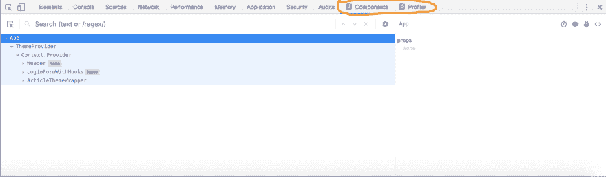T2】](https://res.cloudinary.com/practicaldev/image/fetch/s--V5Sp-Kt_--/c_limit%2Cf_auto%2Cfl_progressive%2Cq_auto%2Cw_880/https://miro.medium.com/max/2556/1%2Aw1hePByhgMPI32PXJxnTgw.png)

新的开发工具比旧版本有很多改进。突出几个—

*   🏎更快的
*   🎣挂钩支架
*   🧐高级树滤波器
*   🤠最好搜索 UX
*   👮HOCs 的徽章
*   🎯页面重新加载后记住选择

# 十大特色

开发工具可以做很多事情。我们不打算深入每个特性的本质细节。相反，我们将看看**十大有用特性**，它们帮助我们节省时间并编写更好的 React 代码。

## 组件选项卡

1.  实时编辑状态/道具
2.  在树中搜索
3.  高级树过滤器
4.  渲染者
5.  所有者树
6.  快速导航
7.  Utils

## 选项卡配置文件

1.  配置文件初始安装
2.  为什么会这样渲染？
3.  呈现在

# 1。实时编辑状态/道具

您可以实时编辑组件的状态和属性，并立即在页面中看到结果。

[T2】](https://res.cloudinary.com/practicaldev/image/fetch/s--uFeagOtj--/c_limit%2Cf_auto%2Cfl_progressive%2Cq_66%2Cw_880/https://miro.medium.com/max/1280/1%2A3RLDGKkZngCzfuxi61kA5Q.gif)

既然 gif 坏了，可以在这里查看[。](https://miro.medium.com/max/1280/1*3RLDGKkZngCzfuxi61kA5Q.gif)

# 2。在树中搜索

当您想要快速找到并跳转到树中的一个组件时，搜索栏会很方便。现在**开发工具可以记住东西**，**选择的节点在重新加载**之间被保存，你不必在每次重新加载页面时重复这个动作。

[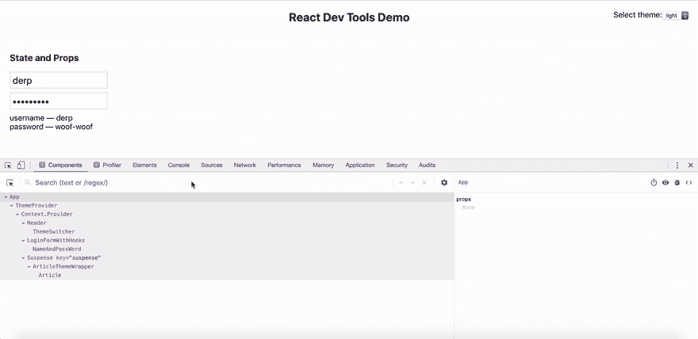T2】](https://res.cloudinary.com/practicaldev/image/fetch/s--YezQPEVE--/c_limit%2Cf_auto%2Cfl_progressive%2Cq_66%2Cw_880/https://miro.medium.com/max/1280/1%2A0c1JIHJRs1N9RX2JBa4BKA.gif)

# 3。组件过滤器

过滤器是一个强大的功能，可以减少视觉噪音，并在一个巨大的树中专注于当前重要的事情。您可以使用各种选项进行过滤，如上下文、hoc、主机(DOM)节点、组件名称等。

[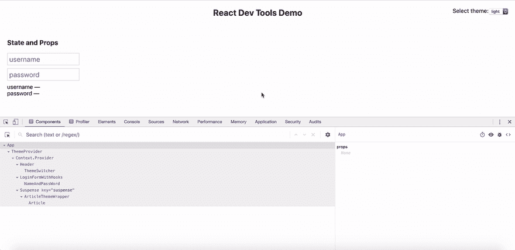T2】](https://res.cloudinary.com/practicaldev/image/fetch/s--Y4SjVLzZ--/c_limit%2Cf_auto%2Cfl_progressive%2Cq_66%2Cw_880/https://miro.medium.com/max/1280/1%2AChPXzBXxRTPXkElTgVSZ9Q.gif)

# 4。渲染者

呈现者是呈现所选组件的**所有者/父组件**的列表。通过从列表中选择一个条目，可以快速跳转到父组件。

[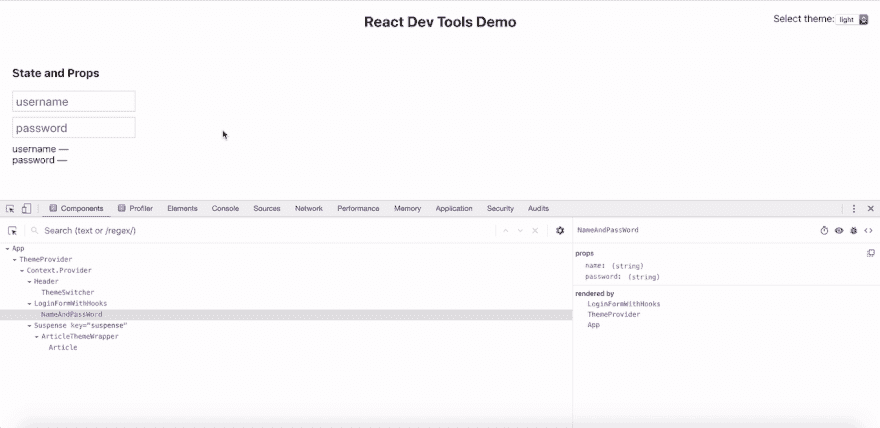T2】](https://res.cloudinary.com/practicaldev/image/fetch/s--Y8b5DL5p--/c_limit%2Cf_auto%2Cfl_progressive%2Cq_66%2Cw_880/https://miro.medium.com/max/1280/1%2AekuimJhLzc1JxDLNLY0jlQ.gif)

# 5。所有者树

所有者树为您提供了特定组件及其子树的**鹰眼视图**,并隐藏了组件树的其余部分。

要进入所有者树视图，您必须双击树中的组件。

[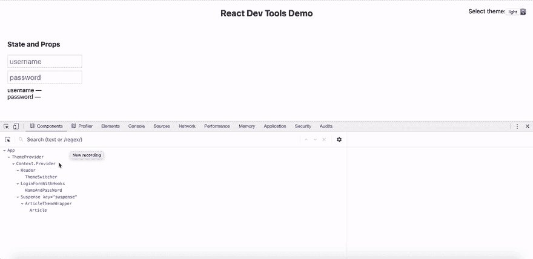T2】](https://res.cloudinary.com/practicaldev/image/fetch/s--IYeXOuoy--/c_limit%2Cf_auto%2Cfl_progressive%2Cq_66%2Cw_880/https://miro.medium.com/max/1280/1%2A8-rJTh6j0StDr959kAzOkA.gif)

# 6。快速导航

在元素选项卡(浏览器开发工具)和组件选项卡(react 开发工具)之间切换非常容易，相应的节点会在这些选项卡中自动选择。

要在 Elements 选项卡中找到相应的 DOM 节点，**选择组件并单击右边窗格中的小眼图标**。它将带您到 Elements 选项卡，并选择相应的 DOM 节点。

要从 Elements 选项卡中找到相应的 React 节点，**只需在 Elements 选项卡中选择一个节点，然后单击 Components 选项卡**。React Dev 工具将自动选择相应的组件。

[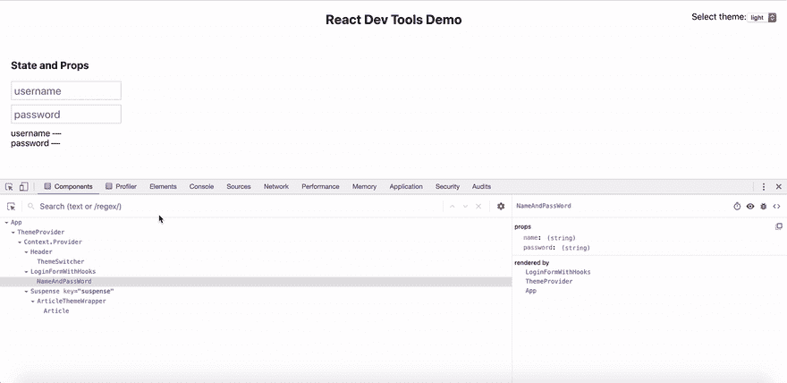T2】](https://res.cloudinary.com/practicaldev/image/fetch/s--TKynG_yZ--/c_limit%2Cf_auto%2Cfl_progressive%2Cq_66%2Cw_880/https://miro.medium.com/max/1280/1%2AyrboX0DNGA5hzPbwkvyuGA.gif)

# 7\. Utils

组件选项卡提供了三个方便的小工具。

1.  暂停组件
2.  检查匹配的 DOM 元素
3.  将组件数据记录到控制台

## 暂停组件

您可以在[暂停](https://reactjs.org/docs/code-splitting.html#reactlazy)组件的等待(加载)和已解决状态之间轻松切换。

[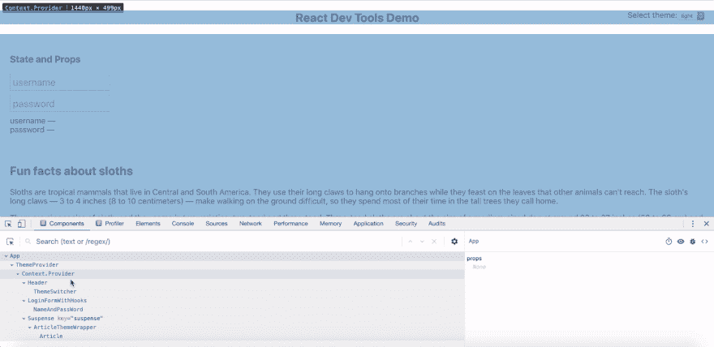T2】](https://res.cloudinary.com/practicaldev/image/fetch/s--C-udc7tX--/c_limit%2Cf_auto%2Cfl_progressive%2Cq_66%2Cw_880/https://miro.medium.com/max/1280/1%2AfsayD-RnFvWKAN2WTiJvog.gif)

## 检查匹配的 DOM 元素

我们已经在**快速导航**中看到了这一点。您可以选择一个组件，点击右窗格中的**眼睛图标**，跳转到 Elements 页签中对应的节点进行检查。

[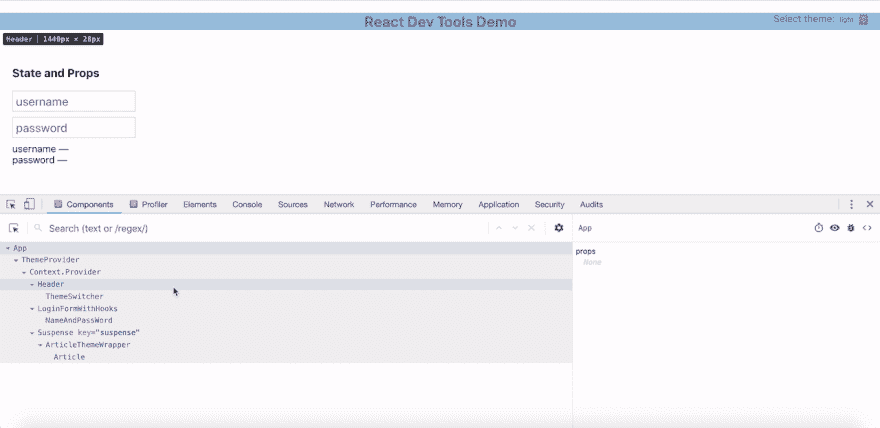T2】](https://res.cloudinary.com/practicaldev/image/fetch/s--TBVMJvJE--/c_limit%2Cf_auto%2Cfl_progressive%2Cq_66%2Cw_880/https://miro.medium.com/max/1280/1%2A4vA7mDDmbOdBPyugPfGCBw.gif)

## 将组件数据记录到控制台

这是一个方便的实用程序，可以将整个组件的元数据记录到控制台。该日志给出了诸如 props、hooks、相应的 DOM 节点和文件系统中的组件文件位置等详细信息。

要将组件数据记录到控制台，选择组件并**点击右窗格中的小 bug 图标**。

[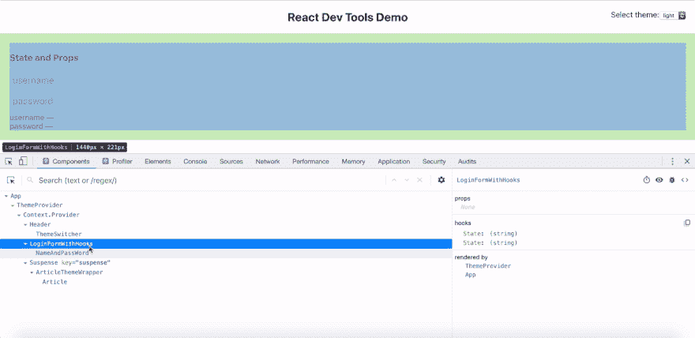T2】](https://res.cloudinary.com/practicaldev/image/fetch/s--CmTgNjEQ--/c_limit%2Cf_auto%2Cfl_progressive%2Cq_66%2Cw_880/https://miro.medium.com/max/1280/1%2A7oO2We69Q6vjUUiprakBMA.gif)

* * *

# 探查器简介

接下来的三个特性是关于分析器的。在深入研究它们之前，我们先来看看 profiler 是如何工作的，以及在分析过程中使用的关键指标。

每个剖析会话都有两个重要的彩色图表—

1.  提交图表
2.  组件图

[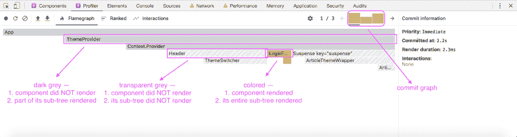T2】](https://res.cloudinary.com/practicaldev/image/fetch/s--T5DX4Bpu--/c_limit%2Cf_auto%2Cfl_progressive%2Cq_auto%2Cw_880/https://miro.medium.com/max/2878/1%2As8gkGYrZfDHDyyiep6-_0w.png)

## 提交图表

提交图为您提供了会话期间的提交列表(整个树)。**每个提交表示一个用户活动或副作用，触发了树中的渲染**。您会看到它从橙色变为绿色，**橙色**表示**开销最大**(花费时间最多)的提交，**绿色**表示**开销最小**(花费时间最少)的提交。

## 组件图

组件图为您提供了在一次提交中哪个组件呈现了**的信息。您可以从提交图中选择每个提交，以查看其组件图。它还带有成本信息的颜色编码—**

1.  **深灰色**—**没有**渲染组件，而是渲染了其子树的**部分**
2.  **透明灰色**—**组件及其子树都没有被渲染**
***   **着色** — **组件及其整个子树都被渲染****

 **# 8。配置文件初始安装

在大多数 React 应用程序中，初始挂载和首次渲染通常是一项性能繁重的操作。在旧版本的开发工具中，不可能对初始挂载阶段进行概要分析和审计。但是最新版本提供了一个选项来分析和审计初始挂载。

[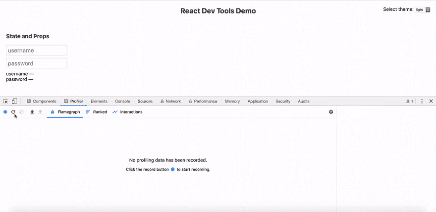T2】](https://res.cloudinary.com/practicaldev/image/fetch/s--k2fESFNP--/c_limit%2Cf_auto%2Cfl_progressive%2Cq_66%2Cw_880/https://miro.medium.com/max/1280/1%2AlPsmgceapwprlUyIyHPArg.gif)

# 9。为什么会这样渲染？

这是 Dev 工具迄今为止最强大的特性，它告诉你为什么一个组件在一个概要分析会话期间被渲染。一个组件可能会因为以下一个或多个原因而呈现—

1.  道具变了
2.  状态已更改
3.  钩子换了
4.  呈现的父组件

您可以分析一个活动，并查看为什么在分析会话**期间呈现一个组件，以找出薄弱环节**并防止树中不必要的呈现。

[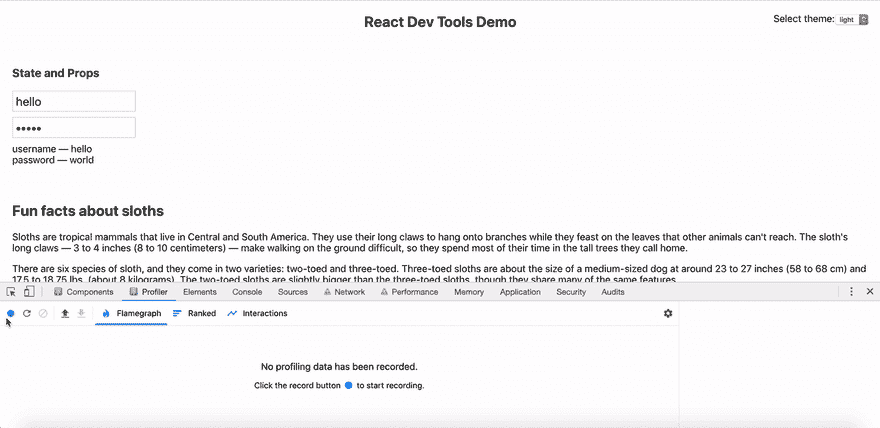T2】](https://res.cloudinary.com/practicaldev/image/fetch/s--LUvLew_t--/c_limit%2Cf_auto%2Cfl_progressive%2Cq_66%2Cw_880/https://miro.medium.com/max/1280/1%2AoTZB8QDpdg65pRVSvKMgyA.gif)

*注意:您已经检查了这个设置——“记录为什么每个组件在分析时被渲染”，以便在 Profiler 标签的右窗格中看到这个信息。*

# 10。呈现在

呈现在右窗格的信息中，给出了两个时间指标—

1.  在分析会话期间，组件呈现的确切时间
2.  在性能分析会话期间组件渲染所用的时间

例如**2.2 秒换 2.3 毫秒**

这里， **2.2s** 表示从分析会话开始 **0s** 开始，以 **2.2s(2200ms)** 渲染的组件。而 **2.3ms** 是组件渲染所花费的时间。

[T2】](https://res.cloudinary.com/practicaldev/image/fetch/s--rGKyrC7Y--/c_limit%2Cf_auto%2Cfl_progressive%2Cq_66%2Cw_880/https://miro.medium.com/max/1280/1%2AYzgMYR2S7lSRsAZLgESoWA.gif)

既然 gif 坏了，可以在这里查看[。](https://miro.medium.com/max/1280/1*YzgMYR2S7lSRsAZLgESoWA.gif)

这是所有的乡亲。

如果你有兴趣探索所有的特性，React 团队已经为此建立了一个网站— [交互式开发工具](https://react-devtools-tutorial.now.sh)。

玩玩开发工具，在下面发表评论，或者[在](https://twitter.com/intent/tweet/?text=Hey%20@flexdinesh%20I%20read%20your%20post%20about%20@reactjs%20Dev%20Tools%20) [Twitter](https://twitter.com/intent/tweet/?text=Hey%20@flexdinesh%20I%20read%20your%20post%20about%20@reactjs%20Dev%20Tools%20) 上与作者开始对话，谈谈你的想法。

*这篇文章是从 Thinkmill 博客的[原文的交叉文章。](https://medium.com/the-thinkmill/react-dev-tools-debug-like-a-ninja-c3a5d09895c6)***