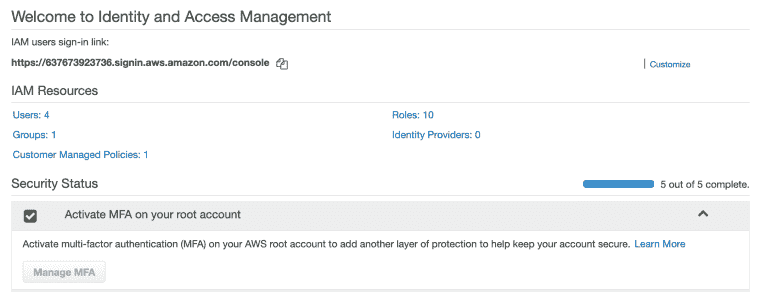
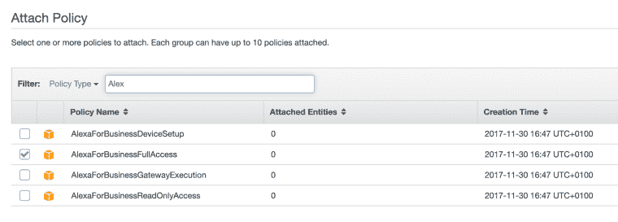
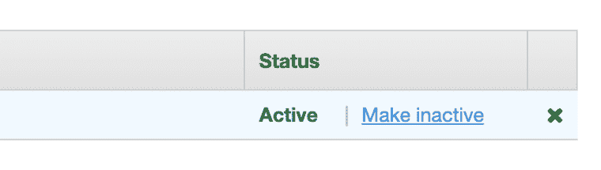
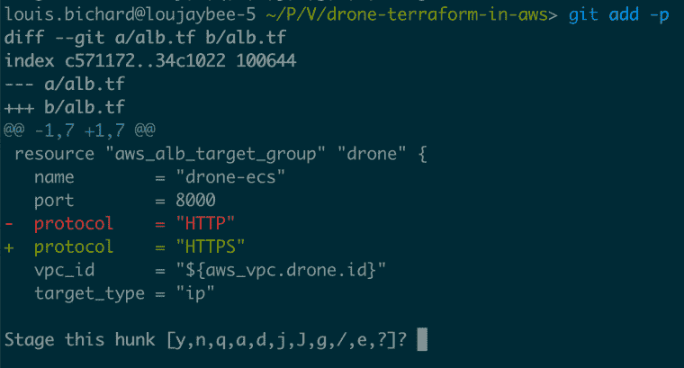
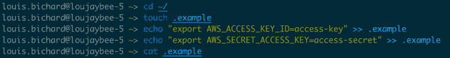

# AWS 访问键——安全使用它们的 5 个技巧。

> 原文:[https://dev . to/loujaybee/AWS-access-keys-5-tips-to-safely-use-them-a0o](https://dev.to/loujaybee/aws-access-keys-5-tips-to-safely-use-them-a0o)

AWS 访问键是您以编程方式访问 AWS 云的方式。AWS 访问密钥可用于供应、更新甚至删除云资源。当涉及到你的云账户、个人账户或工作账户时，你不希望你的账户受到损害，这至少会让你损失数千英镑。因此，保证 AWS 访问密钥的安全至关重要。

[T2】](https://res.cloudinary.com/practicaldev/image/fetch/s--7qMehS3w--/c_limit%2Cf_auto%2Cfl_progressive%2Cq_auto%2Cw_880/https://i1.wp.com/www.thedevcoach.co.uk/wp-content/uploads/2019/09/AWS_KEYS.jpg%3Fresize%3D700%252C457%26ssl%3D1)

管理 AWS 访问键并不像看起来那么可怕。只需一点点知识，您就可以在云中试验和构建软件，同时保持安全。

到本文结束时，你应该知道什么是 AWS 键，为什么它们很重要，以及在使用访问键时确保安全的五个技巧。

## 什么是 AWS 访问键？

和往常一样，让我们首先讨论什么是 AWS 访问键。

当您需要通过 AWS 的 API 访问 AWS 时，您需要使用访问密钥和密码。密钥的两位信息是:`AWS_ACCESS_KEY_ID`和一个`AWS_SECRET_ACCESS_KEY`。

您的访问密钥显而易见，因为它用于识别哪个密钥进行了交易。然而，这个秘密就像一个密码，决不能给任何人，除非第一次给你，否则你不会在任何界面上看到它。

一个访问键与一个给定的用户相关联，该用户被赋予一组权限来决定它能做什么。重要的是，要注意访问密钥不会自动过期。

## 为什么有人会想要你的 AWS 访问密钥？

有人一开始就想要你的钥匙，这可能有点奇怪，对吧？毕竟——也许你的 AWS 账户里没有什么有趣的东西。这就引出了一个问题:为什么有人想要你的 AWS 访问密钥？

原因有很多，但让我给你一个无论你的 AWS 账户里有什么都适用的理由，那就是:获得免费资源。即使你对你的 AWS 账户没有任何兴趣，因为你可能已经获得了活跃的账单细节，这意味着潜在的黑客有机会利用你的账户来启动所有由你资助的资源——呃。

希望我已经说服你了(阅读:害怕！)你知道这是一个重要的话题。所以让我们来看看秘诀吧！

## 1。不要使用您的 Root 帐户 AWS 访问密钥

[T2】](https://res.cloudinary.com/practicaldev/image/fetch/s--sfnDtWDg--/c_limit%2Cf_auto%2Cfl_progressive%2Cq_auto%2Cw_880/https://i1.wp.com/www.thedevcoach.co.uk/wp-content/uploads/2019/09/Screenshot-2019-09-20-at-07.12.43.png%3Fresize%3D760%252C292%26ssl%3D1)

*AWS IAM 仪表板*

当您第一次登录 AWS 时，您将获得一个 root 帐户，默认情况下，该用户将获得对整个 AWS 的完全访问权限。你要做的第一件事是创建另一个具有更有限权限的用户，将你的 root 帐户的详细信息存储在安全的地方，然后永远不再使用它们。

(阅读这篇文章，了解如何安全地[设置您的 AWS 帐户](https://dev.to/loujaybee/your-personal-aws-setup-and-how-to-not-get-hacked-5hnf)的更多细节)

## 2。保持 AWS 访问密钥权限受限。

[T2】](https://res.cloudinary.com/practicaldev/image/fetch/s--QltEf5Z5--/c_limit%2Cf_auto%2Cfl_progressive%2Cq_auto%2Cw_880/https://i0.wp.com/www.thedevcoach.co.uk/wp-content/uploads/2019/09/Screenshot-2019-09-20-at-07.13.56.png%3Fresize%3D760%252C273%26ssl%3D1)

*授予 AWS 访问密钥的访问权限*

从根访问密钥这一点出发，当您设置一个密钥时，您应该使用与具有受限访问权限的用户相关的密钥。当您使用 AWS 时，创建一个(或多个)用户是有意义的，该用户只能访问您当时需要的服务。您的访问密钥越有特权，您就应该对它们越警惕。

## 3。经常刷新/轮换您的 AWS 访问密钥。

[T2】](https://res.cloudinary.com/practicaldev/image/fetch/s--xXonG7Dk--/c_limit%2Cf_auto%2Cfl_progressive%2Cq_auto%2Cw_880/https://i0.wp.com/www.thedevcoach.co.uk/wp-content/uploads/2019/09/Screenshot-2019-09-20-at-07.10.35.png%3Fresize%3D760%252C215%26ssl%3D1)

*AWS 界面，用于停用按键*

时不时的轮换一下你的钥匙也无妨。这可能看起来很可怕，但是如果你只把钥匙放在本地，那么只需两分钟就可以把它们交换过来。只需进入 AWS 控制台，删除您的旧密钥并下载一个新密钥。通过轮换你的密钥，如果一个旧的确实不知何故意外泄露，你将通过生成一个新的密钥来阻止任何未来的访问。

## 4。不要将 AWS 访问键放在代码中。

[T2】](https://res.cloudinary.com/practicaldev/image/fetch/s--ZRhooysL--/c_limit%2Cf_auto%2Cfl_progressive%2Cq_auto%2Cw_880/https://i2.wp.com/www.thedevcoach.co.uk/wp-content/uploads/2019/09/Screenshot-2019-09-20-at-07.16.38.png%3Fresize%3D760%252C409%26ssl%3D1)

*使用 Git 分阶段提交*

无论你用你的键做什么，不要把你的键放在你的代码里。当你承诺的时候要非常小心。如果你正在使用 git，我建议养成使用`git add -p`命令提交的习惯，该命令允许[分阶段提交](https://gist.github.com/mattlewissf/9958704)。分阶段提交允许您逐个代码块地选择要放入的内容。这样做可以减少你无意中添加任何东西的可能性。

## 5。使用 Bash Sourcing 作为您的 AWS 访问键

[T2】](https://res.cloudinary.com/practicaldev/image/fetch/s--5w4PxrsQ--/c_limit%2Cf_auto%2Cfl_progressive%2Cq_auto%2Cw_880/https://i0.wp.com/www.thedevcoach.co.uk/wp-content/uploads/2019/09/Screenshot-2019-09-20-at-07.08.28.png%3Fresize%3D760%252C98%26ssl%3D1)

*本地存储 AWS 密钥的过程*

当涉及到将密钥保存在机器上时，您将需要一个可靠的过程来存储和使用密钥。就我个人而言，我使用的是 [bash sourcing](https://www.tldp.org/HOWTO/Bash-Prompt-HOWTO/x237.html) 特性，它允许您在当前的终端进程中执行脚本。这很有用，因为它允许您设置当前的环境变量(AWS 键)以便立即使用。

我有几个文件，用于不同的项目或不同的访问键，我运行 source 命令在这些概要文件之间切换。一个额外的好处(在我看来)是，它迫使我在开始工作之前在终端窗口中运行一个源代码，所以我必须显式地“认证”我当前的进程。如果你想用同样的方法…

*   选择一个目录来存储密钥——我使用我的主目录`cd ~`
*   创建一个新文件`touch .example`——随便你怎么命名！
*   在文件`export AWS_ACCESS_KEY_ID=YOUR-KEY`中有一行是您的访问密钥。
*   另一行`export AWS_SECRET_ACCESS_KEY=YOUR-SECRET-ACCESS-KEY`代表你的秘密密钥

## 您的 AWS 访问密钥现在是安全的

就这样——快速浏览什么是 AWS 键，以及如何安全地使用它们。没有必要害怕他们。只要确保你没有拥有广泛权限的密钥，避免将它们放在代码中，并且为了安全起见经常轮换它们。

***您是否曾在设置 AWS 访问键时出错？*T3】**

* * *

post [AWS 访问键——安全使用它们的 5 个技巧。](https://www.thedevcoach.co.uk/aws-access-keys/)最早出现在[的 Dev 蔻驰](https://www.thedevcoach.co.uk)上。

像您一样加入云原生软件工程师社区。了解最新的云技术，学习核心云工程主题的基本技能，如:Docker。无服务器和 Linux，等等。

[加入我们](https://thedevcoach.co.uk/newsletter)并取得成功！