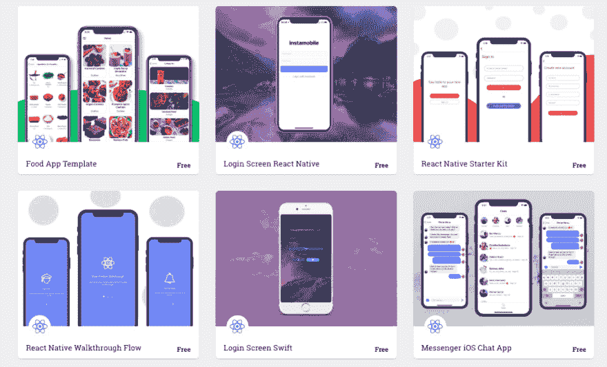
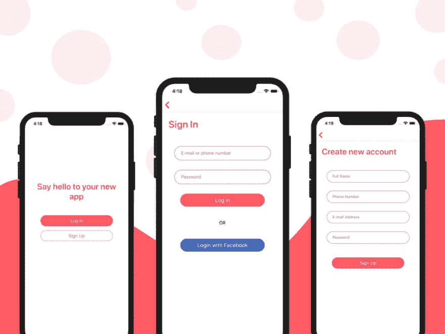
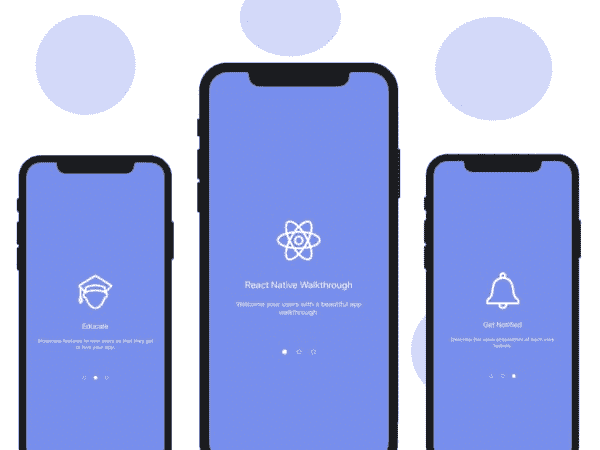

# 3 个免费的 React 本地模板，帮助您快速起步

> 原文：<https://dev.to/kris/free-react-native-templates-in-5-best-sources-h16>

目前，React Native 是制作强大的原生移动应用程序的顶级和最突出的 JavaScript 框架之一，具有为 Android 和 iOS 构建的能力。它消除了从独立平台开发应用程序的繁重工作。许多流行的应用程序已经在这个平台上运行，包括脸书、Instagram、网飞和 Airbnb。然而，仅仅因为 React Native 使这个过程变得更容易，并不意味着它很简单。React 本地开发人员的学习曲线非常陡峭。这就是 free React 本机模板的用武之地。

模板使得应用程序开发更加容易，因为大部分组件、模块、插件和特性都已经实现了。这使得模板成为伟大的初学者工具包，将节省您宝贵的编码时间。使用模板并不意味着你被它所提供的特性所束缚。这些模板是高度模块化和可定制的。因此，您可以进行自己的调整，实现自己版本的 React 原生应用程序。它不仅帮助开发人员，也帮助非开发人员，因为这些模板节省了宝贵的时间、金钱和精力。

现在，让我们来看一些源代码，它们免费提供了那些功能强大、成熟且高度可定制的 React 原生模板，供您下载和创建自己的应用程序。在这里，我们为您提供了获得不同 React 原生模板的最佳资源，完全免费。

一些资源免费提供那些强大的、成熟的和高度可定制的 React 本地模板，供您下载和创建自己的应用程序。在这里，我们为您提供了获得不同 React 原生模板的最佳资源，完全免费。

## Instamobile

Instamobile 是获得 premium 和免费 React 原生应用程序模板的热门来源之一。它的目标是帮助移动应用开发者和企业家以最少的努力和成本，以最快的速度推出他们自己的原生应用。instamobile 提供的 react 原生模板具有高度的可定制性和模块化。您可以下载漂亮的免费 React 原生模板来引导您的应用程序开发过程。一些流行的免费 react 原生模板包括食物应用程序模板、登录屏幕模板、消息 iOS 聊天应用程序模板、初学者工具包模板等，以帮助您快速有效地开始使用 react 原生应用程序。因此，instamobile 中所有可用的免费 React 原生模板都是在 MIT 许可下开源的。因此，您可以将它们集成到您的 react-native 项目中，没有任何复杂性或附加条件。

此外，最令人惊叹的是，您可以完全免费下载各种功能强大、令人惊叹的 react 原生模板，并按照您的意愿将它们集成到您的项目中。所以，为什么要等待呢，从 instamobile 的[开始快速实现你自己的应用吧。](https://www.instamobile.io/mobile-templates/react-native-templates-free)

## React 原生入门套件

 
免费 [react-native starter kit](https://www.instamobile.io/app-templates/react-native-starter-kit-firebase/) 引导您的应用开发开始。不要多此一举！相反，直接投入到行动中，专注于您的核心功能，而不是重写用户入职的样板代码。这个 react 原生样板应用程序使移动开发人员能够从零开始开发他们的 react 原生应用程序，具有广泛的用户注册和登录方面的流行功能，以及流行的 SDK 集成，如 Firebase 和脸书。

## 反应原生预排流程

下载这个漂亮的完全编码的 [React 原生漫游流程](https://www.instamobile.io/app-templates/react-native-walkthrough-flow/)，开始开发您的应用程序。它针对 iOS 和 Android 进行了优化，可以节省您几个小时的工作时间。高度模块化，它支持无限数量的入职步骤，只需一行代码即可添加。

特点
无限步数
可扩展代码
模块化的颜色、字符串和图像

## 结论

以上是一些最流行的下载令人惊叹的强大模板的资源，可以免费下载。您可以选择最适合您的项目的模板，交叉匹配模板。然后，挑选合适的，随心所欲的定制。这些来源有一个不断增长的社区。因此，将来会有越来越多先进的模板出现。因此，请记住这些模板，并让您自己的应用程序从这些来源购买下载资源。

### 交底

这篇文章包括附属链接；如果您从本文提供的不同链接购买产品或服务，我可能会收到报酬。