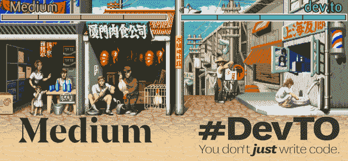
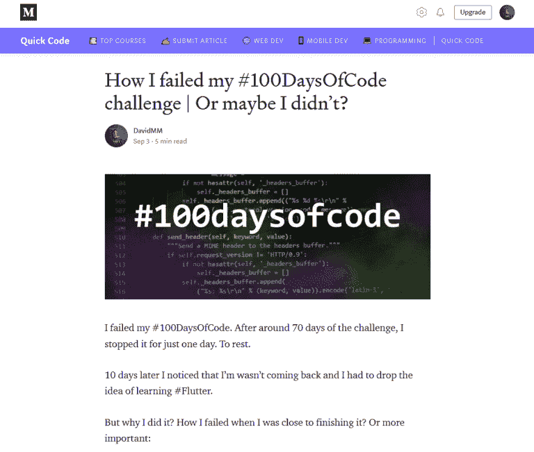
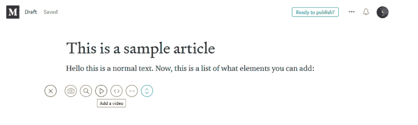
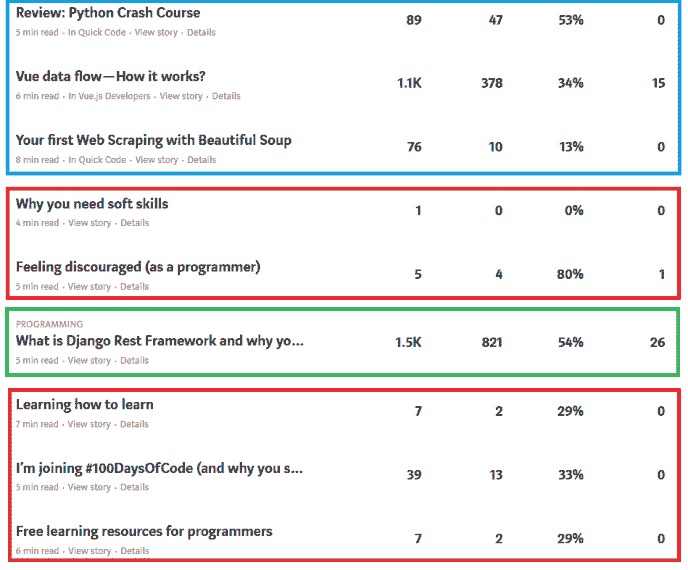
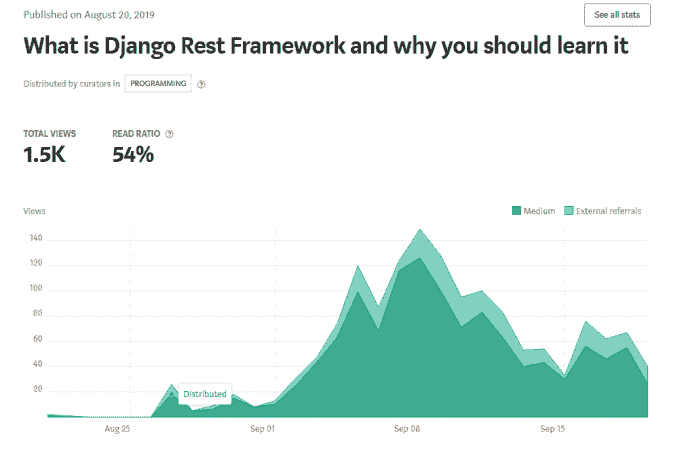
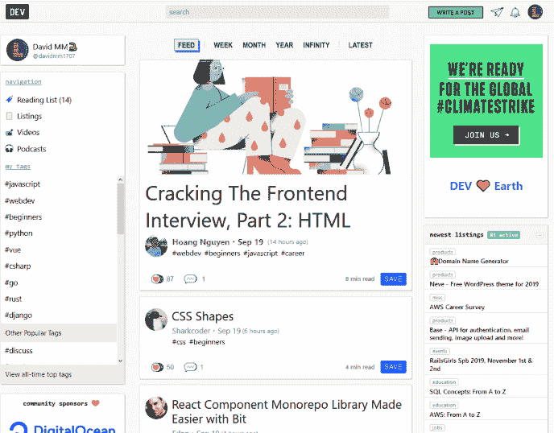

# 您应该使用中等还是发展到？

> 原文:[https://dev . to/davidmm 1707/should-you-use-medium-or-dev-to-2g1d](https://dev.to/davidmm1707/should-you-use-medium-or-dev-to-2g1d)

原帖[应该用 Medium 还是 dev.to？](https://letslearnabout.net/blog/should-you-use-medium-or-dev-to/)

# [](#should-you-use-medium-or-devto)应该用 Medium 还是 dev.to？

[T2】](https://res.cloudinary.com/practicaldev/image/fetch/s--sXegYbKC--/c_limit%2Cf_auto%2Cfl_progressive%2Cq_auto%2Cw_880/https://i0.wp.com/letslearnabout.net/wp-content/uploads/2019/09/image-19.png%3Ffit%3D688%252C318%26ssl%3D1)

Medium 和 dev.to，你应该用哪一个作为博客平台？各有什么利弊？

我也问过自己这些问题，现在，有了几周的经验，我可以回答它们了。

* * *

### [](#introduction)简介

几天前，tomkastek 通过 Twitter 在一个 DM 上找到了我(顺便说一下，我是@ [DavidMM1707](https://twitter.com/DavidMM1707) )。他对博客平台很感兴趣，在媒体和开发之间犹豫不决。

[T2】](https://res.cloudinary.com/practicaldev/image/fetch/s--mpUcXiPk--/c_limit%2Cf_auto%2Cfl_progressive%2Cq_auto%2Cw_880/https://i0.wp.com/letslearnabout.net/wp-content/uploads/2019/09/image-18.png%3Fw%3D688%26ssl%3D1)

这是个好问题。我问过自己一个问题，回答这个问题的最好方法是两者都尝试一下。

我从中号开始。几天前，我看到了使用 dev.to 的理由。我看到了两个平台的优点和缺点。

我将把它们列在这里，但在此之前…

* * *

### [](#what-is-medium)什么是介质？

[T2】](https://res.cloudinary.com/practicaldev/image/fetch/s--CULk31Jn--/c_limit%2Cf_auto%2Cfl_progressive%2Cq_auto%2Cw_880/https://i1.wp.com/miro.medium.com/max/727/1%2AI0E7U5xI-4UvnkExSGKp_w.png%3Fw%3D688%26ssl%3D1)

[Medium](https://medium.com) 是一个在线发布平台。它是社会新闻的一个例子，拥有业余和专业作家和出版物的组合，它被认为是一个博客主机。

看起来是这样的:

[T2】](https://res.cloudinary.com/practicaldev/image/fetch/s--0CxO65Jy--/c_limit%2Cf_auto%2Cfl_progressive%2Cq_auto%2Cw_880/https://i2.wp.com/letslearnabout.net/wp-content/uploads/2019/09/image-20.png%3Fresize%3D768%252C651%26ssl%3D1)

它有一些很酷的东西，比如优雅干净的风格、出版物等等。你可以以大卫 MM 的身份跟我去。

但是，德夫·托呢？

* * *

### [](#what-is-devto)什么是 dev.to？

[Dev.to](https://dev.to) 是一个分享和发现伟大想法、进行辩论和交朋友的在线社区。

这是一个博客平台？聊天室？一个论坛？对我来说，这三样东西加在一起。

[T2】](https://res.cloudinary.com/practicaldev/image/fetch/s--zsV9iJG---/c_limit%2Cf_auto%2Cfl_progressive%2Cq_auto%2Cw_880/https://i1.wp.com/letslearnabout.net/wp-content/uploads/2019/09/image-21.png%3Fresize%3D768%252C542%26ssl%3D1)

不像 Medium 那么完美，但更适合与其他开发人员合作。你也可以跟我去那里。

现在我们知道了这两种平台，但是…它们的优点和缺点呢？

* * *

### [](#medium-pros-and-cons)中等利弊

现在，我的媒体利弊:

#### [](#pros)优点

*   **便于在**上书写。用中号书写很容易做，也容易清洗。

[T2】](https://res.cloudinary.com/practicaldev/image/fetch/s--z5_2k4jB--/c_limit%2Cf_auto%2Cfl_progressive%2Cq_auto%2Cw_880/https://i2.wp.com/letslearnabout.net/wp-content/uploads/2019/09/image-22.png%3Ffit%3D688%252C206%26ssl%3D1)

*   **进口物品。**你可以将你的文章从任何地方导入媒体。我用它将[我自己的网站](https://letslearnabout.net/)的文章链接到 Medium，这样我也可以在那里分享它们。
*   **酷炫统计**。你知道有多少人看了你的帖子，多少人阅读了它们，阅读率的百分比，等等。

[T2】](https://res.cloudinary.com/practicaldev/image/fetch/s--oxVHLgZk--/c_limit%2Cf_auto%2Cfl_progressive%2Cq_auto%2Cw_880/https://i2.wp.com/letslearnabout.net/wp-content/uploads/2019/09/image-23.png%3Fw%3D688%26ssl%3D1)

*   如果你在出版物上写作，你会得到很多评论

#### [](#cons)弊

*   **你没有任何意见**。除非有人让你在他们的出版物上写作。我的每份出版物都有 1-5 次浏览，直到有人让我进入他们的出版物。从那以后，我每天都有数百次浏览(100-450 次)。

[](https://res.cloudinary.com/practicaldev/image/fetch/s--jfCJ-SWG--/c_limit%2Cf_auto%2Cfl_progressive%2Cq_auto%2Cw_880/https://i2.wp.com/letslearnabout.net/wp-content/uploads/2019/09/image-24.png%3Fw%3D688%26ssl%3D1) 红色表示没有出版物，蓝色表示有出版物，绿色表示我获得了“编程”媒体部门的一个职位。你可以看到不同之处。

*   你的目标是登上付费墙。虽然这是一种合法的商业模式，但我不同意。我希望我的文章免费，而且永远免费。
*   不适合程序员。在那里发布代码极其困难。我必须使用一个插件来做到这一点，要使用它，你必须创建一个要点，然后链接它。它是自动完成的，但我不喜欢它的工作方式。应该是复制粘贴，仅此而已。
*   **愚蠢的“喜欢”制度。**您可以为帖子投票。我有一个帖子有+100 个赞，只有 11 个人喜欢这个帖子。

#### [](#summary)总结

作为一个程序员，我不太喜欢 Medium。虽然写这样的帖子很好(事实上，我只是复制了这篇帖子的 URL，然后导入了它，做了一些小的调整，仅此而已)，但编程-有大量代码的帖子是很累人的。

除非被发现，否则你在那里几乎看不到风景。然后你乘火箭升空。我的记录是在那里几周后的一天之内有将近 500 名读者。还有这个:

[T2】](https://res.cloudinary.com/practicaldev/image/fetch/s--ZV0jK55N--/c_limit%2Cf_auto%2Cfl_progressive%2Cq_auto%2Cw_880/https://i1.wp.com/letslearnabout.net/wp-content/uploads/2019/09/image-25.png%3Fw%3D688%26ssl%3D1)

作为程序员的复杂感受:很难写代码，Medium 的目标不是程序员，而是所有人，你不知道谁会进入你的帖子。但是它有一个“阅读率”系统，所以你知道有多少人真正读了它。

看起来很干净。

但是现在，让我们来看看德夫·托。

* * *

### [](#devto-pros-and-cons)发展利弊

我喜欢和不喜欢 dev.to 的地方:

#### [](#pros)优点

*   **瞄准程序员。你的读者 100%是程序员或学习编码的人。**
*   **投票系统**。你可以喜欢一个视频，给它一个超级喜欢和/或“保存”它以便以后阅读。我用了很多保存选项，以便以后阅读/作为学习资源。
*   **容易写代码。**它只是一个你扔出去然后你复制粘贴代码的标签。就是这样。零复杂性。
*   **容易获得评论。即使有数百名真正的读者，我也很少对我的中型帖子发表评论。在 dev.to 中，你创建的任何帖子很难没有任何评论和赞/超级赞(证明我是对的！)**
*   **标记系统。**创建帖子时，选择一个或多个标签。关注这些标签的人更有可能找到你的帖子。作为读者，你可以过滤掉你不喜欢的东西，只在你的 feed 上找到你感兴趣的东西。
*   **非常适合共享代码**与 Medium 不同，您可以在 dev.to 上轻松共享代码。例如，使用 Markdown 语法突出显示:

```
const hello = (name) => {
    console.log(`hello, ${name}`)
} 
```

你也可以嵌入 Kotlin 片段，Glitch，Codepen，JSFiddle 等等。

感谢 Jean-Michel Fayard、Alexis Benamar 和张秀坤·卢巴斯基指出我的错误。)

#### [](#cons)弊

*   使用降价系统。我不喜欢它，因为我通常不使用它(只创建 [http://README.md](https://t.co/qvfP4i2NUS?amp=1) 文件)，虽然它有编辑和预览视图，但你必须在两者之间切换才能看到你在做什么。你不能导入任何博客，除非你能把它导入 Markdown(谢天谢地[我找到了一个](http://heckyesmarkdown.com/))
*   当你创建一个用户时，你会自动关注 50 个人。不是说它超级糟糕，但是我每天都有 150 个追随者，我不知道哪个是真实的，哪个是自动分配的。

#### [](#summary)**总结**

我很喜欢戴夫·托。只有开发人员，所以 99%的帖子可能会让你感兴趣，互动形式(评论、喜欢等)更有“人情味”，是开发人员的一个很好的平台。

[T2】](https://res.cloudinary.com/practicaldev/image/fetch/s--vOuIPkfk--/c_limit%2Cf_auto%2Cfl_progressive%2Cq_auto%2Cw_880/https://i1.wp.com/letslearnabout.net/wp-content/uploads/2019/09/image-26.png%3Ffit%3D688%252C538%26ssl%3D1)

* * *

### [](#conclusion)结论

所以，回答第一个问题:你应该使用中等还是发展。答案是…这要看情况。

在打“X”或拿干草叉之前，在那里等着！

我觉得如果你想写一篇关于编程世界的优美文章(作为一个初级开发人员的艰辛，行业中的问题等等), Medium 更容易写作和获得浏览。

但是如果你想走得更技术化，加入一个社区，拥有并给出反馈，等等，Dev.to 就是答案。

总而言之，选择权在你。我建议你两个都试试，坚持你想要的那个。或者像我一样两者都用。

* * *

[我的 Youtube 教程视频](https://www.youtube.com/channel/UC9OLm6YFRzr4yjlw4xNWYvg?sub_confirmation=1)

[在 Twitter 上联系我](https://twitter.com/DavidMM1707)

[阅读更多教程](https://letslearnabout.net/category/tutorial/)