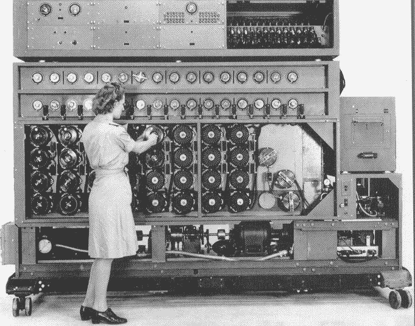
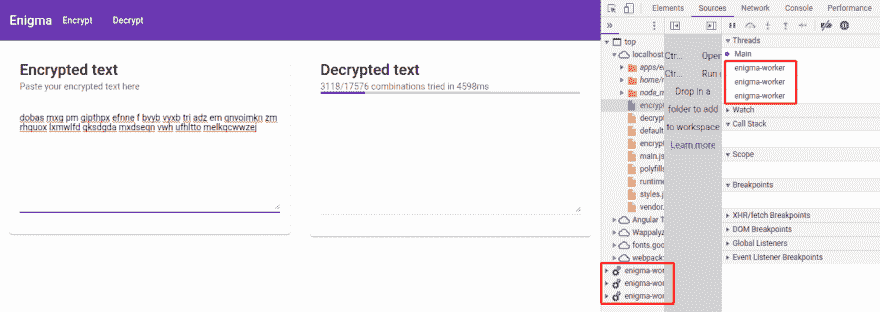
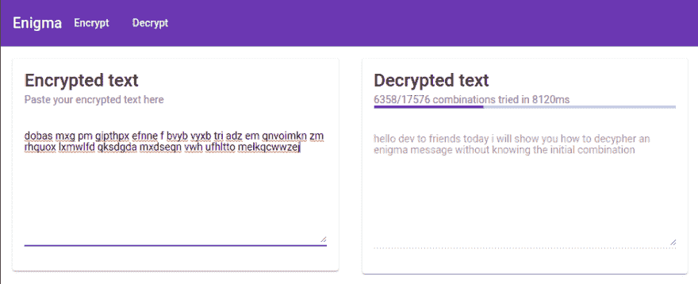

# 使用 web worker API 从 Enigma 强行发送加密消息

> 原文:[https://dev . to/maxime 1992/brute-forcing-an-encrypted-message-from-enigma-using-the-web-worker-API-166 b](https://dev.to/maxime1992/brute-forcing-an-encrypted-message-from-enigma-using-the-web-worker-api-166b)

这篇博客是三篇系列文章的最后一篇，叫做**“谜:理解它，实现它，破解它”**:

*   1 - [英格玛机，著名的加密装置是如何工作的？](https://dev.to/maxime1992/enigma-machine-how-does-the-famous-encryption-device-work-5aon)

*   2 - [建立一个只有打字稿的 Enigma 机器，然后使用 Angular DI 系统正确地实例化它](https://dev.to/maxime1992/building-an-enigma-machine-with-only-typescript-and-then-use-angular-di-system-to-properly-instantiate-it-2e2h)

*   **3 -使用 web worker API 从 Enigma 暴力破解加密消息*【这篇博客文章】***

# [](#table-of-contents)目录

*   [简介](#intro)
*   [1 -如何检测是否发现一个转子组合的信息？](#1-how-to-detect-if-a-message-has-been-found-for-one-rotor-combination)
*   [2 -使用发电机缓慢产生每个英格玛的转子组合](#2-lazily-generate-every-enigmas-rotors-combinations-using-a-generator)
*   [3 -使用所有内核和作为 RxJs 流管理的 web workers 池，强力加密消息](#3-brute-force-the-encrypted-message-using-all-the-cores-with-a-pool-of-web-workers-managed-as-an-rxjs-stream)
*   [4 -构建一个 UI，使用尝试次数和花费的时间来解密编码的消息](#4-build-a-ui-to-decrypt-an-encoded-message-with-the-number-of-attempts-and-time-taken)
*   [结论](#conclusion)
*   [发现错别字？](#found-a-typo)

如果您发现任何打字错误，请在此自行编辑:[https://github . com/maxime 1992/my-dev . to/blob/master/blog-posts/enigma-part-3/enigma-part-3 . MD](https://github.com/maxime1992/my-dev.to/blob/master/blog-posts/enigma-part-3/enigma-part-3.md)并提交一个拉取请求👌

# [T1】简介](#intro)

在第二次世界大战期间，最有价值的资产之一是通信情报。能够只和你的盟友说话，能够倾听你的敌人而不被他们察觉，这是无价的。艾伦·图灵和许多其他人设法用一种叫做“炸弹”的机器从“谜”中读取加密信息:

[T2】](https://res.cloudinary.com/practicaldev/image/fetch/s--54o_XMlX--/c_limit%2Cf_auto%2Cfl_progressive%2Cq_auto%2Cw_880/https://raw.githubusercontent.com/maxime1992/my-dev.to/master/blog-posts/enigma-part-3/assets/the-bombe.jpg)

*来自[https://www.cryptomuseum.com](https://www.cryptomuseum.com)T3 的炸弹影像*

那台机器由 36 台恩尼格玛机组成，可以尝试给定信息的所有组合，直到你从加密信息中找到原始信息。

今天，我们将使用[打字稿](http://www.typescriptlang.org)和[角度](https://angular.io)来建造一台类似的机器🙌。

这个系列中最复杂的部分可能是建造英格玛。一条谜一样的消息可能是最有趣的，所以让我们开始吧😄！

我已经在结论中写了演示的 URL，但我建议在阅读后试一试。

# [](#1-how-to-detect-if-a-message-has-been-found-for-one-rotor-combination)1 -如何检测是否发现一个转子组合的信息？

正如你现在所知道的，主要思想是尝试所有不同的 Enigma 组合，直到我们找到加密信息的原始版本。如果你已经读过该系列的第一篇文章，你就会知道有了 3 个转子，我们就有了 **17576 种可能的组合**。因此，我们显然不希望必须阅读所有邮件才能知道哪个邮件是原始邮件😱。

为了应对第一个挑战，我决定使用字典📕。然后，对于可能解密的消息的每个单词，检查该单词是否在字典中。当我们达到一个给定的阈值时，我们认为消息已经被发现。

下面是实际的实现:

```
const wordMinLength = 3;
const thresholdWordsFoundToBeConsideredEnglishWord = 3;

export class EnigmaDecryptService {
  // ...

  private getMessageIfEnglish(decryptedMessage: string): string | null {
    const decryptedMessageWords = decryptedMessage.split('  ');
    let foundWordsCounter = 0;

    for (let index = 0; index < decryptedMessageWords.length; index++) {
      const element = decryptedMessageWords[index];

      if (element.length > wordMinLength && WORDS.has(element)) {
        foundWordsCounter++;
      }

      if (foundWordsCounter >= thresholdWordsFoundToBeConsideredEnglishWord) {
        return decryptedMessage;
      }
    }

    return null;
  }
} 
```

注意:`WORDS`是我在 Github 上找到的单词的`Set`。它原本是一个`Array`，但是我把它改造成了一个`Set`，这样检查一个单词是否在字典里就像闪电一样快了⚡.

现在我们已经能够检测出一条信息是否是英文信息，让我们看看如何在加密信息上尝试之前生成所有不同的 Enigma 组合。

# [](#2-lazily-generate-every-enigmas-rotors-combinations-using-a-generator)2 -用发电机惰性地产生每一个英格玛的转子组合

你听说过 Javascript 中的 **[生成器](https://developer.mozilla.org/en-US/docs/Web/JavaScript/Guide/Iterators_and_Generators#Generator_functions)** 吗？生成器让你从一个函数中创建一个[迭代器](https://developer.mozilla.org/en-US/docs/Web/JavaScript/Guide/Iterators_and_Generators#Iterators)。这意味着你可以手动调用`next`来获得下一个值，或者循环遍历这些值，就像你处理数组一样。

这是一个非常简单的发电机演示，取自[https://developer.mozilla.org](https://developer.mozilla.org/en-US/docs/Web/JavaScript/Guide/Iterators_and_Generators#Generator_functions):

```
function* makeRangeIterator(start = 0, end = 100, step = 1) {
  for (let i = start; i < end; i += step) {
    yield i;
  }
} 
```

这里需要注意两点:

*   在关键字`function`后使用`*`
*   `yield`关键字

这里的`*`声明这个函数是一个生成器。简单！

`yield`在这里返回值。也简单！🙌

然后我们可以循环遍历它:

```
// will display numbers from 0 to 99 included
for (let value of makeRangeIterator()) {
  console.log(value);
} 
```

但是为什么我们不直接用一个`Array`来表示呢？

```
const values = Array.from({ length: 100 }).map((x, index) => index);

for (let value of values) {
  console.log(value);
} 
```

那也可以！但是有很大的区别。你能发现它吗？

发电机**懒**。这意味着这些值只在需要的时候产生，而不是我们必须事先创建的`Array`和保存在内存中的**。我们有 100 件商品要展示，这很好，但如果是 10.000 件呢？还是 10 亿元素？以至...无限多😮？发电机就是为此而来的。**

在英格玛系列的[第二部分](https://dev.to/maxime1992/building-an-enigma-machine-with-only-typescript-and-then-use-angular-di-system-to-properly-instantiate-it-2e2h)中，我们使用了一个函数 [`goToNextRotorCombination`](https://github.com/maxime1992/my-dev.to/blob/f082a4a135c1f8852222facfa02f2e7c55b6fa34/libs/enigma/enigma-machine/src/lib/rotor.ts#L88) ，如果我们通过`[0, 0, 0]`(它代表`['A', 'A', 'A']`)它将返回`[1, 0, 0]`，这是下一个组合。

我们来看看实现:

```
export class EnigmaBombeService {
  // ...

  private *getPossibleCombinations(): IterableIterator<RotorsState> {
    let rotorCombination: RotorsStateInternalApi = [LetterIndex.Z, LetterIndex.Z, LetterIndex.Z];

    do {
      const combination = rotorCombination.map(rotorState => getLetterFromIndexInAlphabet(rotorState)) as RotorsState;

      yield combination;

      rotorCombination = goToNextRotorCombination(rotorCombination) as RotorsStateInternalApi;
    } while (
      rotorCombination[INDEX_ROTOR_0] !== LetterIndex.Z ||
      rotorCombination[INDEX_ROTOR_1] !== LetterIndex.Z ||
      rotorCombination[INDEX_ROTOR_2] !== LetterIndex.Z
    );
  }
} 
```

很简单，不是吗？

我们从代表`['Z', 'Z', 'Z']`的`[25, 25, 25]`开始，因为当我们键入一个字母时，转子首先旋转。所以第一个运行的组合是`['A', 'A', 'A']`。然后我们循环，直到我们达到初始组合和`yield`之间的每一个可能的组合。

# [](#3-brute-force-the-encrypted-message-using-all-the-cores-with-a-pool-of-web-workers-managed-as-an-rxjs-stream)3 -使用所有内核和作为 RxJs 流管理的 web workers 池强力加密消息

我们现在能够找出给定的信息是否是英文信息，产生所有可能的组合，并(从第二部分开始)创建一个英格玛机。我们下一步要做的是尝试一条加密信息，我们已经生成了所有不同的组合。为了尽可能高效地做到这一点，我们将在 Javascript 中发现一种处理多线程的方法: **[web workers](https://developer.mozilla.org/en-US/docs/Web/API/Web_Workers_API/Using_web_workers)** 🔥。

web worker 使用一种消息模式，在这种模式下，在两端(当前线程和 web worker 中的线程)，您可以订阅或发送给定的消息。作为 Angular 和 RxJs 的爱好者，你认为有一个界面让我们像对待网络工作者一样对待他们会有多酷...**溪流**？:领口:

让你内心的 **[罗布沃马尔](https://twitter.com/robwormald)** 指引你到这里:

[T2】](https://res.cloudinary.com/practicaldev/image/fetch/s--uk6dlV6l--/c_limit%2Cf_auto%2Cfl_progressive%2Cq_auto%2Cw_880/https://raw.githubusercontent.com/maxime1992/my-dev.to/master/blog-posts/enigma-part-3/assets/everything-is-a-stream.jpeg)

*图片取自罗布·沃玛德的一次演讲，非常鼓舞人心，我推荐观看[https://www.youtube.com/watch?v=UHI0AzD_WfY](https://www.youtube.com/watch?v=UHI0AzD_WfY)T3】*

希望我在 [CloudNC](https://cloudnc.com) 的一位同事( [Zak Henry](https://dev.to/zakhenry) )能让这项任务变得轻而易举。真的。他创建并开源了一个很棒的库，不仅为我们管理主线程和 web workers 之间的所有反应绑定，还允许我们自动获取尽可能多的资源。所有这些，通过溪流🙏。

以下是我们将要构建的主要概念:

[T2】](https://res.cloudinary.com/practicaldev/image/fetch/s--q4x2Awob--/c_limit%2Cf_auto%2Cfl_progressive%2Cq_auto%2Cw_880/https://raw.githubusercontent.com/maxime1992/my-dev.to/master/blog-posts/enigma-part-3/assets/enigma-s-generator-and-workers-pool-manager.jpg)

我上面提到的库叫做**[observable-web worker](https://github.com/cloudnc/observable-webworker)**。最棒的部分？

**它是框架不可知的，所以你也可以和 React、Vue 等一起使用。**

这个库只需要两个输入就可以工作:一个工作负载，它可以是一个`Observable`、`Array`或者一个`Iterable`(比如一个生成器)。第二个是`Worker`本身。由此，我们得到了一个流，其中所有的值都是从所有的工作者并行返回的🔥。

还有，我是不是忘了提到，一旦你取消订阅输出流，它会杀死所有的网络工作者？

[T2】](https://res.cloudinary.com/practicaldev/image/fetch/s--syhe6yLM--/c_limit%2Cf_auto%2Cfl_progressive%2Cq_auto%2Cw_880/https://raw.githubusercontent.com/maxime1992/my-dev.to/master/blog-posts/enigma-part-3/assets/brent-rambo.png)

> 说够了，给我看看代码！

`apps/enigma/src/app/decrypt/enigma-bombe.worker.ts` :

```
// all the following is part of a web worker so we're not into
// an Angular context anymore and we don't have any DI here
// we need to manually instantiate the required classes

@ObservableWorker()
export class EnigmaBombeWorker implements DoWorkUnit<ConfigurationToDecrypt, string | null> {
  private enigmaDecryptService: EnigmaDecryptService;

  constructor() {
    const enigmaRotorServices = [
      // by default we use the first 3 rotors
      EnigmaRotorService.ROTOR_1,
      EnigmaRotorService.ROTOR_2,
      EnigmaRotorService.ROTOR_3,
    ].map(rotorConfig => new EnigmaRotorService(rotorConfig));

    const reflectorService = new ReflectorService(
      // by default we use the first reflector, also called "Wide B"
      ReflectorService.REFLECTOR_1,
    );

    const enigmaMachineService: EnigmaMachineService = new EnigmaMachineService(enigmaRotorServices, reflectorService);

    this.enigmaDecryptService = new EnigmaDecryptService(enigmaMachineService);
  }

  public workUnit(input: ConfigurationToDecrypt): Observable<string | null> {
    return of(
      this.enigmaDecryptService.decryptMessageFor1Combination(input.initialRotorPosition, input.encryptedMessage),
    );
  }
} 
```

下面是上面代码中发生的情况:

*   使用库提供的`@ObservableWorker()`装饰器
*   为网络工作者创建一台 Enigma 机器
*   实现库所要求的`workUnit`方法，其中我们只在机器上为给定的消息尝试一种组合。如果消息是英文的，那么我们返回它，否则我们返回`null`

然后从我们的组件中，每当输入改变时，我们得到一个新的流来解密新的消息。

`apps/enigma/src/app/decrypt/decrypt.component.ts` :

```
@Component({
  // ...
})
export class DecryptComponent {
  // ...

  private decryptMessage(encryptedMessage: string): Observable<string> {
    return fromWorkerPool<ConfigurationToDecrypt, string>(
      () =>
        new Worker('./enigma-bombe.worker', {
          name: 'enigma-worker',
          type: 'module',
        }),
      this.enigmaBombeService.getPossibleCombinationsWithEncryptedMessage(encryptedMessage),
    );
  }
} 
```

# [](#4-build-a-ui-to-decrypt-an-encoded-message-with-the-number-of-attempts-and-time-taken)4 -构建一个 UI，用尝试的次数和花费的时间来解密一个编码的消息

既然我们已经为暴力破解加密消息做好了一切准备，我们想看看前面的组件(`DecryptComponent`)中还有什么。但是首先，让我们看看最终的输出:

[T2】](https://res.cloudinary.com/practicaldev/image/fetch/s--sDZ-MKq0--/c_limit%2Cf_auto%2Cfl_progressive%2Cq_auto%2Cw_880/https://raw.githubusercontent.com/maxime1992/my-dev.to/master/blog-posts/enigma-part-3/assets/decrypting.png)

*☝️在解密一条信息时*

[T2】](https://res.cloudinary.com/practicaldev/image/fetch/s--zSVgzjXg--/c_limit%2Cf_auto%2Cfl_progressive%2Cq_auto%2Cw_880/https://raw.githubusercontent.com/maxime1992/my-dev.to/master/blog-posts/enigma-part-3/assets/decrypted.png)

*☝️一旦发现消息*

在我们进入代码之前，让我们考虑一下我们在这里试图实现的工作流:

*   在左侧输入处输入加密消息🔒
*   启动“炸弹”,让所有的网络工作者开始寻找原始信息🔥
*   计算到目前为止已经尝试过的组合数量🔢
*   计算经过的时间(直到我们得到结果)⏳
*   显示解密的文本(如果有)🔓

是时候写代码了！让我们试试反应式版本:

我们将看一下整个代码，然后一段一段地详述。

`apps/enigma/src/app/decrypt/decrypt.component.ts` :

```
@Component({
  selector: 'app-decrypt',
  templateUrl: './decrypt.component.html',
  styleUrls: ['./decrypt.component.scss'],
  providers: [...DEFAULT_ENIGMA_MACHINE_PROVIDERS, EnigmaBombeService],
  changeDetection: ChangeDetectionStrategy.OnPush,
})
export class DecryptComponent {
  public encryptedTextControl: FormControl = new FormControl('', containsOnlyAlphabetLetters({ acceptSpace: true }));

  public encryptedText$: Observable<string> = combineLatest([
    this.encryptedTextControl.valueChanges,
    this.encryptedTextControl.statusChanges,
  ]).pipe(
    map(([message, status]: [string, Status]) =>
      status !== Status.VALID
        ? // if the message is not valid we want to clear
          // the decrypted text as it's outdated
          ''
        : message.trim(),
    ),
    shareReplay({ bufferSize: 1, refCount: true }),
  );

  private decryptedBundle$: Observable<DecryptedBundle | null> = this.encryptedText$.pipe(
    switchMap(msg =>
      !msg
        ? of(null)
        : this.decryptMessage(msg).pipe(
            map((message, index) => ({ message, index })),
            takeWhile(({ message }) => !message, true),
          ),
    ),
    shareReplay({ bufferSize: 1, refCount: true }),
  );

  public combinationsTried$: Observable<number> = this.encryptedText$.pipe(
    switchMap(() =>
      this.decryptedBundle$.pipe(
        skip(1),
        map(decryptedBundle => (!decryptedBundle ? 1 : decryptedBundle.index + 1)),
        startWith(0),
      ),
    ),
  );

  public elapsedTime$: Observable<number> = this.encryptedText$.pipe(
    timestamp(),
    switchMap(({ timestamp: initialTimestamp }) =>
      this.decryptedBundle$.pipe(
        timestamp(),
        map(({ timestamp: currentTimestamp }) => currentTimestamp - initialTimestamp),
      ),
    ),
  );

  public decryptedText$ = merge(
    // whenever the encrypted text changes, reset the decrypted text
    this.encryptedText$.pipe(mapTo('')),
    // but as soon as we receive the decrypted text, return it
    this.decryptedBundle$.pipe(
      filter(decryptedBundle => !!decryptedBundle && !!decryptedBundle.message),
      map(decryptedBundle => !!decryptedBundle && decryptedBundle.message),
    ),
  );

  constructor(private enigmaBombeService: EnigmaBombeService) {}

  private decryptMessage(encryptedMessage: string): Observable<string> {
    return fromWorkerPool<ConfigurationToDecrypt, string>(
      () =>
        new Worker('./enigma-bombe.worker', {
          name: 'enigma-worker',
          type: 'module',
        }),
      this.enigmaBombeService.getPossibleCombinationsWithEncryptedMessage(encryptedMessage),
    );
  }
} 
```

这里发生了很多事！我们一块一块来看:

```
changeDetection: ChangeDetectionStrategy.OnPush, 
```

☝️因为我们要以一种被动的方式工作，并且只使用`async`管道在视图中显示值，所以使用`ChangeDetectionStrategy.OnPush`来获得更好的性能是安全的。

```
public encryptedTextControl: FormControl = new FormControl('', containsOnlyAlphabetLetters({ acceptSpace: true })); 
```

☝️我们创建了一个`FormControl`，并确保它只能包含可以被 Enigma 处理的字符(使用一个定制的验证器)。

```
public encryptedText$: Observable<string> = combineLatest([
  this.encryptedTextControl.valueChanges,
  this.encryptedTextControl.statusChanges,
]).pipe(
  map(([message, status]: [string, Status]) =>
    status !== Status.VALID
      ? // if the message is not valid we want to clear
        // the decrypted text as it's outdated
        ''
      : message.trim(),
  ),
  shareReplay({ bufferSize: 1, refCount: true }),
); 
```

☝️我们创建一个`Observable`来组合先前的`FormControl`值和状态。如果状态无效，则加密文本应被视为空。如果要解密的文本无效，这将重置正确的输入，而不是在旧值上被阻止。

注意这里`shareReplay`的用法。我们将多次订阅那个`Observable`,但我们希望共享源代码。一旦每个人都退订了这个流，我们就想关闭它(`refCount: true`)。您可以在这里了解更多关于`shareReplay`及其参数:[https://blog . angularindepth . com/rxjs-whats-changed-with-share replay-65c 098843 e 95](https://blog.angularindepth.com/rxjs-whats-changed-with-sharereplay-65c098843e95)

```
private decryptedBundle$: Observable<DecryptedBundle | null> = this.encryptedText$.pipe(
  switchMap(msg =>
    !msg
      ? of(null)
      : this.decryptMessage(msg).pipe(
          map((message, index) => ({ message, index })),
          takeWhile(({ message }) => !message, true),
        ),
  ),
  shareReplay({ bufferSize: 1, refCount: true }),
); 
```

☝️我们现在创建一个表示解密包的可观察对象(`message`如果有的话+ `index`以便我们稍后可以计算已经尝试的可能性的数量)。它由`encryptedText$`驱动。每次`encryptedText$`发生变化，如果消息不是空的，那么我们就试着在那个消息上发射炸弹。这给了我们一个潜在的解密消息流。当消息没有被发现时，我们使用`takeWhile`来保持流存活。一旦找到该消息，您将能够注意到所有的 web workers 都将被关闭。

你可能想知道为什么我根据消息在`switchMap`中做了一个条件，而不是在`switchMap`前使用一个`filter`。如果我们之前使用了`filter`，工作流程将会是:

*   输入加密的消息
*   试着解密这条消息
*   删除加密的信息，认为它会停止解密过程
*   不会的，*炸弹*会继续，因为我们会在`switchMap`之前过滤掉，因此不会杀死内部流

而在这里，有以下条件:

```
!msg ? of(null) : this.decryptMessage(msg); // ... 
```

如果我们正在解密一条消息，而`encryptedText$` observable 发出一个空值，我们将返回`of(null)`，这是一个不同于`switchMap`之前订阅的流。因此，它会关闭前一个。

```
public combinationsTried$: Observable<number> = this.encryptedText$.pipe(
  switchMap(() =>
    this.decryptedBundle$.pipe(
      skip(1),
      map(decryptedBundle => (!decryptedBundle ? 1 : decryptedBundle.index + 1)),
      startWith(0),
    ),
  ),
); 
```

☝️为了显示尝试的组合数量，我们将基于有一个`index`的`decryptedBundle$`创建一个流。唯一需要注意的是，我们使用了一个`skip(1)`,因为`decryptedBundle$`返回最后一个发出的值(可能是它发现前一条消息时的值！).因此，代替它，我们跳过它，使用`startWith(0)`。

```
public elapsedTime$: Observable<number> = this.encryptedText$.pipe(
  timestamp(),
  switchMap(({ timestamp: initialTimestamp }) =>
    this.decryptedBundle$.pipe(
      timestamp(),
      map(({ timestamp: currentTimestamp }) => currentTimestamp - initialTimestamp),
    ),
  ),
); 
```

☝️:为了找到经过的时间，每次`encryptedText$`改变时，我们也使用`timestamp`操作符得到一个时间戳。这将代表初始时间。然后，每次解密的包发出时，我们得到另一个时间戳并比较两者。它们之间的差值代表经过的时间。

```
public decryptedText$ = merge(
  // whenever the encrypted text changes, reset the decrypted text
  this.encryptedText$.pipe(mapTo('')),
  // but as soon as we receive the decrypted text, return it
  this.decryptedBundle$.pipe(
    filter(decryptedBundle => !!decryptedBundle && !!decryptedBundle.message),
    map(decryptedBundle => !!decryptedBundle && decryptedBundle.message),
  ),
); 
```

☝️的最后一段代码:解密文本本身。如果加密文本改变了，我们就重置它。一旦解密的包返回消息，我们就返回它。

# [](#conclusion)结论

我们已经看到了如何使用**打字稿**和**角度**来构建*炸弹*，利用**生成器**来避免高内存消耗，并利用 **web workers** 来并行处理多种可能性。感谢 [observable-webworker](https://github.com/cloudnc/observable-webworker) 库，我们还能够将我们的 webworker 结果作为一个流来管理，并根据设备能力自动调整所使用的 worker 数量。

我希望这个系列对你有所启发，并且你可能在这个过程中学到了一些东西，或者是关于 Enigma 的机制，或者是关于 web workers、generators 等技术方面的东西。请在评论中告诉我！😄

最后但同样重要的是，不要忘记在这里查看现场演示:

【https://maxime1992.github.io/my-dev.to/enigma】T2

感谢阅读！

# [](#found-a-typo)发现错别字？

如果你在这篇博文中发现了一个错别字、一个可以改进的句子或者任何其他应该更新的内容，你可以通过 git 存储库访问它，并发出一个 pull 请求。请不要发表评论，直接前往[https://github.com/maxime1992/my-dev.to](https://github.com/maxime1992/my-dev.to)并打开一个包含您所做更改的新拉动式请求。