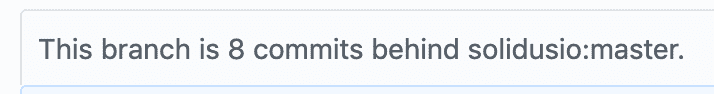
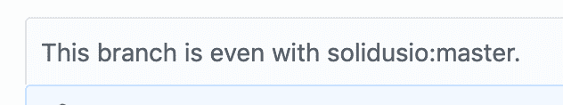

# 一个简单的方法让你的叉子卡在 Git 中

> 原文：<https://dev.to/jacobherrington/a-fool-proof-way-to-keep-your-fork-caught-up-in-git-2e2e>

如何让一个 fork 与 GitHub 上的主存储库保持同步？

在过去的几个月里，似乎有很多人问过我这个问题。

我不确定在 git 中有多少种模式可以实现这一点(我猜有很多)，但是我有一种模式是我专门使用的。

首先，让我们确定为什么这是必要的。如果你找到了一个你想贡献或者保留一份副本的开源库，通常的做法是`fork`这个库。

派生一个存储库仅仅意味着制作它的一个副本，这样你就可以在不影响原始存储库的情况下对它进行修改。在许多情况下，这是因为您没有对原始存储库的写权限。

在 GitHub(fork 一词在这里很常用)上，你所要做的就是点击库顶部的大 fork 按钮。几秒钟后，您将有自己的原始存储库副本存储在您的名称空间下。

如果您打算对您的 fork 进行更改，您很可能希望将其克隆到您的本地环境中。对于本文，我将使用 Solidus.io 项目(我在 GitHub 上帮助维护的一个项目)的 fork。

我的叉子位于[github.com/jacobherrington/solidus](https://github.com/jacobherrington/solidus)。要将其克隆到我的本地机器上，我可以运行这个 git 命令:

```
git clone git@github.com:jacobherrington/solidus.git 
```

<svg width="20px" height="20px" viewBox="0 0 24 24" class="highlight-action crayons-icon highlight-action--fullscreen-on"><title>Enter fullscreen mode</title></svg> <svg width="20px" height="20px" viewBox="0 0 24 24" class="highlight-action crayons-icon highlight-action--fullscreen-off"><title>Exit fullscreen mode</title></svg>

假设我创建了这个分叉，克隆了它，然后把它放了六个月。

六个月的时间，原来的库发生了实质性的变化，现在我的 fork 已经过时了。当这种情况发生时，GitHub UI 会给出提示。该指示看起来像这样:

[](https://res.cloudinary.com/practicaldev/image/fetch/s--BsQlbpCy--/c_limit%2Cf_auto%2Cfl_progressive%2Cq_auto%2Cw_880/https://thepracticaldev.s3.amazonaws.com/i/ltdx7c38i7v4ax3soqnm.png)

所以让我们继续吧。

### 1。创建新的遥控器

我们将使用`git remote`命令来完成这项工作！一个`remote`相当简单；您可以把它想象成一个指向远程存储库的书签。

例如，如果我在我创建的 Solidus fork 的本地副本中运行`git remote -v`(`-v`标志代表 verbose ),我将看到名为`origin`的默认遥控器，以及它指向的位置:

```
$ git remote -v
origin    git@github.com:jacobherrington/solidus.git (fetch)
origin    git@github.com:jacobherrington/solidus.git (push) 
```

<svg width="20px" height="20px" viewBox="0 0 24 24" class="highlight-action crayons-icon highlight-action--fullscreen-on"><title>Enter fullscreen mode</title></svg> <svg width="20px" height="20px" viewBox="0 0 24 24" class="highlight-action crayons-icon highlight-action--fullscreen-off"><title>Exit fullscreen mode</title></svg>

可以看到有一个`fetch`和一个`push`遥控器。你现在可以忽略这些，把注意力放在看起来像 URL 的东西上。这就是我们克隆 fork 时给 git 的地址。

我们可以使用这个遥控器来获取新的代码或者更新我们的修改。如果我运行`git push`，默认情况下，我的代码将被推送到这个遥控器。

但是，您可以在推或拉时指定另一个地址。这就是我们需要做的赶上我们的叉子。

第一步是创建一个新的遥控器:

```
$ git remote add upstream git@github.com:solidusio/solidus.git 
```

<svg width="20px" height="20px" viewBox="0 0 24 24" class="highlight-action crayons-icon highlight-action--fullscreen-on"><title>Enter fullscreen mode</title></svg> <svg width="20px" height="20px" viewBox="0 0 24 24" class="highlight-action crayons-icon highlight-action--fullscreen-off"><title>Exit fullscreen mode</title></svg>

这个命令添加了一个名为`upstream`的新 remote(您可以选择不同的名称，但我更喜欢这个名称)，指向 GitHub 上的原始存储库。也就是我最初使用的存储库。

### 2。引入新的变化

既然我已经创建了一个指向原始 repo 的 remote，我喜欢称之为上游存储库，我可以很容易地从该存储库中获取更改，并将它们推送到我的 fork。

首先，我确保我在本地的主分支上，并且我没有任何奇怪的本地更改。(小心复制粘贴者，这将删除您在本地的任何工作！)

```
$ git checkout master && git clean -fd 
```

<svg width="20px" height="20px" viewBox="0 0 24 24" class="highlight-action crayons-icon highlight-action--fullscreen-on"><title>Enter fullscreen mode</title></svg> <svg width="20px" height="20px" viewBox="0 0 24 24" class="highlight-action crayons-icon highlight-action--fullscreen-off"><title>Exit fullscreen mode</title></svg>

然后，我将从上游存储库中提取变更:

```
$ git pull upstream master
remote: Enumerating objects: 148, done.
remote: Counting objects: 100% (148/148), done.
remote: Total 186 (delta 148), reused 148 (delta 148), pack-reused 38
Receiving objects: 100% (186/186), 40.44 KiB | 20.22 MiB/s, done.
Resolving deltas: 100% (148/148), completed with 125 local objects.
From github.com:solidusio/solidus
 * branch                master     -> FETCH_HEAD
 * [new branch]          master     -> upstream/master
Updating 29acc0d0b..20973340b
Fast-forward
... # some files that changed
 87 files changed, 180 insertions(+), 177 deletions(-) 
```

<svg width="20px" height="20px" viewBox="0 0 24 24" class="highlight-action crayons-icon highlight-action--fullscreen-on"><title>Enter fullscreen mode</title></svg> <svg width="20px" height="20px" viewBox="0 0 24 24" class="highlight-action crayons-icon highlight-action--fullscreen-off"><title>Exit fullscreen mode</title></svg>

在这种情况下，您可以看到我获得了大约 180 行的修改。为了更新我的远程 fork(位于 jacobherrington/solidus 的 GitHub 上的存储库)，我需要将这些更改推上来！

### 3。将更改推送到您的远程分支

只要我的本地主分支实际上没有分叉，就这么简单:

```
$ git push 
```

<svg width="20px" height="20px" viewBox="0 0 24 24" class="highlight-action crayons-icon highlight-action--fullscreen-on"><title>Enter fullscreen mode</title></svg> <svg width="20px" height="20px" viewBox="0 0 24 24" class="highlight-action crayons-icon highlight-action--fullscreen-off"><title>Exit fullscreen mode</title></svg>

您将得到一些类似如下的控制台反馈:

```
Total 0 (delta 0), reused 0 (delta 0)
To github.com:jacobherrington/solidus.git
   29acc0d0b..20973340b  master -> master 
```

<svg width="20px" height="20px" viewBox="0 0 24 24" class="highlight-action crayons-icon highlight-action--fullscreen-on"><title>Enter fullscreen mode</title></svg> <svg width="20px" height="20px" viewBox="0 0 24 24" class="highlight-action crayons-icon highlight-action--fullscreen-off"><title>Exit fullscreen mode</title></svg>

现在您的远程分支已经赶上了原始存储库！

[](https://res.cloudinary.com/practicaldev/image/fetch/s--RuelTJoP--/c_limit%2Cf_auto%2Cfl_progressive%2Cq_auto%2Cw_880/https://thepracticaldev.s3.amazonaws.com/i/roioc1ejp8u9afrrnb80.png)

就是这样。🤠

### 还有更多...

这些天来，我写了很多文章，运行了一个 T2 播客，并开始发送一个 T4 时事摘要，介绍我听到的所有精彩故事。

你也可以在 Twitter 上关注我，在那里我制作一些愚蠢的迷因，谈论如何成为一名开发者。