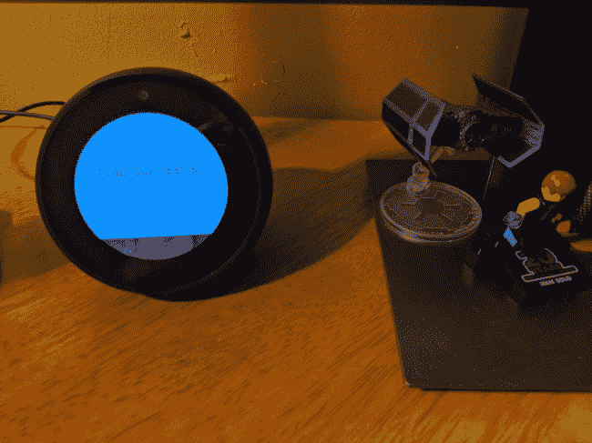
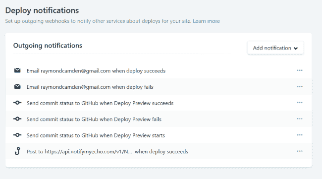
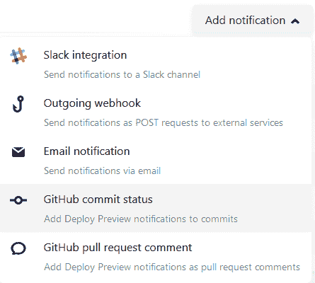
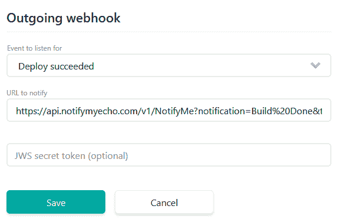

# 当 Netlify 建立您的网站时，向 Alexa 发送通知

> 原文:[https://dev . to/raymondcamden/sending-a-notification-to-Alexa-when-netlify-builds-your-site-1n2e](https://dev.to/raymondcamden/sending-a-notification-to-alexa-when-netlify-builds-your-site-1n2e)

这将是一个快速的帖子，这个想法归功于 [Stacey Higgenbotham](https://staceyoniot.com/how-to-trigger-custom-alexa-notifications-from-a-smart-home-event/) 和她去年的帖子[“如何从智能家居事件中触发自定义 Alexa 通知”](https://staceyoniot.com/how-to-trigger-custom-alexa-notifications-from-a-smart-home-event/)。

在她的帖子中，她描述了如何使用 Alexa 上的[通知我](https://www.amazon.com/Thomptronics-Notify-Me/dp/B07BB2FYFS/ref=sr_1_1)技能来允许自定义通知。当你在 Alexa 中添加“通知我”技能时，你会收到一封带有唯一访问代码的电子邮件。然后你可以去 https://www.thomptronics.com/about/notify-me 的[网站查看文件。在最简单的层面上，您可以点击如下 URL:](https://www.thomptronics.com/about/notify-me)

[https://api.notifymyecho.com/v1/NotifyMe?通知=Hello%20World！&访问代码=访问\ _ 代码](https://api.notifymyecho.com/v1/NotifyMe?notification=Hello%20World!&accessCode=ACCESS%5C_CODE)

说真的，这就是全部的 API。您可以传递一个额外的 title 属性，API 在接受 GET、POST 或 PUT 方面非常灵活。这里有一个例子，它在我的回声点上看起来怎么样。

[T2】](https://res.cloudinary.com/practicaldev/image/fetch/s--09cJ3c6y--/c_limit%2Cf_auto%2Cfl_progressive%2Cq_auto%2Cw_880/https://static.raymondcamden.cimg/2019/09/notification1.png)

在这种情况下，通知的文本是不可见的，只有标题，但如果我向她请求我的通知，我会听到完整的文本。

假设您已经启用了技能并获得了访问代码，那么您将如何设置它来获得构建通知呢？

登录 Netlify，转到您的站点，设置，“构建和部署”，最后是“部署通知”:

[T2】](https://res.cloudinary.com/practicaldev/image/fetch/s--PyO2VKEi--/c_limit%2Cf_auto%2Cfl_progressive%2Cq_auto%2Cw_880/https://static.raymondcamden.cimg/2019/09/notification2.png)

点击“添加通知”按钮并选择“外发网页挂钩”:

[T2】](https://res.cloudinary.com/practicaldev/image/fetch/s--YIfWUrnZ--/c_limit%2Cf_auto%2Cfl_progressive%2Cq_auto%2Cw_880/https://static.raymondcamden.cimg/2019/09/notification3.png)

首先弄清楚您希望收到什么通知，最有可能是“部署成功”，然后在 URL 中输入我在上面分享的表单中的 URL。大概是这样的:

```
https://api.notifymyecho.com/v1/NotifyMe?notification=Build%20Done&title=Build%20Done!&accessCode=ACCESS_CODE 
```

<svg width="20px" height="20px" viewBox="0 0 24 24" class="highlight-action crayons-icon highlight-action--fullscreen-on"><title>Enter fullscreen mode</title></svg> <svg width="20px" height="20px" viewBox="0 0 24 24" class="highlight-action crayons-icon highlight-action--fullscreen-off"><title>Exit fullscreen mode</title></svg>

请记住，只有标题是可见的，但是您可以在通知部分包含更多信息来提供上下文，可能是已部署的站点的名称。

[T2】](https://res.cloudinary.com/practicaldev/image/fetch/s--lUV2K7rh--/c_limit%2Cf_auto%2Cfl_progressive%2Cq_auto%2Cw_880/https://static.raymondcamden.cimg/2019/09/notification4.png)

就是这样！如果你愿意，你可以进入“部署”菜单，点击“触发部署”来强制一个新的构建。我希望对通知的用户界面有更多的控制，但是为了一个免费的服务，我会接受它。

*标题图片由[普拉蒂克·卡蒂亚尔](https://unsplash.com/@prateekkatyal?utm_source=unsplash&utm_medium=referral&utm_content=creditCopyText)在 Unsplash* 上拍摄