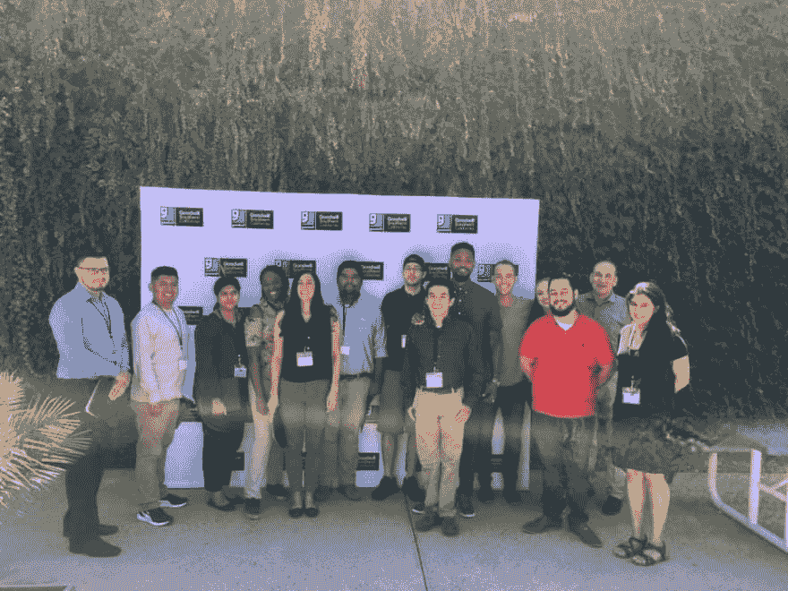

# 培养编码器训练营 2019 年夏季

> 原文:[https://dev . to/kauress/training-coder-s-boot camp-summer-2019-o3n](https://dev.to/kauresss/cultivating-coder-s-bootcamp-summer-2019-o3n)

[T2】](https://res.cloudinary.com/practicaldev/image/fetch/s--xmd_zcUP--/c_limit%2Cf_auto%2Cfl_progressive%2Cq_auto%2Cw_880/https://thepracticaldev.s3.amazonaws.com/i/pqcq1kki8nb13qgb466y.jpg)

今年一个培养程序员的训练营是在圣伯纳迪诺，带着善意。这是密集的，我们做了一些很酷的项目:

1.  [一站式开发商店](http://onestopdevshop.herokuapp.com/)

2.  [地磁台](http://www.geomapstr.com/)

培养程序员完全赞助学生，他们得到一台免费的笔记本电脑。大多数时候也有小吃！(好看，健康的那种)。除此之外，他们还会接触到在软件开发领域以不同身份工作的教师。学生们也不必搬出去，训练营会来找他们。

我们从基础开始(HTML5，CS3，Twitter Bootstrap & Git)。然后我们开始学习 JavaScript，特别是从上下文到 DOM 脚本。最后，我们使用 node.js、express.js 和一些 mongoDB(使用 mongoose.js ODM)进入服务器端 JS。

基本前提是从一个基本的前端项目开始，添加一些功能并将其重构到后端项目中，因此使其成为 fullstack！

这些学生从 20 多岁一直到 50 多岁。总的来说，作为一名教师，这也是我的一次学习经历，因为每个小组都非常不同。

我们的目标是**建立**并在课堂上建立，而我和合作导师在那里协助项目。这些项目的想法来自学生们自己。

在课程开始前的那个周末，加利福尼亚发生了几次地震，所以有一个小组最终编写了 GeoMapstr，它根据震级、AOED(受灾面积)和频率(过去 30 天、1 个月、6 个月等)对地震进行分类和过滤。该应用程序还包括注册/登录功能，因为该应用程序的下一个功能是参考地震对用户进行地理定位。

鉴于，购物车组是建立在学生目前的业务之一，即大麻服装。购物车的功能是用 vanilla JS 从头开始构建的。

我非常感谢和我一起工作的团队。他们通过为别人开门做了很多好事。开门人不是看门人！

哦，我们还制作了有趣的推特机器人:)[这里](https://twitter.com/GeoMapstr)和[这里](https://twitter.com/codedeploy)