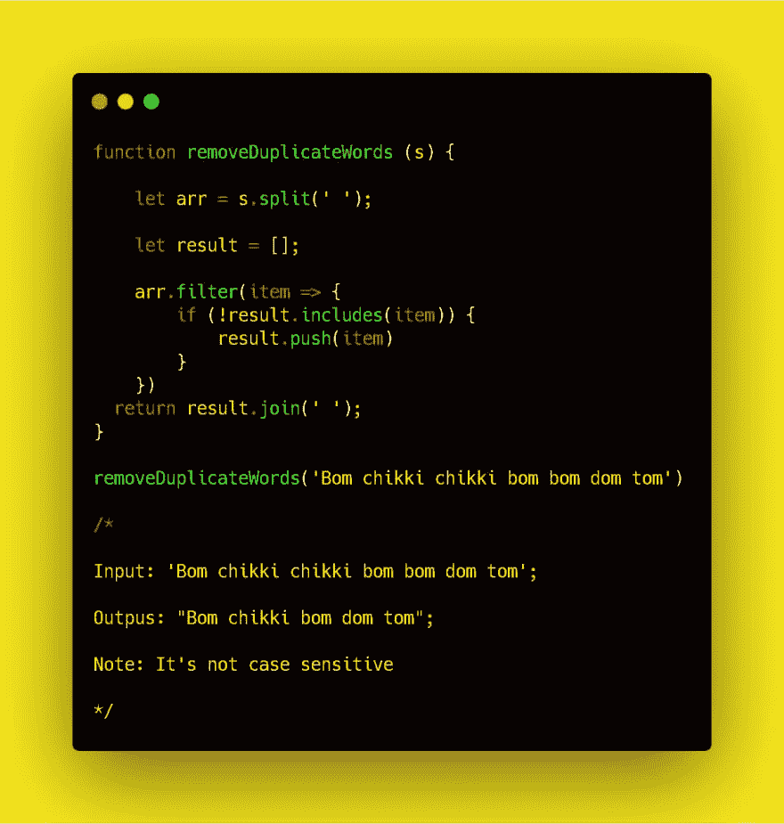

# 那个终极项目

> 原文：<https://dev.to/neowelkin/that-ultimate-project-4h6>

Dev.to 是一个学习的好地方。但我到现在还没在这里看到的是，没人把做东西当做一个社区来谈。我总是觉得，就可用的技术工具而言，我们今天所拥有的东西在某个地方有很大的差距。根据我的开发经验，无论我想要什么，无论我想到什么，它只会让我产生一些小想法。作为一个社区，我们能为 JS 做些什么(没错，我有点偏向 JS)？

 
为什么我们不能做出一些令人敬畏的东西，比如说 Dev.js(不知道它会做什么，与其他 js 框架有何不同)，另一个可以彻底改变 web 开发的框架/库？
请给出你的看法。我真的想为开源和开发者社区做点什么。
期待牛逼的想法。