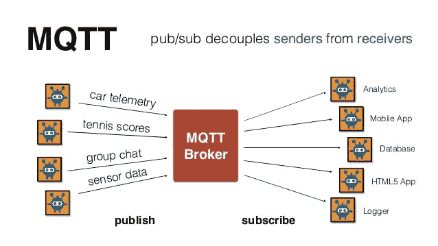
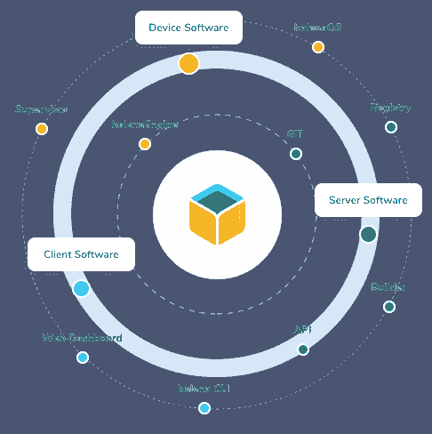
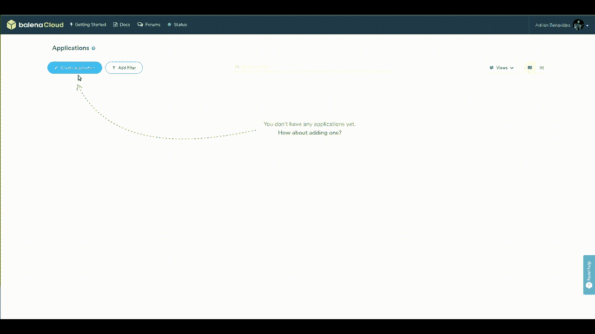
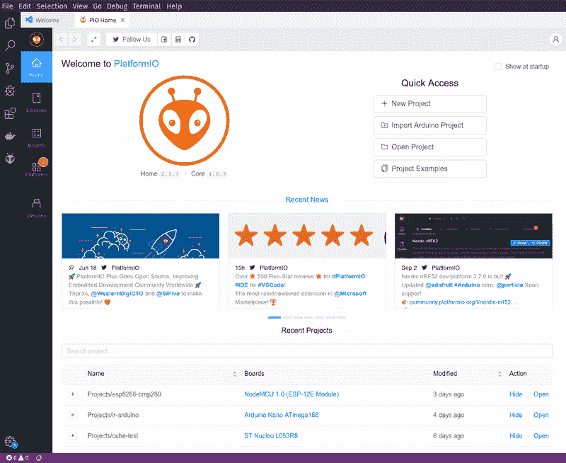
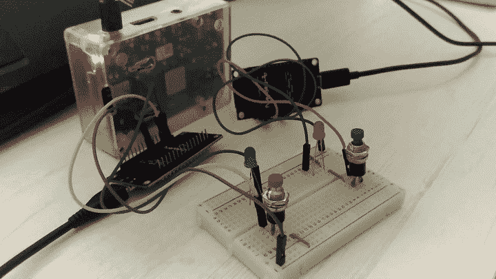
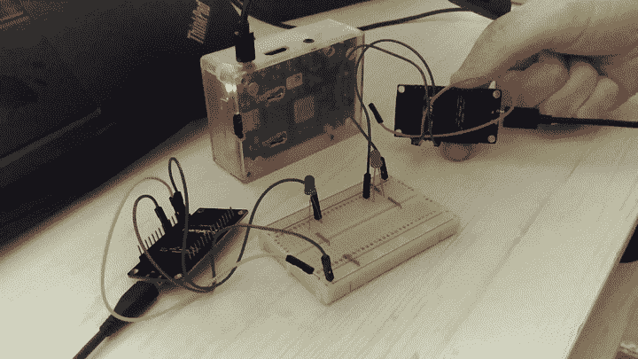

# 使用 ESP8266 探索 MQTT

> 原文:[https://dev.to/adrib/exploring-mqtt-with-the-esp8266-5c56](https://dev.to/adrib/exploring-mqtt-with-the-esp8266-5c56)

在任何物联网项目中，我们都有许多独特的要求和限制。连接设备和在设备之间发送数据的通信策略至关重要。

在本指南中，我们将探索一个强大、简单和轻量级的网络消息协议:MQTT。

最初[发表在我这里的博客](https://kokonatt.com/embedded/mqtt-with-esp8266)和 github 上的完整[代码。](https://github.com/adrianbenavides/esp8266-mqtt-experiments)

## 目录

*   [MQTT 基础知识](#toc-1)
*   [开发环境](#toc-2)
*   [ESP8266 文件系统](#toc-3)
*   [通信两个设备](#toc-4)
*   [跟踪设备状态](#toc-5)

* * *

## MQTT 协议是什么？

在嵌入式领域，我们假设终端设备将在各种处理能力、能源或**通信限制**下工作。具体来说，就本文所关注的主题而言，我们将如何实现系统通信，将直接影响设备的资源和能源消耗。

在本指南中，我们将探索 MQTT，这是一种基于 TCP 的轻量级通信协议**，由 IBM 的安迪·斯坦福-克拉克和 Arcom 的阿尔伦·尼珀于 1999 年发明，最初是为监控输油管道的电池供电设备而设计的。2010 年晚些时候，IBM 将其作为免版税协议发布。2014 年，OASIS 宣布 MQTT v.3.1.1 已经成为 OASIS 标准，并且为所有编程语言开发了许多 MQTT 客户端。**

最常用的代理是 **Eclipse 的 Mosquitto 库**:MQTT v 3.1 和 v.3.1.1 标准的开源实现，提供了一种轻量级的方法来传输消息，为低功耗传感器、移动设备、嵌入式计算机和微控制器提供了发布/订阅模式。您可以在您的 PC 以及任何支持 Linux 的嵌入式系统(如 Raspberry Pi)上安装 Mosquitto broker。

[T2】](https://res.cloudinary.com/practicaldev/image/fetch/s--Qzs8BMgU--/c_limit%2Cf_auto%2Cfl_progressive%2Cq_auto%2Cw_880/https://uploads-ssl.webflow.com/5d0320c393cf98e9a472b352/5d6f418cee72d933e1a8d093_mqtt-protocol.jpg)

### 主要特征

*   数据不可知:你可以用它来发送**传感器数据、图像甚至 OTA** (无线)更新

*   **轻量级和高带宽效率**:最小的帧只有 2 字节长

*   每队列 **QoS** 级别

*   运行在 TCP/IP 栈的顶端**，因此您可以使用它通过 TLS/SSL 加密数据，并在客户端之间建立安全连接**

*   **开发简单**:所有操作系统和编程语言都有客户端

*   中央代理:不同的设备可以相互通信，而不必担心兼容性

*   会话感知:为订阅提供基于身份的方法

*   使用**单级和多级通配符的灵活订阅主题**

### 基本术语

*   **Broker** :软件应用程序，**从**发布客户端**接收**消息，并**将消息路由**到合适的订阅客户端

*   **客户端**:可以向主题发布消息或订阅主题消息的设备

*   **主题**:代理使用的一个标识符(一个字符串)为每个连接的客户端过滤消息。它由客户端在订阅请求中发送给代理，以表达接收其他客户端发布的消息的愿望。它由客户端在向订阅相同主题的任何其他客户端发布消息时发送

*   **发布**:从客户端向代理发送消息的动作

*   **订阅**:通知经纪人有兴趣接收其他客户就该主题发布的未来消息的行为。一个客户端可以订阅多个主题

*   **取消订阅**:通知经纪人客户不想接收指定主题的消息的动作

现在，在开始讨论本指南的内容之前，让我们首先确保我们在开发工具上保持一致。

## 为实验设置

### 使用 Raspberry Pi 和 BalenaOS 的 MQTT 代理

[T2】](https://res.cloudinary.com/practicaldev/image/fetch/s--9-oZKLBa--/c_limit%2Cf_auto%2Cfl_progressive%2Cq_auto%2Cw_880/https://www.balena.io/static/platform-963e4c5aa84a4220819f3518c043e662.png)

正如我之前所说，Mosquitto 可以安装在任何 PC 上(Windows、MacOS 和 Linux)，所以如果你手头没有任何 RPi，你可以在本地安装 Mosquitto，并使用你计算机的静态 IP。

在我的例子中，我正在进行一个迷你家庭自动化项目，在这个项目中，我需要集成几个设备，在 webapp 中显示数据，并分析这些数据以执行某些操作。如你所见，这里涉及到一个完整的开发栈(数据库、后端、前端)，对于这种设置，没有什么比使用容器更好的了。有人说码头工人吗？

我们如何在自动部署的 Raspberry Pi 上使用 **Docker，而不必浪费时间配置 Raspbian？[这是你可以用 Balena](https://www.balena.io/) 实现的事情之一。在你问之前:是的，它是免费的，但“只”对你的前 10 个设备...**

下面是创建一个新的 Balena 应用程序的简短视频(从开始到结束花费了我大约 **15 分钟**):

[T2】](https://i.giphy.com/media/XBpQIf1NkNzWGUEs13/source.gif)

最后，在右上角，您可以查看新创建的 balena 远程 git 存储库。点击“？”按钮查看如何配置您的项目或[查看此处的文档](https://www.balena.io/docs/learn/getting-started/raspberrypi3/nodejs/#deploy-code)。

现在，是时候设置 MQTT 代理了:

*   创建一个新的 github 项目并添加这个 docker-compose.yml 文件

*   添加我们之前在仪表盘中看到的 balena 远程端点

*   首先将您的更改推送到 github，然后推送到 balena

搞定了。在几分钟内，您将在 balena 仪表板中看到 mosquitto 容器是如何创建和启动的

### ESP8266 开发环境

我推荐你使用 Linux，因为它提供了许多优于 Mac 或 Windows 的优势，可以帮助你避免某些挫折。例如，在标准的 Ubuntu 安装中，我已经能够使用 Arduino 板、esp 甚至 STMs **工作，而不必担心安装单个驱动程序**。相信我:这是纯粹的快乐。

在任何情况下，请记住，有时不可避免地要通过 Windows，因为有一些特定的供应商开发软件只适用于该操作系统。因此，总是检查您的需求，并确保您事先知道您的设备需要什么软件。

对于本指南中进行的实验，我们不需要任何花哨的东西，所以幸运的是，我们可以继续使用 Linux。

#### 平台+ VS 代码(或 Atom)

[T2】](https://res.cloudinary.com/practicaldev/image/fetch/s--fuGFr1Ji--/c_limit%2Cf_auto%2Cfl_progressive%2Cq_auto%2Cw_880/https://uploads-ssl.webflow.com/5d0320c393cf98e9a472b352/5d708f1c6d5a3832b1dafc32_platformio-vscode-p-800.png)

忘记使用 Arduino IDE。它一点也不实用。它缺少构成一个好的 IDE 的所有功能。

幸运的是，我们有 PlatformIO，它是 VS 代码和 Atom 的扩展，可以将这些奇妙的编辑器变成我们嵌入式实验的真实 ide。

文档中写道:“它负责工具链、调试器、在最流行的平台上工作的框架，比如 Windows、Mac 和 Linux。它支持 500 多种开发板以及 30 多种开发平台和 15 种框架。”

它还允许您管理您的库并保持更新，以及轻松地调试您的代码。

你还在等什么？现在就开始[安装吧](https://docs.platformio.org/en/latest/ide/vscode.html#ide-vscode)。

接下来您要做的是下载几个库:PubSubClient 和 ArduinoJson。或者您可以简单地复制本指南的存储库。

现在，让我们开始吧！

## ESP8266 文件系统:将 WiFi 凭证存储到闪存中

由于我将在不同的项目中与几个 ESP8266 一起工作一段时间，我认为花一些时间预配置模块并**忘记在脚本中硬编码我的 wifi 网络凭证**然后在将项目上传到 github 之前放置虚拟文本是一个好主意。我敢肯定，我最终会按下密码，而不会注意到。

借助于 **SPIFFS 和 ArduinoJson** 库，使用 ESP8266 实现这一点非常简单。为了封装与我们的设备相关的基本功能(网络连接和闪存管理)，我创建了一个名为 NodeMcu 的小类。

正如您所看到的，其中一个构造函数接受了一个参数，我们将使用这个参数传递我们希望在内存中持久化的字符串化 Json。在 setup()方法中，它将尝试从内存中恢复数据，否则如果没有找到正确的数据来连接到本地网络，它将失败。

除了这个 NodeMcu 包装器之外，我还创建了另一个包装器，以更直接、更简洁的方式使用 MQTT，包括所有外部库。请务必在这里查看完整的代码。

现在我们已经正确配置了我们的板，我们可以继续第一个实验。

## 用 MQTT 连接两台设备

在第一个实验中，我们将关注 MQTT 协议的核心功能:**发布/侦听来自主题**的消息，并使用它来切换 LED。作为发送消息的触发器，我使用了双向开关，正如你在下面的 GIF 中看到的，这不太适合原型，但比大多数教程中通常使用的四针典型扁平按钮要酷得多。

工作流程很简单:当我们按下左边设备的按钮时，它会从右边切换 LED 反之亦然。唯一的陷阱是每个设备都监听所有发布的消息，因此我们需要过滤掉自行发布的消息，以避免自行其是。

[T2】](https://i.giphy.com/media/kgChxhGQCxsC7U6pSL/source.gif)

## 用最后意愿消息检测断开的设备

MQTT 协议最有趣的特性之一是代理**跟踪它自己和所有连接的客户机之间的连接**。当一个客户断开连接时，代理随时都知道。怎么会？非常简单:它不断地 pings 它的客户端，当其中一个客户端停止响应一段时间(超时)后，它就认为它已经被断开。

这个**超时**是由客户端在向代理发送初始连接请求时定义的，因此完全可以由客户端配置。在这个连接请求中，我们还可以包含用于**遗嘱(LWT)消息**的参数，该消息包含:有效负载、发布它的主题、QoS 以及是否应该保留该消息。

这里出现了 MQTT 的一个新特性:**保留一条消息**。这允许我们告诉代理，无论何时我们发送一个“保留”标记的消息到一个主题，它应该存储它并保证它的安全。现在，当一个新的客户端订阅该主题时，它将收到保留的消息。就当是**给新人的欢迎纸条**。

我们可以**结合这两个 MQTT 功能**来跟踪我们设备的状态，这就是我们在这个实验中要做的。当然，PubSubClient 库为我们提供了在类似 Arduino 的板上轻松处理 LWT 消息的 API。

这是用于管理 LWT 消息的标准算法(归功于来自 stackoverflow 的 knolleary):

1.  当客户端连接时，它将保留的消息发布到对其唯一的主题(“clients/*clientId*/status”)，有效负载为 1

2.  它还在 connect 上设置了一个 LWT 消息来发布到同一个主题，但是有效负载为 0。这也应该是保留的消息

3.  当客户端完全断开连接时，它将保留的消息发布到相同的主题，有效负载为 0

4.  当客户端突然断开连接时(ping 在定义的超时内失败)，代理将发布 LWT 消息作为新的保留消息

这里是使用的代码，这里是来自 HiveMQ 的关于 LWT 的更多细节[(第 8 和第 9 部分)。](https://www.hivemq.com/mqtt-essentials/)

这个实验的线路和以前一样，只是没有按钮。

[T2】](https://i.giphy.com/media/Uttc74Bj8d3VWOI5Jp/source.gif)

## 包装完毕！

在本指南中，我们使用了最广泛使用的 ESP8266 的一个变体(NodeMcu)来实现 MQTT 通信协议的一些基本概念。

我们还看到了如何使用模块的内部存储来存储配置文件并加速原型的开发。

现在，您可以将我们在这里学到的技术应用到您可能想到的一些实际项目中，实现一个高效而简单的通信系统，例如，将来自传感器的数据发送到本地服务器，供以后分析。

MQTT 比我们今天在这里看到的要多得多，但是我希望至少这些实验已经帮助您理解了这个协议的核心概念以及如何使用它们。不断实验，不断学习！