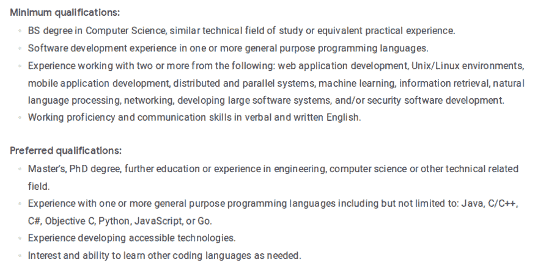

# 为什么你不应该成为一名 X 软件开发者

> 原文:[https://dev . to/calvinchiulele/why-you-should-t-entitle-you-as-a-x-software-developer-1cmj](https://dev.to/calvinchiulele/why-you-shouldn-t-entitle-yourself-as-a-x-software-developer-1cmj)

你好。

今天的帖子是关于为什么你不应该自称为 PHP 或 JavaScript 或 X 语言软件开发人员，而应该自称为软件开发人员。是的，作为一名软件开发人员。你现在可能会认为我的观点是不正确的，但这是我这个月一直在经历的事情。如今，寻找工作机会听起来是一项艰巨的任务，如果你使用一些公司认为过时的工具，那就更糟了。回到 2017 年，当我意识到我可以通过[https://careers.google.com](https://careers.google.com)在谷歌工作时，我很高兴，因为这是我梦想为之工作的公司。但我总是自称是 PHP 开发人员，而谷歌不使用 PHP 和相关语言，如黑客 HHVM，所以我为谷歌工作的梦想走下坡路了。从 2017 年到现在的整个时间里，我一直在提升自己在 PHP 和相关工具方面的知识和经验，甚至知道 Google 不用。我也一直在寻找与 PHP 及其生态系统相关的工作机会，但我找到了一个雄心勃勃的角色，但他们与 Ruby 和 Ruby on Rails 合作。在知道可以在其他公司用 PHP 和 Laravel 工作的情况下，我应该投入时间学习 Ruby 和 Ruby on Rails 吗？是的，我应该投资我的时间，这对我来说是必须的。我是一名初级软件开发人员，希望与其他开发人员一起成长和学习。因此，在我现在的职位上，我所要做的就是学习所有可能的东西(尤其是后端&至少是前端框架，因为这是我最感兴趣的),让自己有机会找到一份好工作，而不仅仅是试图让自己成为一名 X 软件开发人员。

 
**图 1 -谷歌软件工程师角色**

正如你在上面的谷歌角色中看到的，最后一个要求与这篇文章有关。我甚至听说，谷歌可以雇用使用不同于谷歌使用的其他语言的开发人员，但他们必须学习公司工作中使用的特定语言。

 
**图 Shopify 软件开发人员角色片段**

上面的片段来自 Shopify 软件开发人员角色。他们可以雇佣用 Shopify 以外的语言编写代码的开发人员，但他们必须在以后熟悉 Ruby 及其生态系统。

在我看来，Google 和 Shopify(以及其他公司)对他们的开发者说的话(以及对你说的话！)是技术涉及很多，语言和框架来来去去，就像它们来了一样，所以作为软件开发人员，你应该改变你作为软件开发人员的想法，为了更好的体验，你应该尝试不断学习新的东西，做一个充满激情的软件开发人员。

我现在正在用 PHP 做我的副业项目，学习 Ruby 和 Ruby on Rails 和 Python，并计划在未来的特定时间点学习 C/C++。

这些是我的想法，为什么你和我不应该再把自己称为 X 软件开发人员，而是软件开发人员。

如果你对这篇文章的主题有不同的想法，你可以在评论中联系我。