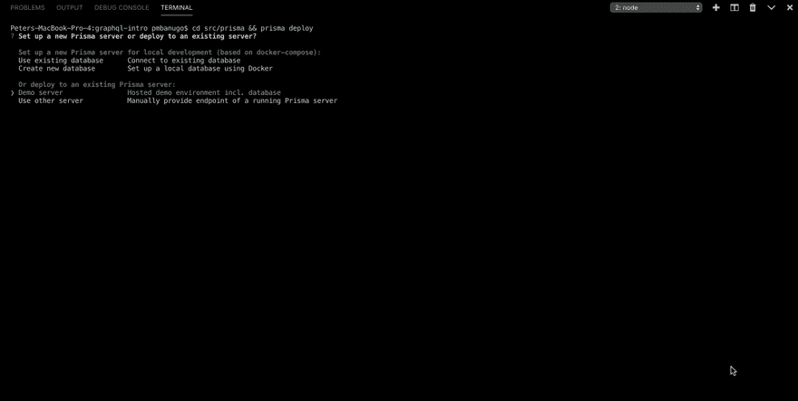
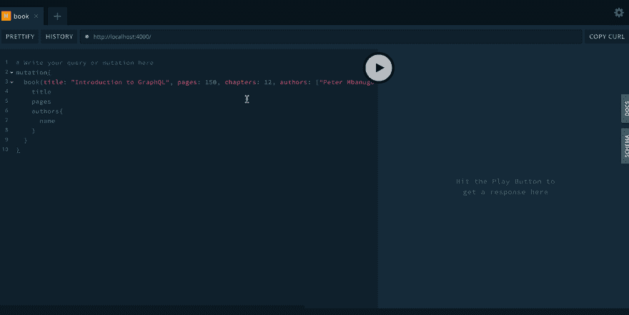
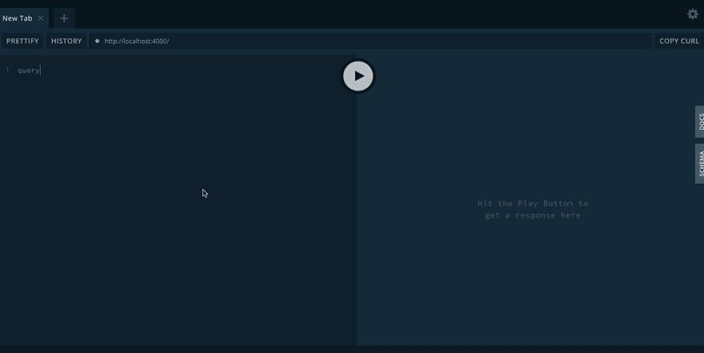

# GraphQL:突变和数据库访问

> 原文:[https://dev . to/pmbanugo/graph QL-mutation-and-database-access-5a 62](https://dev.to/pmbanugo/graphql-mutation-and-database-access-5a62)

GraphQL 被描述为 API 的数据查询和操作语言，以及用现有数据完成查询的运行时，它允许不同的客户端使用您的 API 并只查询他们需要的数据。它有助于解决一些 REST 服务存在的问题。也就是[取多和取少](https://stackoverflow.com/questions/44564905/what-is-over-fetching-or-under-fetching)，这是一个性能问题。在之前的[帖子](https://dev.to/pmbanugo/graphql-schema-resolvers-type-system-schema-language-and-query-language-5c0i)中，我写了关于 GraphQL 类型系统、查询语言、模式和解析器的内容。我向您展示了如何使用`graphql-yoga`构建一个 GraphQL 服务器，并用来自 GraphQL playground 的一些查询测试了这个 API。在本帖中，我将向您介绍 GraphQL 突变。我们还将移除我们在上一篇文章中使用的内存存储，并使用数据库来访问和存储我们的数据。

## [](#adding-a-database)添加数据库

如果你没有遵循之前的帖子，你可以在 [GitHub](https://github.com/pmbanugo/graphql-intro-js) 上下载源代码。前一篇文章的完整代码包含在`src-part-1`文件夹中。如果您想遵循编码，将该文件夹重命名为`src`,并从这里开始遵循编码说明。

在我们开始创建 GraphQL 变体之前，我希望我们使用一个数据库来处理 GraphQL 系统中的现有查询。我们将使用 [Prisma](https://github.com/prisma/prisma) 作为 MySQL 数据库的数据访问层。对于这个例子，我们将使用运行在 Prisma 云服务上的 Prisma 演示服务器。

让我们继续定义一个数据库模式。添加一个新文件`src/prisma/datamodel.prisma`，内容如下

```
type Book {
    id: ID! @id
    title: String!
    pages: Int
    chapters: Int
    authors: [Author!]!
}

type Author {
    id: ID! @id
    name: String! @unique
    books: [Book!]!
} 
```

<svg width="20px" height="20px" viewBox="0 0 24 24" class="highlight-action crayons-icon highlight-action--fullscreen-on"><title>Enter fullscreen mode</title></svg> <svg width="20px" height="20px" viewBox="0 0 24 24" class="highlight-action crayons-icon highlight-action--fullscreen-off"><title>Exit fullscreen mode</title></svg>

上面模式代表了我们的数据模型。每种类型都将被映射到一个数据库表。让`!`具有一个类型将使数据库中的该列不可为空。我们还用`@id`指令注释了一些字段。GraphQL 指令以`@`开头，用于模式语言或查询语言。`@id`指令由 Prisma 管理，会将字段标记为数据库中的主键，并为数据库中的该列自动生成全局唯一 ID。`@unique`指令将在数据库中用一个惟一的约束来标记该列。这也将允许我们通过作者的名字来查找作者，稍后您将看到这一点。

接下来，我们添加一个新文件`src/prisma/prisma.yml`，它将包含 Prisma 的配置选项。

```
# The HTTP endpoint for the demo server on Prisma Cloud
endpoint: ""

# Points to the file that contains your datamodel
datamodel: datamodel.prisma

# Specifies language & location for the generated Prisma client
generate:
  - generator: javascript-client
    output: ./client 
```

<svg width="20px" height="20px" viewBox="0 0 24 24" class="highlight-action crayons-icon highlight-action--fullscreen-on"><title>Enter fullscreen mode</title></svg> <svg width="20px" height="20px" viewBox="0 0 24 24" class="highlight-action crayons-icon highlight-action--fullscreen-off"><title>Exit fullscreen mode</title></svg>

Prisma CLI 将使用它来配置和更新云中的 Prisma 服务器，并根据数据模型生成客户端 API。`endpoint`选项将包含 Prisma 云服务器的 URL。`datamodel`选项指定数据模型的路径，`generate`选项指定我们正在使用 javascript 客户端生成器，它应该将客户端文件输出到`/client`文件夹。Prisma CLI 可以使用其他生成器生成客户端。目前有 TypeScript 和 Go 的生成器。我们正在使用 JavaScript，所以我选择了使用`javascript-client`生成器。要了解更多关于这个配置文件的结构，请随意查看[文档](https://www.prisma.io/docs/-5cy7#reference)。

我们需要 Prisma CLI 来部署我们的 Prisma 服务器和生成 Prisma 客户端。我们将使用 npm 全局安装 CLI。运行以下命令安装 Prisma CLI。

```
npm install -g prisma 
```

<svg width="20px" height="20px" viewBox="0 0 24 24" class="highlight-action crayons-icon highlight-action--fullscreen-on"><title>Enter fullscreen mode</title></svg> <svg width="20px" height="20px" viewBox="0 0 24 24" class="highlight-action crayons-icon highlight-action--fullscreen-off"><title>Exit fullscreen mode</title></svg>

在写这篇文章的时候，我正在运行 CLI 的版本`1.34.0`。安装完成后，我们现在需要部署我们的数据模型。按照以下说明在 Prisma cloud 上设置数据库。

1.  在命令行中运行`cd src/prisma && prisma deploy`。
2.  系统会提示您选择如何设置 Prisma 服务器。选择`Demo Server`继续。
3.  CLI 可能希望通过打开浏览器窗口让您登录或注册 Prisma 来验证您的请求。登录后，关闭窗口并返回到命令提示符。
4.  下一个提示要求您选择一个区域，让演示服务器托管在 Prisma Cloud 上。选择任意一个并按下**回车**键继续。
5.  现在要求您为服务选择一个名称。输入`graphql-intro`(或您选择的任何名称)并继续。
6.  下一个提示要求为我们的工作流的当前阶段命名。按下**键，输入**继续，接受默认值。

CLI 利用这些信息和`prisma.yml`中的信息来设置演示服务器。完成后，它会将端点文件更新到 Prisma 服务器。它还将在控制台中打印关于数据库如何设置的信息。

[T2】](https://res.cloudinary.com/practicaldev/image/fetch/s--rYK4Ovjn--/c_limit%2Cf_auto%2Cfl_progressive%2Cq_auto%2Cw_880/https://ucarecdn.com/ab930c7a-c3d2-4182-b074-e44160da8b83/)

设置好服务器后，下一步是为我们的数据模型生成 Prisma 客户机。Prisma 客户端是根据您的数据模型自动生成的，它为您提供了与 Prisma 服务进行通信的 API。运行以下命令来生成我们的 Prisma 客户端。

```
prisma generate 
```

<svg width="20px" height="20px" viewBox="0 0 24 24" class="highlight-action crayons-icon highlight-action--fullscreen-on"><title>Enter fullscreen mode</title></svg> <svg width="20px" height="20px" viewBox="0 0 24 24" class="highlight-action crayons-icon highlight-action--fullscreen-off"><title>Exit fullscreen mode</title></svg>

这个命令生成客户端 API 来访问我们之前创建的演示服务器。它应该在`src/prisma/client`中转储几个文件。我们的下一步是使用 Prisma 客户机将我们的 GraphQL 服务器连接到数据库服务器，并从那里获取数据。

打开`src/index.js`导入从生成的客户端导出的 prisma 实例，然后删除`books`变量。

```
const { GraphQLServer } = require("graphql-yoga");
const { prisma } = require('./prisma/client')

....//rest of the code remains untouched 
```

<svg width="20px" height="20px" viewBox="0 0 24 24" class="highlight-action crayons-icon highlight-action--fullscreen-on"><title>Enter fullscreen mode</title></svg> <svg width="20px" height="20px" viewBox="0 0 24 24" class="highlight-action crayons-icon highlight-action--fullscreen-off"><title>Exit fullscreen mode</title></svg>

我们还需要一个运行 Prisma 客户端所需的依赖项。打开命令行并运行命令`npm install prisma-client-lib`来安装这个包。

## [](#using-prisma-client-in-resolvers)在解析器中使用 Prisma 客户端

现在我们已经生成了 Prisma 客户端，我们需要在解析器中使用它。我们将通过每个解析器函数获得的上下文参数传递 prisma 实例。我们在上一篇文章中简要讨论了这个论点，现在你将会用到它。我提到过,`context`参数对于保存上下文信息很有用，您可以向其中读取或写入数据。为了使用 prisma 客户机，我们将在初始化 GraphQL 客户机时，将 prisma 实例从生成的客户机写入上下文对象。

在`src/index.js`的第 32 行，更新`GraphQLServer`的初始化，如下所示。

```
const server = new GraphQLServer({
  typeDefs,
  resolvers,
  context: { prisma }
}); 
```

<svg width="20px" height="20px" viewBox="0 0 24 24" class="highlight-action crayons-icon highlight-action--fullscreen-on"><title>Enter fullscreen mode</title></svg> <svg width="20px" height="20px" viewBox="0 0 24 24" class="highlight-action crayons-icon highlight-action--fullscreen-off"><title>Exit fullscreen mode</title></svg>

我们还将更新解析器，使用 prisma 来解析查询。更新`resolvers`变量中的`Query`属性，如下所示:

```
const resolvers = {
  Query: {
    books: (root, args, context, info) => context.prisma.books(),
    book: (root, args, context, info) => context.prisma.book({ id: args.id })
  },
  ...
} 
```

<svg width="20px" height="20px" viewBox="0 0 24 24" class="highlight-action crayons-icon highlight-action--fullscreen-on"><title>Enter fullscreen mode</title></svg> <svg width="20px" height="20px" viewBox="0 0 24 24" class="highlight-action crayons-icon highlight-action--fullscreen-off"><title>Exit fullscreen mode</title></svg>

在这些解析器中，我们调用附属于上下文的 prisma 客户机实例上的函数。函数`prisma.books()`给我们数据库中的所有书籍，而`prisma.book({ id: args.id})`根据传入的 id 给我们一本书。

## [](#adding-mutation-operations)添加变异操作

到目前为止，我们能够从 GraphQL API 获取数据，但我们需要一种方法来更新服务器上的数据。GraphQL 变异是一种允许客户端修改服务器上的数据的操作。通过这种操作类型，我们能够在服务器上添加、删除和更新记录。为了读取数据，我们使用 GraphQL 查询操作类型，这是您从上一篇文章中学到的，我们在上一节中也提到过。

我们将为我们的 GraphQL API 添加一个新特性，这样我们就可以添加书籍和作者。我们将从更新 GraphQL 模式开始。更新 index.js 中的`typeDefs`变量，如下所示

```
const typeDefs = `
type Book {
    id: ID!
    title: String!
    pages: Int
    chapters: Int
    authors: [Author!]!
}

type Author {
    id: ID!
    name: String!
    books: [Book!]!
}

type Query {
  books: [Book!]
  book(id: ID!): Book
  authors: [Author!]
}

type Mutation {
  book(title: String!, authors: [String!]!, pages: Int, chapters: Int): Book!
}
`; 
```

<svg width="20px" height="20px" viewBox="0 0 24 24" class="highlight-action crayons-icon highlight-action--fullscreen-on"><title>Enter fullscreen mode</title></svg> <svg width="20px" height="20px" viewBox="0 0 24 24" class="highlight-action crayons-icon highlight-action--fullscreen-off"><title>Exit fullscreen mode</title></svg>

我们已经更新了我们的 GraphQL 模式，添加了新的类型，`Author`和`Mutation`。我们添加了一个新字段`authors`,它是 Book 类型的`Author`列表，并添加了一个新字段`authors: [Author!]`到根查询类型。我还将名为`id`的字段改为使用`ID`类型。这是因为我们在数据模型中使用了该类型，数据库将为这些字段生成全局唯一标识符，这与我们目前使用的`Int`类型不匹配。根`Mutation`类型定义了我们的变异操作，我们只有一个名为`book`的字段，它接受创建一本书所需的参数。

在我们向 API 添加变异的过程中，下一步是为我们添加的新字段和类型实现解析器。在`index.js`仍然打开的情况下，转到定义了`resolvers`变量的第 **30** 行，向对象添加一个新字段`Mutation`，如下所示。

```
const resolvers = {
  Mutation: {
    book: async (root, args, context, info) => {
      let authorsToCreate = [];
      let authorsToConnect = [];

      for (const authorName of args.authors) {
        const author = await context.prisma.author({ name: authorName });
        if (author) authorsToConnect.push(author);
        else authorsToCreate.push({ name: authorName });
      }

      return context.prisma.createBook({
        title: args.title,
        pages: args.pages,
        chapters: args.chapters,
        authors: {
          create: authorsToCreate,
          connect: authorsToConnect
        }
      });
    }
  },
  Query: {
    ...
  },
  Book: {
    ...
  }
}; 
```

<svg width="20px" height="20px" viewBox="0 0 24 24" class="highlight-action crayons-icon highlight-action--fullscreen-on"><title>Enter fullscreen mode</title></svg> <svg width="20px" height="20px" viewBox="0 0 24 24" class="highlight-action crayons-icon highlight-action--fullscreen-off"><title>Exit fullscreen mode</title></svg>

就像其他解析器函数一样，根突变类型中的`books`解析器接受四个参数，我们从 args 参数获得需要创建的数据，从 context 参数获得 prisma 实例。这个解析器是这样实现的，它将在数据库中创建图书记录，如果不存在，则创建作者，然后根据我们的数据模型中定义的数据关系链接这两个记录。所有这些都将作为数据库中的一个事务来完成。我们使用 Prisma 所称的[嵌套对象写](https://www.prisma.io/docs/prisma-client/basic-data-access/writing-data-JAVASCRIPT-rsc6/#nested-object-writes)来修改单个事务中跨关系的多个数据库记录。

虽然我们有了根突变类型的解析器，但我们仍然需要为新的`Author`类型添加解析器，并为`Query`和`Book`类型添加新的字段。更新*书*和*查询*解析器如下:

```
const resolvers = {
  Mutation: {
    ...
  },
  Query: {
    books: (root, args, context, info) => context.prisma.books(),
    book: (root, args, context, info) => context.prisma.book({ id: args.id }),
    authors: (root, args, context, info) => context.prisma.authors()
  },
  Book: {
    authors: (parent, args, context) => context.prisma.book({ id: parent.id }).authors()
  },
  Author: {
    books: (parent, args, context) => context.prisma.author({ id: parent.id }).books()
  }
}; 
```

<svg width="20px" height="20px" viewBox="0 0 24 24" class="highlight-action crayons-icon highlight-action--fullscreen-on"><title>Enter fullscreen mode</title></svg> <svg width="20px" height="20px" viewBox="0 0 24 24" class="highlight-action crayons-icon highlight-action--fullscreen-off"><title>Exit fullscreen mode</title></svg>

根查询操作的`authors`字段解析器就像调用`prisma.authors()`来获取数据库中的所有作者一样简单。您应该注意到在`Book`和`Author`中省略了标量类型字段的解析器。这是因为 GraphQL 服务器可以通过将结果与来自`parent`参数的同名属性进行匹配来推断如何解析这些字段。我们拥有的其他关系字段不能以同样的方式解析，所以我们需要提供一个实现。正如你所看到的，我们打电话给 Prisma 来获取这些数据。

在所有这些编辑之后，你的 **index.js** 应该和下面的一样:

```
const { GraphQLServer } = require("graphql-yoga");
const { prisma } = require("./prisma/client");

const typeDefs = `
type Book {
    id: ID!
    title: String!
    pages: Int
    chapters: Int
    authors: [Author!]!
}

type Author {
    id: ID!
    name: String!
    books: [Book!]!
}

type Query {
  books: [Book!]
  book(id: ID!): Book
  authors: [Author!]
}

type Mutation {
  book(title: String!, authors: [String!]!, pages: Int, chapters: Int): Book!
}
`;

const resolvers = {
  Mutation: {
    book: async (root, args, context, info) => {
      let authorsToCreate = [];
      let authorsToConnect = [];

      for (const authorName of args.authors) {
        const author = await context.prisma.author({ name: authorName });
        if (author) authorsToConnect.push(author);
        else authorsToCreate.push({ name: authorName });
      }

      return context.prisma.createBook({
        title: args.title,
        pages: args.pages,
        chapters: args.chapters,
        authors: {
          create: authorsToCreate,
          connect: authorsToConnect
        }
      });
    }
  },
  Query: {
    books: (root, args, context, info) => context.prisma.books(),
    book: (root, args, context, info) => context.prisma.book({ id: args.id }),
    authors: (root, args, context, info) => context.prisma.authors()
  },
  Book: {
    authors: (parent, args, context) =>
      context.prisma.book({ id: parent.id }).authors()
  },
  Author: {
    books: (parent, args, context) =>
      context.prisma.author({ id: parent.id }).books()
  }
};

const server = new GraphQLServer({
  typeDefs,
  resolvers,
  context: { prisma }
});
server.start(() => console.log(`Server is running on http://localhost:4000`)); 
```

<svg width="20px" height="20px" viewBox="0 0 24 24" class="highlight-action crayons-icon highlight-action--fullscreen-on"><title>Enter fullscreen mode</title></svg> <svg width="20px" height="20px" viewBox="0 0 24 24" class="highlight-action crayons-icon highlight-action--fullscreen-off"><title>Exit fullscreen mode</title></svg>

## [](#testing-the-graphql-api)测试 GraphQL API

到目前为止，我们已经更新了模式，并添加了解析器来调用数据库服务器以获取数据。我们现在已经到了需要测试我们的 API 的时候了，看看它是否像预期的那样工作。打开命令行，运行`node src/index.js`启动服务器。然后在浏览器中打开 [localhost:4000](https://dev.tolocalhost:4000) 。这应该会打开 GraphQL 游乐场。复制并运行下面的查询来添加一本书。

```
mutation{
  book(title: "Introduction to GraphQL", pages: 150, chapters: 12, authors: ["Peter Mbanugo", "Peter Smith"]){
    title
    pages
    authors{
      name
    }
  }
} 
```

<svg width="20px" height="20px" viewBox="0 0 24 24" class="highlight-action crayons-icon highlight-action--fullscreen-on"><title>Enter fullscreen mode</title></svg> <svg width="20px" height="20px" viewBox="0 0 24 24" class="highlight-action crayons-icon highlight-action--fullscreen-off"><title>Exit fullscreen mode</title></svg>

[T2】](https://res.cloudinary.com/practicaldev/image/fetch/s--vUiKY_cp--/c_limit%2Cf_auto%2Cfl_progressive%2Cq_auto%2Cw_880/https://ucarecdn.com/1461cd73-d446-4dec-9c5b-84f771a51606/)

既然已经创建了图书，我们可以在应用程序中查询并查看作者的情况。

```
query{
  authors {
    name
    books {
      title
    }
  }
} 
```

<svg width="20px" height="20px" viewBox="0 0 24 24" class="highlight-action crayons-icon highlight-action--fullscreen-on"><title>Enter fullscreen mode</title></svg> <svg width="20px" height="20px" viewBox="0 0 24 24" class="highlight-action crayons-icon highlight-action--fullscreen-off"><title>Exit fullscreen mode</title></svg>

[T2】](https://res.cloudinary.com/practicaldev/image/fetch/s--B4Gkrwcy--/c_limit%2Cf_auto%2Cfl_progressive%2Cq_auto%2Cw_880/https://ucarecdn.com/fd720758-7368-4ee5-97ca-d4b607d4999c/)

## [](#thats-a-wrap)就这么定了！

我向您介绍了 GraphQL 变异，这是 GraphQL 中三种根操作类型之一。我们用新的功能更新了我们的模式，包括向应用程序添加书籍的突变，以及使用 Prisma 作为我们的数据库访问层。我向您展示了如何使用来自 GraphQL 的相同模式定义语言使用[数据模型](https://www.prisma.io/docs/datamodel-and-migrations/datamodel-MYSQL-knul/)，使用 [CLI 并生成 Prisma 客户端](https://www.prisma.io/docs/prisma-client/)，以及如何使用 Prisma 客户端[读取](https://www.prisma.io/docs/prisma-client/basic-data-access/reading-data-JAVASCRIPT-rsc2/)和[写入](https://www.prisma.io/docs/prisma-client/basic-data-access/writing-data-JAVASCRIPT-rsc6/)数据。由于我们的数据存储在 Prisma cloud 上，您可以在 [app.prisma.io](https://app.prisma.io) 上在线访问您的服务和数据库。

在这篇文章中，您为我们的应用程序添加了新的功能。这将使您具备构建 GraphQL API 来执行 CRUD 操作的技能。这应该让你可以向你的朋友炫耀你现在是一名 GraphQL 开发人员😎。为了向您证明这一点，我希望您在 API 中添加一组新的功能，如下所示:

1.  添加一个查询，按作者姓名查找作者。
2.  允许书籍有出版商。这将使您向模式中添加一个新类型。您应该能够独立添加出版商和查询属于一个出版商的所有书籍。

如果你卡住了，或者想让我看看你的解决方案，请在 twitter 上对我大喊大叫。我是推特上的 [@p_mbanugo。](https://twitter.com/p_mbanugo)

虽然这项技能使您成为一名自豪的 GraphQL 开发人员，但我不会就此止步。我想增强你的技能，让你更专业。在下一篇文章中，我将向您介绍 GraphQL 服务器中的认证和 GraphQL 订阅。所以敬请关注，保持编码精神🚀👩‍🎤😎💪❤️

你可以在 [GitHub](https://github.com/pmbanugo/graphql-intro-js) 上找到这篇文章的完整代码。下载源代码，进入`src-part-2`文件夹。

> 最初发表于[telerik.com/blogs](https://www.telerik.com/blogs/graphql-mutation-and-database-access)