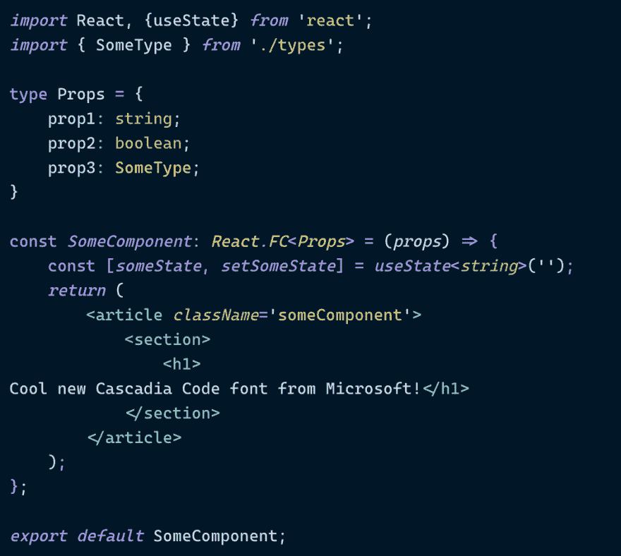

# 微软新的免费字体

> 原文:[https://dev.to/chiangs/microsoft-s-new-free-font-409g](https://dev.to/chiangs/microsoft-s-new-free-font-409g)

微软发布了一款新的免费等宽字体，名为 ***卡斯卡迪亚码*** 。额外收获:它支持连字！

它将与 Windows 终端的新版本一起发布，但他们也通过 GitHub repo 发布了它。

有人试过吗？你怎么想呢?

贴一张你编辑主题的截图吧！

下面是我在 VS 代码上用 NightOwl 做的:*注意:对我来说，Polacode 没有正确格式化，所以我用老办法做了截图。*

[T2】](https://res.cloudinary.com/practicaldev/image/fetch/s--Xhsgnswy--/c_limit%2Cf_auto%2Cfl_progressive%2Cq_auto%2Cw_880/https://thepracticaldev.s3.amazonaws.com/i/80p5ynukuwint3laolc8.png)

和 Dank Mono 进行比较。

[T2】](https://res.cloudinary.com/practicaldev/image/fetch/s--VNWbe6aM--/c_limit%2Cf_auto%2Cfl_progressive%2Cq_auto%2Cw_880/https://thepracticaldev.s3.amazonaws.com/i/bbwgx34dfor35muo0xc1.png)