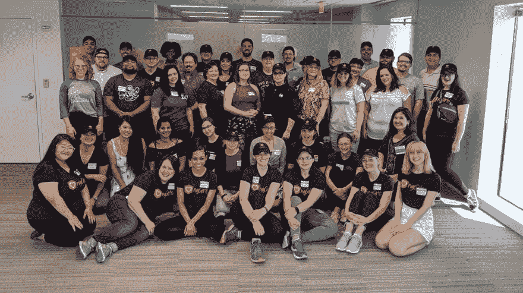
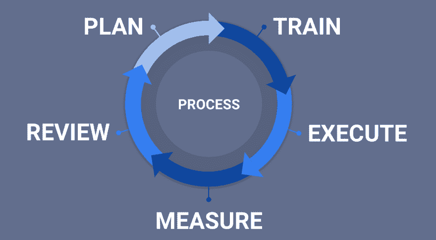
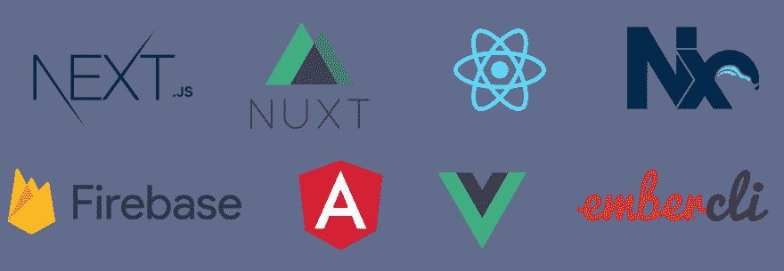

# 介绍 PAM Stack——构建可持续、包容性开发团队的新框架

> 原文:[https://dev . to/this dot media/introducing-the-PAM-stack-a-new-framework-for-building-sustainable-inclusive-development-teams-2ppd](https://dev.to/thisdotmedia/introducing-the-pam-stack-a-new-framework-for-building-sustainable-inclusive-development-teams-2ppd)

在这个 Dot Labs，我们有幸通过我们的学徒计划等计划以及 ngGirls 等指导活动，与许多有才华的初级开发人员一起工作。我们与训练营的毕业生和自学成才的开发者交谈过。尽管我们在这些人身上看到了天赋，但我们经常听说进入 web 开发行业有多么困难。

<figure>

[T2】](https://res.cloudinary.com/practicaldev/image/fetch/s--UPwINmqp--/c_limit%2Cf_auto%2Cfl_progressive%2Cq_auto%2Cw_880/https://www.vinsolutions.com/vinsolutions/media/Vin-Images/Resources/Articles/Header-Feature-Image-resized.jpg%3Fext%3D.jpg)

<figcaption>Volunteering at the ngGirls event in Kansas City</figcaption>

</figure>

与此同时，公司哀叹他们无法找到优秀人才来填补团队中的许多空缺。这些公司谈论开发人员有多昂贵，以及他们的团队遇到了多少损耗。我们听说他们的项目太重要，他们的用例太复杂，他们的预算太小，负担不起初级员工。这些公司哀叹招聘人才和团队缺乏多样性。与此同时，他们对年轻员工置之不理，这是这个行业中最多样化的渠道之一。

我们试图找出为什么大三学生找工作如此艰难，为什么公司一开始就不愿意雇佣大三学生。我们发现，人们觉得低年级学生不适合他们的团队，因为低年级学生缺乏什么(他们需要更多的指导，项目太复杂，训练营/CS 毕业生没有真正的编程团队，等等。).这些团队没有意识到的是，不能接纳和利用初级人才实际上是他们自己的错误。

## 团队为什么会失败

我们对这个问题了解得越多，就越意识到最好地支持初级开发人员的团队也支持他们的中级开发人员和高级开发人员。我们发现对初级开发人员影响最大的一些问题是:

*   **糟糕的入职文档**——大三学生没有办法回答自己的问题，所以他们被迫在几乎每项任务上都寻求帮助。这让低年级的人很自卑，也让比较资深的开发人员很恼火。
*   对个人优秀的依赖 -在要求每个人对不犯错误负责的团队中，下级需要大量的微观管理，否则错误最终会释放给用户。
*   **10x 开发人员/摇滚明星开发人员心态** -专注于最优秀成员的团队通常缺乏包容的同志情谊。这些团队会在压力大的时候将初级成员拒之门外，为他们的摇滚明星腾出更多空间。剧透提醒:事情总是有压力的。
*   **没有评估或指导** -初级员工需要反馈才能成长和发展为中高级工程师。如果没有评估或指导，低年级学生就得不到反馈，因此会停滞不前，什么也学不到。

但是这些问题也会影响到你团队的其他成员！

*   没有适当入职文档的新聘开发人员将需要更长时间才能适应。因此，他们从其他团队成员那里榨取更多的时间，以努力提高效率。这迫使团队试图雇佣更多合格的工程师来缩短启动时间。
*   依靠个人优势的团队也会被“被公共汽车撞了”的恐惧所削弱。人们对应用程序特定部分的开发变得如此重要，以至于团队担心如果这些人离开团队，项目会分崩离析。这会造成这样的情况，那些人觉得他们可以做任何事情而不承担后果。
*   过多的优越感导致包容性不足，降低了视角的多样性。对于最终用户来说，这几乎总是导致更差的产品。
*   中级工程师甚至高级工程师都需要指导和反馈，以在他们自己的职业生涯中成长。没有这一点，这些工程师的发展就会停滞不前，变得不快乐。团队将被要求总是从公司外部招聘(以非常高的溢价)，而不是从内部招聘。

那么，当一个团队真正支持团队中的所有成员时，会是什么样子呢？PAM 堆栈的目标是什么，我们对成功团队的愿景是什么？

*   成功不是个人的，而是团队的。
*   团队不太关注自行车脱落和不相关的复杂性，而是关注重要的以用户为中心的功能。
*   注重创新、乐于学习、热衷于在整个团队中分享知识的文化
*   团队中更广泛、更多样化的工程师和技能水平

<figure>

[T2】](https://res.cloudinary.com/practicaldev/image/fetch/s--MwWcktZc--/c_limit%2Cf_auto%2Cfl_progressive%2Cq_auto%2Cw_880/https://upload.wikimedia.org/wikipedia/commons/thumb/e/eb/Bicycle_shed.JPG/800px-Bicycle_shed.JPG)

<figcaption>Bikeshedding - Developers favorite minimally productive pastime</figcaption>

</figure>

## 进入 PAM 栈

我们观察了最支持低年级学生的团队。我们看到这些团队的特点是:

*   团队成员知道对他们的期望，以及他们对其他人的期望
*   应用程序的结构是这样的，所有技能和经验水平的开发人员都可以贡献有意义和重要的工作
*   围绕指导、成长、探索、实验和分享的文化

这些成为了 PAM 堆栈的三个支柱:过程、抽象和指导。

### 流程

软件团队的活动经常是临时的，并且依赖于团队成员的个人能力。当事情变得有压力时，这些团队会很努力。交流减少了，技术债务增加了，重要的过程被简单地忽略了。

我们主张，当事情平静下来时，团队应该专注于定义他们的目标，实现这些目标的过程，以及如何处理经常出现的意外障碍。

定义良好的过程对成功的团队至关重要。他们澄清期望，改善团队协作，消除单点故障，在事情变得疯狂时减轻压力，甚至减少冲突和权力斗争。

构建项目过程的方法有很多，我们并不主张任何特定的解决方案是最好的。然而，几乎所有的过程都遵循相似的模式:

[T2】](https://res.cloudinary.com/practicaldev/image/fetch/s--6HB-ywLv--/c_limit%2Cf_auto%2Cfl_progressive%2Cq_auto%2Cw_880/https://thepracticaldev.s3.amazonaws.com/i/bmsbeiq8hmhztkdm3l47.png)

*   定义期望 -当平静的时候，写下你期望人们在各种情况下做什么！写实际计划！
*   **描述如何达到期望** -解释如何制定计划！清单！一步一步的指示！训练！
*   **验证是否达到预期** -回顾所有事情！不仅仅是代码！审查需求、设计、会议记录、流程计划、文档和面向客户的文档！有人负责运行流程，并确保合规性！
*   **记录结果**——找到有意义的度量标准并保存它们(例如:缺陷的类型，计划的与实际的代码估计，每次冲刺/发布的流失率，等等。)
*   **对照预期回顾成就**——用你收集的数据评估你的计划和执行情况。能提高执行力吗？你的计划？你的度量标准？

在本系列的后续文章中，我们将进一步深入这个过程循环的每个部分。我们将描述如何编写有效的计划，如何选择有用的度量标准，以及如何迭代地改进团队的过程。

### 抽象概念

现代 web 开发中有太多东西需要学习。为了向我们的用户提供世界一流的体验，我们要求我们的开发人员精通性能、安全性、可访问性、响应式设计、渐进式增强、浏览器兼容性、渐进式 web 应用等！在一次又一次的谈话中，我们听到复杂性是进入我们行业的障碍。

因此，我们提倡使用能够免费提供大量复杂工作的技术。Angular、Vue 和 React 等框架对于初级和中级开发人员来说是惊人的力量倍增器。它们允许越来越多样化的开发人员创建强大的 web 体验，而不需要确切地知道所有事情是如何完成的。这些技术也有很好的文档记录(有大量的培训资源)，这意味着新的团队成员更容易理解如何更快地为应用程序做出贡献。

<figure>

[T2】](https://res.cloudinary.com/practicaldev/image/fetch/s--PFXlMAzE--/c_limit%2Cf_auto%2Cfl_progressive%2Cq_auto%2Cw_880/https://thepracticaldev.s3.amazonaws.com/i/ckgcwfwtyrctxje3tk19.png)

<figcaption>Popular, well-documented, feature-rich CLI tools are available for all frameworks and stacks</figcaption>

</figure>

这些框架通常提供强大的 CLI 工具，帮助开发人员搭建、构建和部署具有出色性能和特性的应用程序。团队需要为每个项目创建定制的吞咽和咕噜流程的日子已经一去不复返了。与框架一样，这些工具拥有优秀的文档，可以真正帮助新的团队成员快速上手，并为影响他们项目的问题获得上下文相关的支持。

我们还提倡使用技术、方法和库来隔离复杂的业务逻辑或复杂的特性，远离其他关注点，例如构建可访问的语义 HTML 和可维护的 CSS。按照这些思路，我们支持 NgRx 等状态管理库和 XState 等状态机库。为了降低 UI 开发的复杂性，我们还支持使用设计系统和组件库，如 material design 和 Shopify 的 Polaris。这些工具有助于标准化用户界面的设计和开发，并且通常这些工具提供了具有可访问性、性能和内置特性的组件。

在本系列的后续文章中，我们将更深入地研究这些推荐的方法和库，并解释它们如何帮助由具有不同技能的工程师组成的团队。

### 师友

PAM 堆栈的最后一个支柱(但肯定不是最不重要的)是导师。关于导师的统计数据令人瞠目结舌。没有得到指导的工程师比得到指导的工程师更有可能离开他们的团队。被辅导者的晋升速度明显高于未接受辅导的工程师。有趣的是，导师也经历了类似的提升和晋升。招聘成本高，入职难。从长远来看，雇佣初级和中级开发人员并指导他们成为团队需要的高级工程师和架构师要便宜得多。

[T2】](https://res.cloudinary.com/practicaldev/image/fetch/s--lc1VRHo5--/c_limit%2Cf_auto%2Cfl_progressive%2Cq_auto%2Cw_880/https://thepracticaldev.s3.amazonaws.com/i/4c7djh97cocrjw2zopef.jpg)

为了理解接受导师文化意味着什么，我们要求人们考虑一下，如果你公司的人只有先找到接替他们位置的人才能得到晋升，那会是什么样子。这将如何改变人们的日常互动方式？突然，人们不能只担心“得到他们的”。人们必须寻找、指导和留住有才华的人，这样他们才能最终帮助他们获得晋升。

对摇滚明星开发者的狂热消退了。对摇滚明星导师的崇拜上升了。

在本系列的后续文章中，我们将探讨如何建立导师文化；我们将展示如何导师总是超越个人的优秀；我们将介绍不同类型的指导；此外，我们将描述如何组织导师和学员之间的一对一会议。

## 大三可以做什么？

有时，在没有做好支持他们的工作的团队中，低年级学生会感到无助。然而，即使团队不支持，低年级学生也可以做一些实际的事情来开始影响他们团队的变化。最终，我们建议人们成为他们希望在团队中看到的改变。我们提倡低年级学生提出问题，并在缺少的地方贡献文档。低年级学生应该感到有权要求审查他人的代码，并要求人们帮助审查他们自己的代码(即使是非正式的)。

在本系列的后续文章中，我们将更深入地探讨一些具体的策略，这些策略帮助初级人员以更好的方式销售他们的团队来构建软件和团队。我们将讨论不同团队面临的一些常见问题，这些问题使得其他一些 PAM 堆栈建议变得困难(例如:当所有开发人员都处于同一水平时，如何实现导师制)。最后，我们将提供一些资源来帮助团队开始。

## 结论

我们希望这个 PAM 栈的预览已经让你兴奋了。当我们与全国各地的青少年分享这些想法时，我们得到了热情的回应，这让我们深受鼓舞。我们希望，无论您是一家新技术创业公司的首席执行官、组建新团队的开发经理、日常管理工程师的技术主管/项目经理，还是仍在寻找第一份工作的开发人员，您都会发现这份材料对构建包容性、可持续发展团队很有吸引力、很有挑战性，也很有用。

在您的团队中实现 PAM 堆栈需要任何帮助吗？我们可以帮忙！Dot Labs 是一家 web 开发咨询公司，主要致力于前端 JavaScript 开发和指导。我们可以帮助审查您团队的流程，提出改进建议，然后与您合作实施这些流程。感兴趣吗？联系我们:[hi@thisdot.co](mailto:hi@thisdot.co)！