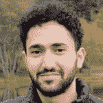

# 欢迎来到大线程俱乐部，亚塞尔阿尔纳贾尔。你是大线程徽章的最新获奖者。🎉

> 原文:[https://dev . to/dev team/welcome-to-the-big-thread-club-Yaser-al-najjar-you-the-late-winner-the-big-thread-badge-Ni2](https://dev.to/devteam/welcome-to-the-big-thread-club-yaser-al-najjar-you-are-the-latest-winner-of-the-big-thread-badge-ni2)

亚塞尔加入 [@zkat](https://dev.to/zkat) 、 [@stereobooster](https://dev.to/stereobooster) 、[@ liyastomas](https://dev.to/liyasthomas)、@emmawedekind、@neilonsoftware、 [@andrewbrown](https://dev.to/andrewbrown) 、 [@mjraadi](https://dev.to/mjraadi) 、 [@room_js](https://dev.to/room_js) 、 [@iam_timsmith](https://dev.to/iam_timsmith) 、@fullstack_to、 [@espoir](https://dev.to/espoir) 、[@ Helen and](https://dev.to/helenanders26)

## [亚塞尔](/yaser)纳贾尔<button name="button" type="button" data-info="{&quot;className&quot;:&quot;User&quot;,&quot;style&quot;:&quot;full&quot;,&quot;id&quot;:71570,&quot;name&quot;:&quot;Yaser Al-Najjar&quot;}" class="crayons-btn follow-action-button whitespace-nowrap c-btn--secondary fs-base " aria-label="Follow user: Yaser Al-Najjar" aria-pressed="false">跟随</button>

[Software Architect](/yaser)

大主题徽章授予在网站上创建讨论主题并引发最多集体评论的人(例如，由总❤️反应和相邻排名因素确定的分数)。

这是亚塞尔的思路:

 [## 你是一个平庸的开发者吗？我也是

### 亚塞尔·纳贾尔 1919 年 9 月 11 日 12 分钟阅读

#webdev #career #discuss](/yaser/are-you-a-mediocre-developer-me-too-34ed)

入门很简单:开始一个必定会引发大量评论的帖子。请社区讲述某类故事，并获得大量评论！即使这些帖子并不总是回答*深刻的问题*，但它们通常可以很好地了解更广泛的社区对某个主题的看法，并且通常非常有趣！

使用# discuss 标签来表示这个帖子是一个讨论主题。

## # [讨论](https://dev.to/t/discuss) <button name="button" type="button" data-info="{&quot;className&quot;:&quot;Tag&quot;,&quot;style&quot;:&quot;full&quot;,&quot;id&quot;:715,&quot;name&quot;:&quot;discuss&quot;}" class="crayons-btn follow-action-button whitespace-nowrap c-btn--secondary fs-base " aria-label="Follow tag: discuss" aria-pressed="false">跟随</button>

Craft a prompt and start a conversation!

*开发员工没有资格获得大线程徽章。🙂*

## **快乐编码！**