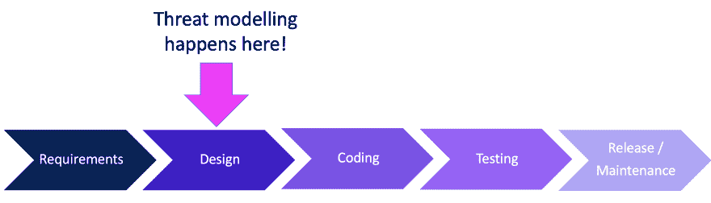

# 像老板一样向左推-第 6 部分:威胁建模

> 原文：<https://dev.to/azure/pushing-left-like-a-boss-part-6-threat-modelling-1j5g>

### 这个系列，还有我的博客，都动了！[来看看](https://wehackpurple.com/g8tg)！

* * *

系统开发生命周期(SDLC)设计阶段的最后一个安全相关部分是威胁建模，被亲切地称为“邪恶头脑风暴”。

威胁建模的目的是讨论您的系统可能面临的威胁，然后尽最大努力减轻它们，如果不能，则管理或接受风险。有多种正式的方法可以做到这一点，我不会在这里讨论，每一种都有自己的书，倡导者或专门的博客，可能比我做得更好。事实上，微软(我的雇主)[基本上发明了威胁建模](https://docs.microsoft.com/en-ca/azure/security/develop/threat-modeling-tool?WT.mc_id=devto-blog-tajanca)，你可以在这里阅读更多关于它的[。](https://docs.microsoft.com/en-ca/azure/security/develop/threat-modeling-tool?WT.mc_id=devto-blog-tajanca)

也就是说，亲爱的读者，我希望你理解为什么威胁建模是重要的，谁需要这样做，以及何时和如何开始。

### [在我的新博客上阅读其余内容！](https://wehackpurple.com/xfxk)！