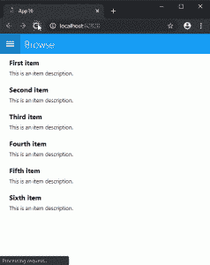

# 宣布 Uno 平台 2.0

> 原文：<https://dev.to/uno-platform/announcing-uno-platform-2-0-395d>

当我们最初在//build 2018 上开源 Uno 框架时，我们迈出了一大步，向世界展示了我们内部近五年来所做的工作。那是 2018 年，我们仍然主要通过 UWP 进行移动工作。在那些日子里，你看到我们骄傲地飘扬着#UWPEverywhere 的旗帜。从那时起，世界发生了很大的变化。NET 生态系统，在 WebAssembly world 中，以及在我们的社区要求我们涵盖的场景中。虽然 UWP 过去是，现在仍然是我们的最爱，但通过今天的发布，我们正在跟上观众的要求，我们正在努力确保未来的 WinUI 堆栈可以在任何地方运行——web assembly、iOS、Android，当然还有 Windows，为我们的新北极光腾出空间——#**WinUI everywhere**！！！

实际上，这意味着什么？

## 宣布 XAML 为 Uno 平台热重装预览

使用 Uno 进行开发的内部循环使您能够在 Visual Studio for Windows 中使用 XAML 热重装，允许您完成 95%的应用程序开发。您通常需要使用实际的应用程序环境，在设备上或在浏览器中完成应用程序的测试。

在应用程序运行时从 Visual Studio 热重新加载 XAML 的能力，将提供更新 UI 而无需重建的能力。热重装功能适用于 iOS、Android 和 WebAssembly。

*下面是一个使用 WebAssemly 进行编辑的示例*:

我们正在积极开发该功能，但它将提供一个很好的可能性，因为我们将改善使用 XAML 与语言服务集成、集成错误报告以及资源和模板版本的体验。

你可以访问我们的 GitHub 发布页面来试用一下:【https://github.com/unoplatform/uno/releases/tag/hr-pre1 T2】

## 宣布面向 Xamarin 的 Uno 平台 WebAssembly 渲染器。形式

虽然过去我们已经在这个方向上实现了突破，但今天我们可以自豪地说，您可以运行您的 Xamarin。通过 Uno 平台在 WebAssembly 上形成应用程序。

Xamarin。Forms teams 从一开始就致力于支持 UWP 和 Windows，由于 Uno 平台提供了完整的 UWP API 集，我们很自然地在 Uno 上构建这些渲染器来支持 WebAssembly。

这将启用 Xamarin。通过执行简单的命令行，在 Web 上运行表单应用程序。以下是在 Visual Studio for Windows 中的操作方法:

*   创建一个 Xamarin。表单项目
    *   选中“将项目和解决方案放在同一目录中”
    *   检查“Windows (UWP)”
*   使用 VS Developer 命令提示符，导航到包含该解决方案的文件夹
*   键入以下内容以安装最新的模板:

```
dotnet new -i Uno.ProjectTemplates.Dotnet::1.46.230-dev.2723 
```

*   然后键入以下内容创建新的 WebAssembly 项目:

```
dotnet new wasmxfhead 
```

*   在 Visual Studio 中打开或重新加载解决方案
*   将 Wasm 项目设置为启动项目
*   打开 Wasm 项目的 Nuget 包管理器并更新 Uno。Xamarin.Forms.Platform 项目到最新的实验包
*   使用 Ctrl+F5 运行应用程序(没有 Visual Studio 调试器)，您就可以开始了！

[](https://res.cloudinary.com/practicaldev/image/fetch/s--zUk5ZQhn--/c_limit%2Cf_auto%2Cfl_progressive%2Cq_66%2Cw_880/https://s3.amazonaws.com/uno-website-assets/wp-content/uploads/2019/09/18141103/20190917-xf-demo-238x300.gif)

也有一些现有的 Xamarin 表单示例应用程序使用了这项工作:

*   自行车共享:[https://bikesharing-wasm.azurewebsites.net](https://bikesharing-wasm.azurewebsites.net)
*   RPN 计算器:[https://rpncalculator-wasm.azurewebsites.net](https://rpncalculator-wasm.azurewebsites.net/)

值得一提的是，我们亲爱的朋友 Frank Krueger 的工作和他的 Ooui 框架已经涵盖了这个场景。我们当然希望将来继续与 Frank 合作，让 Xamarin 表单在 WebAssembly 上运行。

## 宣布支持 SkiaSharp。为 WebAssembly 扩展

继我们最初宣布对 SkiaSharp for WebAssembly 的早期支持之后，今天我们自豪地宣布 Uno 平台现在为 SkiaSharp 提供专业支持。

斯基亚。扩展提供一组高级渲染操作，如形状、插值或 SVG 渲染。我们把这个库移植到了 Uno 平台上，你可以在这里访问 GitHub 页面:[https://github.com/unoplatform/Uno.SkiaSharp.Extended](https://github.com/unoplatform/Uno.SkiaSharp.Extended)

我们正在继续努力，一些即将推出的功能包括 Wasm OpenGL 后端支持，与最新的 SkiaSharp 更新保持一致，以及对解码器的更多支持。

## 宣布 Uno 平台 UI 测试

我们一直致力于提高 Uno 平台的可靠性和可测试性。这就是我们建造 Uno 的原因。UITest，一个为 iOS、Android 和 WebAssembly 提供跨平台 UI 测试的库。iOS 和 Android 都有 Xamarin 做后盾。UITest 和 AppCenter，WebAssembly 测试由 Selenium 提供支持。

该库提供了在 CI/Pull 请求环境中运行测试的能力，允许 UI 测试成为开发流程的一部分，而不是事后的想法。

以下是测试 WebAssembly 时的体验:

你可以去参观联合国。UITest 存储库了解更多详情:[https://github.com/unoplatform/Uno.UITest](https://github.com/unoplatform/Uno.UITest)

## 数十种性能、稳定性和可用性特性

我们一直在努力创建这个版本，在社区的帮助下，这里是这个版本的一些亮点:

*   主题资源支持
*   内容对话
*   磁力计支架
*   Texbox 文本更改和 before 文本更改
*   跳转列表支持
*   显示信息支持
*   加速度计支架
*   电话经理支持
*   振动装置支架
*   Android Notch 支持
*   重构的指针事件

和更多的功能和缺陷修复！

完整的发行说明请参见发行说明文档:[https://github . com/uno platform/uno/blob/master/doc/release notes](https://github.com/unoplatform/uno/blob/master/doc/ReleaseNotes)

## 宣布 Uno 平台用户组支持计划

你们中的许多人要求我们帮助你们举办一次当地活动。在这一点上，我们准备了“盒子里的活动”，即在活动中分发一些演示、PPT 和赠品。请[联系我们](https://platform.uno/contact/)，我们将为您准备 PPT，甚至可能帮助您准备披萨和汽水或活动。

## 接下来是什么？

首先，你绝对应该尝试一下 Uno Platform 2.0，并让我们知道你的想法。

至于平台，战略方向已经确定了——把 WinUI 放在目前不能运行的任何地方。我们愿意和你们所有人一起为此而努力。如果你有兴趣为 Uno 平台做贡献，请通过 [info@platform.uno](mailto:info@platform.uno) 告诉我们。

如果你在远处观看或者无法参加明天的 UnoConf 2019 研讨会:[https://github.com/unoplatform/workshops](https://github.com/unoplatform/workshops)

此外，请密切关注 11 月的微软 Ignite 大会，我们希望届时能为您带来更多 Uno 平台消息。

宣布 Uno 平台 2.0 的帖子[最先出现在](https://platform.uno/announcing-uno-platform-2-0/) [Uno 平台](https://platform.uno)。