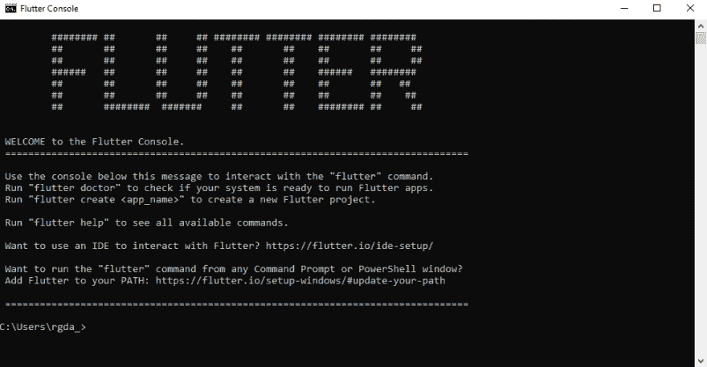
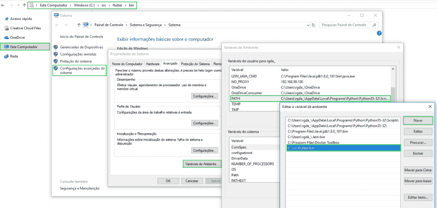
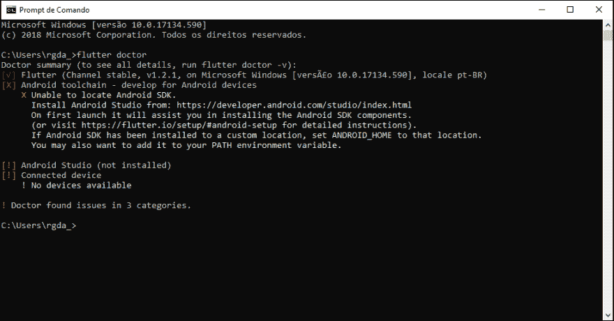
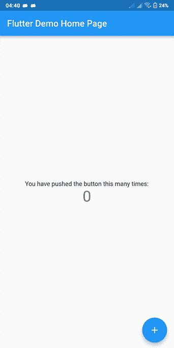

# 在 Windows 上安装 float

> 原文:[https://dev . to/flutter fans/instalando-o-flutter-no-windows-2aj 4](https://dev.to/flutterfans/instalando-o-flutter-no-windows-2aj4)

大家好，欢迎来到《颤栗传奇》，我们将从安装到应用程序开发的各个阶段进行探讨。

**那么让我们来看一下**
首先让我们稍微了解一下颤振，然后开始在 Windows 捆绑包中安装 SDK。

float 是用于开发 iOS 和 Android 的本机应用程序的 Google 开源 SDK，也是创建 Google 府社应用程序(打算取代 Android 的新开发操作系统)的主要方法。
在本文中，我们将看到 Windows 上安装颤振的分步操作，这样我们就可以开始玩游戏并构建我们的第一个应用程序。

**前提条件**
要在 Windows 上安装颤振，需要具备以下条件的机器:
windows 7 SP1 或更高版本的 64 位操作系统。
用于 SDK 安装的 400 MB 磁盘空间。
Windows PowerShell 5.0 或更高版本。
git for windows 2.0 版或更高版本。

**安装 SDK**
**步骤:**下载浮筒 SDK 并取出。
[下载](https://flutter.dev/docs/get-started/install/windows)

**步骤:**解压缩下载的档案，并将资料夹置于您偏好的目录中，例如。:c:\ src \ float。文档不建议在 C:\Program Files\之类的目录中安装 falta，以避免出现权限不足的问题。
执行此步骤后，您现在可以透过执行档案来存取「浮动」指令和所有可用指令您也可以从任何终端或命令提示符访问 float。

[T2】](https://res.cloudinary.com/practicaldev/image/fetch/s--KsOAmzXR--/c_limit%2Cf_auto%2Cfl_progressive%2Cq_auto%2Cw_880/https://i.imgur.com/CVpD2rI.png)

**步骤:**将或浮点添加到系统 PATH 变量中。要执行此操作，请将路径复制到\bin 目录，该目录位于文件夹中在 Windows 资源管理器中，右键单击“”，然后选择然后转到→的高级→的在 text field 中，单击 PATH →变量，然后粘贴\bin 目录的路径。

[T2】](https://res.cloudinary.com/practicaldev/image/fetch/s--yEYrdXDw--/c_limit%2Cf_auto%2Cfl_progressive%2Cq_auto%2Cw_880/https://i.imgur.com/GJqq9BC.png)

**安装依赖项**
【现在 SDK 已安装，并将颤振添加到 PATH 环境变量中，我们可以在任何终端上使用**颤振医生】**命令。

[T2】](https://res.cloudinary.com/practicaldev/image/fetch/s--LPp90V2m--/c_limit%2Cf_auto%2Cfl_progressive%2Cq_auto%2Cw_880/https://i.imgur.com/FSjLLAv.png)

**颤振医生**是负责检查是否存在待安装的颤振依赖项的命令。此外，它还会返回一份安装状态报告(医生摘要)，其中包含缺少的依赖关系、如何安装这些依赖关系、遇到的问题以及如何修复这些依赖关系。

**安装 Android Studio**
要安装 Android Studio，请访问此[链接](https://developer.android.com/studio/)，下载并安装最新版本。安装非常简单直接，例如

安装过程完成并再次使用该命令后，Summary 医生将显示另一条消息，通知您 Android 许可证未被接受。要解决此问题，请使用命令:float doctor--Android-licenses，并通过在控制台中键入所有选项来接受所有许可证。

[T2】](https://res.cloudinary.com/practicaldev/image/fetch/s--PhZgm3iq--/c_limit%2Cf_auto%2Cfl_progressive%2Cq_66%2Cw_880/https://cdn-images-1.medium.com/max/800/1%252Ajz38rMbRI2p8lVRyaUKMqQ.gif)

**测试设施**
现已到达我们将开始测试的部分，我们将创建一个项目，对其进行编译并运行。要执行此操作，请确保设备已连接到您的计算机，并且在该计算机上启用了开发人员选项。然后输入“创建浮点”命令以创建新项目，并进入创建的文件夹。

现在，在创建项目的文件夹中运行命令:**float run**，并接受设备上的安装，以便您可以编译和运行下图中的项目。

[T2】](https://res.cloudinary.com/practicaldev/image/fetch/s--yy_PSa2a--/c_limit%2Cf_auto%2Cfl_progressive%2Cq_auto%2Cw_880/https://i.imgur.com/NvwvMDj.png)

现在只有欢乐，因为颤振安装正确，配置正确。
现在我们可以开始玩了。

**一些必不可少的命令:**
**颤振创建=** 创建了一个新项目，其全部标准文件夹结构、boilerplate 代码和测试。
**颤振运行=** 编译并在项目中生成。
**【颤振运行-d =** 在特定装置上编译并生成。
**颤振安装=** 将颤振项目安装在连接的装置上。
**浮动包获取=** 增加了对项目的依赖。
**浮动测试=** 执行单元测试。
**【颤振医生=** 显示了颤振安装过程的信息。
**【浮点设备=** 列出了所有连接的设备，包括设备名称、设备 id 和 Android 版本等信息。
**【s =**对正在运行的应用程序进行屏幕截图，并将其存储在项目文件夹中。
**【r =**进行项目的热充电。
**【shift+r =**执行项目的热重启。
**【q =**结束项目。
**颤振帮助=** 列出了这些和所有其他可用于颤振运行的命令。