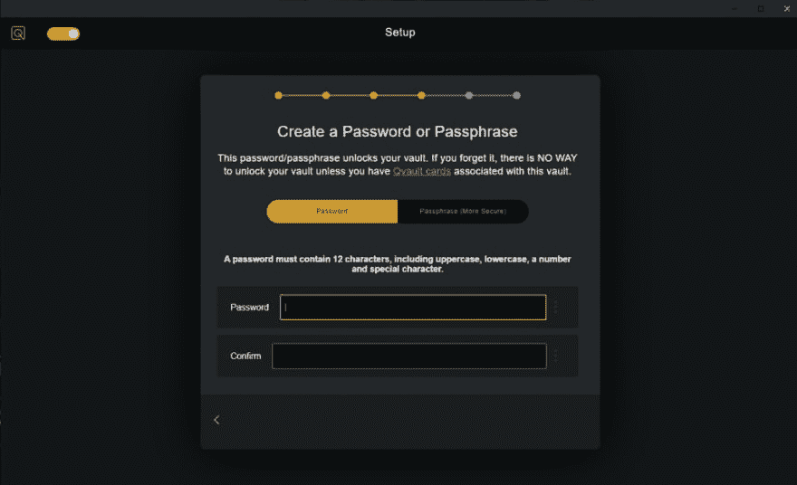
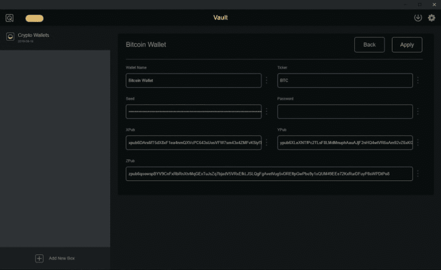
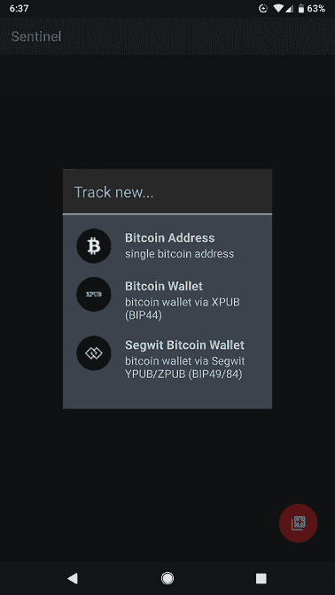

# 如何使用 Qvault 和 Sentinel 创建比特币储蓄钱包

> 原文:[https://dev . to/wags lane/how-to-create-a-bit coin-savings-wallet-using-q vault-and-sentinel-5623](https://dev.to/wagslane/how-to-create-a-bitcoin-savings-wallet-using-qvault-and-sentinel-5623)

Qvault 和 [Samourai 的 Sentinel](https://samouraiwallet.com/sentinel) 对于任何想要一个安全而简单的比特币储蓄解决方案的人来说都是天作之合。

[T2】](https://res.cloudinary.com/practicaldev/image/fetch/s--R0Vs6LHc--/c_limit%2Cf_auto%2Cfl_progressive%2Cq_auto%2Cw_880/https://qvault.io/wp-content/uploads/2019/09/Capture-3.png)

## 为什么？

纯手表钱包非常适合想要一个高安全性储蓄账户的用户。这是一个双应用程序设置，其中种子(包含支出密钥)安全地存储在一个应用程序中，公共密钥存储在另一个应用程序中。

带有**种子的应用程序处于高度加密或离线**状态，不会被定期访问。具有公共密钥的应用程序被定期使用，并且具有**生成新的接收地址和查看余额的能力**。

## 有何不可？

这种设置的唯一缺点是手表专用钱包中的**硬币不能立即花掉**。为了消费，种子必须被输出到“正常”的钱包中。因此，**手表钱包非常适合打算长期持有硬币的#hodlgang** 用户。

如果我*假设*拥有任何比特币……我会*假设*把 90%的硬币放在一个 Qvault + Sentinel 手表专用的设置中，另外 10%我会放在一个热钱包里(比如 [Samourai](https://samouraiwallet.com) )用于日常消费。我喜欢把它们分别理解为储蓄账户和支票账户。

## 下载应用

为您的电脑下载 Qvault:[https://Qvault . io](https://qvault.io)

Qvault 是一个密码管理器，内置了一个比特币钱包生成器。它是一款开源应用，可以离线使用，也可以在线使用。如果你在离线机器上使用它，黑客攻击几乎是不可能的。如果你在线使用它，并将你的加密保险库同步到 Qvault 的云端，那么很容易保存多个备份。

从 play store 为您的 Android 手机下载 Sentinel:[https://play.google.com/store/apps/details?id = com . samourai . sentinel&HL = en _ US](https://play.google.com/store/apps/details?id=com.samourai.sentinel&hl=en_US)

Sentinel 是一款安卓专用的手表钱包。它将允许你为你的钱包生成新的比特币地址，并查看你的余额，所有这些都无需访问敏感的私钥。

## Setup Qvault

下载 Qvault 后，创建一个新的 vault。如果您有 Qvault 卡(用于增强恢复和加密选项),请按照说明进行设置。否则，点击*暂时跳过*并设置新的主密码或通行短语。那个**主密码只有你**知道，用于加密将存储在你的金库中的比特币种子(和其他金库内容)。

使用你能记住的密码！如果您忘记了密码并且没有设置恢复卡，您将无法重新进入保管库！

[T2】](https://res.cloudinary.com/practicaldev/image/fetch/s--_b9fdz4U--/c_limit%2Cf_auto%2Cfl_progressive%2Cq_auto%2Cw_880/https://qvault.io/wp-content/uploads/2019/09/Capture-1-1024x624.png)

如果您想要在云中保留加密的 vault 文件的副本，请使用有效的电子邮件地址注册一个免费的云帐户。如果您打算保持离线，那么一定要保存一份加密的*副本。USB 驱动器或其他机器上的 qvault* 文件。

## 生成钱包

在应用程序中添加一个**加密钱包**框，点击框中的“ **+** ”符号添加一个新钱包。继续完成设置钱包的步骤，在该过程结束时，您将拥有一个新的比特币钱包，如下所示:

[T2】](https://res.cloudinary.com/practicaldev/image/fetch/s--XUpc_BaG--/c_limit%2Cf_auto%2Cfl_progressive%2Cq_auto%2Cw_880/https://qvault.io/wp-content/uploads/2019/09/Capture-2-1024x628.png)

**“种子”包含新钱包的消费密钥，将安全地保存在密码管理器**中。如果你觉得没有足够的数字备份，或者担心忘记你的 Qvault 密码，那么为了以防万一，**也在纸上写下种子**将是一个好主意。

## 设置哨兵

打开手机上的 sentinel 应用程序，您应该会看到:

[T2】](https://res.cloudinary.com/practicaldev/image/fetch/s--tbwJNYQH--/c_limit%2Cf_auto%2Cfl_progressive%2Cq_auto%2Cw_880/https://qvault.io/wp-content/uploads/2019/09/Screenshot_20190918-183751.png)

要创建 segwit 钱包(推荐)，请选择底部选项并点击图标扫描二维码。在 Qvault 应用程序中，单击 zpb 条目上的下拉菜单，并选择“显示 QR”。

通过扫描公钥，您的 sentinel 应用程序将无法花费您的硬币，但它将能够查看余额和接收硬币。

## 搞定！

你已经准备好了！您可以每天在手机上使用 Sentinel 来接收新硬币并查看您的余额，而无需解密安全保存在您的金库中的种子。

## 记住了！

**哨兵**的硬币不能花，只能收。当你准备花掉这些硬币时，你需要将种子放入类似 [Samourai](https://samouraiwallet.com) 或 [Electrum](https://electrum.org/#home) 的钱包中。

保证你的种子安全。如果有人得到了你的种子，他们可以偷走你所有的硬币。在您的保管库中对其进行加密，并避免将其拷贝到电脑的剪贴板。

不要失去你的种子。确保您的加密。“qvault”文件存在于多个设备上。您可以从应用程序内自动将备份保存在 Qvault 的云上，也可以保存在 u 盘或其他设备上。

**不要忘记您的 Qvault 主密码**。如果您忘记了密码，您将无法恢复对金库的访问，因此您的硬币可能会丢失。我们建议购买 Qvault 卡(即将上市)并设置恢复码以防万一。

使用高度加密。**密码越长，保险库的加密**就越强。我们建议购买 Qvault 卡(即将上市)并使用密钥卡设置双重加密。

谢谢你的阅读，祝你好运！

由莱恩·瓦格纳 [@wagslane](https://twitter.com/wagslane)

下载 q vault:[https://q vault . io](https://qvault.io/)

星我们的 Github:[https://github.com/q-vault/qvault](https://github.com/q-vault/qvault)

帖子[如何使用 Qvault 和 Sentinel](https://qvault.io/2019/09/19/how-to-create-a-bitcoin-savings-wallet-using-qvault-and-sentinel/) 创建比特币储蓄钱包最早出现在 [Qvault](https://qvault.io) 上。