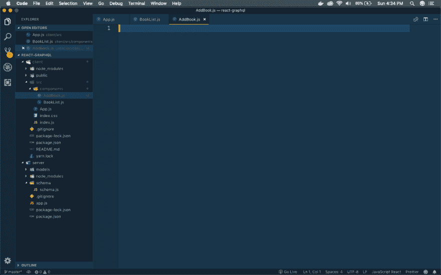
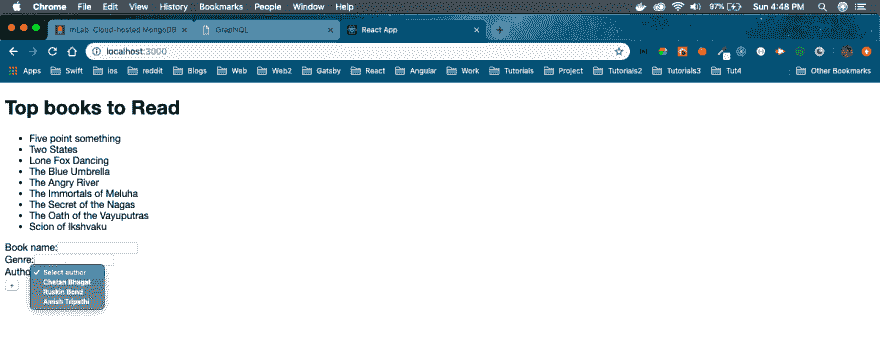
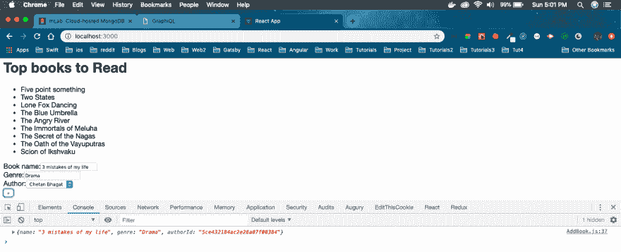
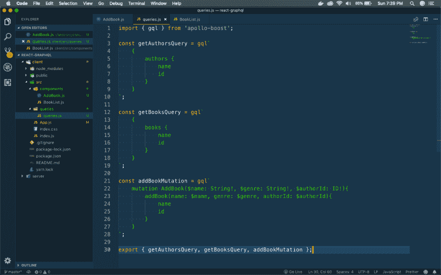
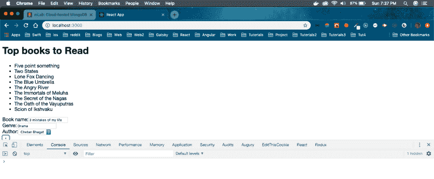
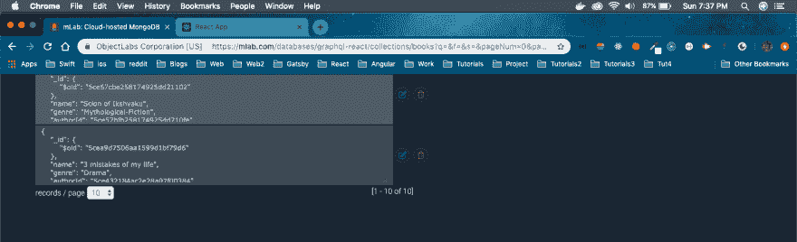
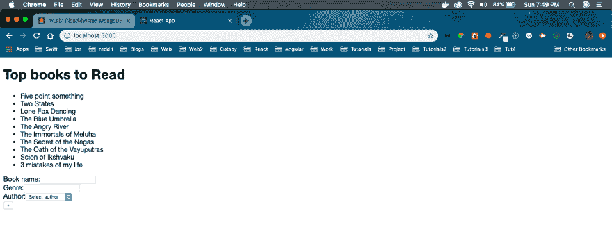
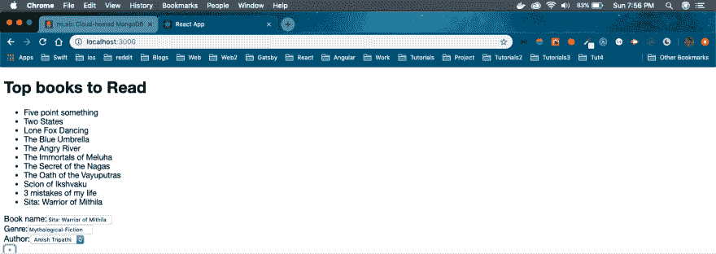
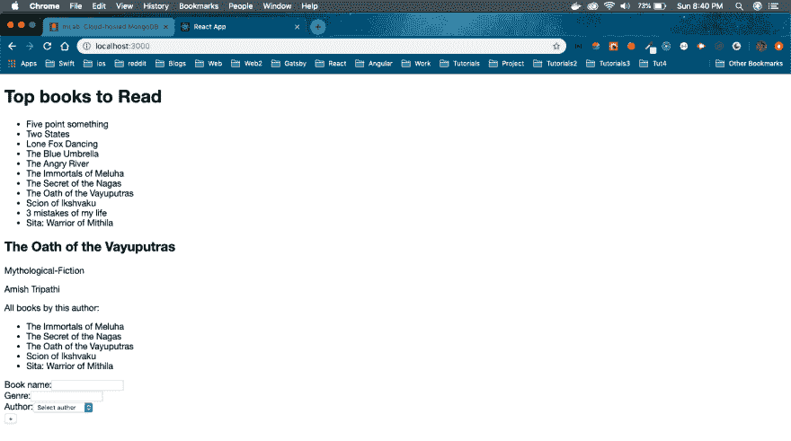
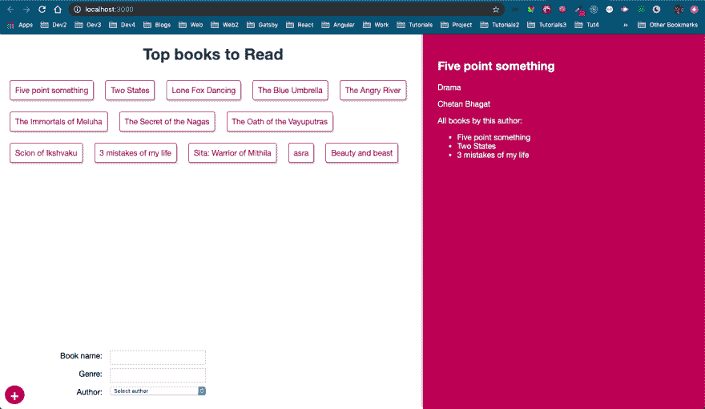

# 使用 React 和 GraphQL-4 构建完整的应用程序

> 原文：<https://dev.to/nabendu82/build-a-complete-app-with-react-and-graphql-4-2582>

欢迎来到本系列的第 4 部分。这个系列的灵感来自于免费代码营的 youtube 教程。

我们将从我们离开的地方开始。我们将首先通过前端制作一个组件，将书籍添加到我们的应用程序。

我们将在 components 文件夹中添加一个新文件 **AddBook.js** 。

[ ](https://res.cloudinary.com/practicaldev/image/fetch/s--ixmK2TDI--/c_limit%2Cf_auto%2Cfl_progressive%2Cq_auto%2Cw_880/https://cdn-images-1.medium.com/max/2880/1%2AmAo4ccThNHlmnhzqvSAF5A.png) * AddBook.js*

现在，我们将向 **AddBook.js** 添加内容。你会注意到它与之前教程中的 **BookList.js** 几乎相似。只有我们使用一个表单来输入数据，并使用 GraphQL 来获取作者下拉列表的作者列表。

```
import React, { Component } from 'react';
import { gql } from 'apollo-boost';
import { graphql } from 'react-apollo';

const getAuthorsQuery = gql`
    {
        authors {
            name
            id
        }
    }
`;

class AddBook extends Component {
    displayAuthors(){
        var data = this.props.data;
        if(data.loading){
            return( <option disabled>Loading authors</option> );
        } else {
            return data.authors.map(author => {
                return( <option key={ author.id } value={author.id}>{ author.name }</option> );
            });
        }
    }
    render(){
        return(
            <form id="add-book">
                <div className="field">
                    <label>Book name:</label>
                    <input type="text" />
                </div>
                <div className="field">
                    <label>Genre:</label>
                    <input type="text" />
                </div>
                <div className="field">
                    <label>Author:</label>
                    <select>
                        <option>Select author</option>
                        { this.displayAuthors() }
                    </select>
                </div>
                <button>+</button>

            </form>
        );
    }
}

export default graphql(getAuthorsQuery)(AddBook); 
```

我们还会在 **App.js** 中包含这个组件。所以，更新如下。

```
import React from 'react';
import BookList from './components/BookList';
import AddBook from './components/AddBook';
import ApolloClient from 'apollo-boost';
import { ApolloProvider } from 'react-apollo';

const client = new ApolloClient({
  uri: 'http://localhost:4000/graphql'
})

function App() {
  return (
    <ApolloProvider client={client}>
      <div className="main">
        <h1>Top books to Read</h1>
        <BookList />
        <AddBook />
      </div>
    </ApolloProvider>
  );
}

export default App; 
```

现在，我们的应用程序看起来如下，有一个工作的**作者**下拉菜单。

[ ](https://res.cloudinary.com/practicaldev/image/fetch/s--xz3WVxM9--/c_limit%2Cf_auto%2Cfl_progressive%2Cq_auto%2Cw_880/https://cdn-images-1.medium.com/max/2880/1%2AIOJjcD_ApPePYjrt-o4lOw.png) *作者下拉*

接下来，我们将向文件 **AddBooks.js** 添加一些 React 状态管理，以存储表单的值。变化用粗体标出。

```
import React, { Component } from 'react';
import { gql } from 'apollo-boost';
import { graphql } from 'react-apollo';

const getAuthorsQuery = gql`
    {
        authors {
            name
            id
        }
    }
`;

class AddBook extends Component {
    constructor(props){
        super(props);
        this.state = {
            name: '',
            genre: '',
            authorId: ''
        };
    }

    displayAuthors(){
        var data = this.props.data;
        if(data.loading){
            return( <option disabled>Loading authors</option> );
        } else {
            return data.authors.map(author => {
                return( <option key={ author.id } value={author.id}>{ author.name }</option> );
            });
        }
    }

    submitForm(e){
        e.preventDefault()
        console.log(this.state);
    }

    render(){
        return(
            <form id="add-book" onSubmit={ this.submitForm.bind(this) }>
                <div className="field">
                    <label>Book name:</label>
                    <input type="text" onChange={ (e) => this.setState({ name: e.target.value }) } />
                </div>
                <div className="field">
                    <label>Genre:</label>
                    <input type="text" onChange={ (e) => this.setState({ genre: e.target.value }) } />
                </div>
                <div className="field">
                    <label>Author:</label>
                    <select onChange={ (e) => this.setState({ authorId: e.target.value }) }>
                        <option>Select author</option>
                        { this.displayAuthors() }
                    </select>
                </div>
                <button>+</button>

            </form>
        );
    }
}

export default graphql(getAuthorsQuery)(AddBook); 
```

接下来，通过添加一些数据并单击“+”并检查控制台上的输出来测试表单。

[ ](https://res.cloudinary.com/practicaldev/image/fetch/s--ZQanwbv5--/c_limit%2Cf_auto%2Cfl_progressive%2Cq_auto%2Cw_880/https://cdn-images-1.medium.com/max/2880/1%2AqnmFAhnsx-YX9jYu_u349Q.png) *形态运转良好*

现在，我们将添加突变逻辑，以便在 GraphQL 服务器上添加这些数据。但是由于我们的 **AddBook.js** 将有不止一个查询，我们需要稍微修改一下逻辑。

我们首先将所有的查询移动到一个不同的文件中。在 src 里面创建一个文件夹 **queries** 和一个文件 **queries.js** 。

[](https://res.cloudinary.com/practicaldev/image/fetch/s--XTpVsDY_--/c_limit%2Cf_auto%2Cfl_progressive%2Cq_auto%2Cw_880/https://cdn-images-1.medium.com/max/2880/1%2ATYrk-6YSiubzCqj4Ab6Jew.png)*query . js*

将以下内容添加到 **queries.js**

```
import { gql } from 'apollo-boost';

const getAuthorsQuery = gql`
    {
        authors {
            name
            id
        }
    }
`;

const getBooksQuery = gql`
    {
        books {
            name
            id
        }
    }
`;

const addBookMutation = gql`
    mutation AddBook($name: String!, $genre: String!, $authorId: ID!){
        addBook(name: $name, genre: $genre, authorId: $authorId){
            name
            id
        }
    }
`;

export { getAuthorsQuery, getBooksQuery, addBookMutation }; 
```

现在，我们将在我们的 **AddBook.js** 中使用**getbookquery**和 **addBookMutation**

更改用粗体标出。我们不得不使用来自 **react-apollo** 的另一个函数 **compose** ，来使用两个查询。this.props 也发生了变化，将包含 **getAuthorsQuery** 和 **addBookMutation。**

```
import React, { Component } from 'react';
import { graphql, compose } from 'react-apollo';
import { getAuthorsQuery, addBookMutation } from '../queries/queries';

class AddBook extends Component {
    constructor(props){
        super(props);
        this.state = {
            name: '',
            genre: '',
            authorId: ''
        };
    }

    displayAuthors(){
        var data = this.props.getAuthorsQuery;
        if(data.loading){
            return( <option disabled>Loading authors</option> );
        } else {
            return data.authors.map(author => {
                return( <option key={ author.id } value={author.id}>{ author.name }</option> );
            });
        }
    }

    submitForm(e){
        e.preventDefault();
        this.props.addBookMutation({
            variables: {
                name: this.state.name,
                genre: this.state.genre,
                authorId: this.state.authorId
            }
        });
    }

...
...
...
}

export default compose(
    graphql(getAuthorsQuery, { name: "getAuthorsQuery" }),
    graphql(addBookMutation, { name: "addBookMutation" })
)(AddBook); 
```

让我们也在 **BookList.js** 中进行更改，因为我们将使用来自 *queries.js* 的查询

```
import React, { Component } from 'react';
import { graphql } from 'react-apollo';
import { getBooksQuery } from '../queries/queries';

class BookList extends Component {
    displayBooks() {
        var data = this.props.data;
        if (data.loading) {
            return (<div>Loading books...</div>);
        } else {
            return data.books.map(book => {
                return (
                    <li key={book.id}>{book.name}</li>
                );
            })
        }
    }

    render() {
        return (
            <div>
                <ul className="book-list">
                    {this.displayBooks()}
                </ul>
            </div>
        )
    }
}

export default graphql(getBooksQuery)(BookList); 
```

现在让我们转到浏览器，通过输入字段并按“+”来添加一本新书。

[ ](https://res.cloudinary.com/practicaldev/image/fetch/s--lNk0F5Lz--/c_limit%2Cf_auto%2Cfl_progressive%2Cq_auto%2Cw_880/https://cdn-images-1.medium.com/max/2880/1%2AT0puWfN2O3SXk-92mt2J0g.png) *进入新书*

但是我们在这里没有看到新书的反映，因为我们还没有它的逻辑。所以，我们可以先在 mongoDB 查一下。

[ ](https://res.cloudinary.com/practicaldev/image/fetch/s--gLpfXoRT--/c_limit%2Cf_auto%2Cfl_progressive%2Cq_auto%2Cw_880/https://cdn-images-1.medium.com/max/2880/1%2AzHtZQeXtcmCwjT2XC-OTug.png) *入住 mongoDB*

接下来，进入浏览器，刷新它，你会看到这本书。

[ ](https://res.cloudinary.com/practicaldev/image/fetch/s--ZrXYxmy1--/c_limit%2Cf_auto%2Cfl_progressive%2Cq_auto%2Cw_880/https://cdn-images-1.medium.com/max/2880/1%2AiKRUYfUTKMcPN78EX_usoA.png) *刷新浏览器*

现在，为了解决刷新问题，我们需要在突变查询运行后立即运行查询**getbookquery**。

我们可以简单地通过在 **AddBook.js** 文件中的突变后添加一个 **refetchQueries** 来做到这一点。

```
import React, { Component } from 'react';
import { graphql, compose } from 'react-apollo';
import { getAuthorsQuery, addBookMutation, getBooksQuery } from '../queries/queries';
…
…

    submitForm(e){
        e.preventDefault();
        this.props.addBookMutation({
            variables: {
                name: this.state.name,
                genre: this.state.genre,
                authorId: this.state.authorId
            },
            refetchQueries: [{ query: getBooksQuery }]
        });
    }
…
… 
```

现在，添加一本书并点击“+”，你会立即将这本书添加到页面中。

[ ](https://res.cloudinary.com/practicaldev/image/fetch/s--aZUlqN1B--/c_limit%2Cf_auto%2Cfl_progressive%2Cq_auto%2Cw_880/https://cdn-images-1.medium.com/max/2880/1%2AQPWJkLkQkGPenR_YFB4h9Q.png) *本书即刻补充*

现在，我们将添加当我们点击一本书时显示细节的功能。因此，在**组件**文件夹中创建一个新文件 **BookDetails.js** 。

让我们首先为来自 **BookList.js** 的每本书添加点击功能，并获取图书 id。我们将把它传递给 **BookDetails** 组件。

```
import React, { Component } from 'react';
import { graphql } from 'react-apollo';
import { getBooksQuery } from '../queries/queries';
import BookDetails from './BookDetails';

class BookList extends Component {
    constructor(props){
        super(props);
        this.state = {
            selected: null
        }
    }
    displayBooks(){
        var data = this.props.data;
        if(data.loading){
            return( <div>Loading books...</div> );
        } else {
            return data.books.map(book => {
                return(
                    <li key={ book.id } onClick={ (e) => this.setState({ selected: book.id }) }>{ book.name }</li>
                );
            })
        }
    }
    render(){
        return(
            <div>
                <ul id="book-list">
                    { this.displayBooks() }
                </ul>
                <BookDetails bookId={ this.state.selected } />
            </div>
        );
    }
}

export default graphql(getBooksQuery)(BookList); 
```

我们现在将在 **queries.js** 文件中添加查询来获取一本书的详细信息。在这里，我们不仅会得到该书的 id、名称和流派，还会得到作者的 id、名称和年龄。我们还将获得该作者所有其他书籍的列表

```
…
…
const getBookQuery = gql`
    query GetBook($id: ID){
        book(id: $id) {
            id
            name
            genre
            author {
                id
                name
                age
                books {
                    name
                    id
                }
            }
        }
    }
`;

export { getAuthorsQuery, getBooksQuery, addBookMutation, getBookQuery }; 
```

现在，让我们向文件 **BookDetails.js** 添加代码。这里，我们从 props 中执行一个 graphql 查询(粗体),它是从父组件 ie **BookList** 中接收的，然后将它传递给 query . js 中的查询 **getBookQuery**

在接收到返回到 **this.props.data.book** 中的数据后，我们将显示它。

```
import React, { Component } from 'react';
import { graphql } from 'react-apollo';
import { getBookQuery } from '../queries/queries';

class BookDetails extends Component {
    displayBookDetails(){
        const { book } = this.props.data;
        if(book){
            return(
                <div>
                    <h2>{ book.name }</h2>
                    <p>{ book.genre }</p>
                    <p>{ book.author.name }</p>
                    <p>All books by this author:</p>
                    <ul className="other-books">
                        { book.author.books.map(item => {
                            return <li key={item.id}>{ item.name }</li>
                        })}
                    </ul>
                </div>
            );
        } else {
            return( <div>No book selected...</div> );
        }
    }
    render(){
        return(
            <div id="book-details">
                { this.displayBookDetails() }
            </div>
        );
    }
}

export default graphql(getBookQuery, {
    options: (props) => {
        return {
            variables: {
                id: props.bookId
            }
        }
    }
})(BookDetails); 
```

现在，当我们去点击任何一本书，我们会得到它的细节。

[ ](https://res.cloudinary.com/practicaldev/image/fetch/s--hvy90bxz--/c_limit%2Cf_auto%2Cfl_progressive%2Cq_auto%2Cw_880/https://cdn-images-1.medium.com/max/2880/1%2ASXAVQdVlM02syn1g3g41-A.png) *图书详情*

我们的 App 很完整，但是很丑。因此，我们将继续将 css 添加到 **index.css** 文件中。

```
body {
  font-family: "Helvetica Neue", sans-serif;
}

.main h1{
  color: #444;
  text-align: center;
}

.main{
  padding: 0px;
  box-sizing: border-box;
  width: 60%;
  height: 100%;
}

#book-list{
  padding: 0;
}

#book-list li{
  display: inline-block;
  margin: 12px;
  padding: 10px;
  border-radius: 4px;
  border: 1px solid #880E4F;
  box-shadow: 1px 2px 3px rgba(0,0,0,0.3);
  cursor: pointer;
  color: #880E4F;
}

form{
  background: #fff;
  padding: 20px;
  position: fixed;
  left: 0;
  bottom: 0;
  width: 400px;
}

form .field{
  display: grid;
  grid-template-columns: 1fr 1fr;
  grid-gap: 10px;
}

form label{
  text-align: right;
  padding: 6px;
}

form input, form select{
  margin: 4px 0;
  padding: 6px;
  box-sizing: border-box;
}

form button{
  color: #fff;
  font-size: 2em;
  background: #AD1457;
  border: 0;
  padding: 0 10px;
  border-radius: 50%;
  cursor: pointer;
  position: absolute;
  bottom: 10px;
  left: 10px;
}

#book-details{
  position: fixed;
  top: 0;
  right: 0;
  width: 40%;
  height: 100%;
  background: #AD1457;
  padding: 30px;
  overflow: auto;
  box-shadow: -2px -3px 5px rgba(0,0,0,0.3);
  box-sizing: border-box;
  color: #fff;
} 
```

它将显示我们的最终应用程序。

[ ](https://res.cloudinary.com/practicaldev/image/fetch/s--nEmmjuj1--/c_limit%2Cf_auto%2Cfl_progressive%2Cq_auto%2Cw_880/https://cdn-images-1.medium.com/max/2880/1%2AH8Bg9pTwRInc1Wl1eVL1jA.png) *我们美丽的 app*

我们的系列到此结束。希望你喜欢。你可以在 github [链接](https://github.com/nabendu82/react-graphql)中找到代码。