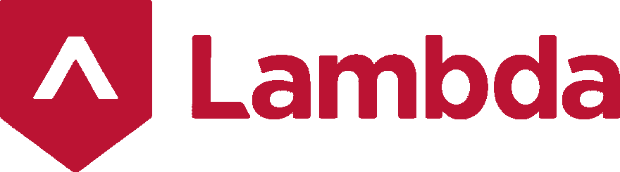

# 被 Lambda School 的 iOS 开发课程录取！

> 原文:[https://dev . to/Josh/accepted-to-lambda-school-s-IOs-development-course-306h](https://dev.to/josh/accepted-to-lambda-school-s-ios-development-course-306h)

[T2】](https://res.cloudinary.com/practicaldev/image/fetch/s--rSFk9Br1--/c_limit%2Cf_auto%2Cfl_progressive%2Cq_auto%2Cw_880/https://thepracticaldev.s3.amazonaws.com/i/co1v99yob6ibtit7o9fk.png)

非常激动地宣布我被 Lambda 学校的 iOS 开发课程录取了。被顶级软件工程项目录取太激动了！

我选择了 10 月 28 日开始这个兼职项目，我对这个新的旅程感到非常兴奋。每周工作 40 多个小时并兼职参加 iOS 课程将是一项挑战——但这种牺牲是值得的！

对于任何在 Lambda 的人或校友，请随时关注并发送鼓励的话。

我将记录我的旅程-敬请期待！

[在 Twitter 上关注](https://www.twitter.com/joshuarutkowski)