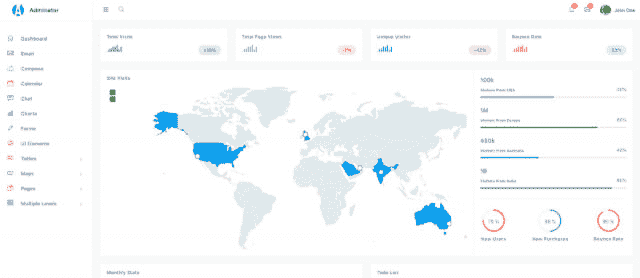
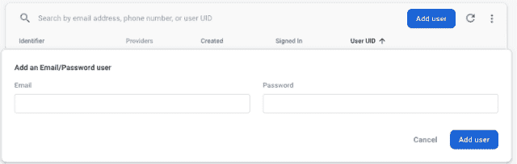
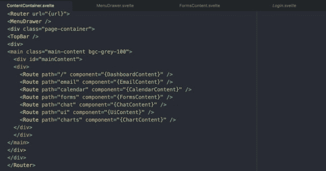
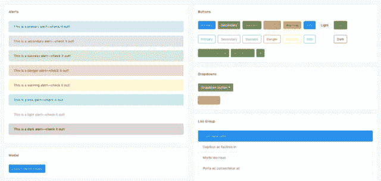
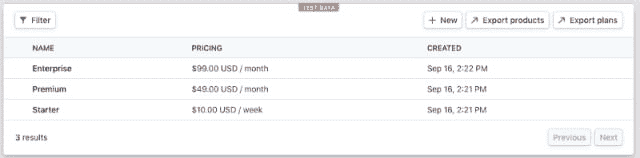
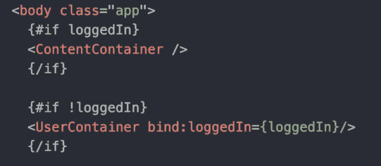
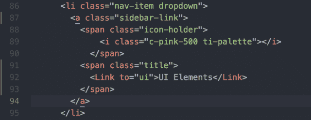
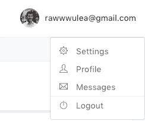
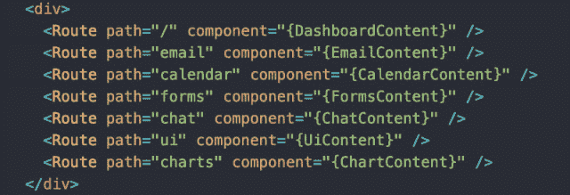

# 建设 SaaS？

> 原文：<https://dev.to/mihairaulea/building-saas-4db9>

我们免费赠送用户管理、用户界面和循环计费(带 Stripe)(麻省理工学院许可)。我们已经使用了 Adminator，并通过在顶部添加 Firebase 和 Svelte 使其功能化。从 Github 抓取:[https://github.com/mihairaulea/DashboardHeroLite](https://github.com/mihairaulea/DashboardHeroLite)

不会让你厌烦——你知道你需要用户管理。你知道你需要一个用户界面。账单是你公司生存的基础，所以最好也有账单。以下是如何使用 Dashboard Hero Lite 快速、廉价地完成这项工作，并在本周启动和运行您的 MVP。

在成为建立 MVP(和失败的创业公司)的大师之后，有一件事坚持下来了。如何快速、廉价且(某种程度上)可靠地建造。

在你构建出你产品的核心后，你应该能够把它展示给全世界，并开始相当快地获得收益。只是，通常情况不是这样，我们有一个客户在雇佣我们之前花了 181，000 美元来建造它。

Dashboard Hero 旨在帮助 SaaS 公司快速扩张，并专注于其产品的核心。

# 用户管理

至少，您需要一个注册和登录界面。重点是收集邮件，这样可以和你的用户建立沟通渠道。

您还需要根据用户的角色(认证角色与访客角色、管理员角色与普通角色与其他角色)来过滤访问和呈现不同的 UI。

将是很好的，能够让用户登录和脸书和谷歌(OAuth)注册，阻止某些用户，从主管理仪表板手动重置密码，并验证电子邮件地址。

手动注册用户怎么样？我们也有。

关于如何实现的细节，请阅读架构部分。

# 用户界面

也许你已经花了 3-6 个月的时间来学习 React、Angular 或 Vue 并提高其工作效率。也许你甚至喜欢那些框架。我没有也不会。

初创公司资源紧张——专注于前端最佳实践是你在超竞争环境中最不想做的事情。

苗条是纯粹的了不起——它完美地应用了帕累托原则:用 20%的努力获得 80%的收益。

你得到的是组件——由 HTML、CSS 和 Javascript 组成的孤立的代码片段。但是 React 挂钩、组件生命周期和 Webpack 都没有构建 jazz。你会像 2004 年一样在键盘上跳舞。想法是将项目装船，开始学习和迭代。

组件的例子包括菜单和顶栏，还有不同颜色的按钮、通知等等。

Svelte 是我在 14 年的编码生涯中使用的为数不多的完全不碍事的框架之一——简单地写 Html(用模板系统)、CSS 和 javascript。

体系结构部分的解释、实践和示例。

# 计费

Dashboard Hero Lite 与 Stripe 松散集成。您可以在 Stripe Billing dashboard 中为计划订阅生成 URL，并在 Firebase 中手动分配它。这对你的前 10-20 个客户来说应该足够了。

文章和视频解释如何做到这一点，即将推出。

# 建筑

在克隆了 admin dashboard GitHub 之后，你会注意到两个重要的文件夹:src 和 public。Rollup(一个构建工具)将 src 文件夹作为输入，并生成 web 应用程序的公共版本。公共文件夹是被部署到 Firebase 主机的文件夹。

### 源(src)文件夹

App.svelte 是我们管理仪表板的入口点。无论用户是否登录，它都会获取一个 Firebase 实例并呈现不同的组件。

很直接，对吧？您可以使用 Firebase 云功能来隐藏敏感的业务流程，如果用户没有登录，还可以拒绝对资源的访问。

重要的组件是 MenuDrawer 和 TopBar。MenuDrawer 通过使用 Link 标签告诉路由器要呈现哪些组件。

这里有一个例子:
UI 元素

在构建时，Svelte 知道如何解包链接属性

顶栏显示用户的电子邮件，并允许用户退出。

ContentContainer 列出了可用的路径(页面),并将 URL 路径映射到 svelte 组件。仅在用户登录时显示(参见 App.svelte)。

UserContainer 具有类似的结构，处理登录和注册。

要在本地主机上运行项目，从项目根目录执行:
npm install
npm run dev

要部署到 firebase 并获得整个世界，请查看您的 awesome 管理仪表板:用您自己的凭证更改 src/common/resources/Firebase/index . js(第 6 行)中的 Firebase 凭证，并从项目根目录运行:

消防基地部署

# 结论

这篇文章尽量保持简洁明了，这样你很快就可以开始工作了。没有什么可以代替自己阅读和修改代码:)

让我们在评论中知道你在构建什么——永远对新技术充满热情。另外，如果有什么需要进一步解释的，请告诉我们。如果你发现了一个 bug——不要害羞，在 GitHub 上开一期。

只说你好也行:)