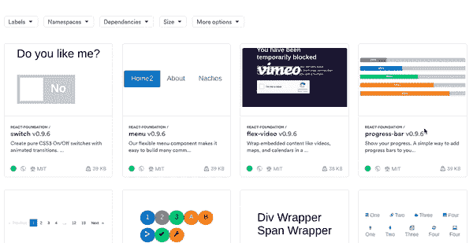
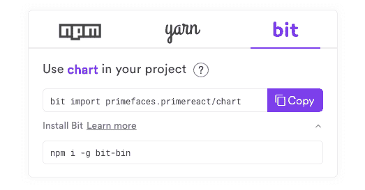

# 使用 Bit 使反应组件 Monorepo 库变得更容易

> 原文:[https://dev . to/gite den/react-component-monorepo-library-make-easy-with-bit-2g1h](https://dev.to/giteden/react-component-monorepo-library-made-easier-with-bit-2g1h)

### [](#develop-build-test-version-and-publish-individually-isolated-components-in-your-library-with-0-refactoring-or-configurations)开发、构建、测试版本，并在您的库中发布单独隔离的组件，无需重构或配置。

在不同的存储库和项目之间共享组件对于代码重用非常有效。在 UI 组件的情况下，这也是确保您的 [UI 在不同应用程序间保持一致](https://blog.bitsrc.io/building-a-consistent-ui-design-system-4481fb37470f)的有效方法。

但是，共享组件也可能是一个挑战，因为试图发布每个组件将迫使我们将我们的存储库分成多个存储库，并单独发布每个组件。因此，有时最好将所有组件保存在一个库中，并且仍然单独发布每个组件。这种架构通常被称为[多包存储库或 monorepo](https://blog.bitsrc.io/monorepo-architecture-simplified-with-bit-and-npm-b1354be62870) 。

## [](#multipackage-monorepo-for-components)组件多包单报告

像 [Lerna](https://github.com/lerna/lerna) 这样的辅助工具可以帮助自动化多包 monorepo 的一些开销，比如版本控制和发布每个包。然而，它仍然需要大量的开销，因为每个包仍然需要被样板化和维护，就像它是一个独立的存储库一样。

当涉及到多组件库时，这种开销可能会很大，因此很少看到为了发布每个组件而进行这样的库重构。

在这篇文章中，我们将看到如何在没有开销的情况下获得相同的结果，通过利用 [Bit](https://bit.dev) 从现有库中隔离、版本化和发布组件的能力——没有重构或开销。

此外，您将能够隔离 repo 中的组件，以便您可以完全隔离地单独构建、测试和版本化它们。因为位控制组件之间的关系，所以您可以更新一个组件，并只为该组件和依赖它的组件增加一个版本。这意味着您不仅可以从 repo 中发布单独的包，还可以获得对其开发的模块化控制。

如有任何问题，请不吝评论或[联系](https://gitter.im/bit-src/Bit)。

### [](#how-it-looks)看起来怎么样……

这里有一个非常好的开源组件库，叫做 [React foundation](https://github.com/digiaonline/react-foundation) 。使用 Bit 和 0 重构，它的每个组件都作为一个独立的包发布。你可以[查看并安装在这个收藏里](https://github.com/digiaonline/react-foundation)。

[T2】](https://bit.dev)

## [](#build-test-version-and-publish-individual-components-in-the-repository)构建、测试、版本化和发布存储库中的单个组件

Bit 的[开源 CLI 工具](https://github.com/teambit/bit)让您可以虚拟化存储库中组件的隔离。这是通过[使用 bit add 命令](https://docs.bit.dev/docs/add-and-isolate-components.html)完成的，该命令将 bit 指向存储库中组件所在的路径。

### [](#develop-each-component-in-isolation)孤立地开发各个组件

然后, [Bit](https://bit.dev) 将自动定义和封装每个组件及其所有依赖项，将它变成一个独立的单元，可以在项目之外独立地构建、测试和运行。这个过程自动为每个组件创建一个 package.json 文件，这将有助于在检测到组件依赖关系的变化时进行管理和更新。

### [](#zero-build-configurations)零构建配置

由于每个组件都应该在自己的上[构建和测试，Bit 允许你将编译器和测试器链接到你的项目工作空间中的所有组件。您还可以选择链接一个测试环境来运行每个组件的单元测试。通过运行“位构建”和“位测试”命令，您可以构建和测试每个组件，与项目的其余部分完全隔离。](https://docs.bit.dev/docs/building-components.html)

### [](#version-and-update-individual-components-and-their-dependants)版本和更新单个组件及其从属组件

使用 bit tag 命令，您可以使用 semver 规则对 repo 中的组件进行版本控制。现在，每个组件都有一个版本，当组件本身发生变化时，这个版本可能会被不体面地删除。当你只改变一个不相关的组件如*滑块*时，不需要更新*按钮*组件的版本。但是，如果您更改一个有其他组件依赖于它的组件，一个 Bit 将提示您更新依赖的组件(它读取 package.json)。

这意味着您可以随时运行 bit status 来了解哪些组件被跟踪并封装在 repo 中，哪些组件被修改并需要版本更新(或者哪些组件的依赖项被更新并需要更新)，等等。很明显，也有符号链接:)

### [](#publish-each-component-individually)分别发布每个组件

准备就绪后，您可以将所有组件发布为单独的包，这些包可以在其他项目中单独使用和更新。

开发存储库的经验是*通过 0 到很少的重构*你可以立即隔离、构建、测试、版本化和发布存储库中的每个组件。当对一个组件进行更改时，Bit 可以让您查看、学习和准确控制哪些其他组件受到影响，并选择是否要一次更新所有组件。

## [](#example-workflow-with-gitlike-commands)使用类似 Git 命令的示例工作流

一旦你[安装了 Bit](https://docs.bit.dev/docs/installation.html#install-via-npm--yarn-1) 和[向 bit.dev](https://docs.bit.dev/docs/setup-authentication.html) 认证它。这意味着您现在可以开始跟踪存储库中的组件，并将每个组件作为一个包发布。

让我们假设下面的库结构。

```
├── package.json
├── src
│   ├── components
│   │   ├── Accordion
│   │   │   ├── Accordion-spec.js
│   │   │   ├── Accordion.js
│   │   │   ├── Acordion.module.scss
│   │   │   ├── index.js
│   │   ├── Button
│   │   │   ├── Button-spec.js
│   │   │   ├── Button.js
│   │   │   ├── Button.module.scss
│   │   │   ├── index.js 
```

在这种情况下，我们希望在 src/components 目录中单独发布 accordion 和所有其他组件。

使用 Bit，我们可以虚拟地封装这些组件，而根本不需要重构存储库，或者将它们封装成一个包。

首先，让我们为存储库初始化一个 Bit 工作区，并提交新创建的。位图文件到 Git，这样两者就可以和谐地同步。

```
$ bit init

$ git add .bitmap
$ git commit -am "initialized an emtpy bit workspace"
[master a4eddaa] bit initialized for project
 2 files changed, 11 insertions(+)
 create mode 100644 .bitmap 
```

我们现在开始版本化和发布组件。

bit add 命令告诉 bit 跟踪特定目录中的组件。它将每个组件的所有文件作为组件的一部分捆绑在一起，并将分析每个组件的代码以定义其所有依赖关系。您可以看到，Bit 为每个组件创建了一个 package.json，您可以将它作为组件的一部分来查看。在本例中，让我们这样运行它:

```
$ bit add src/components/* 
```

bit 将向其模型写入组件的所有数据(运行 bit show 以查看每个组件的依赖关系图，并运行 bit status 以了解 Bit 成功识别了每个组件的所有文件和依赖关系)。如果缺少一些，您需要单独添加它们。

接下来，让我们定义一个编译器，它可以将代码编译成可以在其他项目中运行的文件。你可以在这里找到所有可用的编译器。在这种情况下(React 库)，让我们[选择 React 编译器](https://bit.dev/bit/envs/compilers/react)并将其安装在工作区中。

```
$ bit import bit.envs/compilers/react 
```

Bit 会将这个编译器应用到工作空间中的所有组件，这意味着您节省了定义每个组件的配置的开销。

接下来，让我们为每个组件设置一个版本。当向单独的组件发布更新时，以及对于跨存储库的组件共享和开发，独立地对组件进行版本控制是非常有用的(见下文)。现在，让我们将所有组件设置为版本 0.0.1。

```
$ bit tag --all 0.0.1 
```

太好了！我们的组件已准备好出口。接下来，让我们将它们导出到您之前创建的 [bit.dev 集合](https://bit.dev)中。注意，Bit 是分布式的，您可以在任何服务器上托管组件，但是 bit.dev 提供了一个注册表，您可以从这个注册表中将每个组件作为一个包进行安装。它还提供了组件的渲染、搜索和协作功能。

```
$ bit export user-name.collection-name 
```

就是这样！现在，您可以浏览集合，[保存每个组件](https://docs.bit.dev/docs/bit-react-library-tutorial.html#using-the-playground)的示例(这些示例也将作为快照显示在集合中)，并从 bit.dev 注册表中使用 **NPM** 和* * Yarn * *客户端将它们作为独立的包进行安装。不需要重构，没有开销。

## [](#install-and-update-individual-components)安装和更新单个组件

一旦您的组件被发布，它们就可以在 bit.dev 组件中心中使用，它也可以作为一个注册中心，您可以从这里使用像 npm 和 yarn 这样的包管理器来安装组件。

[T2】](https://bit.dev)

bit.dev 组件中心还通过组件搜索引擎和带有预览快照的可视化集合为您的组件提供可发现性。每个组件的例子都被**渲染**，其 **API 文档被自动提取并呈现在组件页面**中，因此您可以了解它是如何工作的。

要安装组件，只需使用组件页面中安装窗格中的命令。

[](img/2ad3a65b42fa0ddc188614ee7bf48325.png) ](https://res.cloudinary.com/practicaldev/image/fetch/s--uWP4JsVJ--/c_limit%2Cf_auto%2Cfl_progressive%2Cq_auto%2Cw_880/https://cdn-images-1.medium.com/max/2000/1%2A8yyNE9OnwUSEFDRefJGo1g.png) *例子:【https://bit.dev/primefaces/primereact/chart】*T4

注意，如果您还没有安装 Bit 并运行 bit login 命令，那么您首先需要将 bit.dev 配置为一个作用域 npm 注册表。如果您首先运行 bit login，就没有必要这样做。

```
npm config set '@bit:registry' https://node.bit.dev 
```

然后，只需在您想要使用组件的新项目中运行 install 命令。

```
npm i @bit/primefaces.primereact.chart
# or
yarn add @bit/primefaces.primereact.chart 
```

仅此而已。您的组件现在作为一个包依赖项单独安装在新项目中，并且可以像任何其他包一样使用。因为您只安装您需要的组件，所以您避免了安装整个库，并且防止了项目中的冗余重量和依赖性。

## [](#update-single-components-individually-or-at-bulk-from-any-consuming-project)从任何消费项目中单独或批量更新单个组件

> ***无需发布或更新整个库，也无需上下文切换！*T3】**

[T2】](https://res.cloudinary.com/practicaldev/image/fetch/s--dDqhS8mv--/c_limit%2Cf_auto%2Cfl_progressive%2Cq_auto%2Cw_880/https://cdn-images-1.medium.com/max/2000/1%2AAGxkfdoFM9xGWFmRPmm8Xg.png)

当您从库中发布许多组件时，人们可以在他们的项目中选择和使用单个组件。这很有用，但是在某些情况下，人们仍然需要在使用组件之前对其进行修改。这样做最好避免上下文切换。

使用 Bit，您可以将每个组件的源代码引入到一个新项目中，并根据需要进行修改。由于 Bit 仍然会管理“克隆”的组件，因此可以对变更进行版本控制、发布，甚至更新回原始项目或其他项目。

这意味着人们可以采用这些组件，而不必深入整个库来建议一个拉取请求，这个请求可能被接受，也可能不被接受。

若要将组件代码引入不同的项目并进行编辑，请使用出现在组件页面同一窗格中的“位导入”命令。请注意，您应该安装 bit 并在消费存储库中初始化 Bit 工作空间，这样 Bit 就可以跟踪和管理变更。

例如:

```
bit import primefaces.primereact/chart 
```

然后，只需进行更改，再次运行 bit tag 并 bit 导出新版本。如果运行 bit status，bit 将显示组件已更改，以及哪些其他组件也受到更改的影响，应该进行更新。不需要更新所有的东西，Bit 让你控制每个组件的依赖图，轻松地只更新你需要的。

## [](#conclusion)结论

当您构建一个组件库并希望在不同的项目或应用程序中使用其组件时，您可以利用 Bit 等工具在库中独立开发组件，同时控制它们的依赖关系图，并能够构建、测试、版本化和发布每个组件。

通过使它们可被发现，并让其他人安装甚至更新他们自己项目中的单个组件，您增加了组件的采用，这有助于跨存储库标准化您的开发，并为您的用户保持跨应用程序的 UI 一致。