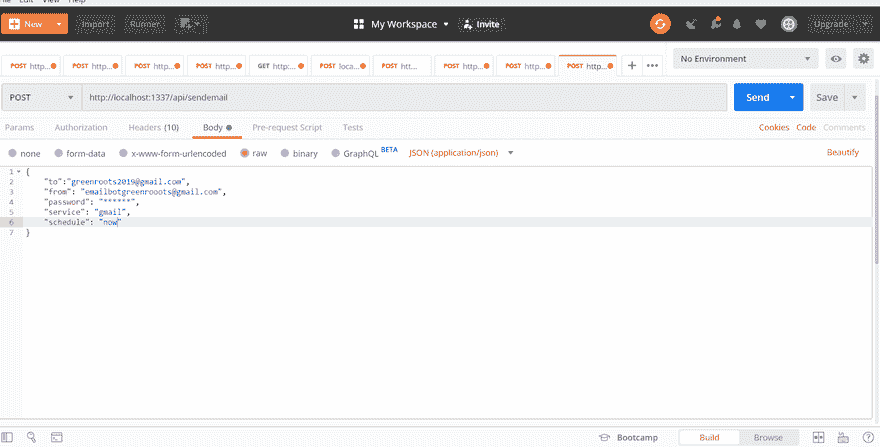

# 从 Node.js 应用程序发送和安排电子邮件

> 原文:[https://dev . to/ATA pas/send-and-schedule-emails-from-a-node-js-app-30p 3](https://dev.to/atapas/send-and-schedule-e-mails-from-a-node-js-app-30p3)

作为一名应用程序开发人员，我们有多频繁地感觉到需要一个服务来向指定的或订阅的电子邮件 id 发送电子邮件？即使没有真正的需要，我们仍然会在开发宠物项目或应用程序时幻想它，不是吗😁？

在本文中，我将解释从 node.js 应用程序发送电子邮件的简单步骤。最后，我们将能够安排和发送电子邮件。不仅如此，我们还将创建一个 REST API，将所需的详细信息发布到 node.js 应用程序，以便发送电子邮件。

**TL；**
博士这里是工作 app
[](https://res.cloudinary.com/practicaldev/image/fetch/s--rzs_tRL_--/c_limit%2Cf_auto%2Cfl_progressive%2Cq_66%2Cw_880/https://cdn.hashnode.com/res/hashnode/image/upload/v1568559587037/mYahNkH_i.gif)
*REST API 从一个 node.js app*

你可以从我的 GitHub Repo 中找到代码:[测试 REST app 发送邮件](https://github.com/atapas/test-rest-app)

# [](#setting-the-stage)设置舞台

Nodemailer 是 Node.js 应用程序的一个超级酷的模块，让电子邮件发送变得如此简单。使用`npm`
安装

```
npm install nodemailer --save 
```

<svg width="20px" height="20px" viewBox="0 0 24 24" class="highlight-action crayons-icon highlight-action--fullscreen-on"><title>Enter fullscreen mode</title></svg> <svg width="20px" height="20px" viewBox="0 0 24 24" class="highlight-action crayons-icon highlight-action--fullscreen-off"><title>Exit fullscreen mode</title></svg>

在你的`.js` (app.js，email.js 随便什么)文件中导入`Nodemailer`:

```
let nodemailer = require('nodemailer'); 
```

<svg width="20px" height="20px" viewBox="0 0 24 24" class="highlight-action crayons-icon highlight-action--fullscreen-on"><title>Enter fullscreen mode</title></svg> <svg width="20px" height="20px" viewBox="0 0 24 24" class="highlight-action crayons-icon highlight-action--fullscreen-off"><title>Exit fullscreen mode</title></svg>

接下来，遵循这三个简单的步骤来让事情运转起来:

*   设置一个消息选项:这是告诉`Nodemailer` *谁*在给*发送什么*消息给*谁*？

```
 let mailOptions = {
        from: '<FROM_EMAIL_ADDRESS>',
        to: '<TO_EMAIL_ADDRESS>',
        subject: 'Email from Node-App: A Test Message!',
        text: 'Some content to send'
  }; 
```

<svg width="20px" height="20px" viewBox="0 0 24 24" class="highlight-action crayons-icon highlight-action--fullscreen-on"><title>Enter fullscreen mode</title></svg> <svg width="20px" height="20px" viewBox="0 0 24 24" class="highlight-action crayons-icon highlight-action--fullscreen-off"><title>Exit fullscreen mode</title></svg>

👉注意:上面的`to`属性可以有多个用逗号(，)分隔的电子邮件 id。

*   使用 SMTP(这是默认设置)或其他传输机制[创建一个`Nodemailer` *传输器*](https://nodemailer.com/transports/)

```
 let transporter = nodemailer.createTransport({
        service: 'gmail',
        auth: {
          user: '<FROM_EMAIL_ADDRESS>',
          pass: '<FROM_EMAIL_PASSWORD>'
        }
  }); 
```

<svg width="20px" height="20px" viewBox="0 0 24 24" class="highlight-action crayons-icon highlight-action--fullscreen-on"><title>Enter fullscreen mode</title></svg> <svg width="20px" height="20px" viewBox="0 0 24 24" class="highlight-action crayons-icon highlight-action--fullscreen-off"><title>Exit fullscreen mode</title></svg>

👉注意:在上面的例子中，`service`被称为`gmail`。这只是一个例子。您可以指定想要实际使用的电子邮件服务的名称。

*   使用您之前创建的传送器的`sendMail()`方法来传递消息。

```
 transporter.sendMail(mailOptions, function(error, info){
        if (error) {
          console.log(error);
        } else {
          console.log('Email sent: ' + info.response);
        }
  }); 
```

<svg width="20px" height="20px" viewBox="0 0 24 24" class="highlight-action crayons-icon highlight-action--fullscreen-on"><title>Enter fullscreen mode</title></svg> <svg width="20px" height="20px" viewBox="0 0 24 24" class="highlight-action crayons-icon highlight-action--fullscreen-off"><title>Exit fullscreen mode</title></svg>

就这样，你完了。现在，我们已经具备了从 node.js 应用程序发送电子邮件所需的一切。

# [](#hang-on-a-minute-we-can-schedule-it)等一下，我们可以安排一下！

是啊，没错！这个应用程序的真正强大之处在于，你可以安排电子邮件，

*   立即发送
*   每天下午 7 点(19:00)发送，就像每日文摘一样
*   每 30 分钟发送一次。
*   2 月 29 日发送！
*   ....更多更多想要的方式。

你猜对了，我们需要类似 cron 作业的东西，为此我们将使用一个名为 [node-cron](https://www.npmjs.com/package/node-cron) 的节点模块。

*   首先安装它。

```
 node install node-cron --save 
```

<svg width="20px" height="20px" viewBox="0 0 24 24" class="highlight-action crayons-icon highlight-action--fullscreen-on"><title>Enter fullscreen mode</title></svg> <svg width="20px" height="20px" viewBox="0 0 24 24" class="highlight-action crayons-icon highlight-action--fullscreen-off"><title>Exit fullscreen mode</title></svg>

*   导入`node-cron`并安排任务

```
 let cron = require('node-cron');

 cron.schedule('* * * * *', () => {
     console.log('running a task every minute');
  }); 
```

<svg width="20px" height="20px" viewBox="0 0 24 24" class="highlight-action crayons-icon highlight-action--fullscreen-on"><title>Enter fullscreen mode</title></svg> <svg width="20px" height="20px" viewBox="0 0 24 24" class="highlight-action crayons-icon highlight-action--fullscreen-off"><title>Exit fullscreen mode</title></svg>

👉注意:你可以在这里阅读几个 cron 调度模式。在上面的例子中，我们已经计划了每分钟一次简单的控制台日志。

下面是我安排电子邮件每分钟发送的组合代码:

```
 let cron = require('node-cron');
  let nodemailer = require('nodemailer');

  // e-mail message options
  let mailOptions = {
        from: '<FROM_EMAIL_ADDRESS>',
        to: '<TO_EMAIL_ADDRESS>',
        subject: 'Email from Node-App: A Test Message!',
        text: 'Some content to send'
   };

  // e-mail transport configuration
  let transporter = nodemailer.createTransport({
        service: 'gmail',
        auth: {
          user: '<FROM_EMAIL_ADDRESS>',
          pass: '<FROM_EMAIL_PASSWORD>'
        }
    });

 cron.schedule('* * * * *', () => {
  // Send e-mail
  transporter.sendMail(mailOptions, function(error, info){
        if (error) {
          console.log(error);
        } else {
          console.log('Email sent: ' + info.response);
        }
    });
  }); 
```

<svg width="20px" height="20px" viewBox="0 0 24 24" class="highlight-action crayons-icon highlight-action--fullscreen-on"><title>Enter fullscreen mode</title></svg> <svg width="20px" height="20px" viewBox="0 0 24 24" class="highlight-action crayons-icon highlight-action--fullscreen-off"><title>Exit fullscreen mode</title></svg>

塔达，完成了！

[T2】](https://res.cloudinary.com/practicaldev/image/fetch/s--cyhAAQnh--/c_limit%2Cf_auto%2Cfl_progressive%2Cq_66%2Cw_880/https://cdn.hashnode.com/res/hashnode/image/upload/v1568562815375/1hnouwcyL.gif)

# [](#rest-api-to-schedule-and-send-email)REST API 来调度和发送邮件

如果您对创建一个用于调度和发送电子邮件的 REST API 不感兴趣，那么这是一个可选的部分。如果你介意的话，我们可以使用 [sails.js](https://sailsjs.com/) 在一分钟内完成。我在 Heroku 上发过一篇关于 *[如何部署你的 Sails.js app，活得更久](https://blog.greenroots.info/how-to-deploy-your-sailsjs-app-on-heroku-and-live-longer-cjzv8igb2001m6vs1qhg5pdnt)* 的文章。快速看一下。

*   在 sails.js 应用程序的`routes.js`文件中创建一条路线

```
 'post /api/sendemail': 'EmailController.sendEmail' 
```

<svg width="20px" height="20px" viewBox="0 0 24 24" class="highlight-action crayons-icon highlight-action--fullscreen-on"><title>Enter fullscreen mode</title></svg> <svg width="20px" height="20px" viewBox="0 0 24 24" class="highlight-action crayons-icon highlight-action--fullscreen-off"><title>Exit fullscreen mode</title></svg>

*   用`sendEmail`方法创建一个`EmailController`。这个方法应该具有上面讨论的用于安排和发送电子邮件的代码。

哇，真快，不是吗？

👉注意:使用 sails.js，您也可以使用其他 cron 库，比如`sails-hook-cron`。详情可以在[这里](https://www.npmjs.com/package/sails-hook-cron)找到。

* * *

如果这对你有用，请告诉我。

请随意评论您可能用于相同目的的替代方式和方法，即从 node.js ap 安排和发送电子邮件。