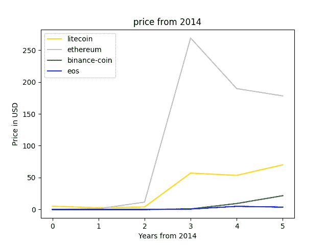
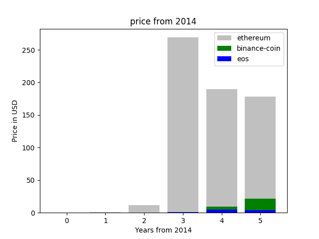

# 用 Python 代码比较 alt-coin 趋势

> 原文:[https://dev . to/codesharedot/comparisng-alt-coin-trends-with-python-code-8fo](https://dev.to/codesharedot/comparing-alt-coin-trends-with-python-code-8fo)

alt 币趋势对比如何？如果你对加密货币感兴趣，你可能会对此感到疑惑。

这个问题可以用 [Python](https://python.org) 来回答。其工作方式是获取每枚硬币的所有 json 数据，然后获取年份，最后将它们绘制成一个图。

[T2】](https://res.cloudinary.com/practicaldev/image/fetch/s--Yar4R2Pl--/c_limit%2Cf_auto%2Cfl_progressive%2Cq_66%2Cw_880/https://proxy.duckduckgo.com/iu/%3Fu%3Dhttps%253A%252F%252Fmedia.giphy.com%252Fmedia%252FjR8EDxMbqi1QQ%252Fgiphy.gif%26f%3D1%26nofb%3D1)

## [](#line-trend-comparison)线条趋势对比

我们将代码封装到函数中的[以获得价格趋势](https://gitlab.com/codelivespeed/bitcoin-price-chart/blob/master/example.py)。

然后调用函数来获取列表。作为参数，您可以定义货币。

```
#!/usr/bin/python3
prices = getCoin("litecoin")
prices_btc = getCoin("bitcoin")
prices_eth = getCoin("ethereum")
prices_bcn = getCoin("binance-coin")
prices_eos = getCoin("eos") 
```

这将价格放在列表中。然后，您可以使用 matplotlib 将它们绘制在一起。

```
#!/usr/bin/python3
plt.title('price from 2014')
plt.ylabel('Price in USD')
plt.xlabel('Years from 2014')

plt.plot(x, prices, label='litecoin', color='gold')
#plt.plot(x, prices_btc, label='bitcoin', color='silver')
plt.plot(x, prices_eth, label='ethereum', color='silver')
plt.plot(x, prices_bcn, label='binance-coin', color='green')
plt.plot(x, prices_eos, label='eos', color='blue')
plt.legend() 
```

[T2】](https://res.cloudinary.com/practicaldev/image/fetch/s--r6io5Xmt--/c_limit%2Cf_auto%2Cfl_progressive%2Cq_auto%2Cw_880/https://thepracticaldev.s3.amazonaws.com/i/ardvkcfornbasilk84xh.png)

这说明最大的牛市是在几年前。然后有一些略有增加，但其他像以太坊有一个转储时间。这是有道理的，因为许多早期投资者希望套现。

我们看到币安硬币在增加，币安是一个交易所，所以他们的业务增长可能会看到他们的硬币增值。

## [](#bar-plot-trend)柱状图趋势

换一个剧情我们能得到更多的感悟吗？

让我们试试堆积条形图。将代码从 plot 更改为 bar。

```
#!/usr/bin/python3                                                                                                                                            

plt.bar(x, prices_eth, label='ethereum', color='silver')                                                                                       
plt.bar(x, prices_bcn, label='binance-coin', color='green')                                                                                    
plt.bar(x, prices_eos, label='eos', color='blue') 
```

[T2】](https://res.cloudinary.com/practicaldev/image/fetch/s--h9Nc_Ekm--/c_limit%2Cf_auto%2Cfl_progressive%2Cq_auto%2Cw_880/https://thepracticaldev.s3.amazonaws.com/i/fxk7vwkn45ghrxfqpvhj.png)

在这里我们看到以太币相比其他币收益了很多倍。但这并不意味着其他人的增长很小。币安正处于萧条趋势中。如果你在 2017 年购买它们，它们将是 0.89 美元，但现在是 21 美元(这不是财务建议)。

[T2】](https://res.cloudinary.com/practicaldev/image/fetch/s--xuNaZ-yF--/c_limit%2Cf_auto%2Cfl_progressive%2Cq_66%2Cw_880/https://proxy.duckduckgo.com/iu/%3Fu%3Dhttps%253A%252F%252Fmedia1.tenor.com%252Fimages%252Fb4cef4aff23de2712130b058194a1ce0%252Ftenor.gif%253Fitemid%253D14988921%26f%3D1%26nofb%3D1)

如果您想摆弄代码:

```
#!/usr/bin/python3
import time
import os
import json
import requests
from bs4 import BeautifulSoup
import csv
import sys
from time import sleep
from time import gmtime, strftime
import matplotlib.pyplot as plt

def getCoin(coin):
    enddate = strftime("%Y%m%d", gmtime())
    r  = requests.get("https://coinmarketcap.com/currencies/" + coin + "/historical-data/?start=20140101&end={0}".format(enddate))
    data = r.text

    soup = BeautifulSoup(data, "html.parser")
    table = soup.find('table', attrs={ "class" : "table"})

    prices = []

    for row in table.find_all('tr'):
        addPrice = False
        tag = row.findAll('td')
        for val in tag:
            value = val.text

            if "Sep 10" in value:
                print(value)
                addPrice = True

        if addPrice == True:
            prices.append( tag[3].text )

    # flip list, months are in reverse order
    prices = prices[::-1]
    for i in range(0,len(prices)):
        prices[i] = float(prices[i])

    while len(prices) < 6:
        prices = [0] + prices

    return prices

prices = getCoin("litecoin")
prices_btc = getCoin("bitcoin")
prices_eth = getCoin("ethereum")
prices_bcn = getCoin("binance-coin")
prices_eos = getCoin("eos")

x = list(range(0, len(prices)))

plt.title('price from 2014')
plt.ylabel('Price in USD')
plt.xlabel('Years from 2014')

plt.plot(x, prices, label='litecoin', color='gold')
#plt.plot(x, prices_btc, label='bitcoin', color='silver')
plt.plot(x, prices_eth, label='ethereum', color='silver')
plt.plot(x, prices_bcn, label='binance-coin', color='green')
plt.plot(x, prices_eos, label='eos', color='blue')
plt.legend()

os.system("rm -rf chart.png")
time.sleep(1)
plt.savefig('chart.png') 
```

相关链接:

*   [替代硬币价格的数据来源](https://coinmarketcap.com/)
*   [学习 Python 编程](http://pythonbasics.org)
*   [条形图示例](https://pythonbasics.org/matplotlib-bar-chart/)