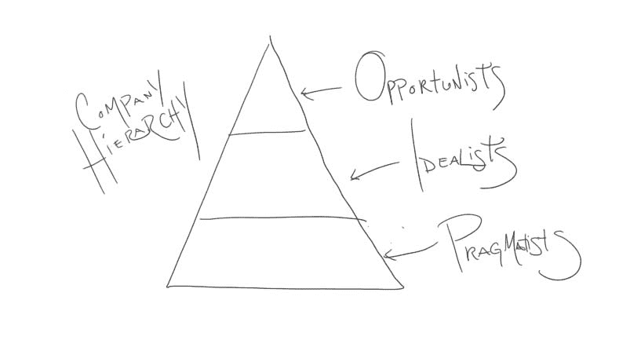

# 如何与高管交谈(以及如何不交谈)

> 原文：<https://dev.to/daedtech/how-to-talk-to-a-c-level-executive-and-how-not-to-1lc1>

不到两年前，这篇文章最初出现在我的博客上，是为了回答一个读者的问题。

本周，我在一个真实的星期一成功地做了[读者问题星期一](https://www.daedtech.com/category/you-asked-for-it/)。所以这周已经有了一个好的开始。让我们加倍努力，看看如何与高管交谈。

就像上周的[一样，我在 FIFO 模型的尝试中遇到了冲突，但我刚刚得到了这个问题，它让我的大脑开始运转。我认为这应该是一个有趣的帖子。这是另一个相当简单的问题。](https://www.daedtech.com/specialty-easy-explain/)

> 今天我收到一篇 Gartner 的文章，发现它几乎无法阅读。流行语、新术语等。不过，我可以关注 ThoughtWorks 的文章。这是我需要说的一种语言，以便与 C 套件对话，还是仅仅是炒作？谢谢！

### 让我们快速检查一下这篇文章

有问题的加内特文章有 4 个作者，他们最初是在 18 个月前合作完成的。然后他们在 10 月份“刷新”了它。我不会说谎——这是一个相当残酷的阅读。我们先来看看文章的摘要。

> 解决数字革命带来的无处不在的集成需求正促使 IT 领导者转向一种双模式的、自己动手的集成方法。基于本研究中讨论的最佳实践实施混合集成平台是一个关键的成功因素。

你还记得[这篇文章](https://www.daedtech.com/decline-enterprise-architect/)吗，在那里我引用了对企业架构的描述？在这篇文章中，我评论了每一个引用是如何降低了《邮报》的[可读性分数](https://yoast.com/flesch-reading-ease-score/)。

好吧，那些引用和这个没有任何关系。

上面引用的代码块一手就让我的可读性降低了 13%。作者设计它是为了震撼和敬畏，而不是为了消费。这就是*摘要*——这部分应该说“嘿，我是这个东西真正的肉的一个容易消化的逗趣者。”

所以你只能想象“肉”包括什么。

> Gartner 将“普遍集成”定义为根据需要集成内部和云中的应用程序和数据源、业务合作伙伴、客户端、移动应用程序、社交网络和“事物”的行为，以使组织能够追求数字业务、双模 IT 和其他现代业务和技术战略。在这些业务和 IT 趋势的推动下，分散集成任务的激增和日益增长的重要性正迫使集成主管重新思考他们的方法、组织模型和技术平台。

可读性只是经历了与那段文字升华的修辞对等物。从绿色开始，经过橙色，然后右转到红色。

### 仁慈，威廉，仁慈

我试着读了这篇文章。说真的。我给了它真诚的努力。但这就像穿着水泥靴穿过沼泽一样。

我自己也当过一段时间的首席信息官。在那之后的几年里，我为首席信息官(以及董事会、首席执行官、副总裁、董事和经理)提供建议。不管这篇文章的目的是什么，它都不是领导的简单理解和探索。

在技术、营销、客座博文和公众形象的交叉点上，很难推测某个东西的用途。我无法想象这四个人到底希望通过地毯式轰炸来说服谁。

但是不难推测在组织中人们如何以及为什么这样说话。T2，其实不难推测你应该如何与一位 c 级高管交谈。事实上，我很容易就能说到最后一点。

但首先，让我们重温一下企业金字塔，并帮助我们自己上一课，了解其中的人是如何相互交谈的。

### 皇帝的新衣，在现代企业中重访

我想简单介绍一下安徒生童话《皇帝的新衣》让我们稍微调整一下，使之与[的企业金字塔](https://www.daedtech.com/defining-the-corporate-hierarchy/)相一致。

忘了皇帝吧。他本质上是个道具。

相反，让我们来谈谈一对既负责皇帝的衣柜又负责帝国预算的机会主义贵族。用黄金和没药之类的东西给皇帝穿衣服变得很昂贵，所以他们有了一个主意。“嘿——与其给皇帝穿这些非常昂贵的衣服，花很多钱，不如给他穿上....没什么。有什么比没有更便宜的？”

所以他们策划了一个计划。

“我们就把他光着身子送出去。我们会告诉所有人，他实际上穿着衣服，但这是魔法衣服，只有聪明、能干和帝国的真正信徒才能看到。”了不起的混蛋。

你认为会发生什么？

显然，机会主义者在玩他们自己的游戏。实用主义者看到裸体的皇帝，会想，“那家伙是裸体的，但我喜欢我的农民工作，所以我只会翻白眼，奉承他的漂亮衣服。”

理想主义者呢？

不像安徒生童话里，他们看到皇帝裸体时不会发抖和担心。相反，他们制造了如此强烈的错觉来缓解他们的认知失调，以至于他们实际上看到他站在他们面前，穿着华丽的毛皮和丝绸礼服。

### 公司老板的新衣服

我对这个故事的改编可能最符合企业文化的理念。机会主义者凭空发明了这个概念，并利用它将存在主义的虚无感排除在更大的企业体验之外。

正如拿破仑·波拿巴曾经说过的:

> “一个人不会为了一天半便士或一点小小的荣誉而被杀。你必须与灵魂对话，才能使他通电。”

因此，在任何地方的公司里，这都是一种更平凡的感觉。职业生涯又老了一天，债台高筑，这令人沮丧，但如果你能说服自己，你是“[让世界更加紧密](https://techcrunch.com/2017/06/22/bring-the-world-closer-together/)”而不是仅仅帮助他们浪费时间，这种沮丧就不会那么令人沮丧。

所以机会主义者为其他人制造文化。实用主义者耸耸肩，说“只要能付账就行。”而理想主义者呢？嗯，他们把这东西吃光了。

然而，你不仅仅可以把它应用到虚构的企业文化中。你也可以在金字塔居民的言语模式中看到这一点。

### 理想主义者的演讲模式

从某种意义上说，Gartner 的那篇文章是皇帝(缺少)的衣服。

它代表了一种没有人觉得有用的理想化语言的概念。这看起来就像是，如果你让一些随机的人按照他们认为高管们希望有前途的人说话的方式说话，会发生什么。

而且，就像制造出来的文化理想一样，这种东西非常适合理想主义者的世界。他们以他们认为高管希望他们说话的方式说话，下意识地重视故作姿态而不是交流。的确，这样的语言根本不是为了交流，而是为了展示。

理想主义者说一种语言——一种商业克里奥尔语——不直接交流。

相反，它旨在模仿。

实用主义者用简单的术语说话，机会主义者自然会发展出一种行话式的、有能力的商店用语。理想主义者试图通过不称职地模仿机会主义者来区别于实用主义者。

### 你如何与首席执行官交谈

幸运的是，对于这个建议，我不需要区分有抱负的机会主义者和自由代理人。不管怎样，我都会给出同样的建议，因为我建议你在这两种情况下都要像机会主义者一样操作。

你最不希望的就是机会主义者认为你是一个非战略性的理想主义者。所以，无论你做什么，都不要像个男人一样说话。不要参与裸体错觉，表现得像行话 babble 一样有意义。

你真正想做的是非常坦率地和他们说话。

这和全世界的扎克伯格在任何地方都穿牛仔裤一样有一种声望。你有足够的能力用直截了当的语言说话。例如，当我给高管和领导层写关于聘用顾问的建议时，我会保持简短，就像写博客一样。

但是记住一件事。

这对于一对一的听众来说很有效，因为经理会喜欢简单明了。但是在群体情况下，你需要和机会主义者一起保持新装假象。这意味着不要泄露你没有衣服穿的秘密，而是要巧妙地向你的目标观众发出信号，告诉他们你知道发生了什么。

你是怎么做到的？

机会主义及其 [powertalk](https://www.ribbonfarm.com/2009/11/11/the-gervais-principle-ii-posturetalk-powertalk-babytalk-and-gametalk/) 的大量实践。但是你不会用夸张的吹嘘来达到目的。从简单的语言开始，边走边调。

*如果你想问读者问题，你可以在[“问我”页面](https://daedtech.com/ask)提问。*