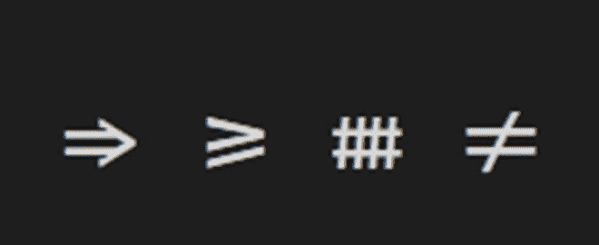
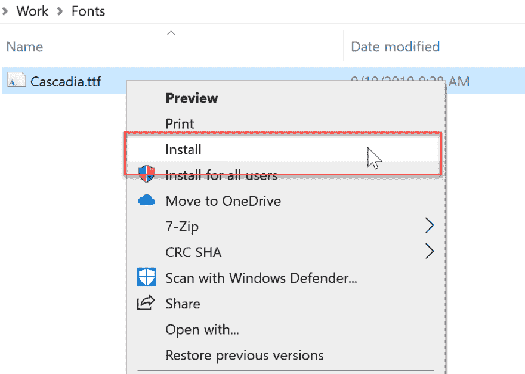
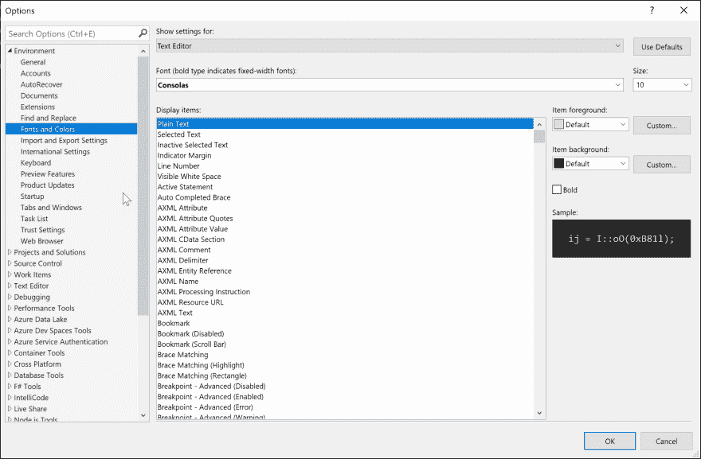
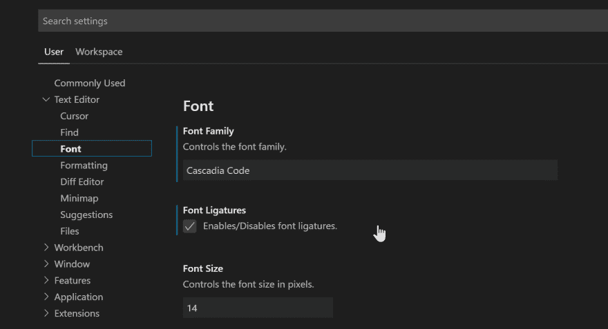

# 更改您的 Visual Studio / Visual Studio 代码字体

> 原文:[https://dev . to/coding coach/change-your-visual-studio-visual-studio-code-font-8pb](https://dev.to/codingcoach/change-your-visual-studio-visual-studio-code-font-8pb)

# 新的卡斯卡迪亚代码字体

作为新的 Windows 终端开发的一部分，微软提供了一种原始的开源等宽字体 Cascadia Code。建议与控制台应用程序和开发文本编辑器一起使用。
这种新字体支持编程连字！
编程连字通过组合字符来创建新的字形。
这有助于提高代码的可读性。

## 在你的 windows 系统中安装卡斯卡迪亚代码字体

*   下载。ttf 文件从 [github repo](https://github.com/microsoft/cascadia-code/releases) 到你电脑上的任意文件夹
*   打开下载文件的上下文菜单，并选择安装选项

[T2】](https://res.cloudinary.com/practicaldev/image/fetch/s--xYEirEyS--/c_limit%2Cf_auto%2Cfl_progressive%2Cq_auto%2Cw_880/https://i.imgur.com/DWJAuMu.png)

# 在 IDE 中更改字体

厌倦了日复一日相同的字体？按照这些步骤，在您的 IDE 中拥有一个新的外观和感觉！

## 在 Visual Studio 2019 for Windows 中更改编辑器字体

*   您可以在“工具”>“选项”菜单中的“环境”>“字体和颜色”下访问字体设置(更改字体后，重新打开 Visual Studio 2019)

[T2】](https://res.cloudinary.com/practicaldev/image/fetch/s--HtaHxaw---/c_limit%2Cf_auto%2Cfl_progressive%2Cq_auto%2Cw_880/https://i.imgur.com/XUJDcxx.png)

## 在 Visual Studio 代码中更改编辑器字体

*   打开您的设置，查找用户>文本编辑器>字体，并将其更改为您想要的字体(更改字体后，重新打开 Visual Studio 代码)

[T2】](https://res.cloudinary.com/practicaldev/image/fetch/s--EID7mfqh--/c_limit%2Cf_auto%2Cfl_progressive%2Cq_auto%2Cw_880/https://i.imgur.com/iJAkA2Q.png)

参考

*   [卡斯卡迪亚代码](https://devblogs.microsoft.com/commandline/cascadia-code/)