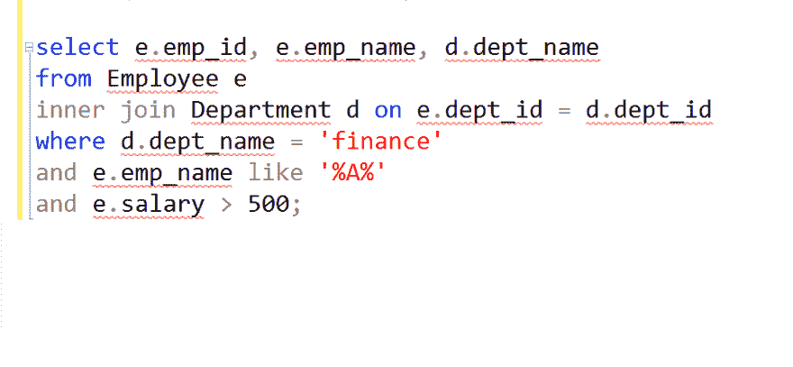
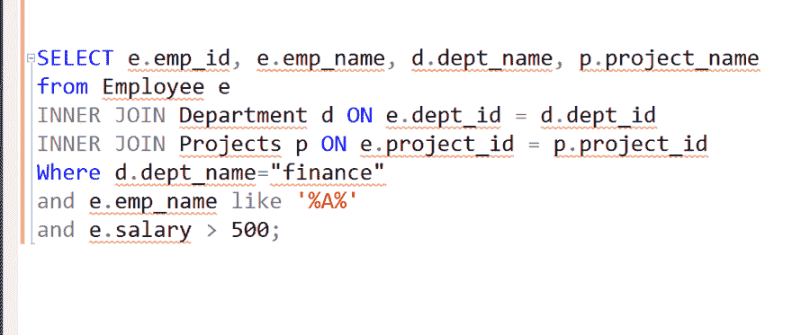
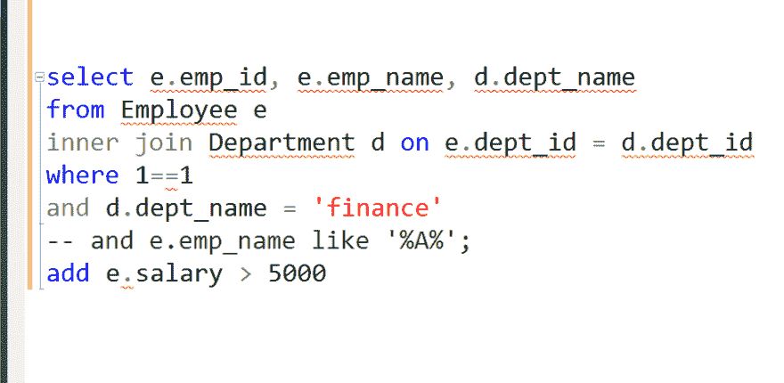
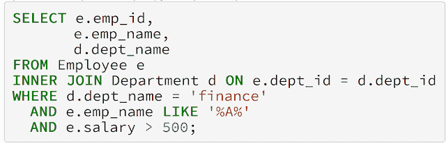

# 如何写出更易读的 SQL 查询？

> 原文:[https://dev . to/javin Paul/how-to-write-SQL-queries-which-are-easy-to-read-39p 8](https://dev.to/javinpaul/how-to-write-sql-queries-which-are-easier-to-read-39p8)

*披露:这篇文章包括附属链接；如果您从本文提供的不同链接购买产品或服务，我可能会收到报酬。*

毫无疑问，写代码是艺术而不是科学，即使有经验，每个程序员也不可能写出既可读又可维护的漂亮代码。是的，这很直白也很难，但基本上是真的。

一般来说，编码会随着经验的增加而提高，但是只有当你学会了编码的艺术，比如更喜欢 [**合成而不是继承**](http://javarevisited.blogspot.sg/2013/06/why-favor-composition-over-inheritance-java-oops-design.html) 或者为 [**接口编码而不是在**](http://javarevisited.blogspot.sg/2012/03/10-object-oriented-design-principles.html)上实现时，但是，不幸的是，只有少数开发人员能够掌握这些技术。

这同样适用于 SQL 查询。您构建查询的方式、您编写查询的方式对于将您的意图传达给其他开发人员、DBA 甚至几个月后的您自己有很大的帮助。

每当我在不同开发人员的电子邮件中看到 SQL 查询，我都能看到他们写作风格的明显差异。一些开发人员和 DBA 将它写得非常整洁，并缩进他们的查询，这样您就可以很容易地发现关键的细节，比如您要提取哪些列，从哪个表中提取，以及什么是连接或过滤条件。

因为在实际项目中，SQL 查询很难是单行的，所以学习编写复杂 SQL 查询的正确方法会有很大的不同；尤其是当您与他人共享查询以供查看或执行时。正如我所说，几个月后，当你自己阅读时，也会有所帮助。

问题是有很多书和课程教你 SQL，比如什么是表，不同的 SQL 命令，但是很少有(比如乔希·波尔蒂利亚的《SQL 训练营》)专注于编写正确的 SQL 查询。

在本文中，我将向您展示我过去尝试过的几种风格，它们的优缺点以及我认为的编写 SQL 查询的最佳方式。

除非你有一个很好的理由不使用我的风格，例如，你有一个更好的风格，或者你想坚持你的项目中使用的风格(一致性压倒一切)，没有理由不使用它。

顺便说一句，我希望你熟悉 SQL，并明确知道如何编写查询。我希望您使用过不同的 SQL 子句，如 SELECT、INSERT、UPDATE、delete，并理解它们在 SQL 查询中的含义。如果您不是，最好通过参加我推荐的一些课程来获得一些 SQL 经验，例如:

1.  通过 CodeCademy 学习 SQL
2.  乔恩·弗兰德斯的 SQL 简介
3.  数据科学家乔希·波尔蒂利亚在 Udemy 或
4.  David Kim 和 Peter Sefton 在 Udemy 上的课程《SQL for Newbs: Data Analysis for 初学者》。

它们都是很棒的课程，教你 SQL 基础知识，但是，如果你需要一些免费的替代品，你也可以查看这个为程序员和开发人员提供的免费 SQL 课程列表。

无论如何，让我们检查几种编写 SQL 查询的方法，并找出哪一种是快速表达意图的最佳方法:

## SQL 查询 1.0 版本

[T2】](https://click.linksynergy.com/fs-bin/click?id=JVFxdTr9V80&subid=0&offerid=323058.1&type=10&tmpid=14538&RD_PARM1=https%3A%2F%2Fwww.udemy.com%2Fsql-for-newbs%2F)

### 优点:

混合大小写的引入是为了将关键字与列名和表名分开，比如将 [SELECT](http://javarevisited.blogspot.sg/2011/10/selct-command-sql-query-example.html) 写成大写，而将 Employee 写成原样，但是考虑到**不一致**，比如`SELECT`是大写的而`from`是小写的，使用这种样式没有任何好处。

### 缺点:

1)混合案例。整个查询写在一行上，一旦表和列的数量增加，这一行就变得不可读。
3)在添加新条件或在没有现有条件的情况下运行时没有灵活性

## SQL 查询 2.0 版本

[T2】](https://click.linksynergy.com/fs-bin/click?id=JVFxdTr9V80&subid=0&offerid=323058.1&type=10&tmpid=14538&RD_PARM1=https%3A%2F%2Fwww.udemy.com%2Fthe-complete-sql-bootcamp%2F)

### 改进:

1) SQL 查询被分成多行，这使得它更具可读性，是的，这一点小事就能产生巨大的差异。

### 问题

1)混合情况
2)`WHERE`子句上的所有条件都在同一行上，这意味着通过注释排除它们并不容易。

## SQL 查询 3.0 版本(最佳)

[T2】](https://res.cloudinary.com/practicaldev/image/fetch/s--eO3o2kUQ--/c_limit%2Cf_auto%2Cfl_progressive%2Cq_auto%2Cw_880/https://thepracticaldev.s3.amazonaws.com/i/tviqzrqlq4ub81c7rm2r.png)

### 优点

1)将 SQL 查询分成多行使其可读性更好。
2)使用适当的缩进可以很容易地找到数据的来源，即[表](http://www.java67.com/2017/12/difference-between-table-scan-index.html)和[连接](http://javarevisited.blogspot.sg/2013/05/difference-between-left-and-right-outer-join-sql-mysql.html)
3)在单独的行上有条件允许你通过注释如下所示的条件之一来运行查询:

[T2】](https://click.linksynergy.com/deeplink?id=JVFxdTr9V80&mid=44188&murl=https%3A%2F%2Fwww.codecademy.com%2Flearn%2Flearn-sql&LSNSUBSITE=TEST)

顺便说一句，如果你注意到有一个细微的区别，我添加了 WHERE 1=1，这意味着你可以注释任何条件而不用注释 WHERE 子句，这在早期版本的查询中是不可能的。

如果您喜欢关键字的大写字母，您也可以编写如下所示的相同的 [SQL 查询](http://www.java67.com/2018/02/5-free-database-and-sql-query-courses-programmers.html)，规则是相同的，但只是关键字的大写字母。

[T2】](https://click.linksynergy.com/fs-bin/click?id=JVFxdTr9V80&subid=0&offerid=323058.1&type=10&tmpid=14538&RD_PARM1=https%3A%2F%2Fwww.udemy.com%2Fthe-complete-sql-bootcamp%2F)

这就是关于如何编写一个可读且更易维护的 SQL 查询的全部内容。请随意发表您对 SQL 查询的缩进或样式的看法。

这是一种更简单但非常强大的技术，对于提高包含多个连接 的复杂 [**SQL 查询的可读性大有帮助，如我前面的例子所示。**](https://javarevisited.blogspot.sg/2012/11/how-to-join-three-tables-in-sql-query-mysql-sqlserver.html)

如果你愿意，你也可以在线使用各种 SQL 格式化程序，但是我建议你学习一种风格并坚持下去，而不是依赖格式化程序。

感谢您阅读这篇文章，让我们知道您是如何编写 SQL 查询的？你用哪种风格，或者你有自己的风格？如果你是一个初学者，正在学习 SQL，你可能会发现我列出的免费 SQL 课程和 T2 书籍很有帮助。

那么，你有什么想法？这几点有意义吗？您使用的是哪种 SQL 风格？你能让它更具可读性和可维护性吗？

**继续学习**
[SQL 简介](https://pluralsight.pxf.io/c/1193463/424552/7490?u=https%3A%2F%2Fwww.pluralsight.com%2Fcourses%2Fintroduction-to-sql)
[完整的 SQL 训练营](https://click.linksynergy.com/fs-bin/click?id=JVFxdTr9V80&subid=0&offerid=323058.1&type=10&tmpid=14538&RD_PARM1=https%3A%2F%2Fwww.udemy.com%2Fthe-complete-sql-bootcamp%2F)
[新手 SQL:新手数据分析](https://click.linksynergy.com/fs-bin/click?id=JVFxdTr9V80&subid=0&offerid=323058.1&type=10&tmpid=14538&RD_PARM1=https%3A%2F%2Fwww.udemy.com%2Fsql-for-newbs%2F)

您可能喜欢的其他 **SQL 和数据库文章**

*   5 个免费学习 SQL 的网站([网站](https://javarevisited.blogspot.com/2015/06/5-websites-to-learn-sql-online-for-free.html))
*   学习 MySQL 数据库的 5 门免费课程([门课程](https://javarevisited.blogspot.com/2018/05/top-5-mysql-courses-to-learn-online.html))
*   5 门免费学习数据库和 SQL 的课程([门课程](http://www.java67.com/2018/02/5-free-database-and-sql-query-courses-programmers.html)
*   更好地学习 SQL 的 5 本书([本书](http://www.java67.com/2016/09/sql-5-best-books-to-learn-and-master.html)
*   如何在单个查询中连接两个以上的表([文章](https://javarevisited.blogspot.com/2012/11/how-to-join-three-tables-in-sql-query-mysql-sqlserver.html))
*   WHERE 和 HAVING 子句的区别([回答](https://javarevisited.blogspot.com/2013/08/difference-between-where-vs-having-clause-SQL-databse-group-by-comparision.html)
*   来自访谈的 10 个 SQL 查询([查询](http://www.java67.com/2013/04/10-frequently-asked-sql-query-interview-questions-answers-database.html))
*   面向高级程序员的前 5 本 SQL 书籍([本书](https://javarevisited.blogspot.com/2018/07/top-5-advanced-sql-books-for.html)
*   SQL、T-SQL 和 PL/SQL 的区别？([回答](https://javarevisited.blogspot.com/2017/03/difference-between-sql-tsql-and-plsql.html))
*   学习 SQL 和数据库的五大在线课程([课程](https://hackernoon.com/top-5-sql-and-database-courses-to-learn-online-48424533ac61)

感谢阅读这篇文章，让我知道你是如何编写 SQL 查询的？你用哪种风格，或者你有自己的风格？

如果你正在寻找一个免费的课程来开始学习 SQL 和数据库基础知识，那么我建议你去参加 Udemy 上的 **[数据库和 SQL 查询介绍](https://click.linksynergy.com/deeplink?id=JVFxdTr9V80&mid=39197&murl=https%3A%2F%2Fwww.udemy.com%2Fintroduction-to-databases-and-sql-querying%2F)** 课程。这是完全免费的，你所要做的就是创建一个 Udemy 帐户，你就可以访问整个课程。