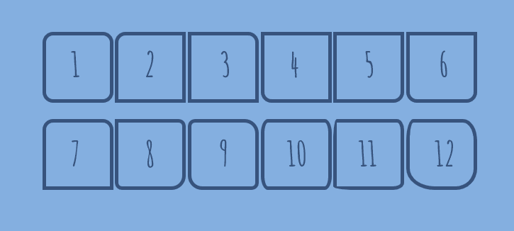
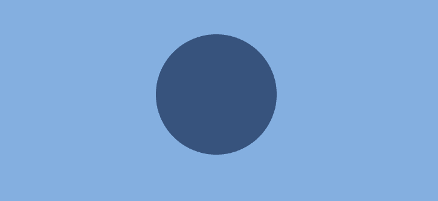
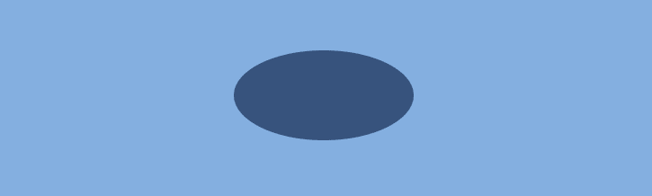
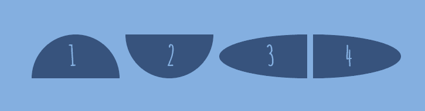
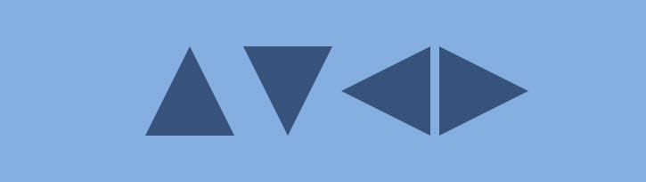
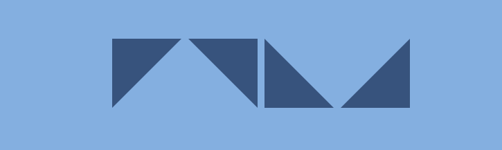
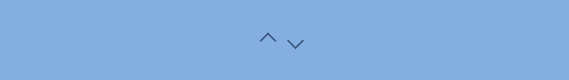
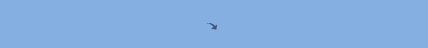
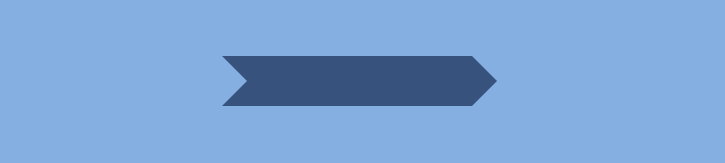

# CSS 形状

> 原文:[https://dev.to/sharkcoder/css-shapes-244j](https://dev.to/sharkcoder/css-shapes-244j)

这篇文章包括了在 CSS 上设计不同形状的例子。

## [](#borderradius-property)边框-半径属性

在样式化任何 CSS 图形之前，`border-radius`属性是一个需要理解的重要概念。它允许 HTML 元素的圆角。每个角度的曲线由定义其形状的一个或两个半径确定——圆形或椭圆形。半径扩展到整个背景，即使元素没有边框。

属性允许同时圆角化 HTML 元素的所有角。如果您为`border-radius`属性设置了两个值，第一个值将使**左上角和右下角**变圆，第二个值将使**右上角和左下角**变圆。您可以使用`px`、`em`、`%`或其他单位来设定值。

通过使用`border-top-left-radius`、`border-top-right-radius`、`border-bottom-left-radius`和`border-bottom-right-radius`属性，您可以用自己的方式来圆角化每个角。

由斜杠(/)符号分隔的值定义水平和垂直半径。

下面是一些具有不同边框半径的形状示例。

[](https://res.cloudinary.com/practicaldev/image/fetch/s--HrwP0CnY--/c_limit%2Cf_auto%2Cfl_progressive%2Cq_auto%2Cw_880/https://thepracticaldev.s3.amazonaws.com/i/ibgyr1rwme3pbmulkepv.png)T3】

```
 .shape1 { border-radius: 15px; }
.shape2 { border-top-left-radius: 15px; }
.shape3 { border-top-right-radius: 15px; }
.shape4 { border-bottom-left-radius: 15px; }
.shape5 { border-bottom-right-radius: 15px; }
.shape6 { border-radius: 0 0 15px 15px; }
.shape7 { border-radius: 15px 15px 0 0; }
.shape8 { border-radius: 0 10px 20px; }
.shape9 { border-radius: 10px 20px; }
.shape10 { border-radius: 10px/20px; }
.shape11 { border-radius: 5px 10px 15px 30px/30px 15px 10px 5px; }
.shape12 { border-radius: 10px 20px 30px 40px/30px; }

.shape {
  display: inline-block;
  width: 100px;
  height: 100px;
  border: 5px solid #32557f;
} 
```

有在线乐器可以玩不同的边框半径:[链接 1](https://codepen.io/chriscoyier/pen/owBwKM) 、[链接 2](https://9elements.github.io/fancy-border-radius/#89.68.11.81--) 。

## [](#circle)圆圈

圆形是最简单的 CSS 形状。将`border-radius: 50%;`属性应用于具有相同宽度和高度的元素，您将得到一个圆形。

```
 .circle {
  background: #32557f;
  width: 200px;
  height: 200px;
  border-radius: 50%; 
} 
```

[T2】](https://res.cloudinary.com/practicaldev/image/fetch/s--N45-qlsa--/c_limit%2Cf_auto%2Cfl_progressive%2Cq_auto%2Cw_880/https://thepracticaldev.s3.amazonaws.com/i/ocq3x7h6uambas8snok4.png)

## [](#ovalsellipses)卵形/椭圆形

椭圆形的制作方法与圆形相同。唯一的区别是椭圆的宽度应该不同于它的高度。

```
 .ellipse {
  background: #32557f;
  width: 200px;
  height: 100px;
  border-radius: 50%;
} 
```

[T2】](https://res.cloudinary.com/practicaldev/image/fetch/s--UsWsX957--/c_limit%2Cf_auto%2Cfl_progressive%2Cq_auto%2Cw_880/https://thepracticaldev.s3.amazonaws.com/i/3b3b9ur5pgfthprf4tft.png)

## [](#halfellipses)半椭圆形

要制作半椭圆，请使用由斜杠(/)符号分隔的一组值来定义水平和垂直半径。如果你在斜线符号前加 50%，你会得到一个垂直的半椭圆。如果你把 50%放在斜线符号后面，你会得到一个水平的半椭圆。0 和 100%值的组合定义半椭圆的方向。参见下面的例子。

```
 .half-ellipse1 { border-radius: 50% / 100% 100% 0 0; }
.half-ellipse2 { border-radius: 50% / 0 0 100% 100%; }
.half-ellipse3 { border-radius: 100% 0 0 100% / 50%; }
.half-ellipse4 { border-radius: 0 100% 100% 0 / 50%; }

.half-ellipse {
  background: #32557f;
  width: 150px;
  height: 75px;
} 
```

[T2】](https://res.cloudinary.com/practicaldev/image/fetch/s--QT0CcUCv--/c_limit%2Cf_auto%2Cfl_progressive%2Cq_auto%2Cw_880/https://thepracticaldev.s3.amazonaws.com/i/c1tme18jbscbdhh0ducs.png)

## [](#triangles)三角形

CSS 三角形对于创建箭头很有用，例如，在选择元素或按钮内部。

要制作三角形，请创建一个宽度和高度都为零的方框。

```
 .triangle {
  width: 0;
  height: 0;
} 
```

箭头的实际宽度和高度由边框的宽度决定。例如，在向上箭头中，底部边框是彩色的，而左边和右边是透明的，这就形成了三角形。

```
 .triangle .triangle-up {
  border-left: 50px solid transparent;
  border-right: 50px solid transparent;
  border-bottom: 100px solid #32557f;
}

.triangle .triangle-down {
  border-left: 50px solid transparent;
  border-right: 50px solid transparent;
  border-top: 100px solid #32557f;
}

.triangle .triangle-left {
  border-top: 50px solid transparent;
  border-right: 100px solid #32557f;
  border-bottom: 50px solid transparent;
}

.triangle .triangle-right {
  border-top: 50px solid transparent;
  border-left: 100px solid #32557f;
  border-bottom: 50px solid transparent;
} 
```

[T2】](https://res.cloudinary.com/practicaldev/image/fetch/s--8C3OVdig--/c_limit%2Cf_auto%2Cfl_progressive%2Cq_auto%2Cw_880/https://thepracticaldev.s3.amazonaws.com/i/m8bwstax20l12zve5vds.png)

要制作直角三角形，请将顶部或底部着色，并将右边框或左边框保持透明。

```
 .triangle .triangle-top-left {
  border-top: 100px solid #32557f;
  border-right: 100px solid transparent;
}

.triangle .triangle-top-right {
  border-top: 100px solid #32557f;
  border-left: 100px solid transparent;
}

.triangle .triangle-bottom-left {
  border-bottom: 100px solid #32557f;
  border-right: 100px solid transparent;
}

.triangle .triangle-bottom-right {
  border-bottom: 100px solid #32557f;
  border-left: 100px solid transparent;
} 
```

[T2】](https://res.cloudinary.com/practicaldev/image/fetch/s--Wg7WMnap--/c_limit%2Cf_auto%2Cfl_progressive%2Cq_auto%2Cw_880/https://thepracticaldev.s3.amazonaws.com/i/e2srrr5iqyks7rec6do7.png)

## [](#arrows)箭头

要创建一个没有尾部的简单箭头，制作一个具有宽度和高度、边框以及零左边框和零上边框的框。

```
 .arrow {
  width: 15px;
  height: 15px;
  border: 2px solid #32557f;
  border-left: 0;
  border-top: 0;
} 
```

要制作向上箭头，添加`transform: rotate(225deg);`属性，要制作向下箭头，添加`transform: rotate(45deg);`属性，分别将箭头旋转 225 度和 45 度。

```
 .arrow-up { transform: rotate(225deg); }
.arrow-down { transform: rotate(45deg); } 
```

[T2】](https://res.cloudinary.com/practicaldev/image/fetch/s--WVMS71yK--/c_limit%2Cf_auto%2Cfl_progressive%2Cq_auto%2Cw_880/https://thepracticaldev.s3.amazonaws.com/i/ac7kvd4qvbo88kr701o0.png)

还可以做一个带尾巴的弯箭头:

```
 .arrow-curved {
  position: relative;
  width: 0;
  height: 0;
  border-top: 9px solid transparent;
  border-right: 9px solid #32557f;
  transform: rotate(10deg);

  &:after {
    content: "";
    position: absolute;
    border: 0 solid transparent;
    border-top: 3px solid #32557f;
    border-radius: 20px 0 0 0;
    top: -12px;
    left: -9px;
    width: 12px;
    height: 12px;
    transform: rotate(45deg);
  }
} 
```

[T2】](https://res.cloudinary.com/practicaldev/image/fetch/s--0d547iAy--/c_limit%2Cf_auto%2Cfl_progressive%2Cq_auto%2Cw_880/https://thepracticaldev.s3.amazonaws.com/i/3tnfcfp6i0n4al97dalm.png)

下面是一个如何创建箭头指针的例子:

```
 .arrow-pointer {
  width: 250px;
  height: 50px;
  background: #32557f;
  position: relative;

  &:after {
    content: '';
    position: absolute;
    left: 0; bottom: 0; width: 0; height: 0;
    border-left: 25px solid #7eb4e2;
    border-top: 25px solid transparent;
    border-bottom: 25px solid transparent;
  }

  &:before {
    content: '';
    position: absolute;
    right: -25px;
    bottom: 0;
    width: 0;
    height: 0;
    border-left: 25px solid #32557f;
    border-top: 25px solid transparent;
    border-bottom: 25px solid transparent;
  }
} 
```

[T2】](https://res.cloudinary.com/practicaldev/image/fetch/s--JiznQnMO--/c_limit%2Cf_auto%2Cfl_progressive%2Cq_auto%2Cw_880/https://thepracticaldev.s3.amazonaws.com/i/u24jlns3zs8uqtmdsw21.png)

你可以在[sharkcoder.com](https://sharkcoder.com/visual/shapes)找到更多形状的例子