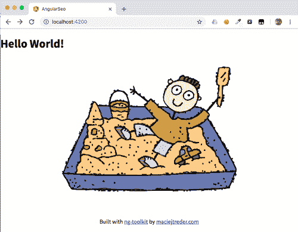
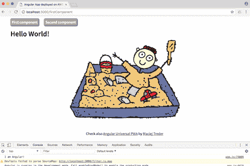
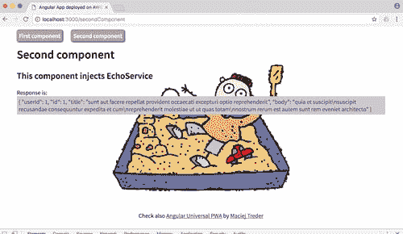
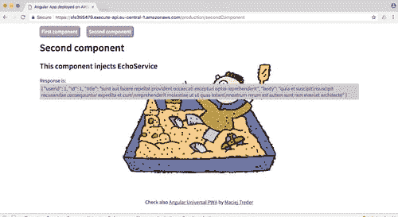

# AWS Lambda 无服务器 Angular Universal 入门

> 原文:[https://dev . to/twilio/getting-started-with-server less-angular-universal-on-AWS-lambda-1j 73](https://dev.to/twilio/getting-started-with-serverless-angular-universal-on-aws-lambda-1j73)

*原载于 [Twilio 博客](https://www.twilio.com/blog/angular-universal-javascript-node-js-aws-lambda)T3】*

您可以使用 [Angular Universal](https://angular.io/guide/universal) 构建搜索引擎优化(SEO)友好的单页应用程序(SPA ),这是一种在服务器上运行 Angular 应用程序的技术。你还可以通过 [AWS Lambda](https://aws.amazon.com/lambda/) 降低运行这些应用程序的成本，这是一个事件驱动的无服务器计算平台，作为亚马逊网络服务(AWS)的一部分提供。这篇文章将向您展示如何使用[无服务器框架](https://serverless.com/framework/)在 AWS Lambda 上构建和部署 Angular Universal 项目，这是一个用于构建和部署无服务器应用程序的开源命令行界面。

在本帖中，我们将:

*   创建一个包含两条路线并调用外部 API 的 Angular 应用程序
*   添加用于 SEO 目的的服务器端渲染
*   设置一个[无服务器框架](https://serverless.com/)框架配置
*   在 AWS Lambda 上部署应用程序

为了完成这篇文章中的任务，你需要[创建一个 AWS 账户](http://aws.amazon.com/)并安装以下软件:

*   [Node.js 和 npm](https://nodejs.org/)(node . js 安装也会安装 NPM。)
*   [角度 CLI](https://cli.angular.io/)
*   [AWS CLI](http://docs.aws.amazon.com/cli/latest/userguide/installing.html)

要配置 AWS CLI，您需要从您的 AWS 帐户获得以下信息:

*   访问密钥 ID
*   秘密钥匙
*   默认区域

您的根用户将拥有将 Angular 应用程序作为 Lambda 函数进行部署和运行所需的所有权限。通过在身份和访问管理(IAM)控制台中生成新的访问密钥 ID 和密钥对，您可以获得 root 用户的访问密钥 ID 和密钥。

如果您不想在这个项目中使用您的 root 用户 ID，您可以[为 API 设置一个 IAM 角色和策略来调用 Lambda 函数](https://docs.aws.amazon.com/apigateway/latest/developerguide/integrating-api-with-aws-services-lambda.html#api-as-lambda-proxy-setup-iam-role-policies)。这个过程有许多步骤，如果您不熟悉 AWS，不建议您这样做。

在继续之前，请确保您已成功完成所有这些任务。

## [](#set-up-the-angular-project-and-run-hello-world)设置 Angular 项目，运行 Hello World！

在每个 Angular 项目中，我们必须采取的第一步是包的初始化和安装:

```
ng new angularSeo --style css --routing false
cd angularSeo 
```

让我们对生成的项目做一些小的修改。首先，让我们给`src/index.html`文件中的`<app-root>`添加一些样式。将现有代码替换为:

```
<!doctype html>
<html lang="en">
<head>
 <meta charset="utf-8">
 <title>AngularSeo</title>
 <base href="/">

 <meta name="viewport" content="width=device-width, initial-scale=1">
 <link rel="icon" type="image/x-icon" href="favicon.ico">
</head>
<body>
 <app-root class="content"></app-root>
 <footer>Built with <a href="https://github.com/maciejtreder/ng-toolkit">ng-toolkit</a> by <a href="https://www.maciejtreder.com">maciejtreder.com</a></footer>
</body>
</html> 
```

接下来，用
替换`src/app/app.component.html`的现有内容

```
<h1>Hello World!</h1> 
```

最后，将以下内容添加到`src/styles.css` :

```
body {
   margin: 0 auto;
   max-width: 1000px;
   background: url('assets/img/sandbox.png') no-repeat center;
   display: flex;
   flex-direction: column;
   height: 100%;
   font-family: 'Source Sans Pro', calibri, Arial, sans-serif !important;
   min-height: 550px;
}
.content {
   flex: 1 0 auto;
}
footer {
   padding: 10px 0;
   text-align: center;
} 
```

注意，在上面，我们使用了我最喜欢的花哨背景:

[T2】](https://res.cloudinary.com/practicaldev/image/fetch/s--CBHBbo0N--/c_limit%2Cf_auto%2Cfl_progressive%2Cq_auto%2Cw_880/https://thepracticaldev.s3.amazonaws.com/i/q49c7fjs2jik7bs8pxgn.png)

下载它，并将其放在`src/assets/img`目录中。

让我们通过键入:
来运行这个应用程序

```
ng serve

** Angular Live Development Server is listening on localhost:4200, open your browser on http://localhost:4200/ **

Date: 2018-10-29T08:58:37.685Z
Hash: cb54e4608cfb1115882b
Time: 7682ms
chunk {main} main.js, main.js.map (main) 10.7 kB [initial] [rendered]
chunk {polyfills} polyfills.js, polyfills.js.map (polyfills) 227 kB [initial] [rendered]
chunk {runtime} runtime.js, runtime.js.map (runtime) 5.22 kB [entry] [rendered]
chunk {styles} styles.js, styles.js.map (styles) 15.9 kB [initial] [rendered]
chunk {vendor} vendor.js, vendor.js.map (vendor) 3.29 MB [initial] [rendered] 
```

用浏览器打开命令输出提供的 URL 后，您应该看到:

[T2】](https://res.cloudinary.com/practicaldev/image/fetch/s--TFHGIjyp--/c_limit%2Cf_auto%2Cfl_progressive%2Cq_auto%2Cw_880/https://thepracticaldev.s3.amazonaws.com/i/sltf6hhyqxu8bnp3mccb.png)

您可以在 GitHub 库中找到到目前为止的所有代码，您可以克隆这些代码:

```
git clone -b tutorial1_step1 https://github.com/maciejtreder/angular-seo.git angularSeo
cd angularSeo/
npm install
ng serve 
```

## [](#components-routing-and-services)组件、路由和服务

到目前为止，我们的应用程序并不复杂。让我们给它添加一些路由、其他组件和服务:

```
ng g c first
ng g c second
ng g c menu
ng g s echo 
```

好的，我们有很多文件。我们就从`src/app/first/first.component.ts`开始；这真的很简单。用以下内容替换默认内容:

```
import { Component } from '@angular/core';

@Component({
   template: '<h1>Hello World!</h1>'
})
export class FirstComponent {

} 
```

编辑第二个组件`src/app/second/second.component.ts`，它稍微复杂一点:

```
import { Component, OnInit } from '@angular/core';
import { EchoService } from '../echo.service';
import { Observable } from 'rxjs';

@Component({
  templateUrl: `second.component.html`,
  styleUrls: ['./second.component.css']
})
export class SecondComponent implements OnInit {
  public response: Observable<any>;

  constructor(private echoService: EchoService) {}

  public ngOnInit(): void {
      this.response = this.echoService.makeCall();
  }
} 
```

*注意:您的开发环境或 linter 可能会调用`makeCall()`。不要担心这个问题:我们将在创建服务时解决这个问题。*

我们在这里介绍了一些机制。首先是使用外部模板和外部样式(`templateUrl`和`stylesUrls`)。Angular 让我们能够在组件类之外创建 HTML 模板和 CSS 样式表。

第二个组件`src/app/second/second.component.html`的模板应该是这样的:

```
<h1>Second component</h1>
<h2>This component injects EchoService</h2>
Response is: <span>{{response | async | json}}</span> 
```

样式表`src/app/second/second.component.css`应该是这样的:

```
span {   
   color: purple;
   display: block;
   background: #ccc;
   padding: 5px;
} 
```

我们在这个组件中引入的另一个机制是*依赖注入*。如果你仔细看看`second.component.ts`中的构造函数，你会看到一个类型为`EchoService`的参数。Angular 将尝试初始化一个`EchoService`类型的对象，并在初始化时将它传递给我们的`SecondComponent`类。依赖注入是一种用于实现架构范例的技术，该架构范例被称为*控制反转* (IoC)。

我们还在模板中引入了一个`Observable`类型和一个`async`管道。你熟悉[承诺](https://developer.mozilla.org/en-US/docs/Web/JavaScript/Reference/Global_Objects/Promise)吗？可观测性更进了一步。这种异步类型发出由其他函数推送给它的值。您可以根据需要多次重用它，订阅多个侦听器，等等(映射、过滤、传递到另一个可观察对象，等等)。)你可以在 [RxJS GitHub 页面](https://github.com/ReactiveX/rxjs)了解更多。

`second.component.html`模板中的`async`管道是一个特殊的角度机制，仅在评估时才在视图模板中显示我们的变量。换句话说，在运行时推送到 HTML 的值是由`EchoService` observable 发送的。

最后，但同样重要的是，我们实现了`OnInit`接口和`ngOnInit`生命周期挂钩。TypeScript 中的接口与其他语言中的接口工作方式相同；如果实现它，就必须实现其中声明的所有方法。在这种特殊情况下，我们需要实现`ngOnInit()`方法。该方法是“角度生命周期挂钩”之一，由角度引擎在视图初始化、销毁和其他事件的不同阶段自动调用的方法。根据角度文件:

在 Angular 首先显示数据绑定属性并设置指令/组件的输入属性后，初始化指令/组件。在第一个 ngOnChanges()之后调用一次。

我们在第二个组件中注入了一个服务。现在我们可以创建它了。用以下内容替换`src/app/echo.service.ts`的默认内容:

```
import { HttpClient } from '@angular/common/http';
import { Observable } from 'rxjs';
import { Injectable } from '@angular/core';

@Injectable({
 providedIn: 'root'
})
export class EchoService {
   constructor(private httpClient: HttpClient) {}

   public makeCall(): Observable<any> {
       return this.httpClient.get<any>('https://jsonplaceholder.typicode.com/posts/1');
   }
 } 
```

这个服务只包含一个方法，它向`https://jsonplaceholder.typicode.com/posts/1` URL 发出 GET 请求。

好的。那个魔术看起来棒极了。但你很可能在问“Angular 怎么知道要注射什么？在哪里注射？这些类都是在哪里初始化的？”。这些都是很好的问题。答案是:`NgModule`，我们 app 的入口。是时候看看它内部发生了什么，并再导入一个模块，这是`EchoService` : `HttpClientModule` ( `src/app/app.module.ts` ):
所必需的

```
import { BrowserModule } from '@angular/platform-browser';
import { NgModule } from '@angular/core';

import { AppComponent } from './app.component';
import { FirstComponent } from './first/first.component';
import { SecondComponent } from './second/second.component';
import { MenuComponent } from './menu/menu.component';
import { AppRoutingModule } from './app-routing.module';
import { HttpClientModule } from '@angular/common/http';

@NgModule({
declarations: [
  AppComponent,
  FirstComponent,
  SecondComponent,
  MenuComponent
],
imports: [
  BrowserModule,
  AppRoutingModule,
  HttpClientModule
],
providers: [],
bootstrap: [AppComponent]
})
export class AppModule { } 
```

我们这里有什么…？

*   导入-到其他 NgModules 的链接
*   声明——应用程序中使用的组件列表
*   bootstrap——我们希望作为“主”组件加载的组件的名称
*   提供者——应用程序中使用的服务列表

好了，现在该声明路由了。首先创建一个路由模块:

```
ng generate module app-routing --flat --module=app 
```

我们现在可以将我们的路由添加到`src/app/app-routing.module.ts`，从中导出`RouterModule`，并删除多余的代码(`declarations`数组和`CommonModule`导入):

```
import { NgModule } from '@angular/core';
import { RouterModule } from '@angular/router';
import { FirstComponent } from './first/first.component';
import { SecondComponent } from './second/second.component';

@NgModule({
 imports: [
   RouterModule.forRoot([
     { path: '', redirectTo: '/firstComponent', pathMatch: 'full' },
     { path: 'firstComponent', component: FirstComponent },
     { path: 'secondComponent', component: SecondComponent }
   ])
 ],
 exports: [ RouterModule ]
})
export class AppRoutingModule { } 
```

我们可以在`MenuComponent`文件中添加一些链接，`src/app/menu/menu.component.ts` :

```
import { Component } from '@angular/core';

@Component({
  selector: 'app-menu',
  template: `
      <ul>
          <li><a routerLink="firstComponent">First component</a></li>
          <li><a routerLink="secondComponent">Second component</a></li>
      </ul>
  `,
  styles: [`
      :host {margin: 0; padding: 0}
      ul {list-style-type: none; padding: 0;}
      li {display: inline-block;}
      a {
          border: 1px solid #666666;
          background: #aaaaaa; border-radius: 5px;
          box-shadow: 1px 1px 5px black;
          color: white;
          font-weight: bold;
          padding: 5px;
          text-decoration: none;
       }
      li + li a {margin-left: 20px;}
  `]
})
export class MenuComponent {
} 
```

您是否看到了`routerLink`和 AppModule 中声明的路由之间的联系？太好了！这就是我们如何在 Angular 中链接东西:`routerLink`是一个 Angular 内置指令，它将`path`作为一个参数，并与`RouterModule.forRoot()`中声明的`path`相匹配。当有匹配时，它将给定的组件加载到一个`<router-outlet>`组件中，我们现在要把它添加到`src/app/app.component.html`中。将该文件中的代码替换为:

```
<app-menu></app-menu><router-outlet></router-outlet> 
```

我们的应用已经准备好了。启动时间:

```
ng serve -o 
```

这是您应该在浏览器中看到的内容:

[T2】](https://res.cloudinary.com/practicaldev/image/fetch/s--nyT0m8Zh--/c_limit%2Cf_auto%2Cfl_progressive%2Cq_auto%2Cw_880/https://thepracticaldev.s3.amazonaws.com/i/n820n0ilobuialsyukot.png)

当你点击*第二个组件*按钮时，如果一切正常，你会看到:

[T2】](https://res.cloudinary.com/practicaldev/image/fetch/s--CWYFUKGf--/c_limit%2Cf_auto%2Cfl_progressive%2Cq_auto%2Cw_880/https://thepracticaldev.s3.amazonaws.com/i/0uwdn1gbzm0wb4sf8shn.png)

在您可以克隆的 GitHub 库中找到到目前为止的所有代码:

```
git clone -b tutorial1_step2 https://github.com/maciejtreder/angular-seo.git angularSeo
cd angularSeo/
npm install
ng serve -o 
```

## [](#searchengine-optimization-seo)搜索引擎优化

我们的应用看起来可以部署了。但是如果我们像网络爬虫一样“思考”,就会出现一些问题。

运行我们的应用程序:

```
ng serve 
```

看看我们的网站。您可以通过检查页面源代码或运行下面的 cURL 命令(如果您安装了 cURL)来实现这一点:

```
curl localhost:4200

<!doctype html>
<html lang="en">
<head>
  <meta charset="utf-8">
  <title>AngularSeo</title>
  <base href="/">

  <meta name="viewport" content="width=device-width, initial-scale=1">
  <link rel="icon" type="image/x-icon" href="favicon.ico">
</head>
<body>
  <app-root class="content"></app-root>
  <footer>Built with <a href="https://github.com/maciejtreder/ng-toolkit">ng-toolkit</a> by <a href="https://www.maciejtreder.com">maciejtreder.com</a></footer>
<script type="text/javascript" src="runtime.js"></script><script type="text/javascript" src="polyfills.js"></script><script type="text/javascript" src="styles.js"></script><script type="text/javascript" src="vendor.js"></script><script type="text/javascript" src="main.js"></script></body>
</html> 
```

这里有什么问题？单页应用程序是如何工作的？事实上，它们是纯 HTML，附带了大量的 JavaScript 并在用户的浏览器中执行。

爬虫能做同样的事情吗？GoogleBot 可以呈现 JavaScript，但其他爬虫(如脸书、LinkedIn、Twitter、Bing)不能。此外，网站“看起来”像静态的，并且不期望爬虫程序需要额外的资源来读取它们，因为它们的性能更好，所以在搜索引擎排名中的位置更高。

我们如何解决这个问题？超级简单！在命令行中键入以下内容:

```
ng add @ng-toolkit/universal 
```

刚刚发生了什么？@ng-toolkit 用 [Angular Universal](https://angular.io/guide/universal) 功能更新了我们的项目，这是一种在服务器上运行 Angular 应用程序的技术。我们创建了几个新文件。

对`src/app/app.module.ts`文件进行了修改，这是我们应用程序的入口点。@ng-toolkit 所做的是从@NgModule 注释中删除了`bootstrap`属性，从 imports 数组中删除了`BrowserModule`,并在那里添加了两个新的属性，`NgtUniversalModule`和`CommonModule`。

我们的应用程序现在在哪里启动？其实看情况。如果您正在寻找浏览器使用的引导程序，我们应该导航到`src/app/app.browser.module.ts`，这是它所在的位置:

```
import { AppComponent } from './app.component';
import { AppModule } from './app.module';
import { NgModule } from '@angular/core';
import { BrowserModule } from '@angular/platform-browser';

@NgModule({
   bootstrap: [AppComponent],
   imports: [
       BrowserModule.withServerTransition({appId: 'app-root'}),
       AppModule,
   ]
})
export class AppBrowserModule {} 
```

@ng-toolkit 还完成了`src/app/app.server.module.ts`的创建。这是将在服务器端执行的代码的入口点。

现在我们可以看一下项目配置文件，`angular.json`。我们会发现我们的项目中增加了一个新的建设者。

(代码块中的省略号(“`...`”)表示为简洁起见而修订的部分。)

```
...
"server": {
  "builder": "@angular-devkit/build-angular:server
    "options": {
      "outputPath": "dist/server",
      "main": "src/main.server.ts",
      "tsConfig": "src/tsconfig.server.json"
    }
  }
}
... 
```

如您所见，这个构建的入口文件是`src/main.server.ts`，它也被添加到我们的项目中。通过查看这个文件，我们可以确定 Angular 编译器用来创建服务器端构建的入口点:

```
import { enableProdMode } from '@angular/core';
import { environment } from './environments/environment';

if (environment.production) {
 enableProdMode();
}

export {AppServerModule} from './app/app.server.module'; 
```

这里是:`src/app/app.server.module.ts`，它是相当于`src/app/app.browser.module.ts`的服务器端渲染，这个模块引导应用程序进行浏览器渲染。

您可能已经注意到，`@ng-toolkit`也对`package.json`文件进行了修改。我们有几个新剧本:

```
...
"build:server:prod": "ng run angularSeo:server && webpack --config webpack.server.config.js --progress --colors",
"build:browser:prod": "ng build --prod",
"build:prod": "npm run build:server:prod && npm run build:browser:prod", "server": "node local.js"
... 
```

最重要的两个在列表的末尾:

*   `build:prod`，针对浏览器和服务器构建运行 Angular 编译器，然后使用@ng-toolkit 添加的 Webpack 配置创建一个`server.js`文件。
*   `server`，用编译好的应用程序启动 Node.js。

给他们一个尝试:

```
npm run build:prod
npm run server 
```

我们可以试着表现得像一个网络爬虫:

```
curl localhost:8080 
```

然后嘣！如果我们检查页面源代码，我们可以看到在服务器端生成的。查找为按钮生成的链接，如下所示:

```
...
<app-root class="content" _nghost-sc0="" ng-version="6.1.10"><menu _ngcontent-sc0="" _nghost-sc1="">
<ul _ngcontent-sc1="">
<li _ngcontent-sc1=""><a _ngcontent-sc1="" routerlink="firstComponent" href="/firstComponent">First component</a></li>
<li _ngcontent-sc1=""><a _ngcontent-sc1="" routerlink="secondComponent" href="/secondComponent">Second component</a></li>
</ul></menu>
<router-outlet _ngcontent-sc0=""></router-outlet><ng-component><h1>Hello World!</h1></ng-component></app-root>
... 
```

如果您没有看到预期的结果或遇到错误，您可以在这个 GitHub 存储库中找到到目前为止的所有代码，您可以克隆这些代码:

```
git clone -b tutorial1_step3 https://github.com/maciejtreder/angular-seo.git angularSeo
cd angularSeo/
npm install
npm run build:prod
npm run server 
```

## [](#deploy)部署！

厉害！我们的应用程序是完全开发和搜索引擎友好。我们已经为部署做好了 95%的准备。

我们应该讨论剩下的 5%。

通常，我们会构建自己的应用程序，并将`dist`文件夹下的所有内容发布到某个托管服务(例如，亚马逊 S3)。“问题”是我们引入了服务器端渲染机制，需要 Node.js 运行在后端机器上。我们需要每天 24 小时运行的高成本 EC2 实例吗？

没有。我们将使用 AWS Lambda，一个功能即服务(FaaS)环境和无服务器框架。通过再次使用@ng-toolkit，我们将为[无服务器框架](https://serverless.com/)设置基本配置。

```
ng add @ng-toolkit/serverless 
```

这个命令创建了为无服务器框架提供配置的`serverless.yml`文件和为 AWS Lambda 函数提供入口点的`lambda.js`文件。它还对框架做了一些小的改动。

要将项目配置为在您的默认 AWS 区域中运行，请编辑`serverless.yml`文件并用您的默认 AWS 区域的名称替换 region:的值。比如把`eu-central-1`换成`us-east-2`。

我们在`package.json`中也有新的脚本。利用其中的一个:

```
npm run build:serverless:deploy

...
endpoints:
  ANY - https://5k42947te1.execute-api.eu-central-1.amazonaws.com/production/{proxy+}
  ANY - https://5k42947te1.execute-api.eu-central-1.amazonaws.com/production
functions:
  api: angularseo-production-api 
```

您应该能够在部署命令输出中找到的 URL 处导航到您的应用程序，如上所示。如果您更改了`serverless.yml`中的值，URL 将包含您的默认区域。

当您点击*第二个组件*按钮时，输出应该如下所示:

[T2】](https://res.cloudinary.com/practicaldev/image/fetch/s--ETVRAmAS--/c_limit%2Cf_auto%2Cfl_progressive%2Cq_auto%2Cw_880/https://thepracticaldev.s3.amazonaws.com/i/hbleq1n3mj5hn53zij2i.png)

最后，用 curl 命令或者通过检查页面源代码来检查 URL:

```
curl https://5k42947te1.execute-api.eu-central-1.amazonaws.com/production
...
<app-root class="content" _nghost-sc0="" ng-version="6.1.10"><menu _ngcontent-sc0="" _nghost-sc1="">
<ul _ngcontent-sc1="">
<li _ngcontent-sc1=""><a _ngcontent-sc1="" routerlink="firstComponent" href="/production/firstComponent">First component</a></li>
<li _ngcontent-sc1=""><a _ngcontent-sc1="" routerlink="secondComponent" href="/production/secondComponent">Second component</a></li>
</ul>
</menu><router-outlet _ngcontent-sc0=""></router-outlet>
<ng-component><h1>Hello World!</h1></ng-component></app-root>
... 
```

完美。我们的应用程序在网上直播。

您可以在 GitHub 库中找到到目前为止的所有代码，您可以克隆这些代码:

```
git clone -b tutorial1_step4 https://github.com/maciejtreder/angular-seo.git angularSeo
cd angularSeo/
npm install
npm run build:serverless:deploy 
```

## [](#summary)总结

今天，我们已经在 AWS Lambda 上成功开发和部署了 Angular 7 应用程序。您已经学习了如何在 Angular 7 中引入路由、模块和服务，所有这些都是出于 SEO 优化目的的服务器端呈现。这些技术使您能够以搜索引擎可访问的方式在 web 上部署 Angular 应用程序，同时最小化您的运营成本。有了 AWS Lambda，你只需为服务访问者请求所需的计算时间付费，而不是为服务器在线的每分钟付费。

## [](#resources)资源

GitHub 资源库:[https://GitHub . com/maciejtreder/angular-SEO/tree/tutorial 1 _ step 4](https://github.com/maciejtreder/angular-seo/tree/tutorial1_step4)

另外，查看:[https://github.com/maciejtreder/ng-toolkit](https://github.com/maciejtreder/ng-toolkit)了解更多 Angular 和 Angular + Serverless 框架特性；以及我之前的文章[如何将 JavaScript & Node.js 应用部署到 AWS Lambda](https://www.twilio.com/blog/2017/09/serverless-deploy-nodejs-application-on-faas-without-pain.html) 。我是 Maciej Treder，你可以通过邮件联系我，邮箱:【contact@maciejtreder.com】T4 或[@ maciejtreder](https://dev.to/maciejtreder)([GitHub](https://github.com/maciejtreder)、 [Twitter](https://twitter.com/MaciejTreder) 、 [StackOverflow](https://stackoverflow.com/users/2849613/maciej-treder) 、 [LinkedIn](https://www.linkedin.com/in/maciej-treder/) )。