# 已尝试在 VS Code 远程开发中构建. NET Framework 的. exe

> 原文:[https://dev.to/joni2nja/vs-code-net-framework-exe-4c1p](https://dev.to/joni2nja/vs-code-net-framework-exe-4c1p)

这篇文章最初出现在[媒体](https://medium.com/@joni2nja/vs-code-remote-development-build-net-framework-89eaa99d96d1)上

* * *

### 尝试用 VS Code 远程开发构建. NET Framework 的. exe

#### 可以在 Linux/Mac 环境中构建. NET Framework 项目~

<figure>[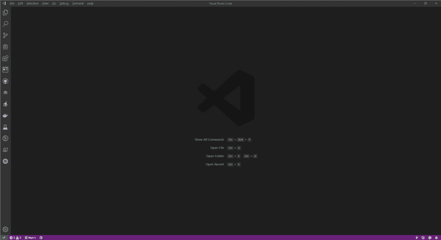](https://res.cloudinary.com/practicaldev/image/fetch/s--8X8rB33G--/c_limit%2Cf_auto%2Cfl_progressive%2Cq_auto%2Cw_880/https://cdn-images-1.medium.com/max/960/1%2As5i5PA6XT8TCN593JOy5AQ.png)

<figcaption>Visual Studio 代码</figcaption>

</figure>

以前在 Twitter 上看到过，在 Linux/Mac 环境下，似乎可以以全. NET Framework 为目标进行构建。

> 穆罕默德·雷汉·赛义德@ rehansaeeduk你现在可以瞄准并打造满。在官方支持下通过 Mono 在 Linux & Mac 上运行. NET Framework。添加此包:
> 
> <package reference Include = " Microsoft。net framework . reference assemblies " private assets = " All " Version = " 1 . 0 . 0-preview . 2 "/>
> 
> [# dot net](https://twitter.com/hashtag/dotnet)[# dot net](https://twitter.com/hashtag/dotnet)core
> 
> [github.com/Microsoft/dotn…](https://t.co/dKBKpsTUyU)2019 年 6 月 13 日下午 11 点[](https://twitter.com/intent/tweet?in_reply_to=1135172099499331584)[](https://twitter.com/intent/retweet?tweet_id=1135172099499331584)66

[。NET Framework 目标包 Nuget 包(预览版)](https://github.com/Microsoft/dotnet/tree/master/releases/reference-assemblies)

因为可以，所以在 Linux 机器上正常构建也没意思，所以这次想使用[visual studio code remote development (远程开发)](https://code.visualstudio.com/docs/remote/remote-overview)进行构建并验证

首先启动 VS Code，按下`F1`，发出命令。 像`rem ad`这样输入必要的最低限度的字符串就能找到搜索结果，非常方便。

<figure>[](https://res.cloudinary.com/practicaldev/image/fetch/s--8MNJxzUz--/c_limit%2Cf_auto%2Cfl_progressive%2Cq_auto%2Cw_880/https://cdn-images-1.medium.com/max/666/1%2AlBGmKFSgzCachLMogfDfAg.png)

<figcaption>通过输入所需最低限度的字符串来进行检索</figcaption>

</figure>

选择`C# (.NET Core Latest)`。

<figure>[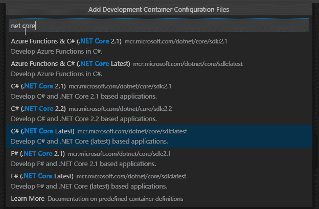](https://res.cloudinary.com/practicaldev/image/fetch/s--Wy89ioLO--/c_limit%2Cf_auto%2Cfl_progressive%2Cq_auto%2Cw_880/https://cdn-images-1.medium.com/max/624/1%2AEWbxnWoo_IQbu7So5i7b6Q.png) 

<figcaption>C#(。网核心最新)を選択</figcaption>

</figure>

选择`Reopen in Container`。

<figure>[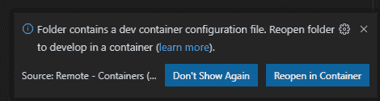](https://res.cloudinary.com/practicaldev/image/fetch/s--kzfxNDZK--/c_limit%2Cf_auto%2Cfl_progressive%2Cq_auto%2Cw_880/https://cdn-images-1.medium.com/max/470/1%2AJCi4NBxgO4B3h-6hesbPhg.png) 

<figcaption>重新打开集装箱中的を選択</figcaption>

</figure>

然后，打开了。

[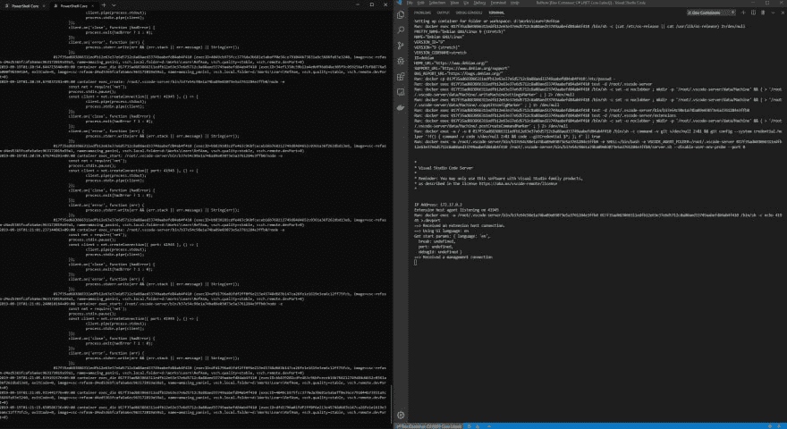](https://res.cloudinary.com/practicaldev/image/fetch/s--_h1QcQbT--/c_limit%2Cf_auto%2Cfl_progressive%2Cq_auto%2Cw_880/https://miro.medium.com/max/3096/1%2AT0wV1BrjBg4OiG16_-6EQw.png)
[(显示高分辨率图像)](https://miro.medium.com/max/3096/1*T0wV1BrjBg4OiG16_-6EQw.png)

左侧用[Windows Terminal](https://devblogs.microsoft.com/commandline/introducing-windows-terminal/) 实时显示`docker events`命令的结果。 右侧是准备进行 VS Code 远程开发的画面。

在 VS Code 的终端中输入`dotnet new console`以创建新的控制台 APP 应用程序。

<figure>[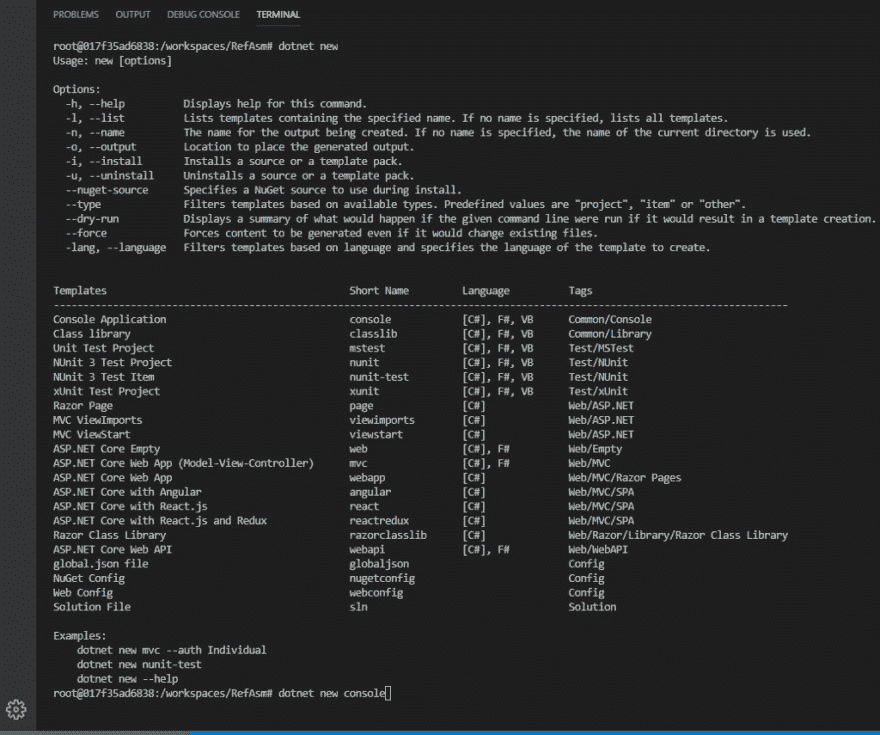](https://res.cloudinary.com/practicaldev/image/fetch/s--LchYOBFw--/c_limit%2Cf_auto%2Cfl_progressive%2Cq_auto%2Cw_880/https://cdn-images-1.medium.com/max/1024/1%2AEz-jEUAp5G0kx0Ms94i2FQ.png)

<figcaption>dotnet new console</figcaption>

</figure>

[(显示高分辨率图像)](https://miro.medium.com/max/1263/1*Ez-jEUAp5G0kx0Ms94i2FQ.png)

将生成项目文件，缺省情况下. csproj 文件的创建方式如下:

<figure>[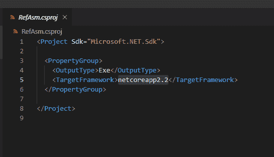](https://res.cloudinary.com/practicaldev/image/fetch/s--RMN0mU4s--/c_limit%2Cf_auto%2Cfl_progressive%2Cq_auto%2Cw_880/https://cdn-images-1.medium.com/max/545/1%2AD1-QC-box0tbK5HH9kF3vw.png)

<figcaption>生成的. csproj 文件</figcaption>

</figure>

删除`netcoreapp2.2`，改为`net48`。 `net48`是[. net 框架 4.8 的目标框架监视器( TFM )](https://docs.microsoft.com/en-us/dotnet/standard/frameworks#supported-target-framework-versions)。

用`dotnet build`命令构建后，出现了错误。

<figure>[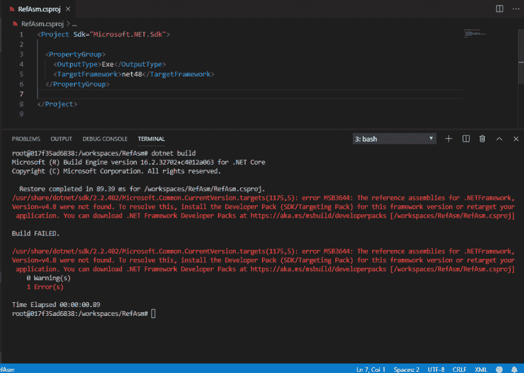](https://res.cloudinary.com/practicaldev/image/fetch/s--A--9q6r---/c_limit%2Cf_auto%2Cfl_progressive%2Cq_auto%2Cw_880/https://cdn-images-1.medium.com/max/1000/1%2AEE26QU-2KG-_dh8HjPdlDw.png)

<figcaption>用 dotnet build 构建</figcaption>

</figure>

[(显示高分辨率图像)](https://miro.medium.com/max/1215/1*EE26QU-2KG-_dh8HjPdlDw.png)

算了，错误是理所当然的。 因为无法在 Linux 环境中正常构建. NET Framework 项目。 需要**Microsoft.net framework reference assemblies**才能构建。 用`PackageReference`定义，再次尝试构建。

<figure>[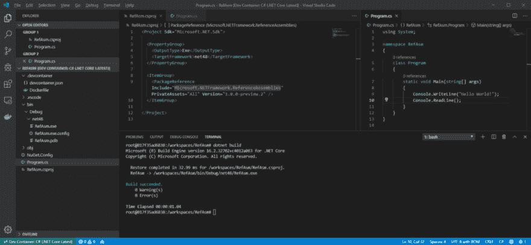](https://res.cloudinary.com/practicaldev/image/fetch/s--8meHFOIA--/c_limit%2Cf_auto%2Cfl_progressive%2Cq_auto%2Cw_880/https://cdn-images-1.medium.com/max/1024/1%2AysVshjgnJodoh87esvK_6w.png) 

<figcaption>Package reference added</figcaption>

</figure>

[(represented by high-resolution portrait)](https://miro.medium.com/max/1960/1*ysVshjgnJodoh87esvK_6w.png)

∞∞在以下情况下

正如宣传的那样，构建完成了呢！

. exe 文件已经生成！

[在 NuGet](https://www.nuget.org/packages/Microsoft.NETFramework.ReferenceAssemblies/1.0.0-preview.2) 网站上看看`Microsoft.NETFramework.ReferenceAssemblies`。

<figure>[](https://res.cloudinary.com/practicaldev/image/fetch/s--18E6cn9G--/c_limit%2Cf_auto%2Cfl_progressive%2Cq_auto%2Cw_880/https://cdn-images-1.medium.com/max/956/1%2AYZaGST72XhQHz3xRtxEm8Q.png) 

<figcaption>NuGet:微软。net framework . reference assemblies</figcaption>

</figure>

. NET Framework 4.8 自不必说，追溯到旧的. NET Framework 2.0 也支持吗？ ！ 这不是很厉害吗！ 也就是说面向传统系统，Microsoft 有很好的支持。

好的，下一个！ 尝试执行`dotnet run`。

<figure>[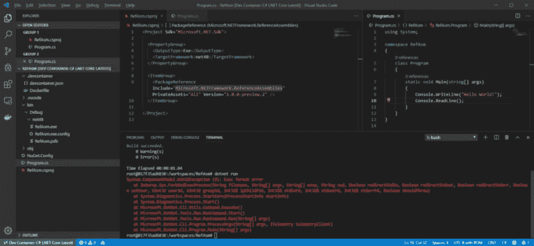](https://res.cloudinary.com/practicaldev/image/fetch/s--bM_5Qey1--/c_limit%2Cf_auto%2Cfl_progressive%2Cq_auto%2Cw_880/https://cdn-images-1.medium.com/max/1024/1%2AFGUmtDEnsnAD3QFnUYQiRQ.png)

<figcaption>dotnet run 错误</figcaption>

</figure>

[(显示高分辨率图像)](https://miro.medium.com/max/1960/1*FGUmtDEnsnAD3QFnUYQiRQ.png)

错误。 这也是理所当然的事情啊。

```
System.ComponentModel.Win32Exception (8): Exec format error
   at Interop.Sys.ForkAndExecProcess(String filename, String[] argv, String[] envp, String cwd, Boolean redirectStdin, Boolean redirectStdout, Boolean redirectStderr, Boolean setUser, UInt32 userId, UInt32 groupId, Int32& lpChildPid, Int32& stdinFd, Int32& stdoutFd, Int32& stderrFd, Boolean shouldThrow)
   at System.Diagnostics.Process.StartCore(ProcessStartInfo startInfo)
   at System.Diagnostics.Process.Start()
   at Microsoft.DotNet.Cli.Utils.Command.Execute()
   at Microsoft.DotNet.Tools.Run.RunCommand.Start()
   at Microsoft.DotNet.Tools.Run.RunCommand.Run(String[] args)
   at Microsoft.DotNet.Cli.Program.ProcessArgs(String[] args, ITelemetry telemetryClient)
   at Microsoft.DotNet.Cli.Program.Main(String[] args) 
```

`Win32Exception`发生了例外呢。

`dotnet run`是执行. net core APP 的命令，如果直接在 bash 中运行生成的. exe 文件会怎么样？

<figure>[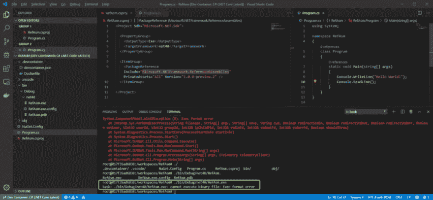](https://res.cloudinary.com/practicaldev/image/fetch/s--iz6Vvx5Z--/c_limit%2Cf_auto%2Cfl_progressive%2Cq_auto%2Cw_880/https://cdn-images-1.medium.com/max/1024/1%2AgphtjbIHgMQOVakYmMBH7g.png)

<figcaption>在 bash 中执行二进制的</figcaption>

</figure>

[(显示高分辨率图像)](https://miro.medium.com/max/1960/1*gphtjbIHgMQOVakYmMBH7g.png)

当然，不能直接在 Linux 上运行. exe 文件哦~！

那么，打开 windows 资源管理器。

<figure>[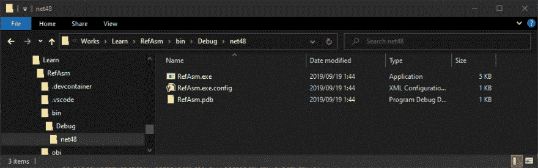](https://res.cloudinary.com/practicaldev/image/fetch/s--NnR_6qEa--/c_limit%2Cf_auto%2Cfl_progressive%2Cq_auto%2Cw_880/https://cdn-images-1.medium.com/max/976/1%2Afa32DsSmOcqTRojN2u3SxQ.png) 

<figcaption>视窗浏览器を開く</figcaption>

</figure>

从那里双击执行！

[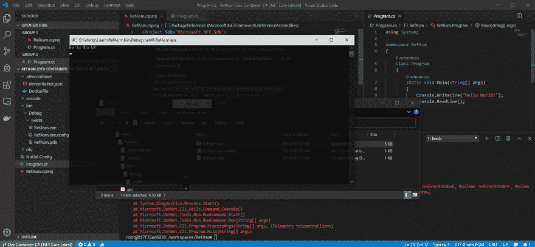](https://res.cloudinary.com/practicaldev/image/fetch/s--j0w5xhLJ--/c_limit%2Cf_auto%2Cfl_progressive%2Cq_auto%2Cw_880/https://miro.medium.com/max/1954/1%2AKWFhlFZgE5vEQa3tYxzG1g.png)
[(显示高分辨率图像)](https://miro.medium.com/max/1954/1*KWFhlFZgE5vEQa3tYxzG1g.png)

哦~~！

非常にシンプルなコンソールアプリの検証になりますが、 Linux 環境でビルドした .NET Framework .exe ファイルはちゃんと Windows で実行できたことをこれで証明されましたね！🎉🎉🎉

到目前为止已经初步达到了验证目标，但下次我想验证一下多目标。

我想修正`TargetFramework`，以多个. NET Framework 为对象构建。 按如下所示进行修改以构建。

```
<TargetFrameworks>net48;netcoreapp2.2</TargetFrameworks> 
```

⚠注:目标框架ではなく複数形目标框架 **s** (語尾に「s」)

<figure>[](https://res.cloudinary.com/practicaldev/image/fetch/s--2CKNYNWg--/c_limit%2Cf_auto%2Cfl_progressive%2Cq_auto%2Cw_880/https://cdn-images-1.medium.com/max/1024/1%2APD_DGG9iFHqQgIQJw7v1HQ.png)

<figcaption>多目标</figcaption>

</figure>

[(显示高分辨率图像)](https://miro.medium.com/max/1960/1*PD_DGG9iFHqQgIQJw7v1HQ.png)

これで .NET Framework 4.8 と .NET Core 2.2 それぞれのバイナリが出来上がりました！👏👏👏

[用 dnSpy](https://github.com/0xd4d/dnSpy) 来看看吧。

<figure>[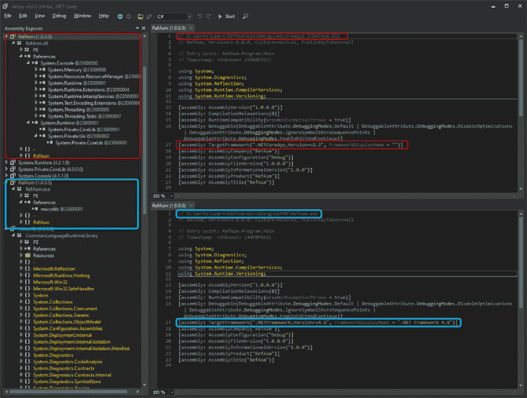](https://res.cloudinary.com/practicaldev/image/fetch/s--aD0xh1zO--/c_limit%2Cf_auto%2Cfl_progressive%2Cq_auto%2Cw_880/https://cdn-images-1.medium.com/max/1024/1%2AYOzayLn4JPA1TZTekueqUg.png)

<figcaption>用 dnSpy 确认</figcaption>

</figure>

[(显示高分辨率图像)](https://miro.medium.com/max/1636/1*YOzayLn4JPA1TZTekueqUg.png)

在 Linux 环境中运行. NET Core 2.2 的. dll 吧！

<figure>[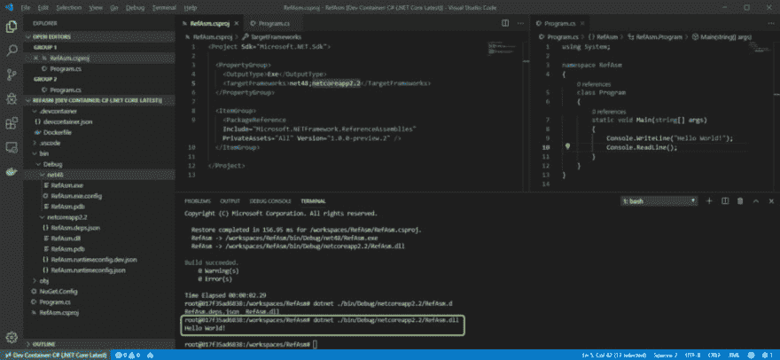](https://res.cloudinary.com/practicaldev/image/fetch/s--CVuO1w3F--/c_limit%2Cf_auto%2Cfl_progressive%2Cq_auto%2Cw_880/https://cdn-images-1.medium.com/max/1024/1%2AarTM_Ist5Af9SLgSjMNl2g.png)

<figcaption>在 bash 执行的</figcaption>

</figure>

[(显示高分辨率图像)](https://miro.medium.com/max/1960/1*arTM_Ist5Af9SLgSjMNl2g.png)

```
Hello World! 
```

做到了呢。

启动 windows 资源管理器。

<figure>[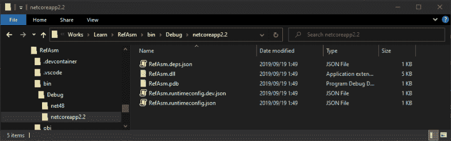](https://res.cloudinary.com/practicaldev/image/fetch/s--d444IpL7--/c_limit%2Cf_auto%2Cfl_progressive%2Cq_auto%2Cw_880/https://cdn-images-1.medium.com/max/976/1%2Aph6McURoiKTwfDmmMyJi-Q.png) 

<figcaption>Windows 资源管理器</figcaption>

</figure>

然后，在地址栏中点击`cmd`，

<figure>[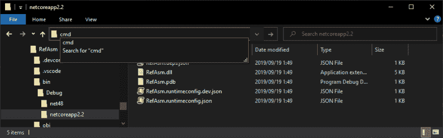](https://res.cloudinary.com/practicaldev/image/fetch/s--0z6k8g8g--/c_limit%2Cf_auto%2Cfl_progressive%2Cq_auto%2Cw_880/https://cdn-images-1.medium.com/max/976/1%2ASM9L1_668T6jFW3GdW63wQ.png) 

<figcaption>cmd</figcaption>

</figure>

按下 ENTER 键！ 现在，在 Explorer 中打开的目录被设置为当前目录，并启动 cmd。

执行与刚才相同的命令`dotnet RefAsm.dll`。

<figure>[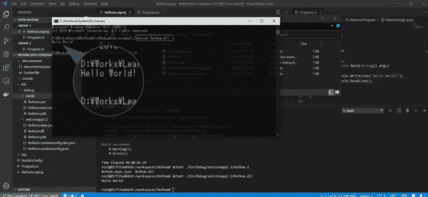](https://res.cloudinary.com/practicaldev/image/fetch/s--TYL_aaME--/c_limit%2Cf_auto%2Cfl_progressive%2Cq_auto%2Cw_880/https://cdn-images-1.medium.com/max/1024/1%2AoyERn0sZybZOPVXNmAQEIg.png)

<figcaption>Hello World！</figcaption>

</figure>

[(显示高分辨率图像)](https://miro.medium.com/max/1953/1*oyERn0sZybZOPVXNmAQEIg.png)

在 Windows 上也能运行啊！

没错，. NET Core 是[跨平台](https://docs.microsoft.com/ja-jp/dotnet/core/)