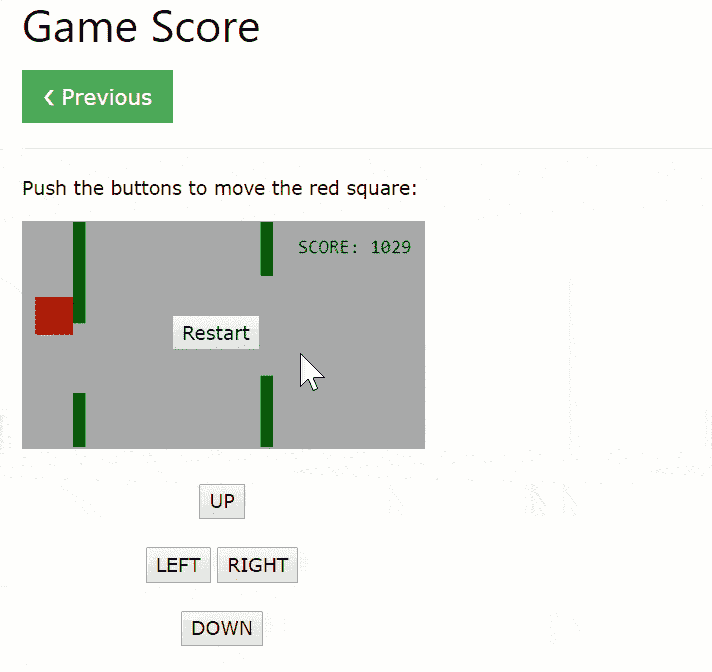
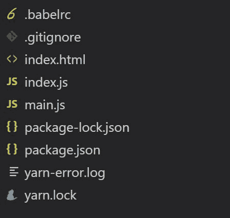

# 让我们用 Tensorflow.js 在 10 分钟内构建一个游戏🎮

> 原文：<https://dev.to/yashints/let-s-build-a-game-with-tensorflow-js-in-10-minutes-1co5>

我最近一直在玩 [Tensorflow.js](https://www.tensorflow.org/js) ，发现整个概念很吸引人。之前我写了一篇关于[如何开始](https://yashints.dev/blog/2018/11/27/get-started-with-tensorflowjs)的文章，我打算写更多关于创建一个新模型的所有方面，用它转移学习，或者只是使用预先训练的模型进行推理。

## 让我们回顾一下我们的计划🗺️

今天我们想:

*   找一个用 JavaScript 写的游戏
*   找到一个我们可以控制游戏的模型
*   将这两者混合在一起，享受乐趣🤪
*   不要抱怨我们刚刚写的代码破坏了乐趣😁

## 免责声明

我在这里没有展示任何关于 JavaScript 代码的最佳实践。它是从其他地方复制粘贴的，我们的目的是让它工作。

## 寻找游戏

当我为我关于人工智能和 JavaScript 的演讲[制作一个演示时，我做的第一件事就是搜索一个用 JavaScript 编写的游戏。我不想要一个复杂的游戏，只是一些轻量级的，可以很容易地定制。](https://www.youtube.com/watch?v=P1gBGT7R7jE)

你现在可以看我的演讲了👇🏼：

[https://www.youtube.com/embed/P1gBGT7R7jE](https://www.youtube.com/embed/P1gBGT7R7jE)

在谷歌搜索了一个`JavaScript game`后，我在 W3Schools 上找到了[这个游戏:](https://www.w3schools.com/graphics/game_score.asp)

[](https://res.cloudinary.com/practicaldev/image/fetch/s--yP482xOq--/c_limit%2Cf_auto%2Cfl_progressive%2Cq_66%2Cw_880/https://thepracticaldev.s3.amazonaws.com/i/2t06ff3tbtw6lhawpj1x.gif)

游戏很简单。你只需要在进来的绿色条之间引导红色立方体。如果它碰到任何绿色条，游戏就结束了。

## 寻找合适的模型

对于这个游戏，我能想到的最快的就是[语音命令](https://github.com/tensorflow/tfjs-models/tree/master/speech-commands)。该模型识别由简单单词组成的口头命令。现在它只有 18 个单词，但我们甚至不需要它，因为我们需要的只是方向(`up`、`down`、`left`和`right`)。

这个模型使用 [WebAudio API](https://developer.mozilla.org/en-US/docs/Web/API/Web_Audio_API) 通过你的麦克风听你的声音。

## 咱们码吧💻

首先，我们需要得到游戏背后的代码。值得庆幸的是，我们在同一个[页面上找到了游戏](https://www.w3schools.com/graphics/tryit.asp?filename=trygame_score)。

```
<html>
<head>
<meta name="viewport" content="width=device-width, initial-scale=1.0"/>
<style>
canvas {
    border:1px solid #d3d3d3;
    background-color: #f1f1f1;
}
</style>
</head>
<body onload="startGame()">
<script>

var myGamePiece;
var myObstacles = [];
var myScore;

function startGame() {
    myGamePiece = new component(30, 30, "red", 10, 120);
    myScore = new component("30px", "Consolas", "black", 280, 40, "text");
    myGameArea.start();
}

var myGameArea = {
    canvas : document.createElement("canvas"),
    start : function() {
        this.canvas.width = 480;
        this.canvas.height = 270;
        this.context = this.canvas.getContext("2d");
        document.body.insertBefore(this.canvas, document.body.childNodes[0]);
        this.frameNo = 0;
        this.interval = setInterval(updateGameArea, 20);
        },
    clear : function() {
        this.context.clearRect(0, 0, this.canvas.width, this.canvas.height);
    },
    stop : function() {
        clearInterval(this.interval);
    }
}

function component(width, height, color, x, y, type) {
    this.type = type;
    this.width = width;
    this.height = height;
    this.speedX = 0;
    this.speedY = 0;    
    this.x = x;
    this.y = y;    
    this.update = function() {
        ctx = myGameArea.context;
        if (this.type == "text") {
            ctx.font = this.width + "  " + this.height;
            ctx.fillStyle = color;
            ctx.fillText(this.text, this.x, this.y);
        } else {
            ctx.fillStyle = color;
            ctx.fillRect(this.x, this.y, this.width, this.height);
        }
    }
    this.newPos = function() {
        this.x += this.speedX;
        this.y += this.speedY;        
    }
    this.crashWith = function(otherobj) {
        var myleft = this.x;
        var myright = this.x + (this.width);
        var mytop = this.y;
        var mybottom = this.y + (this.height);
        var otherleft = otherobj.x;
        var otherright = otherobj.x + (otherobj.width);
        var othertop = otherobj.y;
        var otherbottom = otherobj.y + (otherobj.height);
        var crash = true;
        if ((mybottom < othertop) || (mytop > otherbottom) || (myright < otherleft) || (myleft > otherright)) {
            crash = false;
        }
        return crash;
    }
}

function updateGameArea() {
    var x, height, gap, minHeight, maxHeight, minGap, maxGap;
    for (i = 0; i < myObstacles.length; i += 1) {
        if (myGamePiece.crashWith(myObstacles[i])) {
            myGameArea.stop();
            return;
        } 
    }
    myGameArea.clear();
    myGameArea.frameNo += 1;
    if (myGameArea.frameNo == 1 || everyinterval(150)) {
        x = myGameArea.canvas.width;
        minHeight = 20;
        maxHeight = 200;
        height = Math.floor(Math.random()*(maxHeight-minHeight+1)+minHeight);
        minGap = 50;
        maxGap = 200;
        gap = Math.floor(Math.random()*(maxGap-minGap+1)+minGap);
        myObstacles.push(new component(10, height, "green", x, 0));
        myObstacles.push(new component(10, x - height - gap, "green", x, height + gap));
    }
    for (i = 0; i < myObstacles.length; i += 1) {
        myObstacles[i].speedX = -1;
        myObstacles[i].newPos();
        myObstacles[i].update();
    }
    myScore.text="SCORE: " + myGameArea.frameNo;
    myScore.update();
    myGamePiece.newPos();    
    myGamePiece.update();
}

function everyinterval(n) {
    if ((myGameArea.frameNo / n) % 1 == 0) {return true;}
    return false;
}

function moveup() {
    myGamePiece.speedY = -1; 
}

function movedown() {
    myGamePiece.speedY = 1; 
}

function moveleft() {
    myGamePiece.speedX = -1; 
}

function moveright() {
    myGamePiece.speedX = 1; 
}

function clearmove() {
    myGamePiece.speedX = 0; 
    myGamePiece.speedY = 0; 
}
</script>
<div style="text-align:center;width:480px;">
  <button onmousedown="moveup()" onmouseup="clearmove()" ontouchstart="moveup()">UP</button><br><br>
  <button onmousedown="moveleft()" onmouseup="clearmove()" ontouchstart="moveleft()">LEFT</button>
  <button onmousedown="moveright()" onmouseup="clearmove()" ontouchstart="moveright()">RIGHT</button><br><br>
  <button onmousedown="movedown()" onmouseup="clearmove()" ontouchstart="movedown()">DOWN</button>
</div>

<p>The score will count one point for each frame you manage to "stay alive".</p>
</body>
</html> 
```

<svg width="20px" height="20px" viewBox="0 0 24 24" class="highlight-action crayons-icon highlight-action--fullscreen-on"><title>Enter fullscreen mode</title></svg> <svg width="20px" height="20px" viewBox="0 0 24 24" class="highlight-action crayons-icon highlight-action--fullscreen-off"><title>Exit fullscreen mode</title></svg>

### 创建项目结构

现在，让我们设置项目结构。我们需要以下文件:

*   `package.json`
*   `index.html`
*   `game.js`
*   `index.js`

在我们的`package.json`中，我们将需要一些依赖项和一个脚本命令来运行应用程序。

```
{  ...  "dependencies":  {  "@tensorflow-models/speech-commands":  "^0.3.9",  "@tensorflow/tfjs":  "^1.2.8"  },  "scripts":  {  "watch":  "cross-env NODE_OPTIONS=--max_old_space_size=4096 NODE_ENV=development parcel index.html --no-hmr --open"  },  "devDependencies":  {  "@babel/core":  "^7.0.0-0",  "@babel/plugin-transform-runtime":  "^7.1.0",  "babel-core":  "^6.26.3",  "babel-polyfill":  "~6.26.0",  "babel-preset-env":  "~1.6.1",  "babel-preset-es2017":  "^6.24.1",  "clang-format":  "~1.2.2",  "cross-env":  "^5.2.0",  "eslint":  "^4.19.1",  "eslint-config-google":  "^0.9.1",  "parcel-bundler":  "~1.10.3"  },  ...  } 
```

<svg width="20px" height="20px" viewBox="0 0 24 24" class="highlight-action crayons-icon highlight-action--fullscreen-on"><title>Enter fullscreen mode</title></svg> <svg width="20px" height="20px" viewBox="0 0 24 24" class="highlight-action crayons-icon highlight-action--fullscreen-off"><title>Exit fullscreen mode</title></svg>

我在这里用的是包裹，因为它很容易安装，而且很好用。此外， [Tensorflow.js 模型 GitHub 资源库](https://github.com/tensorflow/tfjs-models)上的大部分演示都是使用 parcel。

您的项目结构应该是这样的:

[](https://res.cloudinary.com/practicaldev/image/fetch/s--ICyYXC4G--/c_limit%2Cf_auto%2Cfl_progressive%2Cq_auto%2Cw_880/https://thepracticaldev.s3.amazonaws.com/i/slboqeldmivtc8pgj5hc.jpg)

### 将游戏代码转换成模块

现在，我们不要太关注代码，因为我们需要做一些重构。首先，让我们将 JavaScript 代码分离到一个单独的文件中。这样，你的 HTML 应该看起来像:

```
<!DOCTYPE html>

<html class="no-js">
  <head>
    <meta charset="utf-8" />
    <meta http-equiv="X-UA-Compatible" content="IE=edge" />
    <title>TensorFlow.js Speech Commands Model Demo</title>
    <meta name="description" content="" />
    <meta name="viewport" content="width=device-width, initial-scale=1" />
    <style>
      canvas {
        border: 1px solid #d3d3d3;
        background-color: #f1f1f1;
      }
    </style>

  </head>
  <body>
    <script src="index.js"></script>
  </body>
</html> 
```

<svg width="20px" height="20px" viewBox="0 0 24 24" class="highlight-action crayons-icon highlight-action--fullscreen-on"><title>Enter fullscreen mode</title></svg> <svg width="20px" height="20px" viewBox="0 0 24 24" class="highlight-action crayons-icon highlight-action--fullscreen-off"><title>Exit fullscreen mode</title></svg>

因为我们要使用 **SpeechCommand** 模块，所以我们需要修改我们的 JavaScript 代码来支持它。创建一个名为`main.js`的文件，并将下面的代码粘贴到其中。

```
var myGamePiece;
var myObstacles = [];
var myScore;

export const startGame = function() {
    myGamePiece = new component(30, 30, "red", 10, 120);
    myScore = new component("30px", "Consolas", "black", 280, 40, "text");
    myGameArea.start();
}

var myGameArea = {
    canvas : document.createElement("canvas"),
    start : function() {
        this.canvas.width = 480;
        this.canvas.height = 270;
        this.context = this.canvas.getContext("2d");
        document.body.insertBefore(this.canvas, document.body.childNodes[0]);
        this.frameNo = 0;
        this.interval = setInterval(updateGameArea, 40);
        },
    clear : function() {
        this.context.clearRect(0, 0, this.canvas.width, this.canvas.height);
    },
    stop : function() {
        clearInterval(this.interval);
    }
}

function component(width, height, color, x, y, type) {
    this.type = type;
    this.width = width;
    this.height = height;
    this.speedX = 0;
    this.speedY = 0;    
    this.x = x;
    this.y = y;    
    this.update = function() {
        let ctx = myGameArea.context;
        if (this.type == "text") {
            ctx.font = this.width + "  " + this.height;
            ctx.fillStyle = color;
            ctx.fillText(this.text, this.x, this.y);
        } else {
            ctx.fillStyle = color;
            ctx.fillRect(this.x, this.y, this.width, this.height);
        }
    }
    this.newPos = function() {
        this.x += this.speedX;
        this.y += this.speedY;        
    }
    this.crashWith = function(otherobj) {
        let myleft = this.x;
        let myright = this.x + (this.width);
        let mytop = this.y;
        let mybottom = this.y + (this.height);
        let otherleft = otherobj.x;
        let otherright = otherobj.x + (otherobj.width);
        let othertop = otherobj.y;
        let otherbottom = otherobj.y + (otherobj.height);
        let crash = true;
        if ((mybottom < othertop) || (mytop > otherbottom) || (myright < otherleft) || (myleft > otherright)) {
            crash = false;
        }
        return crash;
    }
}

function updateGameArea() {
    let x, height, gap, minHeight, maxHeight, minGap, maxGap;
    for (let i = 0; i < myObstacles.length; i += 1) {
        if (myGamePiece.crashWith(myObstacles[i])) {
            myGameArea.stop();
            return;
        } 
    }
    myGameArea.clear();
    myGameArea.frameNo += 1;
    if (myGameArea.frameNo == 1 || everyinterval(180)) {
        x = myGameArea.canvas.width;
        minHeight = 20;
        maxHeight = 200;
        height = Math.floor(Math.random()*(maxHeight-minHeight+1)+minHeight);
        minGap = 50;
        maxGap = 200;
        gap = Math.floor(Math.random()*(maxGap-minGap+1)+minGap);
        myObstacles.push(new component(10, height, "green", x, 0));
        myObstacles.push(new component(10, x - height - gap, "green", x, height + gap));
    }
    for (let j = 0; j < myObstacles.length; j += 1) {
        myObstacles[j].speedX = -1;
        myObstacles[j].newPos();
        myObstacles[j].update();
    }
    myScore.text="SCORE: " + myGameArea.frameNo;
    myScore.update();
    myGamePiece.newPos();    
    myGamePiece.update();
}

export const everyinterval = function(n) {
    if ((myGameArea.frameNo / n) % 1 == 0) {return true;}
    return false;
}

export const moveup = function() {
    myGamePiece.speedY = -1; 
}

export const movedown = function() {
    myGamePiece.speedY = 1; 
}

export const moveleft = function() {
    myGamePiece.speedX = -1; 
}

export const moveright = function() {
    myGamePiece.speedX = 1; 
}

export const clearmove = function() {
    myGamePiece.speedX = 0; 
    myGamePiece.speedY = 0; 
} 
```

<svg width="20px" height="20px" viewBox="0 0 24 24" class="highlight-action crayons-icon highlight-action--fullscreen-on"><title>Enter fullscreen mode</title></svg> <svg width="20px" height="20px" viewBox="0 0 24 24" class="highlight-action crayons-icon highlight-action--fullscreen-off"><title>Exit fullscreen mode</title></svg>

我在这里所做的只是改变一些函数，使之保持不变，然后导出以后需要的函数。现在让我们编写我们的`index.js`并导入语音命令模型。

```
import * as speechCommands from "@tensorflow-models/speech-commands"; 
```

<svg width="20px" height="20px" viewBox="0 0 24 24" class="highlight-action crayons-icon highlight-action--fullscreen-on"><title>Enter fullscreen mode</title></svg> <svg width="20px" height="20px" viewBox="0 0 24 24" class="highlight-action crayons-icon highlight-action--fullscreen-off"><title>Exit fullscreen mode</title></svg>

接下来，导入我们玩游戏需要的函数:

```
import { startGame, moveup, movedown, clearmove } from './main'; 
```

<svg width="20px" height="20px" viewBox="0 0 24 24" class="highlight-action crayons-icon highlight-action--fullscreen-on"><title>Enter fullscreen mode</title></svg> <svg width="20px" height="20px" viewBox="0 0 24 24" class="highlight-action crayons-icon highlight-action--fullscreen-off"><title>Exit fullscreen mode</title></svg>

我不会用左和写，但是你也完全可以用它们。接下来，我们需要创建一个模型实例并初始化它。由于加载模型需要异步调用，我们将使用[life(立即调用的函数表达式)](https://en.wikipedia.org/wiki/Immediately-invoked_function_expression) :

```
const recognizer = speechCommands.create("BROWSER_FFT");

(async function() {
  await recognizer.ensureModelLoaded();

  console.log(recognizer.wordLabels());

  startGame();
})(); 
```

<svg width="20px" height="20px" viewBox="0 0 24 24" class="highlight-action crayons-icon highlight-action--fullscreen-on"><title>Enter fullscreen mode</title></svg> <svg width="20px" height="20px" viewBox="0 0 24 24" class="highlight-action crayons-icon highlight-action--fullscreen-off"><title>Exit fullscreen mode</title></svg>

一旦模型加载完毕，我们就开始游戏。最后，我们需要调用实例上的`listen`方法来监听命令:

```
const suppressionTimeMillis = 1000;
const allowedCommands = ['up', 'down'];

recognizer
  .listen(
    result => {
      checkPredictions(recognizer.wordLabels(), result.scores,
      2, suppressionTimeMillis);
    },
    {
      includeSpectrogram: true,
      suppressionTimeMillis,
      probabilityThreshold: 0.8
    }
  )
  .then(() => {
    console.log("Streaming recognition started.");
  })
  .catch(err => {
    console.log("ERROR: Failed to start streaming display: " + err.message);
  });

const checkPredictions = (
  candidateWords,
  probabilities,
  topK,
  timeToLiveMillis
) => {
  if (topK != null) {
    let wordsAndProbs = [];
    for (let i = 0; i < candidateWords.length; ++i) {
      wordsAndProbs.push([candidateWords[i], probabilities[i]]);
    }
    wordsAndProbs.sort((a, b) => b[1] - a[1]);
    wordsAndProbs = wordsAndProbs.slice(0, topK);
    candidateWords = wordsAndProbs.map(item => item[0]);
    probabilities = wordsAndProbs.map(item => item[1]);
    console.log(wordsAndProbs);
    // Highlight the top word.
    const topWord = wordsAndProbs[0][0];
    if(allowedCommands.includes(topWord)) {
      if(topWord === 'up') {
        moveup();
        setTimeout(() => clearmove(), 850);
        console.log('up');
      } else {
        movedown();
        setTimeout(() => clearmove(), 850);
        console.log('down');
      }
    }

  }
} 
```

<svg width="20px" height="20px" viewBox="0 0 24 24" class="highlight-action crayons-icon highlight-action--fullscreen-on"><title>Enter fullscreen mode</title></svg> <svg width="20px" height="20px" viewBox="0 0 24 24" class="highlight-action crayons-icon highlight-action--fullscreen-off"><title>Exit fullscreen mode</title></svg>

这将开始我们的游戏，并听取你的麦克风。如果您还没有获得使用麦克风的权限，您需要向您的浏览器授予权限。

Listen 方法返回一个包含结果对象的承诺。当我们得到结果时，我们将调用我们的小助手函数来检查哪些单词被识别为 fire，并基于此执行操作。

[点击这里查看现场演示](https://jsgame-speechcommand.netlify.com/)。

## 改进

如果你已经看过关于[语音命令报告](https://github.com/tensorflow/tfjs-models/tree/master/speech-commands)的文档，你可以看到当调用`speechCommands.create()`时，你可以指定加载的模型能够识别的词汇。这被指定为`speechCommands.create()`的第二个可选参数。我们可以利用这一点来限制词语的方向性:

```
const recognizer = speechCommands.create('BROWSER_FFT', 'directional4w'); 
```

<svg width="20px" height="20px" viewBox="0 0 24 24" class="highlight-action crayons-icon highlight-action--fullscreen-on"><title>Enter fullscreen mode</title></svg> <svg width="20px" height="20px" viewBox="0 0 24 24" class="highlight-action crayons-icon highlight-action--fullscreen-off"><title>Exit fullscreen mode</title></svg>

现在如果你尝试这个模型，它会更准确，因为它只关注方向词(`up`、`down`、`left`和`right`)。

## 总结

就是这样。这就是你所需要做的，用你的声音和`Tensorflow.js` **语音命令**模式来控制这个迷你游戏。

现在去用那些预先训练好的模型创建一些有趣的东西，并确保检查它们的范例库。

更多令人振奋的演示，请看由[阿西姆·侯赛因](https://twitter.com/jawache)、[埃莉诺·哈普洛夫](https://twitter.com/EleanorHaproff)和[奥萨马·詹达利](https://twitter.com/osama_jandali)建造的 aijs.rocks 。