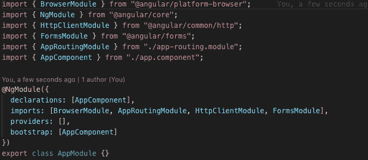
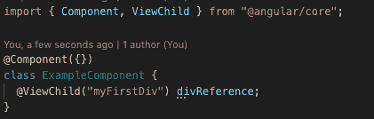
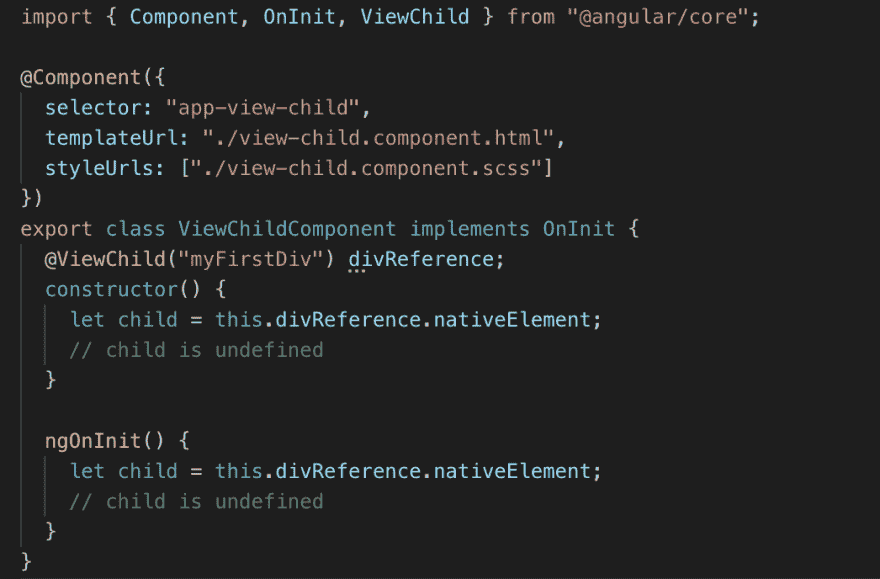
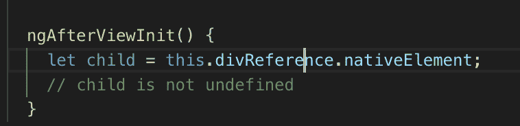
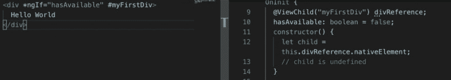
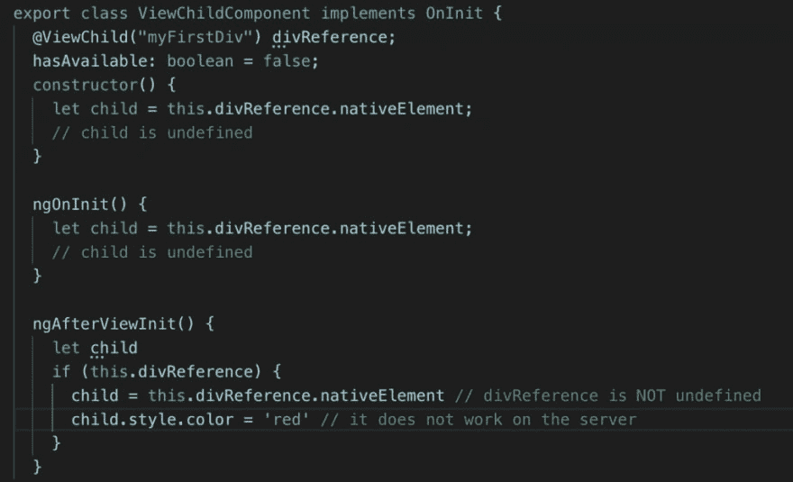
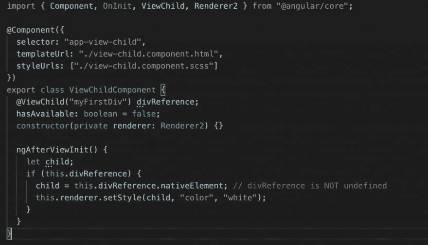
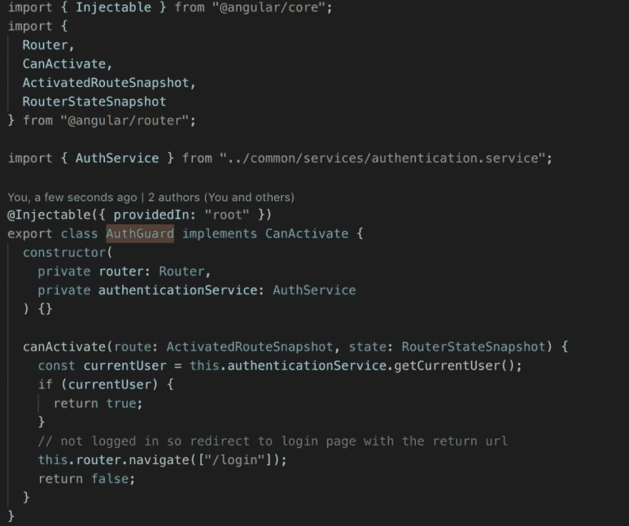
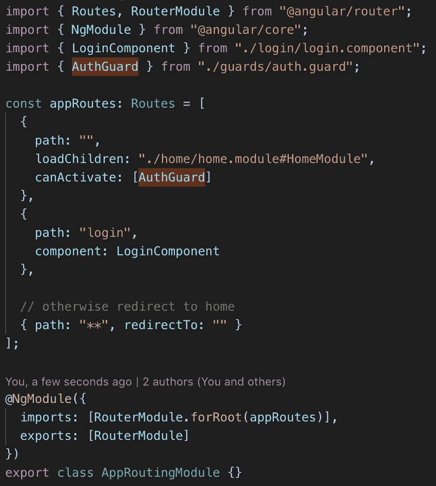
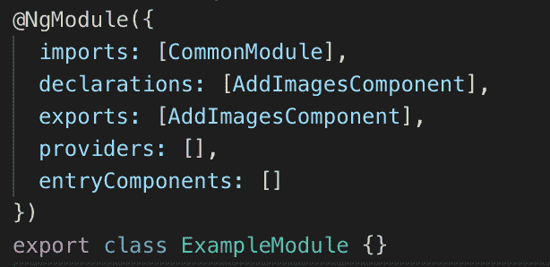

# 为什么你的 Angular 应用程序不起作用:7 个常见错误

> 原文:[https://dev . to/valeriopisapia/why-your-angular-app-is-not-work-7-common-errors-2ba 1](https://dev.to/valeriopisapia/why-your-angular-app-is-not-working-7-common-mistakes-2ba1)

解决您的角度应用问题可能是一个真正的挑战。当我们的应用程序不工作，并且它返回给我们的只是控制台中的一些“关键”红线时，这一切都变得更加困难。

但是相信我，到最后，不会那么痛苦。你要做的就是避免一些几乎所有 Angular 开发者都要面对并至少犯过一次的常见错误。

阅读这篇文章将分析 7 个最常见的错误*，你的开发可能会少一些问题:)。*

 *我会为每一点解释为什么它是一个不好的实践或者仅仅是一个错误，我会用至少一个可能的解决方案指引你正确的方向。

# [](#1-import-the-required-angular-modules)1。导入所需的角度模块

初学者最常见的错误是不导入所需的模块。为什么？因为你对框架了解不够。

全面了解 Angular 需要一些时间。

错误可能是这样的:

```
Can't bind to 'ngModel' since it isn't a known property of 'input' 
```

此错误表明角形模块没有导入到我们的模块中。

而如果我们得到以下错误:

```
Unhandled Promise rejection: No provider for HttpClient! 
```

这意味着 HttpClient 模块没有导入到我们的根模块中。

解决方案很简单:我们需要在主模块中导入缺失的模块。在大多数情况下，这些模块将需要导入到您的应用程序的 AppModule 中。

[T2】](https://res.cloudinary.com/practicaldev/image/fetch/s--KAqeXNcH--/c_limit%2Cf_auto%2Cfl_progressive%2Cq_auto%2Cw_880/https://thepracticaldev.s3.amazonaws.com/i/fkkwqe9v3kipclt74f0w.png)

注意:为了避免应用程序的规模显著增长，我们必须只导入必要的模块。这个最佳实践不仅适用于框架模块，也适用于您想要使用的每个定制模块。

让我们以角度素材库为例:使用 Sidenav 模块有一个特殊的 MatSidenav 模块等等。

因此，根据我们模块的需要，我们可能会也可能不会导入某些模块:

```
...
MatSidenavModule
MatCheckboxModule
... 
```

# [](#2-do-not-use-dom-references-for-items-that-do-not-yet-exist-viewchild)2。不要对尚不存在的项目使用 DOM 引用(@ViewChild)

在@ViewChild decorator 的帮助下，Angular 使得引用组件的特定子元素(节点或 HTML 组件)变得非常容易。

只需在名称后加上#即可。例如:

```
<div #myFirstDiv></div> 
```

我们现在可以从组件中引用该元素。如果它是一个组件，我们可以调用它的公共方法并访问它的属性。如果它是一个简单的 HTML 元素，我们可以改变它的样式、属性或子元素。

如果我们用@ViewChild 装饰器来装饰这个属性，Angular 会自动将引用分配给组件的一个属性。

让我们确保将引用名传递给装饰者。比如@ViewChild ('myFirstDiv ')。

[T2】](https://res.cloudinary.com/practicaldev/image/fetch/s--YV_BxktF--/c_limit%2Cf_auto%2Cfl_progressive%2Cq_auto%2Cw_880/https://thepracticaldev.s3.amazonaws.com/i/kmogjzmw3hlvkbqnu87n.png)

@ViewChild 指令非常有用，但是我们必须注意引用的元素确实存在。

问题出现了:为什么它不应该存在？

引用的项目实际上不存在有几个原因。最常见的原因是浏览器还没有完成上传，因此这个元素没有添加到 DOM 中。

显然，如果您试图在这个阶段访问这个元素，它将是未定义的或空的。

不存在 DOM 访问的一个例子是在 ngOnInit 生命周期回调中的组件构造函数中。

让我们看一个例子:

[T2】](https://res.cloudinary.com/practicaldev/image/fetch/s--4LdB4wxM--/c_limit%2Cf_auto%2Cfl_progressive%2Cq_auto%2Cw_880/https://thepracticaldev.s3.amazonaws.com/i/z98kx3btdr5jssw4neby.png)

解
还记得 DOMContentLoader 事件或者超级经典的 jQuery 回调$(document)吗？ready()？！这里 Angular 使用的机制是相同的:ngAfterViewInit。

正在讨论的回调是角度生命周期挂钩的一部分。ngAfterViewInit 是一个回调函数，当所有组件和子视图都被初始化时调用。

回到前面的例子，我们可以这样修改代码:

[T2】](https://res.cloudinary.com/practicaldev/image/fetch/s--k6Gxs7jE--/c_limit%2Cf_auto%2Cfl_progressive%2Cq_auto%2Cw_880/https://thepracticaldev.s3.amazonaws.com/i/zk64alkq5rf36e13vdoe.png)

太好了！我们解决了我们的问题。但是请注意，还有其他陷阱需要考虑。

正如我们之前说过的，当实际添加元素时，我们可以访问 DOM 中的元素。

如果我们有这样一个场景:

带有*ngIf 指令的元素将从 DOM 中完全删除。

所以在这种情况下我们无法访问它。

为了防止我们的应用程序崩溃，我们实际上需要检查我们的引用是否为空。实际上，我们的代码变成了:

[T2】](https://res.cloudinary.com/practicaldev/image/fetch/s--XXMUScV9--/c_limit%2Cf_auto%2Cfl_progressive%2Cq_auto%2Cw_880/https://thepracticaldev.s3.amazonaws.com/i/039viu3x5imuzo2c2ujn.png)

# [](#3-dont-manipulate-the-dom-directly)3。不要直接操作 DOM

注意:在 Angular 中直接操作 DOM 并不是一个坏习惯。

也许我们的应用程序可以在浏览器上正常工作，但在 Angular Universal 等不同的环境中，这可能不会发生。总之 Angular Universal 允许你在服务器端渲染我们的 Angular 应用。

让我们看一个例子:

[T2】](https://res.cloudinary.com/practicaldev/image/fetch/s--1TpfLb8w--/c_limit%2Cf_auto%2Cfl_progressive%2Cq_auto%2Cw_880/https://thepracticaldev.s3.amazonaws.com/i/yewf8yxb5p57mmwqaui7.png)

解决方案
Angular 提供了一个操作 DOM: Renderer2 的专用 API。在这个 API 的帮助下，我们可以做任何我们习惯于使用 DOM 的事情。

这里有一个清晰的例子:

[T2】](https://res.cloudinary.com/practicaldev/image/fetch/s--eyxZJGs3--/c_limit%2Cf_auto%2Cfl_progressive%2Cq_auto%2Cw_880/https://thepracticaldev.s3.amazonaws.com/i/ap0ooqwu7iivycl4z343.png)

如前所述，我们真的可以做任何事情，因此，我建议你看看官方文档。

# [](#4-angular-guards-are-not-a-real-security-feature)4。棱角分明的防护装置不是(真正的)安全特征

角警卫是一个伟大的方式来人为地限制进入某些路线。

典型的例子是禁止在不登录的情况下访问某些页面。

[T2】](https://res.cloudinary.com/practicaldev/image/fetch/s--wurNAtdY--/c_limit%2Cf_auto%2Cfl_progressive%2Cq_auto%2Cw_880/https://thepracticaldev.s3.amazonaws.com/i/3thmr93bbpb4a34pkunx.png)

[T2】](https://res.cloudinary.com/practicaldev/image/fetch/s--QETPvA4A--/c_limit%2Cf_auto%2Cfl_progressive%2Cq_auto%2Cw_880/https://thepracticaldev.s3.amazonaws.com/i/iqcug7m9lqq28e4ossfq.png)

问题
这仍然是“禁止”访问某些路线的有效解决方案，但像任何其他“网络”解决方案一样，它不是 100%安全的。

因为我们向潜在的“危险”用户提供完整的源代码，所以可以以任何方式修改应用程序。这意味着我们的防范可以很容易地通过注释几行来规避。

解决方案
添加一个服务器端解决方案可以降低应用程序中数据被入侵的风险。使用 JWT (JSON Web 令牌)就是一个例子。

# [](#5-declare-components-only-once)5。仅声明组件一次

当我们开始将我们的应用程序分组到模块中时，这基本上是一种最佳实践，您可能会遇到一个非常常见的问题:

一个组件只能在一个模块中声明！

但是如果我们想在多个模块中使用我们的组件，我们该怎么做呢？

解决方案很简单:只需在一个模块中添加你的组件。

可能一个模块接一个组件有点过分，那么为什么不创建一个组件模块呢？该模块可以导入到其他模块中，您可以在那里使用您的组件。

[T2】](https://res.cloudinary.com/practicaldev/image/fetch/s--5jtuP24b--/c_limit%2Cf_auto%2Cfl_progressive%2Cq_auto%2Cw_880/https://thepracticaldev.s3.amazonaws.com/i/cck0xolu86153ro6ri3a.png)

# [](#6-optimize-and-speed-up-your-app-using-ngif-instead-of-the-hidden-attribute)6。使用 Ngif 而不是[Hidden]属性来优化和加速你的应用

hidden 指令和*ngIf 指令的使用经常混淆。

主要的区别是*ngIf 指令不是只隐藏被标记的元素(实际上是产生隐藏指令的元素)，而是将它们从 DOM 中移除。除了在性能方面可能的改进之外，*ngif 解决方案看起来更干净。

所以我推荐它作为这些场景的标准。

# [](#7-use-the-service-to-avoid-maintainability-problems)7。使用服务来避免可维护性问题

注意:作为一般建议，将业务逻辑外推到服务中总是好的做法。

这样，它更容易管理，因为可能的修改可以在几秒钟内实现，并且将被很好地本地化，我们不应该疯狂地修改 n-千行代码。

当使用 HttpClient 时，这个建议当然是正确的。它应该始终包含在一个集中的服务中。这样，它很容易测试，也很容易进行修改。

例如，在更新之后，您的后端需要一个新的头传递给每个请求。如果没有集中的服务，你应该在你的应用程序中修改多行代码。

我希望这篇文章是有用的。如果是这样，与你的朋友、同事或任何你认为可能感兴趣的人分享。*