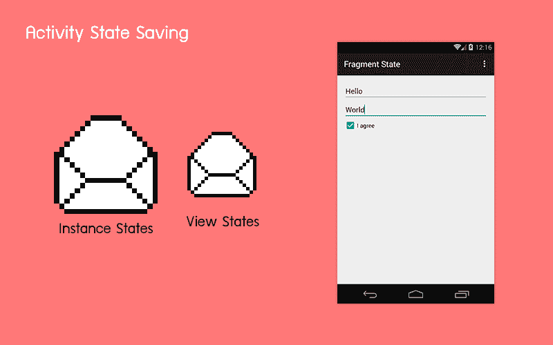

# 如何使用保存实例状态来保存一个 Android 活动状态？

> 原文:[https://dev . to/Amy acker 16/how-to-save-an-Android-activity-state-using-save-instance-state-2 hap](https://dev.to/amyacker16/how-to-save-an-android-activity-state-using-save-instance-state-2hap)

保存和恢复活动 UI 状态是用户体验的重要部分。在这种情况下，客户端希望 UI 状态像以前一样继续，但是，框架会销毁动作和其中存在的任何状态。您可能已经在测试过程中看到，屏幕旋转会重置从客户端收集的所有信息。当用户错误地按下后退按钮时，情况也是如此。屏幕旋转是 Android 生命周期的众多变化之一，可以破坏和重置活动，并导致所有信息丢失。绝对不是非凡的用户体验！

为了保存和恢复 UI 状态，我为此重写了两个最常见的方法:

[T2】](https://res.cloudinary.com/practicaldev/image/fetch/s--zbL9xcbQ--/c_limit%2Cf_auto%2Cfl_progressive%2Cq_66%2Cw_880/https://thepracticaldev.s3.amazonaws.com/i/e53c4qng9ystfjk8jlml.gif)

## onSaveInstanceState():

为了保存 UI 的状态，我覆盖了 onSaveInstanceState(Bundle savedInstanceState)并将 UI 的所有数据保存在 savedInstanceState Bundle 中。

**这个方法在旧版本的 Android(直到 android 8.0)中在 onStop()之前被调用，对于新版本可以在 onStop()之后被调用。**

@ Override
public void onSaveInstanceState(Bundle savedInstanceState){
super . onSaveInstanceState(savedInstanceState)；
//将 UI 状态更改保存到 savedInstanceState。
//如果进程被
//杀死并重启，这个包将被传递给 onCreate。
savedinstancestate . put boolean(" StringKeyForBoolean "，false)；
savedinstancestate . put double(" StringKeyForDouble "，3.4)；
savedinstancestate . putint(" StringKeyForInteger "，5)；
savedinstancestate . putstring(" string key "，" folio 3/blog ")；
//等。
}

该包本质上是一种存储 NVP(“名称-值对”)映射的方式，它将被传递到 onRestoreInstanceState()，然后您将在其中提取值，如下所示:

[T2】](https://res.cloudinary.com/practicaldev/image/fetch/s--hC8J_9Et--/c_limit%2Cf_auto%2Cfl_progressive%2Cq_66%2Cw_880/https://thepracticaldev.s3.amazonaws.com/i/o2lmdux3ts6c4laekwc1.gif)

**这个方法在 onStart()之后被调用。**

@ Override
public void onRestoreInstanceState(Bundle savedInstanceState){
super . onsaveinstancestate(savedInstanceState)；
//使用 savedInstanceState 恢复 UI 状态。

var 1 = savedinstancestate . get boolean(" string keyforboline "，false)；
var 2 = savedinstancestat . getdouble(" string keyforouble ")；
var 3 = savedinstancestat . getint(" string keyforinteger ")；
var 4 = savedinstancestat . getstring(" string key ")；

}

使用这种方法，您可以保存所有状态和其他数据变量，这些数据变量可能会在屏幕旋转或当前活动进入后台时丢失。保存和恢复 UI 的状态在 [android 应用开发](https://www.folio3.com/mobile/android-app-development/)中是一个很好的实践。
注意:第一次创建活动时，保存实例状态包中没有数据。

如果您计划推出一款应用，请查看本指南。