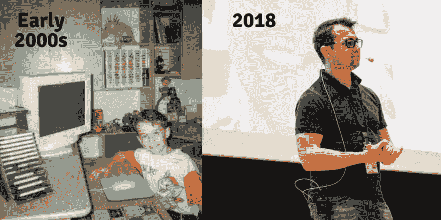

# 你在软件开发方面有什么故事？🐱‍💻

> 原文:[https://dev . to/bartosz _ io/what ' s-what ' s-your ' s story-with software-development-1l0j](https://dev.to/bartosz_io/what-is-your-story-with-software-development-1l0j)

你在软件开发方面有什么故事？
什么时候开始的？你是怎么学会的？我很想听听你的旅程😃

说到我，一切都要追溯到 2000 年初😱父母买了一台电脑，我第一天就迷上了！
我就是停不下来我的激情！在我发现 Turbo Pascal 和 Delphi 之前，我从创建简单的 HTML 页面开始！然后我进入了“严肃”编程(如果你是 14 岁，编程有多严肃🤣)你可以在下面的照片上看到我。几年后(实际上是很多年后，我现在 28 岁了)，我去了一所大学，获得了计算机科学硕士学位。

在 IT 行业工作了几年后，我有幸在世界各地的顶级国际会议上发言(如 JSConf、AngularUP 或 NgColombia)。生活是多么出人意料😉。现在，我正在管理 Angular-Academy.com，在更高的层面上分享知识，这让我非常激动。学院里有来自各大洲的人！

现在，轮到你了。你的软件开发经历是怎样的？我很想听到你的声音🤗

[T2】](https://res.cloudinary.com/practicaldev/image/fetch/s--vifQnsx9--/c_limit%2Cf_auto%2Cfl_progressive%2Cq_auto%2Cw_880/https://thepracticaldev.s3.amazonaws.com/i/fwovm8wdyh86nluanzb7.jpg)