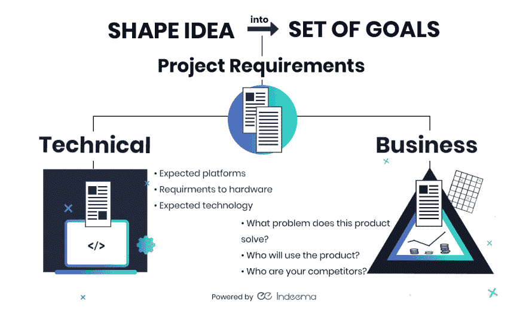
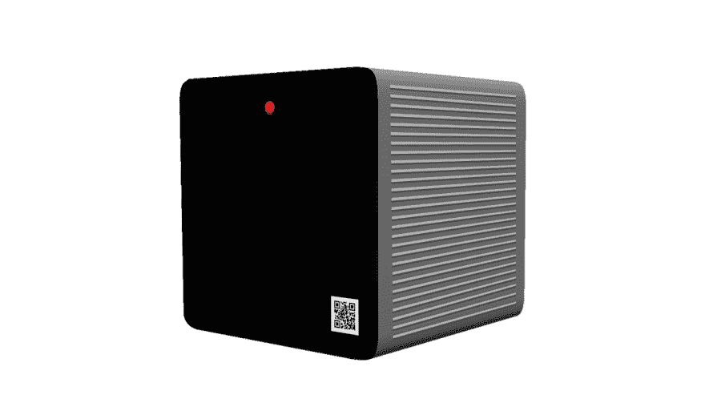
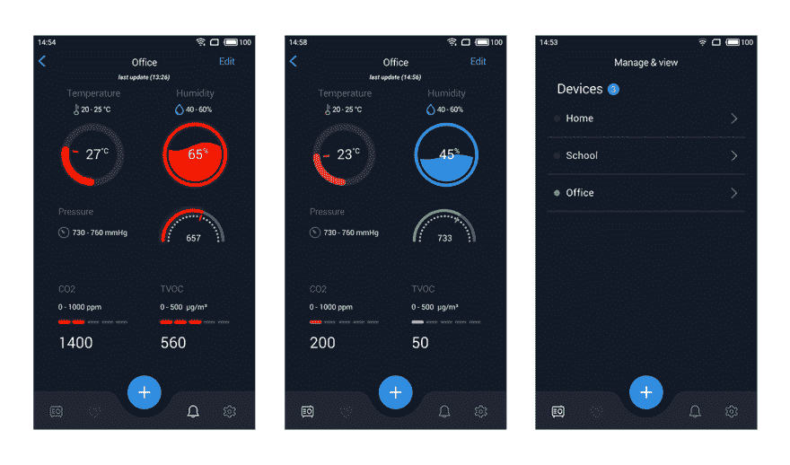
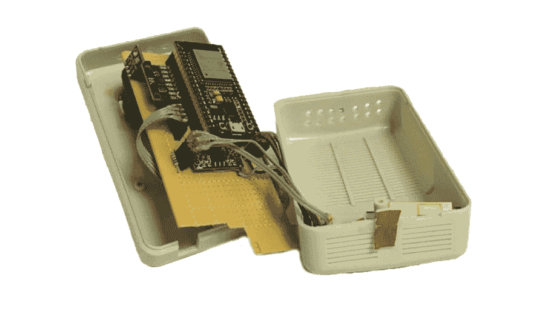
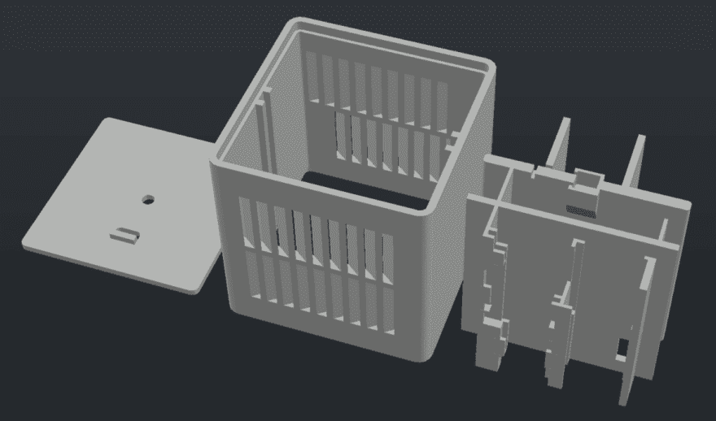
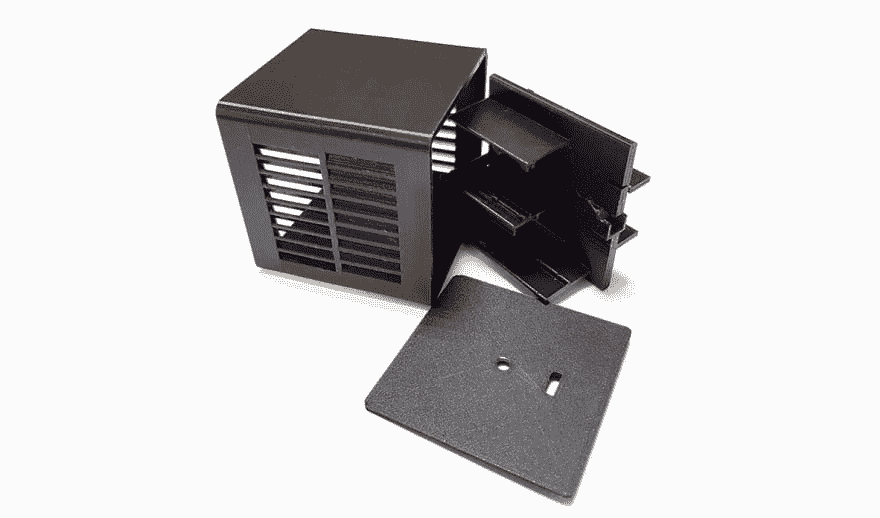

# 如何创建物联网初创企业:分步指南

> 原文:[https://dev . to/indeem software/how-to-create-IOT-startup-step-by-step-guide-PHA](https://dev.to/indeemasoftware/how-to-create-iot-startup-step-by-step-guide-pha)

这一次，我们将通过一步一步的教程来深入了解物联网开发的跌宕起伏。现实生活中的例子，没有理论上的“可能”，包括大量的经验。快速参考相关文章作为奖励。

原文[如何创建一个创业公司:物联网项目从创意到生产](https://indeema.com/blog/how-to-create-a-startup--iot-project-from-idea-to-production)

概述:

* * *

1.  将想法形成一系列目标
2.  寻找潜在用户
3.  查找开发团队
4.  准备技术规范
5.  设计产品
6.  创建一个原型
7.  开始软件开发
8.  创建 3D 模型
9.  开始 beta 测试
10.  推出 MVP
11.  开始生产

## 出发前

现在正是[工业革命#4](https://indeema.com/blog/4th-industrial-revolution) 的时候，你不应该错过这个机会。参加这一浪潮的正确方式是什么？由于我们已经写了一篇关于[将想法变成实际产品的基础文章](https://indeema.com/blog/from-idea-to-success)，这次我们决定写一篇指南，你可以用它来实现每一步的结果，并彻底了解这个过程。那么，让我们开始吧！

## 将想法塑造成一套目标

首先，你应该清楚地理解和定义你的目标，并在任何发展之前把它分成子目标。\
您的项目需求应该包括以下信息:

1.  你最完美的最终产品是什么？ \尽可能详细的描述。你打算用这个产品达到什么目的？在这个阶段，写下所有可以应用的东西，你会在以后多次更新和完善这个文档。
2.  **主要特点是什么？** \写下人们想使用你的产品的主要原因。为什么此功能是成功的必要条件？
3.  你的第一个产品版本是什么？ \计划最低可行产品(MVP)将包括哪些内容，以便您可以开始销售并收集反馈。

请记住，您的项目需求应该包含系统的技术和业务相关部分。终端用户将在哪里、为什么以及如何使用你的产品？定义清晰和充分的项目需求是至关重要的，因为要向团队解释他们应该创建什么以及为什么要创建。否则，[你就有可能在截止日期前失败。](https://indeema.com/blog/the-top-5-reasons-you-re-failing-to-meet-your-project-deadline)

参见我们的[项目描述模板](https://docs.google.com/document/d/1p8ZQQ0RyAMrBkGTnI0UQZ2NiU09WgCPfdQ6HK1fWu74/edit?usp=sharing)以供参考。虽然为所有类型的项目创建独特的模板肯定是不可能的，但我们希望我们在文章中给出的示例对您有用。

为了更好地了解物联网开发的细节，请查看我们的文章，其中有对现有解决方案和细微差别的简短概述。

[T2】](https://res.cloudinary.com/practicaldev/image/fetch/s--93-bbFdj--/c_limit%2Cf_auto%2Cfl_progressive%2Cq_auto%2Cw_880/https://indeema.cimg/articles/How-to-create-a-startup-IoT-project-from-idea-to-production/infographics.png)

## 第一步

在您的项目描述准备好之后，您可以与您的团队共享它并讨论所有细节。如果您发现合理的反馈，请更新文档。

### 寻找潜在用户

如果你在开始开发之前就有潜在的客户，这意味着你的系统是有需求的。此外，当系统的初始版本准备好时，您可以开始 beta 测试。此外，早期客户会帮助你从一开始就进行销售。\
尽管如此，你可以在开发过程中寻找潜在客户。

### 寻找开发团队

以下是最常见的方法:

1.  外包开发\如果你认为外包不会给你带来成功，看看 15 家将成功归功于外包开发的创业公司。
2.  既然你正在阅读这篇文章，最简单的方法就是[联系我们](https://indeema.com/contact-us)。
3.  问问你的朋友或者谷歌一下专业物联网开发公司。

在这种情况下，在面试和谈判之前，请阅读[如何了解外包团队是否向你要价过高。](https://indeema.com/blog/how-to-know-your-outsourcing-team-isn-t-overcharging-you) \
**结论:**专业的外包团队为您节省时间和成本，并提供客观有用的反馈。混乱的团队将使你一事无成。

[T2】](https://calc.indeema.com/)

2.召集你自己的团队

这种替代方案看起来很不错，但是要注意陷阱:

*   聚集成熟的团队需要时间(和办公空间)。
*   你需要为每个成员缴税，请病假，休假。
*   你需要不断地激励他们，计划和监督他们的工作，或者为此雇佣更多的员工。

结论:你发展业务的时间会少得多。但是你会有一个内部团队。

### 准备技术规格

找到实施技术部分的团队后，开始制定技术项目规范。项目描述解释了你的产品是什么。现在你必须认真考虑“如何做”。

不要低估这种文件的价值。虽然这看起来像是在浪费时间(事实并非如此)，但从长远来看，它为你节省了时间、金钱和精力。特别是，你会注意到你没有定义诸如交互、每个页面的内容等等。，以及实现它们需要什么工具。

仔细检查文件，确保没有遗漏任何东西。从一开始就定义范围，然后在过程中进行更改，这样会更便宜、更快。然而，在准备好设计之后，规范可能会进一步更新(没关系，它将使预算和时间表更加明确)。\
您可以在这里找到项目技术说明模板- [项目技术说明模板](https://docs.google.com/document/d/1GE67-Za_T6owHwQDzfVXkvZ8YCe2wSWhxqf0ZFPpsew/edit?usp=sharing)

## 设计产品

所以现在，当你完全理解你的产品需要做什么的时候，想象一下。考虑预期用途和技术细节，设计您的硬件和应用程序，并将它们包含在项目描述和规格中。

设计也会揭示很多你在描述时遗漏的东西。这样你的预算会越来越好。我们已经深入了解了物联网项目工程的预算示例，您可以在此处查看- [创建物联网解决方案需要多少成本？](https://indeema.com/blog/how-much-does-it-cost-to-create-iot-solution)

回到设计轨道，这里有一个可视化:

### 硬件设计

设备设计很重要，因为它回答了以下问题:

商业:

*   消费者会觉得它很吸引人，想买下来放在家里/办公室或作为礼物吗？
*   什么样的颜色、形状和整体外观才能吸引人？
*   如何让制作变得简单又划算？

技术:

*   在尺寸、形状、材料方面会有什么限制吗？
*   它在预期环境中是否耐用和可用？
*   所有需要的机械零件都适合这个装置吗？

[T2】](https://res.cloudinary.com/practicaldev/image/fetch/s---mL7QSe---/c_limit%2Cf_auto%2Cfl_progressive%2Cq_auto%2Cw_880/https://indeema.cimg/articles/How-to-create-a-startup-IoT-project-from-idea-to-production/b5.png)

### 软件设计

你的软件的设计，无论是移动的，网络的，还是桌面的应用，实际上定义了用户将如何看待你的产品。尽可能使它易于使用和直观(即使它背后的功能非常复杂)。下面是我们的例子:

[T2】](https://res.cloudinary.com/practicaldev/image/fetch/s--ncgE5PuC--/c_limit%2Cf_auto%2Cfl_progressive%2Cq_auto%2Cw_880/https://indeema.cimg/articles/How-to-create-a-startup-IoT-project-from-idea-to-production/b6.png)

## 原型和测试概念

太棒了，有了设计，你和你的团队都有了产品外观的愿景，这是最重要的事情之一。然而，你可能还没有完全理解流程:用户如何与你的产品的软件和硬件部分交互。

为了在开发和生产之前识别任何不便/冗余，最好花一点时间创建一个原型。\
对于应用原型，您可以使用:

*   [https://invisionapp.com](https://www.invisionapp.com/)和[https://marvelapp.com/](https://marvelapp.com/)
*   请在这里检查我们的样品[。](https://projects.invisionapp.com/share/R2OQ3733A9B#/screens/327098547_Sign_Up_Empty)
*   [https://www.adobe.com/products/xd.html](https://www.adobe.com/products/xd.html)\测试应用程序 UX 的最佳工具之一。

对于硬件原型，创建包含基本功能的草图设备，并证明您的想法的可行性。尺寸、重量和外观现在都不重要了，因为你只探索功能。您现在的主要目标是验证系统从传感器读取数据，并将其加载到 MQTT broker(或您正在使用的任何其他物联网数据传输协议，如 WebSocket、HTTP REST 或 CoAP)。这是我们原型的一个例子:

[T2】](https://res.cloudinary.com/practicaldev/image/fetch/s--suxW6xU7--/c_limit%2Cf_auto%2Cfl_progressive%2Cq_auto%2Cw_880/https://indeema.cimg/articles/How-to-create-a-startup-IoT-project-from-idea-to-production/b4.png)

使用这个原型，我们明白我们需要更好地实现 setup 按钮，所以我们更新了设计并开始建立最简单的连接流。首先，为了连接，用户必须按住这个按钮才能将设备切换到设置模式并连接到 Wi-Fi 热点。但后来我们使用蓝牙进一步增强和简化了流程。

在这一点上，应用程序和设备原型并没有像我们测试的那样连接起来，如果概念工作正常的话(正如我们所预期的)。我们在硬件上验证了到 MQTT broker 的数据传输，并点击每个屏幕来了解应用程序的外观和感觉是否吸引人和直观。有了这些信息，我们就可以进入软件开发阶段了。

厉害！所有的准备工作都做好了，我们可以开始开发了。接下来的两个阶段可以按任何顺序进行，也可以同时进行，因为它们是独立的。

## 软件开发

我们已经写了大量关于开发细节的文章，所以这里我们将概述成功工作的必备条件:

1.  明确计划截止日期。我们不希望开发永远进行下去，是吗？
2.  指定测试用例。我们希望涵盖所有场景，并验证一切正常。
3.  创建任务积压。让我们删除重复的，并确保我们实现所有必要的。
4.  计划第一次冲刺。我们的开始越详细和彻底，我们就越清楚下一步需要做什么。

了解有关我们开发流程的更多信息:

1.  [项目管理最佳实践](https://indeema.com/blog/project-management-best-practices)
2.  [完美的软件开发过程](https://indeema.com/blog/the-perfect-software-development-process)
3.  [在 Indeema 建立和管理移动项目](https://indeema.com/blog/setting-up-and-managing-a-mobile-project-at-indeema)
4.  [完美发布的完美团队结构](https://indeema.com/blog/a-perfect-team-structure-for-a-perfect-release)

除了开发，我们永远不应该忘记测试。虽然没有 QA 团队也有可能成为新的 IBM，但我们对测试的看法是:[复杂项目中自动化测试的重要性。](https://indeema.com/blog/the-importance-of-automated-testing-on-complex-projects)

## 创建三维模型

有了每个硬件组件的技术描述和所有规格，您就可以开始为 MVP 解决方案制作硬件的 3D 模型了。我们设计并用 3D 打印机打印出来。

[T2】](https://indeema.com/blog/project-management-best-practices)

为了检查设备是否真的如我们所愿，我们在 3D 打印机上打印了这个模型。

这是打印结果:

[T2】](https://res.cloudinary.com/practicaldev/image/fetch/s--gRWKDiUF--/c_limit%2Cf_auto%2Cfl_progressive%2Cq_auto%2Cw_880/https://indeema.cimg/articles/How-to-create-a-startup-IoT-project-from-idea-to-production/b1.png)

它仍然没有生产外观，但大小和功能是正确的，我们可以检查这是否是我们所期望的。

## 开始 beta 测试

我们的 MVP 已经准备好了，让我们开始在第一批客户身上测试它。\
首先，我们决定开始在办公室测试产品。我们在 7 个房间(3 个会议室、厨房和 3 个工作间)安装了 7 台设备。

我们公司的每个人都安装了应用程序并开始使用它。此外，为了从不同的人那里获得不同的反馈，我们把产品送给了我们的朋友和合作公司。\
测试的主要目标是确定我们之前遗漏的任何问题，了解是否有足够的功能，以及是否为第一个版本选择了正确的功能。

## 推出 MVP

首先，什么是 MVP，我们为什么需要 MVP？你可以在我们的文章 [MVP:防范商业产品风险](https://indeema.com/blog/mvp--preventing-commercial-products-from-risks)中找到答案

最小可行产品是只包含主要和最重要功能的版本。正是因为这种功能，人们希望使用该产品并向他人推荐。因此，我们订购了高质量 3D 打印机，在专业生产中打印我们的 3D 模型，这样它们就有了吸引人的盒子。在大多数情况下，人们关心外观，即使他们说他们只需要功能，他们仍然想要好看的东西:

[T2】](https://res.cloudinary.com/practicaldev/image/fetch/s--uijo8JJV--/c_limit%2Cf_auto%2Cfl_progressive%2Cq_auto%2Cw_880/https://indeema.cimg/articles/How-to-create-a-startup-IoT-project-from-idea-to-production/b3.png)

您选择的功能和外观对于 MVP 的成功营销都至关重要。为了支持我们的销售活动并扩大对我们产品的了解，我们还开发了一个登陆页面[https://ubreez.com/.](https://ubreez.com/)

## 准备、设定、制作

从测试人员那里得到反馈后，我们发现了一些需要改进的问题。因为这是我们测试的主要目标，我们很高兴看到进展顺利。因此，我们改进了产品，并在专业生产部门订购了大量设备。我们不在办公室组装设备，因为这不是我们的专长，我们不会像任何专业工厂那样高效地完成。所以，目标达到了，是时候开始做销售了。\
可以在:\
[App Store](https://itunes.apple.com/ua/app/ubreez/id1456605643?mt=8)\
[Play Market](https://play.google.com/store/apps/details?id=com.indeema.safespace&hl=en)查看应用

## 结束？肯定不是！

我们的产品开发成功了，我们每一秒都在成长。就这样结束了吗？当然不是，我甚至敢说这只是一个开始。\
当你发布产品时，下一步是什么？在"[了解 app 发布后还有生活吗？](https://indeema.com/blog/is-there-life-after-app-release)

感谢阅读！\
发表评论并订阅我们的博客，很快会有很多新的好东西。