# 14 个 VSCode 扩展将提高您的工作效率

> 原文:[https://dev . to/x-team/14-vs code-extensions-that-will-improve-your-productivity-27ah](https://dev.to/x-team/14-vscode-extensions-that-will-improve-your-productivity-27ah)

*2020 编辑:这篇文章现在有了[一个更新版本](https://x-team.com/blog/best-vscode-extensions/)，增加了六个扩展。去看看！*

谁的效率更高:一小时写 100 行可怕代码的约翰，还是一小时写 20 行优秀代码的玛丽？

大多数人都会同意，约翰的生产力肯定没有玛丽高五倍。但是他的工作效率有多高呢？事实上，他比玛丽更有生产力吗？

很难确定一个开发人员是否比另一个更有效率的原因与质量有关。众所周知，对于产出质量至关重要的职业来说，生产率很难定义。

到目前为止，我所发现的对生产力的最好定义是用更少的时间和努力获得你想要的结果。虽然很模糊，但这是一个了解如何更快、更容易到达目的地的好起点。

## 更高效的 VSCode 环境

IDE 的扩展对于在不降低输出质量的情况下加快工作速度是非常宝贵的。考虑到 VSCode 是[最流行的 IDE](https://2018.stateofjs.com/other-tools/) ，这里有 14 个 VSCode 扩展，可以让你成为一个更高效的开发者。

### [设置同步](https://marketplace.visualstudio.com/items?itemName=Shan.code-settings-sync)

[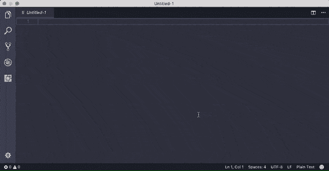T2】](https://res.cloudinary.com/practicaldev/image/fetch/s--9RuFyc2c--/c_limit%2Cf_auto%2Cfl_progressive%2Cq_66%2Cw_880/https://res.cloudinary.com/dukp6c7f7/image/upload/f_auto%2Cfl_lossy%2Cq_auto/s3-ghost/2019/02/Settings-Sync.gif)

在你开始安装左右扩展之前，最好知道设置同步的存在。它允许你将你在 VSCode 上定制的几乎所有东西同步到 Github，从设置到键盘快捷键到其他 VSCode 扩展。

这样，您就可以从任何想要编程的设备上访问您的首选 IDE，而不必在新设备上从普通的 VSCode 环境中编程，也不必再次手动设置一切。

### [直播服务器](https://marketplace.visualstudio.com/items?itemName=ritwickdey.LiveServer)

[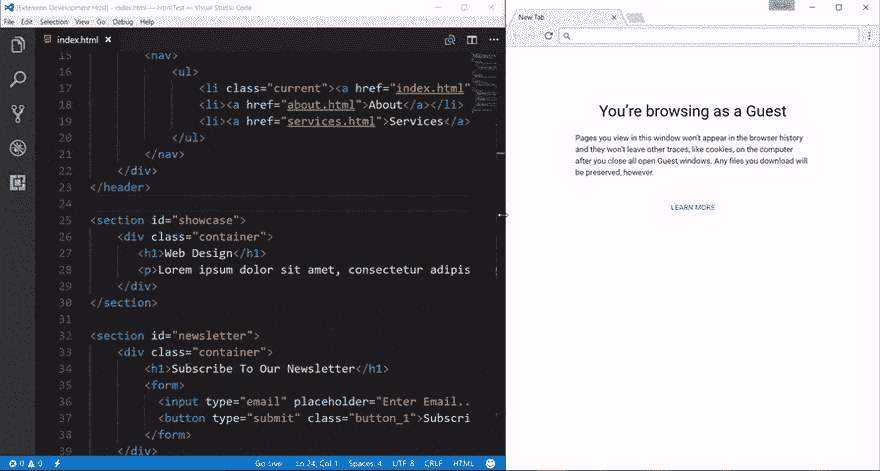T2】](https://res.cloudinary.com/practicaldev/image/fetch/s--bhb3nSVI--/c_limit%2Cf_auto%2Cfl_progressive%2Cq_66%2Cw_880/https://res.cloudinary.com/dukp6c7f7/image/upload/f_auto%2Cfl_lossy%2Cq_auto/s3-ghost/2019/02/Live-Server.gif)

这是我最喜欢的扩展之一。Live Server 为静态和动态页面启动一个具有实时重新加载功能的本地开发服务器。

每次保存代码时，您都会立即看到浏览器中反映的更改。你会更快地发现错误，并且更容易对你的代码做一些快速的实验。

### [括号对上色器](https://marketplace.visualstudio.com/items?itemName=CoenraadS.bracket-pair-colorizer)

[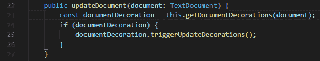T2】](https://res.cloudinary.com/practicaldev/image/fetch/s--gLmyHCgW--/c_limit%2Cf_auto%2Cfl_progressive%2Cq_auto%2Cw_880/https://res.cloudinary.com/dukp6c7f7/image/upload/f_auto%2Cfl_lossy%2Cq_auto/s3-ghost/2019/02/Bracket-Pair-Colorizer.png)

线索就在标题中，但是括号对彩色化器给了开始和结束括号匹配的颜色，使得知道哪些括号属于一起变得容易得多。

还可以配置自定义的括号字符，并且可以给活动范围添加背景颜色。

### [自动重命名标签](https://marketplace.visualstudio.com/items?itemName=formulahendry.auto-rename-tag)

[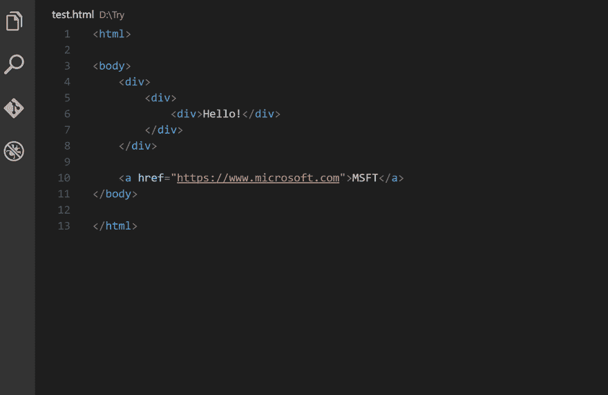T2】](https://res.cloudinary.com/practicaldev/image/fetch/s--jn8PcGux--/c_limit%2Cf_auto%2Cfl_progressive%2Cq_66%2Cw_880/https://res.cloudinary.com/dukp6c7f7/image/upload/f_auto%2Cfl_lossy%2Cq_auto/s3-ghost/2019/02/Auto-Rename-Tag.gif)

VSCode 固有地突出显示匹配的标记，并在您键入开始标记时立即添加结束标记，而 Auto Rename Tag 会自动重命名您更改的标记。

该扩展适用于 HTML、XML、PHP 和 JavaScript，并且消除了两次更改标记名的需要。

编辑:一些人在评论中提到自动重命名标签很容易出错，所以要小心处理。

### [CSS 偷看](https://marketplace.visualstudio.com/items?itemName=pranaygp.vscode-css-peek)

[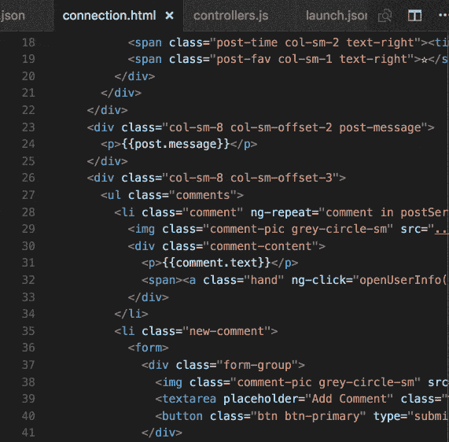T2】](https://res.cloudinary.com/practicaldev/image/fetch/s--cVqIno3Y--/c_limit%2Cf_auto%2Cfl_progressive%2Cq_66%2Cw_880/https://res.cloudinary.com/dukp6c7f7/image/upload/f_auto%2Cfl_lossy%2Cq_auto/s3-ghost/2019/02/CSS-Peek.gif)

这个扩展对于前端开发人员来说是非常宝贵的。受 IDE 括号中类似功能的启发，CSS Peek 允许您扩展 HTML 和 ejs 文件，以显示源代码中的 CSS/SCSS/LESS 代码。

如果您知道类名或 ID 名，它还允许您快速跳转到正确的 CSS 代码。

### [JavaScript (ES6)代码片段](https://marketplace.visualstudio.com/items?itemName=xabikos.JavaScriptSnippets)

[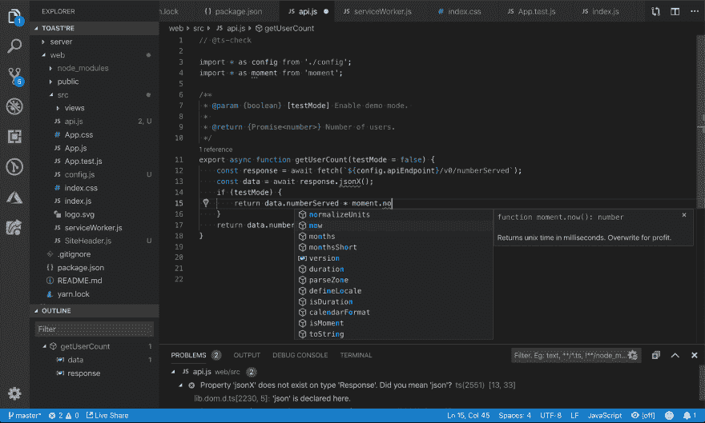T2】](https://res.cloudinary.com/practicaldev/image/fetch/s--XiGFoCXo--/c_limit%2Cf_auto%2Cfl_progressive%2Cq_auto%2Cw_880/https://res.cloudinary.com/dukp6c7f7/image/upload/f_auto%2Cfl_lossy%2Cq_auto/s3-ghost/2019/02/JS-Code-Snippets.png)

虽然 VSCode 包含内置的 JS IntelliSense，但 JS 代码片段通过添加大量导入/导出触发器、类助手和方法触发器来增强这种体验。

该扩展支持 JS、TypeScript、JS React、TS React、HTML 和 Vue。在 VSCode Marketplace 中，其他风格的代码片段也很容易获得，比如 Angular。

### [代码拼写检查器](https://marketplace.visualstudio.com/items?itemName=streetsidesoftware.code-spell-checker)

[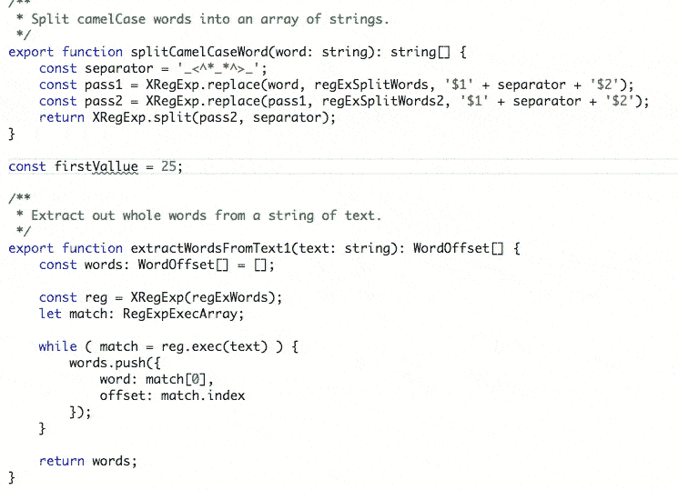T2】](https://res.cloudinary.com/practicaldev/image/fetch/s--Ij0NAjPP--/c_limit%2Cf_auto%2Cfl_progressive%2Cq_66%2Cw_880/https://res.cloudinary.com/dukp6c7f7/image/upload/f_auto%2Cfl_lossy%2Cq_auto/s3-ghost/2019/02/Code-Spell-Checker.gif)

尽管这并不重要，但我更希望我的代码没有拼写错误。代码拼写检查器对其字典文件中无法识别的单词加下划线。

该扩展有许多不同的语言版本，并支持医学术语等术语。

### [Chrome 的调试器](https://marketplace.visualstudio.com/items?itemName=msjsdiag.debugger-for-chrome)

[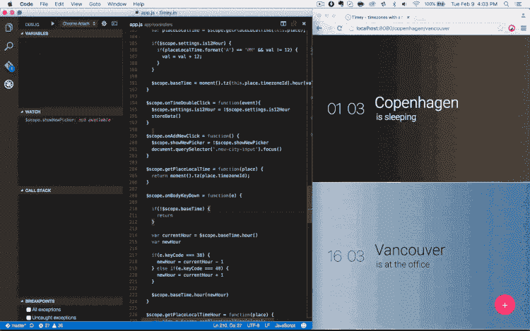T2】](https://res.cloudinary.com/practicaldev/image/fetch/s--XqJ04htP--/c_limit%2Cf_auto%2Cfl_progressive%2Cq_66%2Cw_880/https://code.visualstudio.com/assets/blogs/2016/02/23/chrome-debugger-demo.gif)

由微软开发的 Debugger for Chrome 允许你用 VSCode 调试 JS 代码。与其他 ide 中的调试器相反，它出奇的流畅。

您可以设置断点、单步调试代码、调试动态添加的脚本等等。

### [图标字体](https://marketplace.visualstudio.com/items?itemName=idleberg.icon-fonts)

[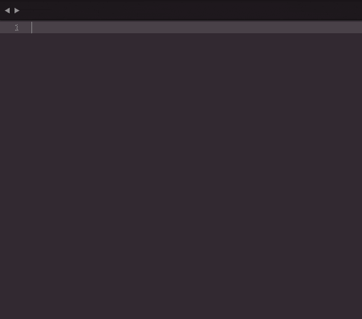T2】](https://res.cloudinary.com/practicaldev/image/fetch/s--RN8l5AUW--/c_limit%2Cf_auto%2Cfl_progressive%2Cq_66%2Cw_880/https://res.cloudinary.com/dukp6c7f7/image/upload/f_auto%2Cfl_lossy%2Cq_auto/s3-ghost/2019/02/Icon-Fonts.gif)

图标字体提供了各种图标字体的片段，包括流行的字体 Awesome v5 图标包。

对于那些不使用 VSCode 的人来说，这个包也适用于 Atom 和 Sublime Text。

### [待办事宜高亮](https://marketplace.visualstudio.com/items?itemName=wayou.vscode-todo-highlight)

[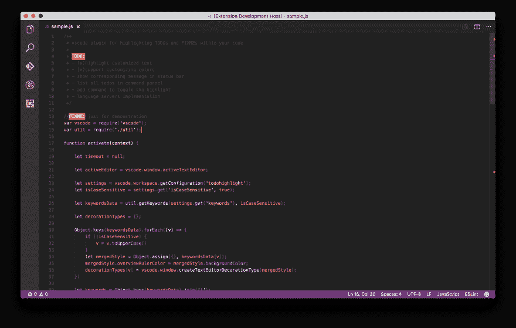T2】](https://res.cloudinary.com/practicaldev/image/fetch/s--6nrtOMdu--/c_limit%2Cf_auto%2Cfl_progressive%2Cq_auto%2Cw_880/https://res.cloudinary.com/dukp6c7f7/image/upload/f_auto%2Cfl_lossy%2Cq_auto/s3-ghost/2019/02/TODO-Highlight.png)

我承认。我很内疚在我的评论中写下 TODOs，然后完全忘记它们。TODO Highlight 使它们更加突出。

您可以切换突出显示，也可以列出所有突出显示的注释，并从相应的文件中显示它们。

### [vscode-icons](https://marketplace.visualstudio.com/items?itemName=vscode-icons-team.vscode-icons)

[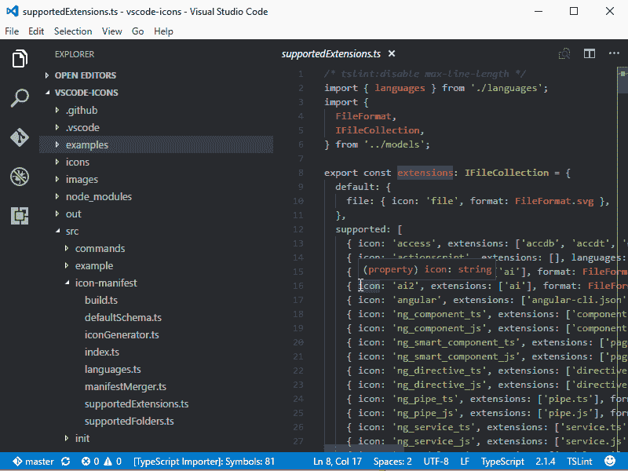T2】](https://res.cloudinary.com/practicaldev/image/fetch/s--nYvipWN3--/c_limit%2Cf_auto%2Cfl_progressive%2Cq_66%2Cw_880/https://res.cloudinary.com/dukp6c7f7/image/upload/f_auto%2Cfl_lossy%2Cq_auto/s3-ghost/2019/02/vscode-icons.gif)

你不会认为图标有很大的区别，但它们确实有(至少对我来说)。VSCode-icons 为你的 IDE 增加了一点色彩和可爱的小图标，我开始喜欢上它了。

### [正则表达式预览器](https://marketplace.visualstudio.com/items?itemName=chrmarti.regex)

[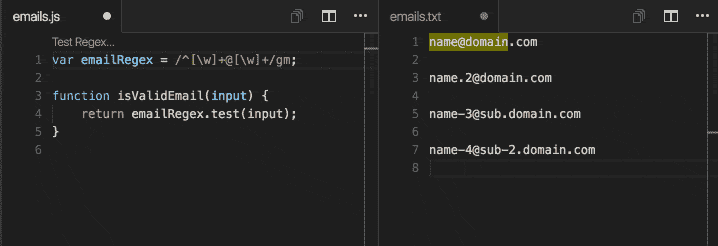T2】](https://res.cloudinary.com/practicaldev/image/fetch/s---YNy-rjK--/c_limit%2Cf_auto%2Cfl_progressive%2Cq_66%2Cw_880/https://res.cloudinary.com/dukp6c7f7/image/upload/f_auto%2Cfl_lossy%2Cq_auto/s3-ghost/2019/02/Regex-Previewer.gif)

正则表达式很难正确表达。正则表达式预览器给你一个匹配你的正则表达式的边文档。

该扩展提供了多个匹配的示例，因此为各种用例快速准确地编写正则表达式变得更加容易。

### [书签](https://marketplace.visualstudio.com/items?itemName=alefragnani.Bookmarks)

[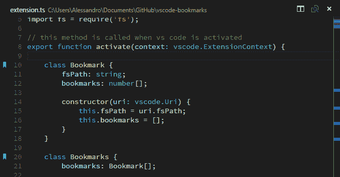T2】](https://res.cloudinary.com/practicaldev/image/fetch/s--HROsRlKW--/c_limit%2Cf_auto%2Cfl_progressive%2Cq_auto%2Cw_880/https://res.cloudinary.com/dukp6c7f7/image/upload/f_auto%2Cfl_lossy%2Cq_auto/s3-ghost/2019/02/Bookmark.png)

虽然 VSCode 有行号，但书签允许您向代码中添加书签，帮助您快速导航和轻松地来回跳转。

此外，它允许您在书签标记的代码之间选择代码区域，这对于日志文件分析之类的事情非常有用。

### [饭桶历史](https://marketplace.visualstudio.com/items?itemName=donjayamanne.githistory)

[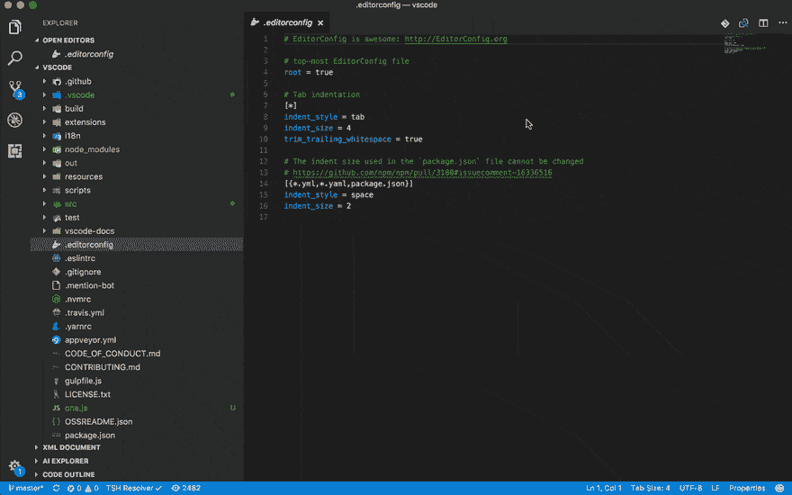T2】](https://res.cloudinary.com/practicaldev/image/fetch/s--u27x1LAs--/c_limit%2Cf_auto%2Cfl_progressive%2Cq_66%2Cw_880/https://res.cloudinary.com/dukp6c7f7/image/upload/f_auto%2Cfl_lossy%2Cq_auto/s3-ghost/2019/02/Git-History.gif)

Git History 是一个 VSCode 扩展，提供了 Git 日志的可视化。你不应该再在终端中查看 git 日志。

扩展相当全面。它允许您跨提交比较分支、提交和文件。也可以查一下 Github 头像，挺整齐的。

-

这是 14 个 VSCode 扩展，有助于在不影响质量的情况下提高编程效率。你喜欢的扩展是什么？请在下面的评论中告诉我👇！