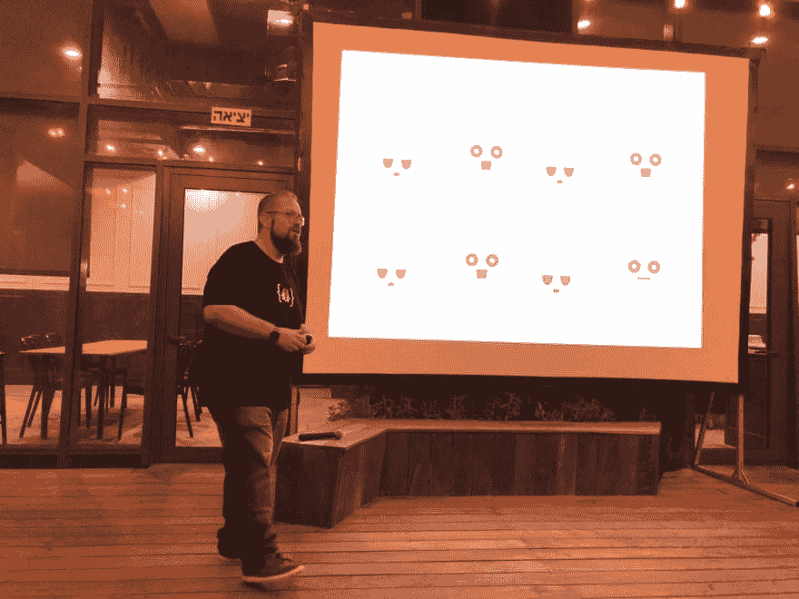
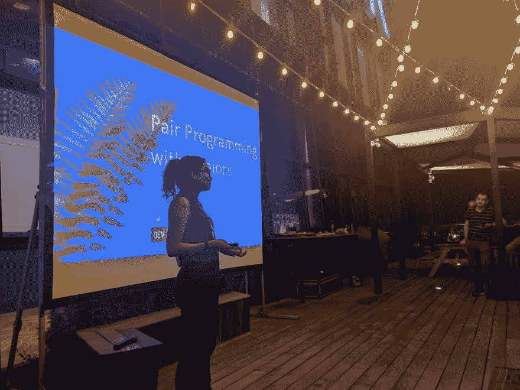
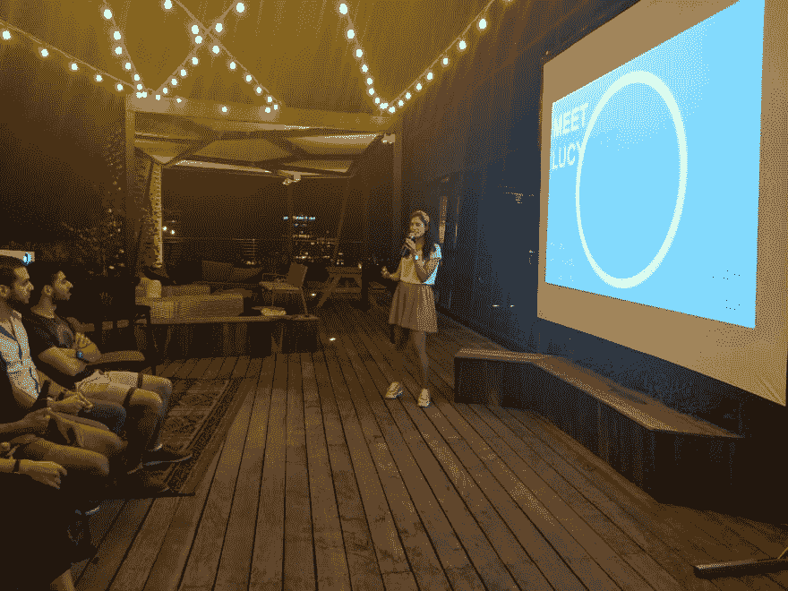

# 特拉维夫的 DEV IRL 发布了！

> 原文:[https://dev . to/bengreenberg/dev-IRL-tel-Aviv-has-launch-5g 15](https://dev.to/bengreenberg/dev-irl-tel-aviv-has-launched-5g15)

一个星期三的晚上，在晴朗的天空下，看着城市的天际线，现实生活中的第一次聚会发生了！定期的 DEV 贡献者、社区成员和对 DEV 感兴趣的人相互见面，听关于各种主题的闪电式谈话，并分享美味的食物和饮料。

聚会在市中心的 T2 研发中心的阳台上举行。我们的主人为所有人提供了各种美味佳肴，从阳台上可以欣赏到令人惊叹的景色。

[T2】](https://res.cloudinary.com/practicaldev/image/fetch/s--1kgNekDJ--/c_limit%2Cf_auto%2Cfl_progressive%2Cq_auto%2Cw_880/https://i.imgur.com/G5QEd2R.jpg)

我以介绍使用 webhooks 构建应用程序开始了闪电对话。我讨论了为什么 webhooks 在与外部 API 交互时很有用，并分享了一个 Rails [Nexmo](https://developer.nexmo.com) [语音应用程序](https://github.com/Nexmo/rails-vapi-holiday-checker)的例子，该应用程序在电话呼叫中接收呼叫者的输入，并使用它来控制应用程序的流程。

[T2】](https://res.cloudinary.com/practicaldev/image/fetch/s--T0JnZ7u0--/c_limit%2Cf_auto%2Cfl_progressive%2Cq_auto%2Cw_880/https://i.imgur.com/tWN5J2i.jpg)

第二个闪电讲座由 Clara 提供，内容是指导初级开发人员时有用的设置、技能和实践。她分享了自己在编码训练营担任讲师的真实经历。

![[deleted user] image](img/56fbc1337a9836e0802365a3a3022a53.png)

## [已删除的用户]

休息片刻，享受了更多的食物和彼此的陪伴后，我们进入了最后一轮闪电对话，从乔纳森开始，10 分钟后开始与盖茨比交谈。他与社区分享了使用 Gatsby 等工具的好处，并从头到尾向每个人展示了一个真实的例子，包括在 DEV 上的交叉发布！

## [乔纳森 P](/johnnymakestuff) <button name="button" type="button" data-info="{&quot;className&quot;:&quot;User&quot;,&quot;style&quot;:&quot;full&quot;,&quot;id&quot;:131023,&quot;name&quot;:&quot;Jonathan P&quot;}" class="crayons-btn follow-action-button whitespace-nowrap c-btn--secondary fs-base " aria-label="Follow user: Jonathan P" aria-pressed="false">跟随</button>

[Fullstack developer, working with various stacks. I love to make products from start to finish. I love making cross-platform apps using web tech.](/johnnymakestuff)

最后，但同样重要的是，Avital 以最后的闪电谈话结束了这个晚上，她向每个人介绍了 Lucy，一个制作 API 文档的机器人。Avital 强调了 API 文档对于产品采用的重要性。她分享了 API 文档的不同标准，比如[开放 API 规范](https://swagger.io/specification/)。Lucy 是一个自动化文档创建过程的工具，Avital 演示了如何使用它，以及她的公司 [Kaltura](https://corp.kaltura.com/) 如何使用它。

## [阿维塔尔·祖贝利](/avitaltzubeli) <button name="button" type="button" data-info="{&quot;className&quot;:&quot;User&quot;,&quot;style&quot;:&quot;full&quot;,&quot;id&quot;:193834,&quot;name&quot;:&quot;Avital Tzubeli&quot;}" class="crayons-btn follow-action-button whitespace-nowrap c-btn--secondary fs-base " aria-label="Follow user: Avital Tzubeli" aria-pressed="false">跟随</button>

[I love bringing ideas to life, which means I generally have too many hobbies... but it also oftentimes leads to some really great things!! I'm Backend Developer turned DevRel, living in magical TLV.](/avitaltzubeli)

对于一个新的开发人员社区来说，这是一个很好的开始，这些开发人员喜欢在开发人员在线社区中见面、打招呼和互相学习。非常感谢 Vonage 成为我们第一次聚会的主持人。热情好客是传奇，我这么说不仅仅是因为他们是我的雇主！

[T2】](https://res.cloudinary.com/practicaldev/image/fetch/s--ETDorCW0--/c_limit%2Cf_auto%2Cfl_progressive%2Cq_auto%2Cw_880/https://i.imgur.com/9MZGKkE.jpg)

我们期待着将这次聚会带到特拉维夫周围，体验这座城市中各种各样的空间。如果你有兴趣举办一个未来的开发 TLV 聚会，请与我本人或与 Avital 联系。

亚拉，去下一个！