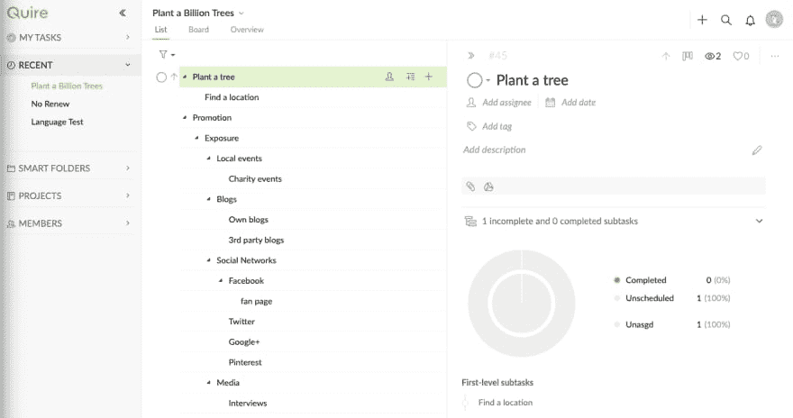

# 你会为了功能牺牲极简 UI 吗？

> 原文：<https://dev.to/zoebourque/will-you-sacrifice-minimalist-ui-for-features-4gdp>

有很多应用声称拥有很棒的功能*和*极简的用户界面。但从我以往的经验来看，这是很难实现的。要么你必须牺牲你的极简 UI 来增加更多的功能，要么你必须削减功能来保持一个干净的 UI。

为什么我会有这种担心？最近，我正在使用一个生产力应用程序，帮助我跟踪任务和管理我的工作。我真的很喜欢这个应用程序，但他们增加了许多功能来使平台变得更好，我担心它是否会破坏简单干净的用户界面。

*图片来源:[叠纸](https://quire.io)T3】*