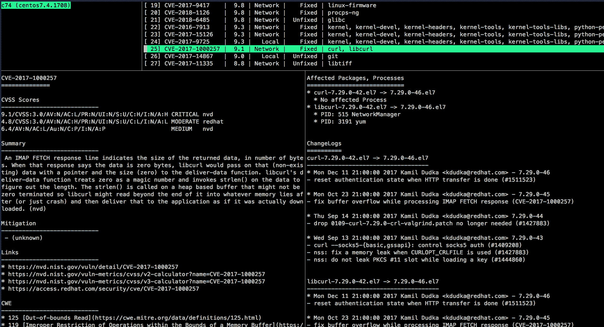

# Vuls(无代理漏洞扫描器)适用于初学者:从 macOS 扫描远程主机中的 Ubuntu 容器

> 原文:[https://dev . to/segatomo/vuls-agent less-vulnerability-scanner-for-初学者-scan-Ubuntu-container-in-remote-host-from-MAC OS-41ef](https://dev.to/segatomo/vuls-agentless-vulnerability-scanner-for-beginners-scan-ubuntu-container-in-remote-host-from-macos-41ef)

## [](#overview)概述

我会告诉你如何部署 [Vuls](https://github.com/future-architect/vuls) 以及如何构建它的开发环境。我用 https://vuls.io/docs/en/tutorial.html 的[和 T4 的
作为参考。](https://vuls.io/docs/en/tutorial.html)

## [](#set-up)设置

### [](#1-docker-container)1。码头集装箱

提取 CentOS 7 官方 Docker 图像，并运行交互式终端会话。然后，进入码头集装箱。

```
$ docker pull centos:centos7
$ docker run -it -d --name mycentos centos:centos7 
$ docker exec -it mycentos /bin/bash 
```

### [](#2-set-up-vuls-environment-on-centos)2。在 CentOS 上设置 Vuls 环境

参见[手册](https://vuls.io/docs/en/install-manually-centos.html)。

## [](#local-scan)本地扫描

扫描 CentOS 本身。

### [](#1-configuration)1。配置

```
[root@c385c6f70094 /]# cd $HOME
[root@c385c6f70094 /]# vi config.toml 
```

这样创造`config.toml`。

```
[servers]

[servers.localhost]
host = "localhost"
port = "local" 
```

### [](#2-check-configtoml-and-settings-on-the-server-before-scanning)2。扫描前检查服务器上的 config.toml 和设置

```
[root@c385c6f70094 /]# vuls configtest
[Sep 18 12:03:34]  INFO [localhost] Validating config...
[Sep 18 12:03:34]  INFO [localhost] Detecting Server/Container OS...
...
[Sep 18 12:03:34]  INFO [localhost] Scannable servers are below...
localhost 
```

### [](#3-start-scanning)3。开始扫描

```
[root@c385c6f70094 /]# vuls scan
[Sep 18 12:03:37]  INFO [localhost] Start scanning
...

One Line Summary
================
localhost   centos7.6.1810  200 installed, 74 updatable 
```

### [](#4-report)4。报告

简单地显示扫描结果。

```
[root@c385c6f70094 /]# vuls report -format-one-line-text
[Sep 18 12:10:18]  INFO [localhost] Validating config...
[Sep 18 12:10:18]  INFO [localhost] Loaded: /root/go/src/github.com/future-architect/vuls/results/2019-09-18T12:10:07Z
...

One Line Summary
================
localhost   Total: 72 (High:14 Medium:48 Low:10 ?:0)    32/72 Fixed 200 installed, 74 updatable 0 exploits      en: 4, ja: 2 alerts 
```

### [](#5-tui)5。蜜雀

TUI(基于终端的用户界面)使我们能够更详细地查看扫描结果。

```
[root@c385c6f70094 /]# vuls tui 
```

[](https://camo.githubusercontent.com/c9fff155bc67c62c7fc5f9642f2a9066066d8c6d/68747470733a2f2f76756c732e696f2f696d672f646f63732f68656c6c6f2d76756c732d7475692e706e67) 
通过键入 Ctrl+C 离开 TUI 模式

## [](#remote-scan)远程扫描

扫描 Ubuntu

### [](#set-up-ubuntu-container)设置 Ubuntu 容器

提取 Ubuntu 图像并运行交互式终端会话。

```
$ docker pull ubuntu:18.04
$ docker run -it -d --name myubuntu -p 22 ubuntu 
```

检查 IP 地址。

```
$ docker inspect --format='{{range .NetworkSettings.Networks}}{{.IPAddress}}{{end}}' CONTAINER ID
172.17.0.3 
```

使用你的 ubuntu 容器的容器 ID 而不是`CONTAINER ID`。(可以通过执行`docker ps`命令来检查。)
然后，进入码头集装箱。

```
$ docker exec -it myubuntu /bin/bash 
```

### [](#start-sshd-on-ubuntu)在 Ubuntu 上启动 sshd

```
root@b4d4062be0a8:/# apt-get update
root@b4d4062be0a8:/# apt -y install openssh-server
root@b4d4062be0a8:/# rm /etc/ssh/ssh_host_*key*
root@b4d4062be0a8:/# dpkg-reconfigure openssh-server
root@b4d4062be0a8:/# /etc/init.d/ssh start 
```

在 CentOS 上创建密钥对。然后，将公钥复制到剪贴板。

```
[root@c385c6f70094 /]# ssh-keygen -t rsa
[root@c385c6f70094 /]# cat ~/.ssh/id_rsa.pub 
```

```
root@b4d4062be0a8:/# mkdir ~/.ssh
root@b4d4062be0a8:/# chmod 700 ~/.ssh
root@b4d4062be0a8:/# touch ~/.ssh/authorized_keys
root@b4d4062be0a8:/# chmod 600 ~/.ssh/authorized_keys
root@b4d4062be0a8:/# vim ~/.ssh/authorized_keys 
```

将剪贴板的内容粘贴到`~/.ssh/authorized_keys`。

```
[root@c385c6f70094 /]# ssh 172.17.0.3
Welcome to Ubuntu 18.04.3 LTS (GNU/Linux 4.9.184-linuxkit x86_64)
... 
```

远程主机的主机密钥被添加到`$HOME/.ssh/known_hosts`。

在`vuls`目录下创建`config.toml`。

```
[servers]

[servers.ubuntu]
host         = "172.17.0.3"
port        = "22"
user        = "root"
keyPath     = "/path/to/.ssh/id_rsa" 
```

然后，确保配置正确。

```
[root@c385c6f70094 vuls]# vuls configtest 
```

现在，您应该能够从 CentOS 扫描远程主机(Ubuntu)。

```
[root@c385c6f70094 vuls]# vuls scan 
[Sep 19 04:56:51]  INFO [localhost] Start scanning
...

One Line Summary
================
ubuntu  ubuntu18.04 154 installed 
```

## [](#scan-remote-host-from-macos)从 macOS 扫描远程主机

### [](#deploy-vuls)部署 Vuls

在您的本地机器上，以如上所示的相同方式部署 vul。

### [](#enable-ssh)启用 ssh

```
$ cat ~/.ssh/id_rsa.pub 
```

将公钥复制到剪贴板。

Ubuntu

```
root@b4d4062be0a8:/# vi ~/.ssh/authorized_keys 
```

将复制的文本添加到`~/.ssh/authorized_keys`。

```
$ docker ps
CONTAINER ID        IMAGE               COMMAND             CREATED             STATUS              PORTS                   NAMES
b4d4062be0a8        ubuntu              "/bin/bash"         2 days ago          Up 2 days           0.0.0.0:32768->22/tcp   myubuntu
c385c6f70094        centos              "/bin/bash"         2 days ago          Up 2 days                                   mycentos 
```

```
$ ssh root@localhost -p 32768 
```

远程主机的主机密钥被添加到`$HOME/.ssh/known_hosts`。

```
$ vi config.toml 
```

如下图所示触摸`config.toml`。

```
[servers]

[servers.ubuntu]
host         = "localhost"
port        = "32768"
user        = "root"
keyPath     = "/path/to/id_rsa" 
```

现在你可以从本地机器扫描远程主机了！

```
$ vuls configtest ubuntu
[Sep 18 22:14:42]  INFO [localhost] Validating config...
[Sep 18 22:14:42]  INFO [localhost] Detecting Server/Container OS...
...
[Sep 18 22:14:42]  INFO [localhost] Scannable servers are below...
ubuntu 
```

```
$ vuls scan
[Sep 18 22:15:25]  INFO [localhost] Start scanning
...

One Line Summary
================
ubuntu  ubuntu18.04 154 installed 
```

```
$ vuls report -format-one-line-text
[Sep 18 22:16:03]  INFO [localhost] Validating config...
...

One Line Summary
================
ubuntu  Total: 46 (High:8 Medium:31 Low:7 ?:0)  0/46 Fixed  177 installed   1 exploits  en: 0, ja: 0 alerts 
```