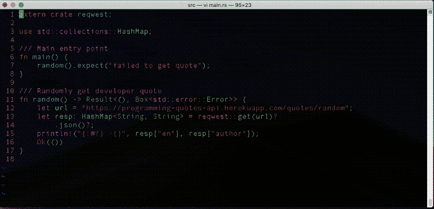
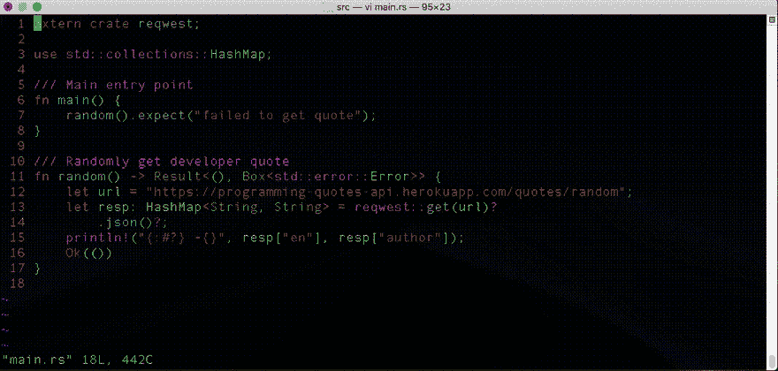

# 在 vi 中注释掉代码块的 3 种方法

> 原文:[https://dev . to/grepliz/3-ways-to-comment-out-blocks-of-code-in-VI-6j 4](https://dev.to/grepliz/3-ways-to-comment-out-blocks-of-code-in-vi-6j4)

第一次学习真的很吓人。学习曲线有点高，在这个简单而强大的编辑器中有很多方法可以做很多事情。将会有一个点，你将会舒适地使用`h` `j` `k`和`l`键四处导航，并且在*命令*模式和*插入*模式之间切换将会成为你的第二天性。这是事情变得真正有趣的地方，向您的`vi`工具箱添加更多命令将使您更加高效。

你有没有发现自己在`vi`中想要注释和取消注释代码块？这里有三种方法来实现这一点。

## 坏道

把这称为“糟糕”的方式可能有点不公平，但肯定是效率最低的。启动编辑器，向下导航到要注释掉的代码块的第一行。点击`i`进入*插入*模式，输入`//`进行注释，点击`ESC`返回*命令*模式，点击`j`向下导航到下一行，然后重复，直到所有行都被注释掉。

要取消对行的注释，您可以做几乎相同的事情。将光标定位到要注释的最后一行的开头。点击`xx`删除该行的前两个字符(在我们的例子中是`//`字符)，点击`h`导航到下一行，然后重复直到所有行都被取消注释。能够像这样四处导航、插入和删除字符，绝对不是一件可以嗤之以鼻的事情。即使达到这种充分的程度也需要时间，但是有更好的方法。

## 更好的方法

 
用正则表达式替换是`vi`中的一个有力工具。

在*命令*模式下:
击`:`进入*转义*模式
键入`11,17s/^/\/\//`然后击`ENTER`

搞定了。

喔，喔，喔！这里刚刚发生了什么？

让我们详细分析一下。
`11,17`是你感兴趣的范围。在本例中，第 11-17 行。

`s`代表替身。接下来的两个参数由`/`分隔，第一个是位置或旧值，第二个是新值。

例如:
`s/cat/dog/`取第一次出现的单词`cat`，用单词`dog`替换。每一行都会这样。

现在你可能已经注意到了一个小问题。我们正试图用`//`来代替任何东西。“nothing”实际上是用`^`(插入符号)表示的每一行的开头。

所以`s/^/dog/`会将单词`dog`添加到每一行的开头。

那`//`呢？因为替换使用了`/`来区分旧值和新值，所以`vi`不会混淆吗？这就是我们需要使用`\`(反斜杠)来转义表示注释的双反斜杠的地方。

`/\/\`是`//`的*逃*版。对这些字符进行转义告诉命令，我们*字面上的*想要使用`/`两次，而不是将其解释为命令的分隔符。

我们把这些放在一起得到`11,17s/^/\/\//`。

取消注释使用类似的模式。

点击`:`进入*逃逸*模式，进入`11,17s/\/\///`。

像以前一样，我们的产品系列是第 11-17 行。这次我们的第一个参数是`//`的转义版本，第二个值被省略了。这实际上意味着我们不用任何东西替换转义的`//`，因此删除了它。

唷！那太多了！这绝对是一种非常强大的技术，但是像许多涉及正则表达式的命令一样，它看起来可能非常难看。

## 最佳方式

`vi`中还有另一种模式可以用于我们手头的任务。视觉阻止模式允许我们在视觉上阻止编辑器的一部分来对其执行操作。我们首先从我们感兴趣的第一行开始向下导航。

点击`CTRL` + `v`进入视觉封锁模式。
使用`j`导航并屏蔽第 11-17 行的开头。
点击`SHIFT` + `i`(大写 I)进入插入模式。
键入`//`并点击`ESC`

取消注释也一样简单。

点击`CTRL` + `v`再次进入视觉封锁模式。
导航并封锁第 11-17 行的`//`。
点击`x`删除。

使用可视模式和命令的组合是注释和取消注释代码的最实用和最好的方法。向外面的 regex 粉丝道歉！

***注:*** **视觉模式其实是`vim`的一个特性，并不是原来的`vi`。大多数现代系统实际上都使用`vim`，二进制文件要么被重命名，要么被别名为`vi`。**

很难相信这只是在`vi`中可以完成的事情的冰山一角。度过最初的难关真的是最难的部分。对`vi`的更熟练转化为更高的效率和生产力。我希望这能鼓励你去探索这个令人敬畏的小编辑器，并从中获得一些乐趣。

***免责声明:*** **用来放置*不好的*、*更好的*和*最好的*判断的标准是基于我个人的喜好。**