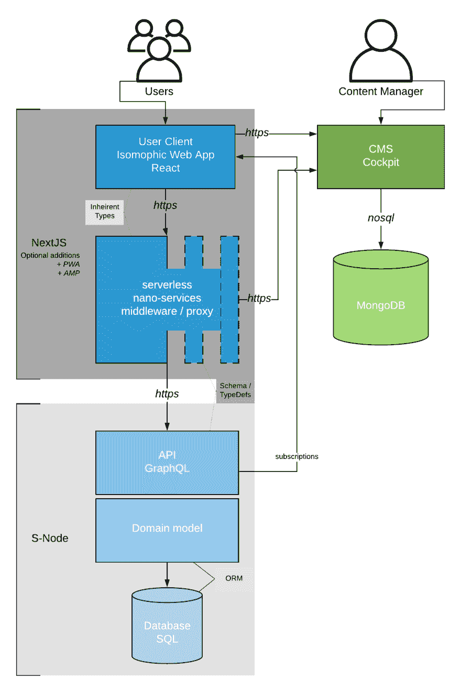

# IT 头脑高级开发人员的领先网络堆栈。

> 原文:[https://dev . to/it minds/the-leading-web-stack-of-an-it-minds-senior-developer-45mb](https://dev.to/itminds/the-leading-web-stack-of-an-it-minds-senior-developer-45mb)

我很高兴以高级软件开发人员的身份为 IT 头脑工作。简而言之，我是所有承担技术责任的人之一。

我的核心职责之一是帮助我们的客户找到满足他们需求的最佳解决方案。

从第一次见面到最后一次握手，我将是主要的技术负责方。

我的首要任务是倾听客户、他们的技术需求、限制和愿望——然后提出一个符合所有标准的解决方案架构。这些通常因公司而异。然而，当谈到网络应用时，我确实有一个首选的技术堆栈，我将它作为一个例子进行推介和展示。我想我应该和大家分享一下。

我的首选堆栈由主要区域和服务组成。

1.  数据核心，
2.  微(纳米)服务
3.  用户客户端

## cd。/数据核心

这个领域的责任主要在于建立一个数据模型，服务于所述模型并公开改变数据的方法。这通常通过 Typescript 节点服务来实现。使用 GraphQL 作为外部通信的主要 API。

我喜欢 GraphQL。每当我用 REST 构建数据模型时，我总是会迷失在所有的视图模型、d to、数据实体和逻辑模型中。在大多数情况下，同一概念的所有这些方面都是多余的。上述每个方面都有很大的用途。当我看到我需要的东西时，它总是以提供数据和允许更改数据而结束。这就是 GraphQLs 简化的“查询”和“变异”发挥作用的地方。

我用 Typeorm 和 Type-GraphQL 构建我的数据模型，用 Postgresql 作为数据库。为了将这一切结合在一起，我通过阿波罗提供这项服务。

## cd../纳米服务

我对这种无服务器的方法百思不得其解。利用平台是我的全部理念。它适合很多地方。我将所有更“重要”的逻辑从我的数据核心中移除。像认证、授权、日志、排队、缓存等重要概念。都是业务逻辑的一部分——但不是实际的模型(在很大程度上)。因此，我用一种无服务器的方法编写了所有这些“中间件”。

谈到轻量级无服务器 api，NextJS(X)非常出色。它不是“特定于平台”的，但仍然和大公司的无服务器选项一样强大。如果需要存储与提到的概念相关的数据，我在这个服务的工具带中保留了一个 MongoDB。

## cd../用户-客户端

虽然有时会被忽视，但在为用户开发客户端时，我不能夸大良好体验对用户和开发人员的重要性。我喜欢 React 和 React Hooks。并且已经将 NextJS 用于无服务器，所以向用户客户端推销它是显而易见的。

Apollo 客户端允许内置的数据概念 100%与数据核心提供的数据保持一致。

NextJS 让站点默认 PWA 和 AMP 变得很容易。

## cd..

许多人不喜欢 JavaScript，为了减轻开发人员的痛苦，我在整个堆栈中使用了 Typescript。这样，我可以确保所有接口之间的强安全类型。

这是整个产品的样子

如果处理得当，在推销过程中，大量的流行语是有益的。因此，有了这种技术组合，您可以炫耀说，最终产品将是:

> 同构无服务器渐进式“移动加速”轻量级 Web 应用程序，具有非常水平的可扩展后端。

感谢您的阅读。我希望在不久的将来为所有这些演讲提供一些例子或者可能的模板。让我们看看我的老板给我多少时间:3
你一直很可爱！评论里见！

您还可以看到 stack @ [stackshare](https://stackshare.io/it-minds/leading-web)