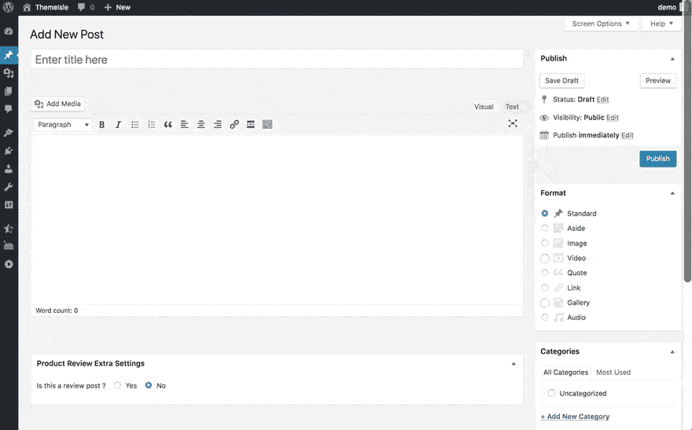
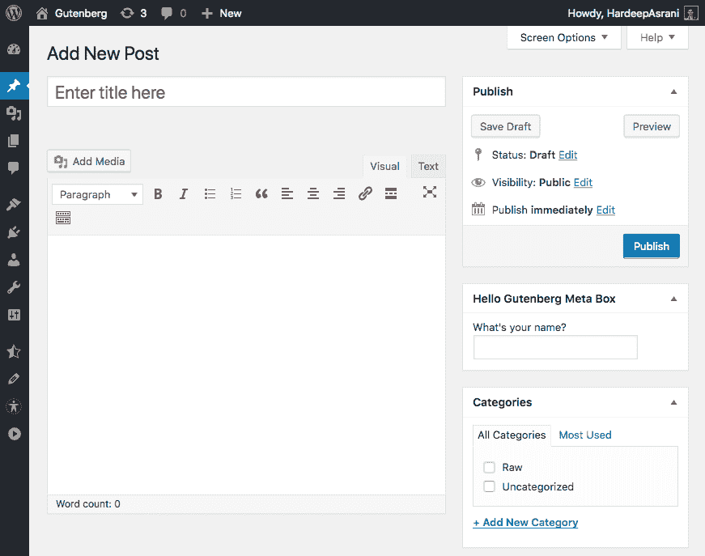
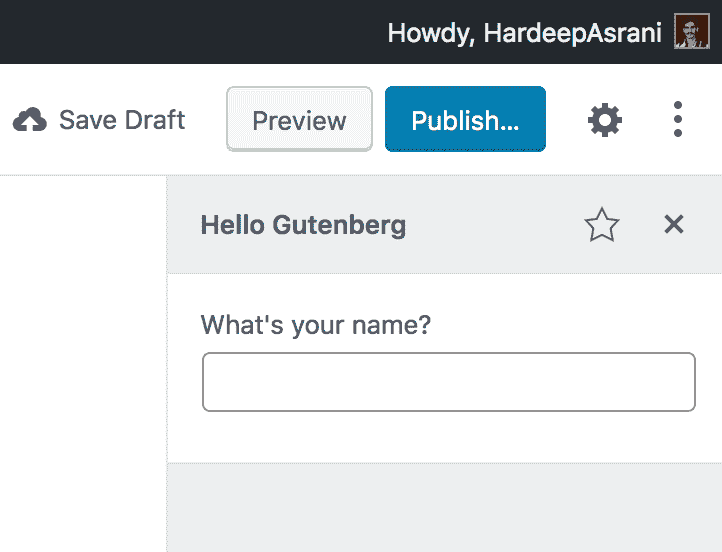

# 如何让你的插件与 Gutenberg 兼容:第 2 部分(侧栏 API)

> 原文:[https://dev . to/codeinwp/how-to-make-your-plugin-compatible-with-Gutenberg-part-2-sidebar-API-4 onn](https://dev.to/codeinwp/how-to-make-your-plugin-compatible-with-gutenberg-part-2-sidebar-api-4onn)

如果你想让你的插件与 Gutenberg 兼容，你有几条路可以/应该走——取决于你的插件做什么以及它如何向用户提供它的特性。

在这个迷你系列的第一部分，[我们探索了 Gutenberg 的 Block API](https://www.codeinwp.com/blog/adapt-your-plugin-for-gutenberg-block-api/)——这是大多数插件在 Gutenberg 兼容性方面所需要的。这一次，我们将探索古腾堡难题的另一块—**古腾堡的侧边栏 API** 。

为了确保我们在同一页上，一个简单的解释:

*   Gutenberg 的 Block API 非常广泛，允许您将几乎所有东西都构建为块，但是，有时这还不够。
*   另一方面，侧边栏 API 允许插件注册一个侧边栏，在那里它们可以将功能扩展到块之外。边栏类似于块检查器。

[例如](https://www.codeinwp.com/blog/build-for-gutenberg-how-others-do-it/)，Yoast SEO 展示的 Gutenberg 侧边栏 API 正在使用中:

[T2】](https://res.cloudinary.com/practicaldev/image/fetch/s--MCmwUfoT--/c_limit%2Cf_auto%2Cfl_progressive%2Cq_auto%2Cw_880/https://www.codeinwp.com/wp-content/uploads/2018/09/Gutenberg-Sidebar-API.png)

### [](#where-can-you-use-sidebar-api)**哪里可以使用侧边栏 API？**

我们最近致力于为古腾堡准备好我们的插件-[WP 产品评论](https://themeisle.com/plugins/wp-product-review/)。WP Product Review 使用元字段向帖子添加评论数据，由于各种向后兼容的原因，我们不能变成一个块。因此，我们使用侧边栏 API。

*这是插件在经典编辑器中的区块:*

[T2】](https://res.cloudinary.com/practicaldev/image/fetch/s--B4af3-q2--/c_limit%2Cf_auto%2Cfl_progressive%2Cq_66%2Cw_880/https://www.codeinwp.com/wp-content/uploads/2018/09/WP-Product-Review-Metabox-1.gif)

当用户指出文章是带有侧边栏切换的评论时，他们将能够从侧边栏选项中配置关于他们的[评论框](https://www.codeinwp.com/blog/best-wordpress-review-plugins/)的一切。

WP 产品评论就是侧边栏 API 有用的例子之一。另一个很好的例子是 [Drop It](https://wordpress.org/plugins/dropit/) 插件，它允许用户使用侧边栏插入来自 Unsplash 和 Giphy 的图片。

在这篇文章中，我将带领你实现类似的东西，并通过侧边栏 API 使你的插件 Gutenberg 兼容。

### 默认情况下， [](#meta-boxes-are-kind-of-ready-for-gutenberg-by-default-but-not-quite) **元盒已经为古腾堡做好了准备，但还没有完全准备好**

让我们从元盒开始。让我们来看一个插件，它使用一个简单的元框在编辑器屏幕上向用户提供一些功能。

在经典编辑器中，这可能如下所示:

[T2】](https://res.cloudinary.com/practicaldev/image/fetch/s--w2s0uYf_--/c_limit%2Cf_auto%2Cfl_progressive%2Cq_auto%2Cw_880/https://www.codeinwp.com/wp-content/uploads/2018/09/Classic-Editor-Meta-Field.png)

您可以使用下面的代码来创建这样一个元框——它也可以在 [Hello Gutenberg](https://github.com/HardeepAsrani/hello-gutenberg/) 资源库:
中找到

```
/**
 * Register Hello Gutenbert Meta Box
 */
function hello_gutenberg_add_meta_box() {
    add_meta_box( 'hello_gutenberg_meta_box', __( 'Hello Gutenberg Meta Box', 'hello-gutenberg' ), 'hello_gutenberg_metabox_callback', 'post' );
}
add_action( 'add_meta_boxes', 'hello_gutenberg_add_meta_box' );

/**
 * Hello Gutenberg Metabox Callback
 */
function hello_gutenberg_metabox_callback( $post ) {
    $value = get_post_meta( $post->ID, '_hello_gutenberg_field', true );
    ?>
    <label for="hello_gutenberg_field"><?php _e( 'What\'s your name?', 'hello-gutenberg' ) ?></label>
    <input type="text" name="hello_gutenberg_field" id="hello_gutenberg_field" value="<?php echo $value ?>" />
    <?php
}

/**
 * Save Hello Gutenberg Metabox
 */
function hello_gutenberg_save_postdata( $post_id ) {
    if ( array_key_exists( 'hello_gutenberg_field', $_POST ) ) {
        update_post_meta( $post_id, '_hello_gutenberg_field', $_POST['hello_gutenberg_field'] );
    }
}
add_action( 'save_post', 'hello_gutenberg_save_postdata' ); 
```

所以这里要问的问题是:

我们需要首先使这个古腾堡兼容吗？

在这一点上，我们应该考虑问自己什么是古腾堡兼容。例如，如果您在 Gutenberg 中使用这个元框而不对它做任何更改，它仍然可以工作。

然而，当我们谈论 Gutenberg 兼容性时，我们不仅仅谈论在 Gutenberg 环境中工作的插件，而是像 Gutenberg 一样工作的插件。

“为什么？”你会问。很简单，在 Gutenberg 成为默认编辑器后开始使用 WordPress 的用户会发现旧的方式是反直觉的。此外，他们希望编辑器中的所有内容都有更像古腾堡的风格。

如果你不为用户提供一种原生的感觉，他们肯定会寻找与 Gutenberg 配合得更好的替代品。

最后，让我们用一些代码来弄脏我们的手！

### [](#getting-started-with-sidebar-api)**侧栏 API 入门**

我们将开始在古腾堡编码我们的侧边栏，以包括我们的元字段。您可以继续使用 [Gutenberg 样板文件](https://github.com/HardeepAsrani/gutenberg-boilerplate)库作为起点。

### [](#getting-your-meta-box-ready-for-gutenberg)**为古腾堡准备好你的元盒**

在我们开始之前，我们首先需要告诉 Gutenberg，我们不会在 Gutenberg 中使用我们的 meta box。你可以通过将 __ *back_compat_meta_box* 参数传递给 *add_meta_box* 函数来实现，比如:

```
/**
 * Register Hello Gutenberg Metabox
 */
function hello_gutenberg_add_meta_box() {
    add_meta_box( 'hello_gutenberg_meta_box', __( 'Hello Gutenberg Meta Box', 'hello-gutenberg' ), 'hello_gutenberg_metabox_callback', 'post',  array(
        '__back_compat_meta_box' => false,
    ) );
}
add_action( 'add_meta_boxes', 'hello_gutenberg_add_meta_box' ); 
```

Gutenberg Handbook 有更多关于如何将 PHP 元盒移植到 Gutenberg 的细节。

这将确保我们的旧 PHP 元框不再出现在 Gutenberg 中。现在，我们还需要将 meta 字段添加到 WordPress REST API 中，为 Gutenberg 做好准备。您可以添加以下代码向 REST API 注册 meta 字段:

```
/**
 * Register Hello Gutenberg Meta Field to Rest API
 */
function hello_gutenberg_register_meta() {
    register_meta(
        'post', '_hello_gutenberg_field', array(
            'type'      => 'string',
            'single'    => true,
            'show_in_rest'  => true,
        )
    );
}
add_action( 'init', 'hello_gutenberg_register_meta' ); 
```

这将把 _ *hello_gutenberg_field* 添加到 REST API 中的 **meta** 对象中。

这个函数只会在 REST API 中显示我们的值。现在我们还需要添加一个方法来使用 REST API 更新我们的元字段。

下面的代码将我们的自定义路线添加到 WordPress REST API 中，它将是**/hello-Gutenberg/v1/update-meta/**:

```
/**
 * Register Hello Gutenberg Metabox to Rest API
 */
function hello_gutenberg_api_posts_meta_field() {
    register_rest_route(
        'hello-gutenberg/v1', '/update-meta', array(
            'methods'  => 'POST',
            'callback' => 'hello_gutenberg_update_callback',
            'args'   => array(
                'id' => array(
                    'sanitize_callback' => 'absint',
                ),
            ),
        )
    );
}
add_action( 'rest_api_init', 'hello_gutenberg_api_posts_meta_field' );

/**
 * Hello Gutenberg REST API Callback for Gutenberg
 */
function hello_gutenberg_update_callback( $data ) {
    return update_post_meta( $data['id'], $data['key'], $data['value'] ); 
```

这个 REST API 路径将用于修改 Gutenberg 侧边栏中的 meta 字段。你可以从这里了解更多关于 WordPress REST API 以及如何[注册自定义路线的信息。](https://developer.wordpress.org/rest-api/)

同样，如果你想知道什么是 WordPress REST API，如何入门，可以看看我们的博文: [WordPress REST API:什么是 WordPress REST API，如何入门使用](https://www.codeinwp.com/blog/wordpress-rest-api/)。

### [](#adding-a-sidebar-block-to-gutenberg)**给古腾堡添加侧边栏块**

让我们从[古腾堡样板](https://github.com/HardeepAsrani/gutenberg-boilerplate/blob/master/src/sidebar.js) :
的侧栏代码开始

```
/**
 * Internal block libraries
 */
const { __ } = wp.i18n;

const { Fragment } = wp.element;

const {
    PluginSidebar,
    PluginSidebarMoreMenuItem,
} = wp.editPost;

const { registerPlugin } = wp.plugins;

const Component = () => (
    <Fragment>
        <PluginSidebarMoreMenuItem
            target="gutenberg-boilerplate-sidebar"
        >
            { __( 'Gutenberg Boilerplate' ) }
        </PluginSidebarMoreMenuItem>
        <PluginSidebar
            name="gutenberg-boilerplate-sidebar"
            title={ __( 'Gutenberg Boilerplate' ) }
        >
            <h2>{ __( 'Hello World!' ) }</h2>
        </PluginSidebar>
    </Fragment>
);

registerPlugin( 'gutenberg-boilerplate', {
    icon: 'admin-site',
    render: Component,
} ); 
```

这将在 Gutenberg 编辑器中插入一个非常简单的侧边栏。我们将以此为起点，在此基础上构建我们的项目。

示例代码来自我们的 Gutenberg 样本库，因此，我们需要将所有出现的“Gutenberg 样本”替换为“Hello Gutenberg”。

### [](#components-used)**所用组件**

虽然我们的侧边栏已经导入了许多组件，但我们还需要更多。您可以用以下代码替换代码的顶部:

```
/**
 * Internal block libraries
 */

const { __ } = wp.i18n;

const {
    PluginSidebar,
    PluginSidebarMoreMenuItem
} = wp.editPost;

const {
    PanelBody,
    TextControl
} = wp.components;

const {
    Component,
    Fragment
} = wp.element;

const { withSelect } = wp.data;

const { registerPlugin } = wp.plugins; 
```

让我们快速了解一下我们已经导入的所有组件。

*   正如在上一篇文章中所讨论的， [__](https://github.com/WordPress/gutenberg/tree/master/packages/i18n) 组件用于使我们的文本可翻译。
*   组件 [PluginSidebar](https://github.com/WordPress/gutenberg/tree/master/packages/edit-post/src#pluginsidebar) 用于将我们的工具条添加到 Gutenberg。PluginSidebarMoreMenuItem 用于向 Gutenberg 菜单添加一个按钮，切换侧边栏的可见性。
*   组件 [PanelBody](https://github.com/WordPress/gutenberg/tree/master/packages/components/src/panel) 用于向我们的工具条添加一个面板。
*   TextControl 用于我们的输入字段。
*   之后，我们导入了[组件](https://reactjs.org/docs/react-component.html)和[片段](https://reactjs.org/docs/fragments.html)组件。它们都是我们在侧栏中使用的 React 组件。片段组件用于对一系列子节点进行分组，而无需向 DOM 添加额外的节点。我们需要在代码中使用片段组件，因为 JSX 不允许我们拥有一个以上的父节点。
*   [withSelect](https://github.com/WordPress/gutenberg/tree/master/packages/data/src/components/with-select) 是高阶组件。要了解什么是高阶组件，我建议你阅读[这个文档](https://reactjs.org/docs/higher-order-components.html)。
*   最后，我们导入 [registerPlugin](https://github.com/WordPress/gutenberg/tree/master/packages/plugins) ，它类似于我们在[上一篇文章](https://www.codeinwp.com/blog/adapt-your-plugin-for-gutenberg-block-api/)中使用的 registerBlockType。registerPlugin 注册你的插件，而不是注册一个块。

### [](#adding-controls)**添加控件**

到目前为止，我们的侧边栏只是一个组件函数，但是因为我们将使用 React 的生命周期方法，我们将把它变成一个 React 组件，就像这样:

```
class Hello_Gutenberg extends Component {
    render() {
        return (
            <Fragment>
                <PluginSidebarMoreMenuItem
                    target="hello-gutenberg-sidebar"
                >
                    { __( 'Hello Gutenberg' ) }
                </PluginSidebarMoreMenuItem>
                <PluginSidebar
                    name="hello-gutenberg-sidebar"
                    title={ __( 'Hello Gutenberg' ) }
                >
                    <h2>{ __( 'Hello World!' ) }</h2>
                </PluginSidebar>
            </Fragment>
        )
    }
}

registerPlugin( 'hello-gutenberg', {
    icon: 'admin-site',
    render: Hello_Gutenberg,
} ); 
```

这应该可以让你的侧边栏使用纯文本。

现在让我们将我们的字段添加到侧栏中。它应该使我们的组件看起来像这样:

```
class Hello_Gutenberg extends Component {
    render() {
        return (
            <Fragment>
            <PluginSidebarMoreMenuItem
                target="hello-gutenberg-sidebar"
            >
                { __( 'Hello Gutenberg' ) }
            </PluginSidebarMoreMenuItem>
            <PluginSidebar
                name="hello-gutenberg-sidebar"
                title={ __( 'Hello Gutenberg' ) }
            >
                <PanelBody>
                    <TextControl
                        label={ __( 'What\'s your name?' ) }
                        // value={}
                        // onChange={}
                    />
                </PanelBody>
            </PluginSidebar>
        </Fragment>
        )
    }
} 
```

这将在侧边栏中添加一个简单的输入字段，在这一点上什么也不做。现在我们还剩两项任务:

*   显示我们的元字段的值。
*   允许从侧边栏更新我们的元字段的值。

[T2】](https://res.cloudinary.com/practicaldev/image/fetch/s--P3VDEFen--/c_limit%2Cf_auto%2Cfl_progressive%2Cq_auto%2Cw_880/https://www.codeinwp.com/wp-content/uploads/2018/09/Hello-Gutenberg.png)

### [](#display-the-meta-value)**显示元值**

为了获取元数据，我们将使用 [wp.apiFetch](https://github.com/WordPress/gutenberg/tree/master/packages/api-fetch) 。apiFetch 是一个实用程序库，它允许我们发出 REST API 请求。

我们将在 React 组件的构造函数中使用 apiFetch，就像这样:

```
class Hello_Gutenberg extends Component {
    constructor() {
        super( ...arguments );

        this.state = {
            key: '_hello_gutenberg_field',
            value: '',
        }

        wp.apiFetch( { path: `/wp/v2/posts/${this.props.postId}`, method: 'GET' } ).then(
            ( data ) => {
                this.setState( { 
                    value: data.meta._hello_gutenberg_field
                } );
                return data;
            },
            ( err ) => {
                return err;
            }
        );
    }

    render() {
        return (
            <Fragment>
            <PluginSidebarMoreMenuItem
                target="hello-gutenberg-sidebar"
            >
                { __( 'Hello Gutenberg' ) }
            </PluginSidebarMoreMenuItem>
            <PluginSidebar
                name="hello-gutenberg-sidebar"
                title={ __( 'Hello Gutenberg' ) }
            >
                <PanelBody>
                    <TextControl
                        label={ __( 'What\'s your name?' ) }
                        value={ this.state.value }
                        // onChange={}
                    />
                </PanelBody>
            </PluginSidebar>
        </Fragment>
        )
    }
} 
```

首先，我们定义了一个初始状态，这基本上是我们元字段的关键和值。之后，我们使用 apiFetch 从当前帖子中获取数据。

我们使用变量 *${this.props.postId}* 传递当前帖子的 ID。我们稍后将回到这一点。

一旦获取了数据，我们就用 REST API 中的值更新我们的状态。

现在，让我们回到 postId 变量。我们目前不知道当前文章的 ID，因此我们使用带有 Select 的*高阶组件，比如:* 

```
const HOC = withSelect( ( select ) => {
    const { getCurrentPostId } = select( 'core/editor' );
    return {
        postId: getCurrentPostId(),
    };
} )( Hello_Gutenberg );

registerPlugin( 'hello-gutenberg', {
    icon: 'admin-site',
    render: HOC,
} ); 
```

这将把我们当前文章的 ID 作为一个 *postId* 变量传递。现在你可以运行一个旧的帖子，我们的古腾堡边栏将显示你的元字段的值。

### [](#update-the-meta-value)**更新元值**

现在我们需要允许我们的侧边栏也更新元值。类似于获取细节，我们将使用 [wp.apiRequest](https://github.com/WordPress/WordPress/blob/master/wp-includes/js/api-request.js) 实用程序。

每当我们的状态值改变时，我们将使用 REST API 更新它。为此，我们首先需要给我们的 *TextControl* 添加一个 *onChange* 事件，就像这样:

```
<TextControl
    label={ __( 'What\'s your name?' ) }
    value={ this.state.value }
    onChange={ ( value ) => { 
        this.setState( {
            value
        } );
    } }
/> 
```

然后我们将使用 [getDerivedStateFromProps](https://reactjs.org/docs/react-component.html#static-getderivedstatefromprops) 生命周期方法来发送 REST 请求。

您可以在您的构造函数下面添加以下代码:

```
static getDerivedStateFromProps( nextProps, state ) {
    wp.apiRequest( { path: `/hello-gutenberg/v1/update-meta?id=${nextProps.postId}`, method: 'POST', data: state } ).then(
        ( data ) => {
            return data;
        },
        ( err ) => {
            return err;
        }
    );
} 
```

这将更新我们的元字段，每次我们改变它。现在您应该看到这种方法的一个问题了。

每次更改元值时，元值都会更新，这种方法有两个问题:

*   即使你决定不更新文章，你的数据也会被保存。
*   它会过于频繁地进行 HTTP 调用，这是不理想的。

只有在保存或发布帖子时，才应该保存数据。为此，我们可以利用我们的高阶组件来找出 post 何时被保存。

您可以用下面的代码替换我们的 HOC 函数:

```
const HOC = withSelect( ( select, { forceIsSaving } ) => {
    const {
        getCurrentPostId,
        isSavingPost,
        isPublishingPost,
        isAutosavingPost,
    } = select( 'core/editor' );
    return {
        postId: getCurrentPostId(),
        isSaving: forceIsSaving || isSavingPost(),
        isAutoSaving: isAutosavingPost(),
        isPublishing: isPublishingPost(),
    };
} )( Hello_Gutenberg ); 
```

这将为我们提供一些变量，我们可以使用这些变量来检查我们的帖子是否被保存或发布。

我们需要将这个条件添加到我们的 post 请求函数:

```
static getDerivedStateFromProps( nextProps, state ) {
    if ( ( nextProps.isPublishing || nextProps.isSaving ) && !nextProps.isAutoSaving ) {
        wp.apiRequest( { path: `/hello-gutenberg/v1/update-meta?id=${nextProps.postId}`, method: 'POST', data: state } ).then(
            ( data ) => {
                return data;
            },
            ( err ) => {
                return err;
            }
        );
    }
} 
```

现在，只有当我们保存、更新或发布帖子时，元值才会更新。
就是这样！你的工具条现在已经完成了，你已经学会了如何让你的插件与 Gutenberg 兼容！

你可以测试你的程序块以确保它能正常工作。如果没有，请在下面的评论区留下你的回答，我会尽力帮助你。

### [](#whats-next-when-youre-done-with-sidebar-api)**当你完成侧边栏 API 后，下一步是什么？**

您可以在 [Hello Gutenberg](https://github.com/HardeepAsrani/hello-gutenberg) 资源库中找到完成的示例。如果您发现任何问题，请随时[提出问题](https://github.com/HardeepAsrani/hello-gutenberg/issues)。

再一次，这是 Gutenberg 侧边栏 API 的一个小例子。使用 Gutenberg 和它的 API，你可以创造出许多令人惊奇的东西。

你想通过古腾堡实现什么？让我们知道。

*文章最初发表于[CodeinWP.com](https://www.codeinwp.com/blog/make-plugin-compatible-with-gutenberg-sidebar-api/)T3】*