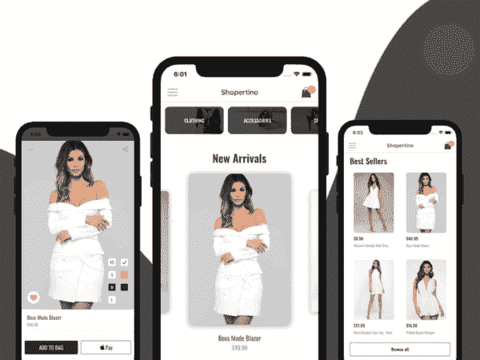
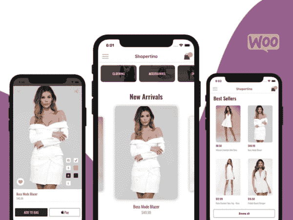

# 2019 年最佳反应本地电子商务模板

> 原文:[https://dev . to/Kris/5-best-react-native-ecommerce-template-2019-2g c8](https://dev.to/kris/5-best-react-native-ecommerce-template-2019-2gc8)

[T2】](https://res.cloudinary.com/practicaldev/image/fetch/s--IbXCvGYB--/c_limit%2Cf_auto%2Cfl_progressive%2Cq_auto%2Cw_880/https://cdn-images-1.medium.com/max/1200/0%2AeHn_dZLo-0KxtY2S.png)

建立网上商店、电子商务网站和应用程序已经成为现代世界的一种发展趋势。由于通过数字或在线营销吸引客户的最大可行性和效率
，在线商店和
电子商务网站正在快速增长。在不久的将来，很有可能每个现实世界的商店都将建立自己的在线商店
应用程序或网站。应用商店中发布的电子商务应用
增长迅速。如今，移动电子商务应用已经成为一种发展趋势。随着越来越多的顾客从个人电脑转向移动平台，几乎任何在线商店都需要有自己的移动应用程序。这就是 React 原生电子商务模板派上用场的地方。

此外，它们有助于节省开发时间，并使我们能够快速有效地创建和发布我们自己的电子商务应用程序。最重要的是，React Native 提供了跨平台应用程序开发的特性。
这意味着带有现成的高端 React 原生模板
的相同应用将可用于 iOS 和 Android，而无需单独的
开发。

在这里，我们为您提供了五个最佳的 React 原生电子商务模板
供您选择，这将鼓励您为您的下一个
电子商务应用选择合适的模板。

#### React 原生 Shopify 模板

[T2】](https://res.cloudinary.com/practicaldev/image/fetch/s--fdfsZjg6--/c_limit%2Cf_auto%2Cfl_progressive%2Cq_auto%2Cw_880/https://cdn-images-1.medium.com/max/800/0%2A3h53W9Z2bf5Qn4Aw.png)

你是 Shopify 的店主还是为 Shopify 公司工作？然后你必须
在 App Store 和 Google Play 上推出一款原生手机应用，以提升
你的销售&业务权限。通过购买我们的 React 原生 Shopify 模板，
您现在就可以为您的 Shopify 商店推出一款移动应用，而不会有任何麻烦。

*   节省 3 个月的设计和开发时间
*   节省数千美元
*   节约能源和努力工作
*   不要为雇佣设计师、开发人员、自由职业者等失败而烦恼。

通过快速行动，将任何 Shopify 商店转换为移动原生应用程序，从而在竞争中保持领先。我们的 [React Native Shopify
模板](https://www.instamobile.io/app-templates/react-native-shopify-app/)
为您提供完美的项目样板，让您毫不费力地将您的移动应用程序发送到
应用程序商店。

#### React 原生电子商务模板

[T2】](https://res.cloudinary.com/practicaldev/image/fetch/s--61gZTbIT--/c_limit%2Cf_auto%2Cfl_progressive%2Cq_auto%2Cw_880/https://cdn-images-1.medium.com/max/800/0%2Am4IbV-t-1us07afH.png)

[React 原生电子商务
模板](https://www.instamobile.io/app-templates/react-native-ecommerce-app-template/)
是流行的电子商务模板，它将帮助您在几分钟内启动 iOS 和 Android 的购物移动
应用程序。这个构建良好的模板具有完整的
后端集成(Firebase)。这个购物应用模板提供了可扩展、干净和全面的源代码，对于每个人来说都是一个很好的入门工具包，无论他们是想学习 React Native 还是想构建一个完整的生产购物应用。最值得一提的功能包括
主屏幕，带有旋转式传送带和产品网格视图；产品屏幕，带有
产品详细信息、照片库、尺寸和颜色选择器；社交媒体分享按钮；基于类别进行搜索的
搜索屏幕；具有成熟的
历史记录和重新订购功能的购物车等。对于支付网关，有 stripe
集成，以及 iOS 的 Apple pay 和 Android 的 Google pay。

此外，动态数据库系统与 Firebase (Firestore)、
用户管理功能、照片存储的集成将使 React 本地开发人员的工作变得更加轻松
。最重要的是，代码库是高度模块化的，并且
针对 Android 和 iOS 平台进行了优化。还有一个脸书 SDK
的集成。干净的界面和通过集成
流行的 React 原生插件包的动态导航是加分点。因此，这个模板
满足了轻松高效地开发电子商务应用的所有需求。

#### React 原生 WooCommerce App

[T2】](https://res.cloudinary.com/practicaldev/image/fetch/s--TjnEHBZU--/c_limit%2Cf_auto%2Cfl_progressive%2Cq_auto%2Cw_880/https://cdn-images-1.medium.com/max/800/0%2A-0rULlj1SoZxWb61.png)

购买我们华丽的购物应用程序模板，在您现有的 WooCommerce 店面的支持下，为 iOS
和 Android 制作一个本地移动应用程序。通过下载我们 [React Native WooCommerce app、](https://www.instamobile.io/app-templates/react-native-woocommerce/) 的
完整源代码，你将
节省几个月的辛苦工作和数千美元。应用程序模板
完全端到端工作，包括支付&订单和**它自动
连接到你的 WooCommerce 商店。**

在 Instamobile，我们的使命是通过向开发者和创业者提供全功能的 React Native starter
套件，帮助他们更快地推出他们的
移动应用。这种 React Native WooCommerce 是为 WooCommerce 上运行的现有电子商务商店创建原生
移动应用程序的最有效方式。

我们已经编写了所有必要的代码，包括 WooCommerce 后端
集成和支付支持，所以你不需要重新发明轮子。
我们努力为您创建最好、最实惠的 WooCommerce 移动应用程序
Builder，因此您无需重新发明轮子或处理
定期/每月付款。

#### 带 Firebase 的购物 App

[T2】](https://res.cloudinary.com/practicaldev/image/fetch/s--KPZV5ivp--/c_limit%2Cf_auto%2Cfl_progressive%2Cq_auto%2Cw_880/https://cdn-images-1.medium.com/max/800/0%2A-fKXXg5XD4yqAvzr.png)

这款完全编码的[电子商务 iPhone 应用
模板](https://www.instamobile.io/app-templates/e-commerce-iphone-app-with-firebase-backend)、
自动与 Firebase 后端集成，让你可以在几分钟内将你的
原生购物应用发布到应用商店。

#### 特性

*   产品类别屏幕
*   单一产品屏幕
*   产品列表屏幕
*   购物车视图屏幕
*   签出功能
*   Apple Pay 支持
*   通过 Stripe 的信用卡支付支持
*   自动端到端 Firebase 数据库后端集成
*   实时产品更新
*   由 rockstar mobile 开发人员编写的干净、灵活且可扩展的代码

#### 购物 App 模板

[T2】](https://res.cloudinary.com/practicaldev/image/fetch/s--bTR84sij--/c_limit%2Cf_auto%2Cfl_progressive%2Cq_auto%2Cw_880/https://cdn-images-1.medium.com/max/800/0%2Aub2KGK4iaNiBaa2J.png)

特色— [React 原生购物 App
模板](https://www.instamobile.io/app-templates/shopping-app-template)

*   全面运行的 Apple Pay 和 Android Pay 功能
*   送货地址和送货选项支持
*   与 Visa、Amex 和 MasterCard 的支付集成。
*   首页提要，布局灵活
*   单一产品屏幕，多张图片幻灯片
*   全功能购物车，带有“添加到购物车”按钮
*   类别页面，突出显示所有产品目录
*   结帐屏幕，从购物车中动态生成
*   灵活的旋转视图，模块化，可以在任何地方使用
*   故事视图模块，可扩展和模块化
*   网格视图模块，在应用程序的任何地方展示产品系列
*   搜索功能
*   侧边栏/抽屉导航
*   用于客户登录和注册的入职屏幕
*   高度可定制化——应用程序模板的主题是模块化的，可以轻松地更改文本、颜色、字体、间距等。
*   屏幕之间精美的动画过渡
*   快速，可靠和超级干净的代码

#### 结论

以上是令人兴奋和信息丰富的收集最好的反应原生
电子商务模板，你可以找到今天。你可以玩转概念
,学习如何将其转化为财务上可行的想法，并发布
电子商务应用。你将从这些电子商务
模板中获得大量的 UI 主题元素、组件、
屏幕和后端功能，你可以获得一个现成的应用程序，并可以选择根据你的需要进行定制
。因此，这些模板不仅可以帮助你开发一个成熟的、强大的动态电子商务应用程序，还可以帮助你了解 React Native 的动态。

#### 交底

这篇文章包括附属链接；如果您从本文提供的不同链接购买
产品或服务，我可能会收到报酬。