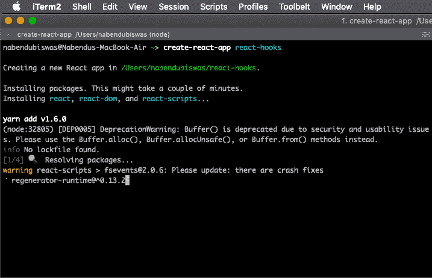
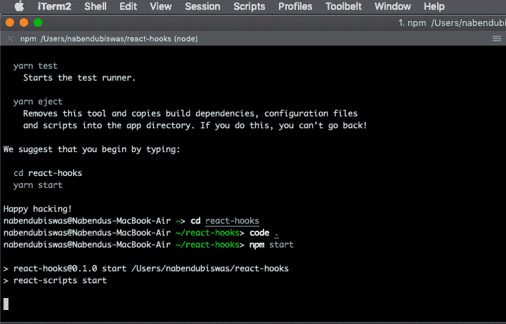
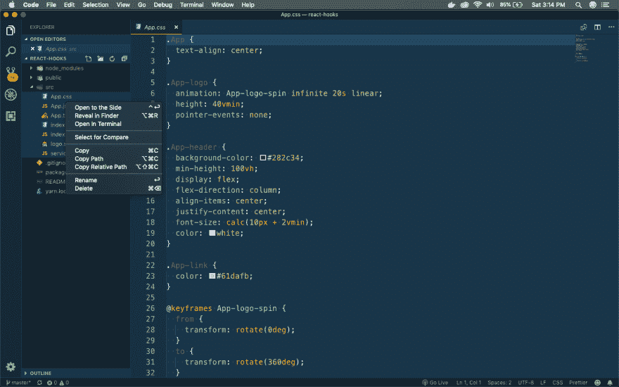
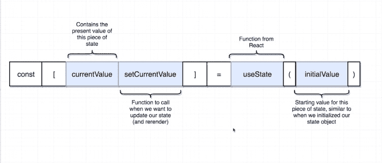
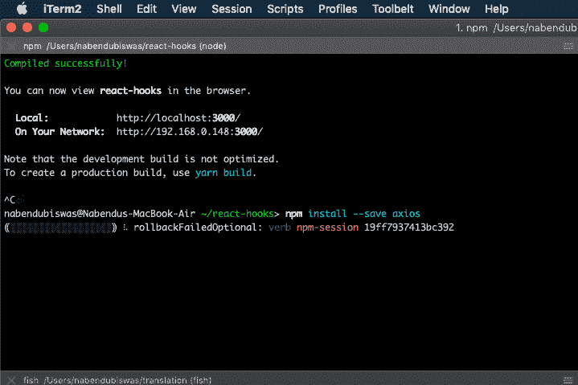
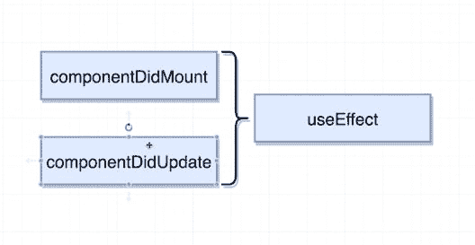
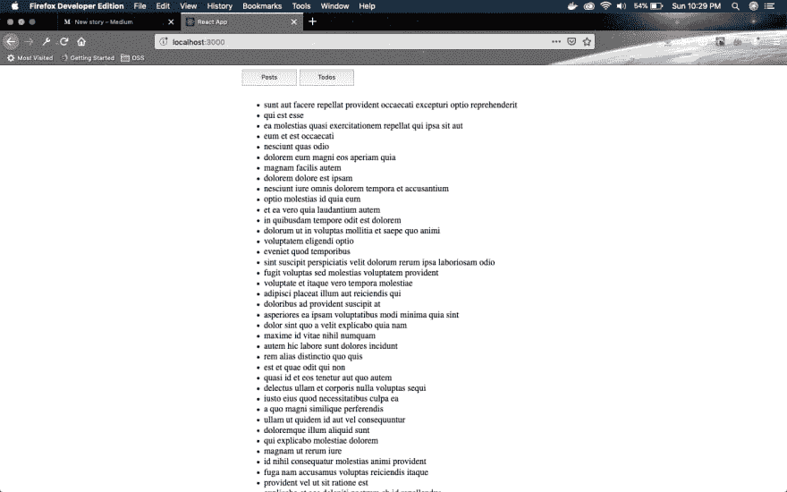

# 通过构建一个简单的应用程序来理解 React 挂钩

> 原文:[https://dev . to/nabe NDU 82/understanding-react-hooks-by-building-a-simple-app-4i6d](https://dev.to/nabendu82/understanding-react-hooks-by-building-a-simple-app-4i6d)

我们将使用 hooks 最新的 React 特性来构建一个简单的应用程序，它允许我们在功能组件中使用类组件概念。

这个系列的灵感来自于 Stephen Grider 在 [udemy](https://www.udemy.com/react-redux/learn/lecture/12700535#overview) 的“Modern React with Redux”系列中的一个例子。

所以，打开你的终端，创建一个新的 react 应用 **react-hooks** 。

[ ](https://res.cloudinary.com/practicaldev/image/fetch/s--HI7dr5Ua--/c_limit%2Cf_auto%2Cfl_progressive%2Cq_auto%2Cw_880/https://cdn-images-1.medium.com/max/2000/1%2Akuub7j19MDl6698g7l5GCA.png) *反应-钩子*

接下来，将 cd 放入该目录。打开代码编辑器并启动 react 应用程序。

[ ](https://res.cloudinary.com/practicaldev/image/fetch/s--Iz-TwUU_--/c_limit%2Cf_auto%2Cfl_progressive%2Cq_auto%2Cw_880/https://cdn-images-1.medium.com/max/2000/1%2AhK9JqQG9EmzPPUO1_YS8jw.png) *初始设置*

现在，像往常一样，进入代码编辑器中的 **src** 目录，删除所有内容。

[ ](https://res.cloudinary.com/practicaldev/image/fetch/s--S4BwaL5v--/c_limit%2Cf_auto%2Cfl_progressive%2Cq_auto%2Cw_880/https://cdn-images-1.medium.com/max/2880/1%2A1mYBrJAjslMHWg2pMdD2gw.png) *删除一切*

接下来，在 **src** 文件夹中创建一个新文件 **index.js** 。它的内容将低于代码。

```
import React from 'react';
import ReactDOM from 'react-dom';
import App from './components/App';

ReactDOM.render(
    <App />, document.querySelector('#root')
); 
```

现在，在 src 文件夹下做一个 **components** 目录，新建一个文件 **App.js** ，其内容将在代码下面。

```
import React, { Component } from 'react'

class App extends Component {
    render() {
        return (
            <div>
               App is rendered
            </div>
        )
    }
}

export default App; 
```

因此，如果初始设置是正确的，您将在我们的本地主机中看到以下内容。

[ ](https://res.cloudinary.com/practicaldev/image/fetch/s--_WiNr3Wd--/c_limit%2Cf_auto%2Cfl_progressive%2Cq_auto%2Cw_880/https://cdn-images-1.medium.com/max/2880/1%2Am8kKlyfmrK0NwCoejTct_Q.png) * App 渲染*

接下来，更新 App.js，使其具有两个按钮，单击这两个按钮会显示不同的文本。

```
import React, { Component } from 'react';
import './App.css';

class App extends Component {
    state = { resources: 'posts' };

    render() {
        return (
            <div className="main__container">
                <span className="buttons__container">
                    <button onClick={() => this.setState({ resources: 'posts' })}>Posts</button>
                    <button onClick={() => this.setState({ resources: 'todos' })}>Todos</button>
                </span>
                <span>{this.state.resources}</span>
            </div>
        )
    }
}

export default App; 
```

我们还通过在同一个文件夹中创建一个 **App.css** 来添加一点 CSS。

```
.main__container {
    display: grid;
    place-content: center;
    grid-template-rows: 30px 30px;
    grid-gap: 10px;
}

.buttons__container{
    display: grid;
    grid-template-columns: 100px 100px;
    column-gap: 5px;
    font-size:1.5rem;
} 
```

我们的应用程序现在看起来如下。

[ ](https://res.cloudinary.com/practicaldev/image/fetch/s--6wQRa3VM--/c_limit%2Cf_auto%2Cfl_progressive%2Cq_auto%2Cw_880/https://cdn-images-1.medium.com/max/2880/1%2AprAZCqtoqWtP4CC1kNgsMQ.png) *帖子*

我们现在要把我们的应用程序改成一个基于功能的组件，然后使用钩子。

所以，有不同类型的钩子。下表中列出了。

[ ](https://res.cloudinary.com/practicaldev/image/fetch/s--G8oEKSFO--/c_limit%2Cf_auto%2Cfl_progressive%2Cq_auto%2Cw_880/https://cdn-images-1.medium.com/max/2000/1%2AoAX03V1Dko9avaj1mrvzfw.png) *不同类型的挂钩*

我们的应用程序需要 **useState** 钩子，因为我们在应用程序中使用状态。所以，我们改成用钩子吧。主要变化以粗体显示，我们还将基于类的应用程序组件更改为功能性组件。

```
import React, { useState } from 'react';
import './App.css';

const App = () => {
    const [resource, setResource] = useState('posts');

    return (
        <div className="main__container">
            <span className="buttons__container">
                <button onClick={() => setResource('posts')}>Posts</button>
                <button onClick={() => setResource('todos')}>Todos</button>
            </span>
            <span>{resource}</span>
        </div>
    )

}

export default App; 
```

如果你去 [http://localhost:3000/](http://localhost:3000/) 查看 app，会有同样的表现。这意味着我们的转变成功了。

但是让我们通过下图来理解行 **const [resource，set resource]= use state(' posts ')**的含义。

[ ](https://res.cloudinary.com/practicaldev/image/fetch/s--MfaQsHZY--/c_limit%2Cf_auto%2Cfl_progressive%2Cq_auto%2Cw_880/https://cdn-images-1.medium.com/max/2000/1%2AfDh9b9uCHX9nM1umBbWCTQ.png) *使用状态解释*

**useState('posts')** 是一个两个元素的数组，我们正在进行数组析构，所以**resource = use state(' posts ')【0】**和**set resource = use state(' posts ')【1】**

接下来，我们将开始创建我们的 **ResourceList** 组件，但是首先我们将安装 axios 来向一个简单的端点发出 GET 请求。所以，到你的终端前，停止运行应用程序，安装 axios

[](https://res.cloudinary.com/practicaldev/image/fetch/s--JC2tVcsi--/c_limit%2Cf_auto%2Cfl_progressive%2Cq_auto%2Cw_880/https://cdn-images-1.medium.com/max/2000/1%2A2oSkmTMzm3vFb-dvvwXaJw.png)T3】安装 axios

现在，在 **src** 目录下创建一个新文件 **ResourceList.js** 。向其中添加以下基于类的代码。这里我们使用了两种生命周期方法——**componentidmount**和**componentiddupdate**，因为我们在初始渲染时以及每当用户点击按钮时都会进行 API 调用。

```
import React, { Component } from 'react';
import axios from 'axios';

class ResourceList extends Component {
    state = { resources: [] };

    async componentDidMount() {
        const response = await axios.get(`https://jsonplaceholder.typicode.com/${this.props.item}`);
        this.setState({ resources: response.data });
    }

    async componentDidUpdate(prevProps) {
        if (prevProps.item !== this.props.item) {
            const response = await axios.get(`https://jsonplaceholder.typicode.com/${this.props.item}`);
            this.setState({ resources: response.data });
        }
    }

    render() {
        return (
            <div>
                {this.state.resources.length}
            </div>
        )
    }
}

export default ResourceList; 
```

现在，我们将把它改为使用钩子。我们需要生命周期方法的另一个钩子——use effect。

```
import React, { useState, useEffect } from 'react';
import axios from 'axios';

const ResourceList = ({ item }) => {
    const [resources, setResources] = useState([]);

    const fetchResource = async (item) => {
        const response = await axios.get(`https://jsonplaceholder.typicode.com/${item}`);
        setResources(response.data);
    }

    useEffect(() => {
        fetchResource(item);
    }, [item])

    return (
        <div>
            {resources.length}
        </div>
    )
}

export default ResourceList; 
```

现在，钩子 **useEffect** 是两种生命周期方法的组合——**componentidmount**和**componentiddupdate**

[ ](https://res.cloudinary.com/practicaldev/image/fetch/s--AbfPLvNz--/c_limit%2Cf_auto%2Cfl_progressive%2Cq_auto%2Cw_880/https://cdn-images-1.medium.com/max/2000/1%2AhR8U4F8aVXuPvVLiDPIHhA.png) *使用效果挂钩*

最后，让我们通过显示来自后端 API 的 **Todos** 或**帖子**的内容来完成我们的应用程序。在 **ResourceList.js** 的返回语句中修改如下

```
return (
        <ul>
            {resources.map(record => <li key={record.id}>{record.title}</li>)}
        </ul>
    ) 
```

我们最终的应用程序如下图所示。

[ ](https://res.cloudinary.com/practicaldev/image/fetch/s--ITRg2qK---/c_limit%2Cf_auto%2Cfl_progressive%2Cq_auto%2Cw_880/https://cdn-images-1.medium.com/max/2880/1%2Aa2bBh8fnJTc96omXjPXUTA.png) *最终 App*

你可以在这个 github [链接](https://github.com/nabendu82/react-hooks)中找到相同的最终代码。