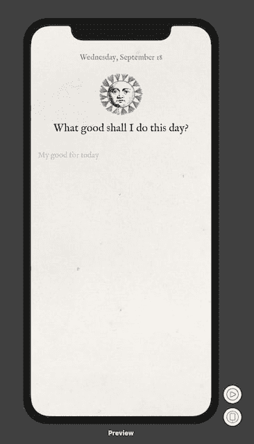

# 每天做好事第 7 天

> 原文：<https://dev.to/swlkr/do-good-daily-day-7-34a3>

📅2019 年 9 月 18 日
🔥七日连胜
📱每日行善
💰0.99 美元的价格
🤑0 销售
⌚️花了 6 个小时
💻7 个文件更改了 42 处添加(+) 2 处删除(-)
🙅‍♀️今天的目标:让文本编辑器工作

## SwiftUI TextField 占位符

听着，我不会坐在这里，对我今天 30 分钟的副业工作夸夸其谈，我只会说，我没有做我计划要做的事情。有一份全职工作和一个家庭是很难的。

让我们来谈谈文本字段和占位符，这是我今天唯一做的事情:

[](https://res.cloudinary.com/practicaldev/image/fetch/s--mlFvqiDo--/c_limit%2Cf_auto%2Cfl_progressive%2Cq_auto%2Cw_880/https://thepracticaldev.s3.amazonaws.com/i/j5v5pqk7xzg005png3ri.png)T3】

```
TextField("My good for today", text: self.$input)
    .font(.custom(font, size: 18))
    .padding() 
```

<svg width="20px" height="20px" viewBox="0 0 24 24" class="highlight-action crayons-icon highlight-action--fullscreen-on"><title>Enter fullscreen mode</title></svg> <svg width="20px" height="20px" viewBox="0 0 24 24" class="highlight-action crayons-icon highlight-action--fullscreen-off"><title>Exit fullscreen mode</title></svg>

就是这样！哦，等等，我还想出了如何格式化今天的日期:

```
let fmt = DateFormatter()
fmt.dateFormat = "EEEE, MMMM dd"
self.date = fmt.string(from: Date()) 
```

<svg width="20px" height="20px" viewBox="0 0 24 24" class="highlight-action crayons-icon highlight-action--fullscreen-on"><title>Enter fullscreen mode</title></svg> <svg width="20px" height="20px" viewBox="0 0 24 24" class="highlight-action crayons-icon highlight-action--fullscreen-off"><title>Exit fullscreen mode</title></svg>

就是这样！