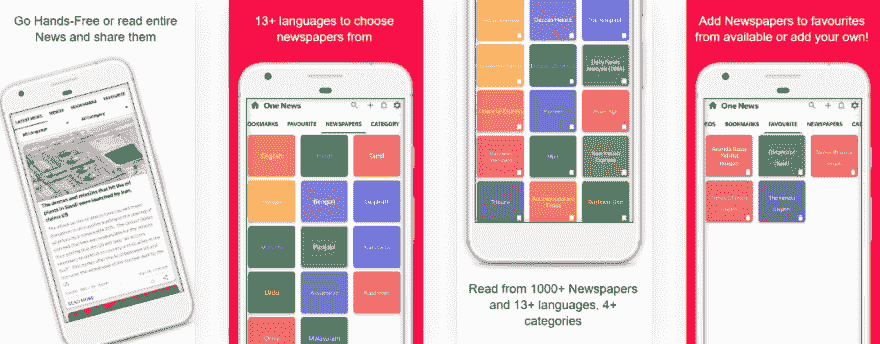
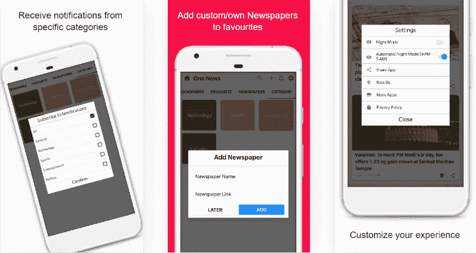

# 一条新闻—快速和最新新闻

> 原文:[https://dev . to/varundwarkani 10/one-news-fast-latest-news-4c 77](https://dev.to/varundwarkani10/one-news-fast-latest-news-4c77)

在这个忙碌的世界里，我们通常没有时间去做或阅读我们喜欢的事情。我们有繁忙的日常工作，完成我们的任务，在一天结束时变得筋疲力尽。我也有过类似的经历，但通过使用这个神奇的应用程序，我终于明白了。

我总是想了解最新的时事新闻，阅读 T2 的各种新闻和世界各地发生的事情，但是我做不到，原因是我没有时间。我的大学、工作、任务和其他繁忙的日程安排阻止了我这样做。虽然我总是想以简洁明了的方式阅读新闻，但我没有找到这样做的任何来源。一般的新闻网站或应用程序并不那么用户友好，对新闻进行了大量的阐述。当我花将近 2-3 分钟阅读这篇让我有时感到恼怒或对他人感到厌烦的文章时，我才会得到新闻。

最近，我遇到了一个应用程序，它可以帮助我在 3 分钟内阅读世界各地的所有重要新闻。我过去常常花 3 分钟阅读每条新闻，现在我可以在 3 分钟内阅读所有新闻，节省了我的大量时间，并保持前所未有的更新。

[T2】](https://res.cloudinary.com/practicaldev/image/fetch/s--iasmc2HO--/c_limit%2Cf_auto%2Cfl_progressive%2Cq_auto%2Cw_880/https://thepracticaldev.s3.amazonaws.com/i/axxhv50e7b8ktnlat6n3.png)

我不必担心得到新闻太晚，因为应用程序总是提供最新的新闻。当我在外工作但有时间通过通知阅读消息时，这个应用程序发送重要的**新闻通知，仅用 15 个字就有漂亮的图像。**只需 10 秒钟，我就能了解来自世界各地的重要新闻和最新消息，甚至不用打开应用程序。最好的一点是，这个应用程序不像一个点击诱饵，要求用户时不时地打开应用程序来获取新闻。它在通知本身中提供了所有的新闻，因此我甚至不必多次解锁我的设备。

该通知不具有普遍性。我可以从各种类别中选择我想收到的通知类型。它提供来自世界各地的各种主题的新闻。

虽然我可以继续谈论这个新闻应用程序，但我在第一印象中喜欢的最重要的功能是—

a.一个只有 2 MB 的轻量级应用程序。所有这些小米用户现在都可以安装该应用程序，而不会收到谷歌 Playstore 的低存储警告。
b .简洁圆滑 **UI/UX** 。
c. **离线阅读能力** —现在我不用在线也能看新闻了。它占用我的手机存储空间不超过 50 MB，而其他著名的应用程序占用高达 500 MB。
d. **夜间模式**为了晚上不累眼睛。
e .阅读来自**不同语言和类别的新闻** —科技、体育、娱乐、政治等。
f. **免提模式** —该应用程序允许用户无需滚动即可收听新闻。
g. **书签** —重要新闻可以保存起来以后阅读。

[T2】](https://res.cloudinary.com/practicaldev/image/fetch/s--q9Edqa0N--/c_limit%2Cf_auto%2Cfl_progressive%2Cq_auto%2Cw_880/https://thepracticaldev.s3.amazonaws.com/i/emvxcx403ocxyuxnfmvu.png)

h.**分享** —该应用允许用户在各种平台上与他们的朋友&家人分享他们感兴趣的新闻。
一、阅读官方来源的**整篇新闻，获取更多关于新闻的见解。
j. **阅读各种报纸的新闻**包括 14 种语言和 4 个类别的 1000 多份报纸，具有多种控制功能——缩放、更快加载、添加为收藏夹、共享文章和添加自己的报纸。
k. **视频** —该应用程序还有一个视频部分，可以添加不同语言和类别的有用和有趣的视频。**

[T2】](https://res.cloudinary.com/practicaldev/image/fetch/s--kJ8XNHNU--/c_limit%2Cf_auto%2Cfl_progressive%2Cq_auto%2Cw_880/https://thepracticaldev.s3.amazonaws.com/i/39cdrmbqcclkpltyz8o1.png)

不是这个。这个话题的亮点是他们的**高级通知**,当通过通知面板看的时候吸引眼球，并且很容易理解新闻。

[T2】](https://res.cloudinary.com/practicaldev/image/fetch/s--cOd5f3Rj--/c_limit%2Cf_auto%2Cfl_progressive%2Cq_auto%2Cw_880/https://thepracticaldev.s3.amazonaws.com/i/og87f22xh2285vr6w4xj.jpeg)

介绍 **One News** —一款时尚简单的多功能新闻应用。
安卓用户可以从——[http://bit.ly/2YPqmeF](http://bit.ly/2YPqmeF)下载应用

iOS 和桌面用户不必失望，因为我们也有同样的网络应用程序——[https://onenews.dwarsoft.com/](https://onenews.dwarsoft.com/)

如果你喜欢这个应用程序，给我们一个关于**产品搜寻**-【https://www.producthunt.com/posts/one-news-fast-latest-news T2】的提示

**免责声明** —我是开发该应用的**矮人解决方案**—**一条新闻**公司的联合创始人& CTO。