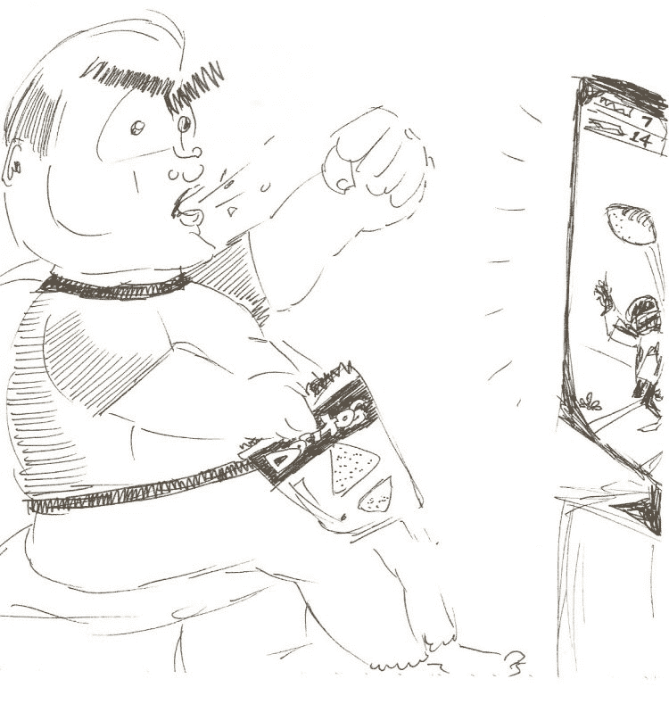

# 不要让任何人告诉你，你不是一个“真正的”程序员

> 原文:[https://dev . to/daedtech/不要让任何人告诉你，你不是一个真正的程序员-465p](https://dev.to/daedtech/don-t-let-anyone-tell-you-that-you-re-not-a-real-programmer-465p)

*大约一周前，[我在 DaedTech 博客](https://daedtech.com/dont-let-anyone-tell-you-that-youre-not-a-real-programmer/)上发表了这篇文章。*

很抱歉我上周没有出席技术专家的会议。我，嗯，这些天我一直都很忙。但是今天，我带着一个听起来可疑的动机演讲的前提回来了。

不过，不要担心，现实政治迷们。不是那样的。不完全是。

当然，不要让任何人告诉你，你不是一个“真正的”程序员，因为(1)这是一个蹩脚的说法，(2)因为你很棒，等等。但我会把这些论点留给其他人。相反，我要谈谈为什么让这些废话进入你的大脑对你的职业生涯和你的定位不利。

## 没有真正的苏格兰人的谬论

不过，首先，让我们逛逛人类学廉价商店，对我们正在处理的东西进行分类。当有人告诉你，不管出于什么原因，你不是一个“真正的”程序员，他们很可能沉迷于所谓的“没有真正的苏格兰人”谬论。

[T2】](http://feeds.feedblitz.com/~/t/0/0/daedtech/www/~https://daedtech.com/wp-content/uploads/2013/07/Braveheart.jpg)

这样做的要点是为某个俱乐部的会员资格创建一个主观的、移动的目标职位纯度测试。人们这样做通常是因为用太宽的画笔画画，然后有人叫他们画。例如，这里有一个引用自维基文章的同名例子:

> 人物 A :“没有苏格兰人会在粥里加糖。”
> 
> **人物 B** :“但是我的叔叔安格斯是苏格兰人，他把糖放在他的粥里。”
> 
> **人甲**:“但是不**真的**苏格兰人在他的粥里加糖。”

在我个人与这种谬论的传播者的经历中，我通常看到两个主要的动机，通常是混杂的:

1.  狂热的，主观的相信纯洁测试本身。
2.  在真正考虑清楚之前就提出了尖锐的要求，并伴随着事后永不退缩的个人倾向。(声音[耳熟](http://feeds.feedblitz.com/~/t/0/0/daedtech/www/~https://twitter.com/ExpertBeginner1)？)

现在，把人性的这一部分拿出来，混合到堆积如山的互联网碗里，在烤箱里烤 20 年，准备好享受“为什么你永远不够好”的无底砂锅吧。

## 多种口味的“非真实”程序员

到目前为止，您可能会发现自己在点头附和，想象这样的面向编程的语句。也许别人用这样的画笔给你画过，也许你只是看到他们对别人画过。

*   没有真正的程序员大量使用 CSS 和标记。
*   真正的程序员使用命令行，而不是用户界面。
*   在 2019 年，如果你使用的不是 git，你就不是真正的程序员。
*   没有真正的程序员只是开箱即用他们的 IDE，而不进行定制。(另外，“*真正的*程序员使用 VIM 而不是 ide。”)

我想这些说法听起来很熟悉。“真正的”编程肯定有很多纸上谈兵的仲裁者，不是吗？

[T2】](http://feeds.feedblitz.com/~/t/0/0/daedtech/www/~https://daedtech.com/wp-content/uploads/2013/03/ArmchairQuarterback.jpg)

因此，在定义了这是什么，并给出了如何识别它的例子后，我想用这篇文章的剩余部分来谈谈为什么这种看似微不足道的博客实际上对那些接触到它的人是有害的。

## 这将如何潜移默化地影响你的职业生涯

为了强调，让我简单地重述一下。不忠实于其他程序员的人表现得很幼稚，而且毫无必要地刻薄。你应该尽最大努力忽略他们——不要让那些混蛋打击你——因为你不应该受到这种待遇。

如果你编程，你就是一个真正的程序员。

但我不是在写“让我们对彼此更好”的行动号召，也不是试图做一个激励性的演讲。相反，我想谈谈软件开发人员的职业。

让我们开始吧。具体来说，让我们看看在互联网论坛上流传的“没有真正的程序员”的普遍瘴气是如何威胁鼓励那些受其影响的人做出糟糕的决定的。请理解，它不是这些声明中的一个，而是它们的整个宇宙的影响，经常是冲突的，总是令人困惑的，从来没有帮助。

### 1。它鼓励过度概括

博客的长期读者知道，我认为长期职业概括是一种反模式。当你的职业生涯是一个永无止境的堆栈、领域、垂直领域、心理图形和角色流时，你的职业生涯可能包含 45 年的入门级工作，而不是 45 年的累积复合经验。这阻碍了有意义的职业发展。

[T2】](http://feeds.feedblitz.com/~/t/0/0/daedtech/www/~https://daedtech.com/wp-content/uploads/2014/11/SwissArmy.jpg)

现在，想想“没有‘真正’的程序员”宣言的一个巨大子集和他们的[对立](https://www.varsitytutors.com/hotmath/hotmath_help/topics/converse-inverse-contrapositive)。*真正的*程序员净化他们的数据库输入并参数化他们的查询。*真正的*程序员都知道字符串串联的代价很高。如此等等，几乎无穷无尽。

根据随机的互联网人的说法，作为软件开发人员，我们去互联网寻求帮助和指导，最终我们会有一个巨大的职业义务清单。但是，如果所有的程序员都应该知道所有栈和所有编程领域的所有基础知识，那么我们基本上就没有分工了。相反，每个人都应该追求这张无止境的牌桌赌注清单。

“真正的程序员”的区别鼓励你专注于用对你当前的工作、雇主或环境毫无用处的知识来“充实自己”。这是典型的过度概括。

### 2。它会引起商品化

具有普遍性的重要部分是[劳动商品化](https://daedtech.com/want-matter-software-industry-stop-laborer/)。你知道程序员(通常可能是知识工作者)*真的*不喜欢人们称他们为“人力资源”吗这种发自内心的抗议是对他们不可避免的“T4”商品化的潜意识反对。

> 不要叫我人力资源！我是一个独特的人，有独特的天赋，独特的技能，独特的视角，独特的想法！

理论上很棒，实际生活中也确实如此。但成为你的技术团队中的多面手的麻烦在于，你的行动掩盖了你的抗议。你*说，不，尖叫*，你不是一个资源，但是你选择你的技能来优化最大的可部署性和与你的~~资源同事~~的可交换性。

[T2】](http://feeds.feedblitz.com/~/t/0/0/daedtech/www/~https://daedtech.com/wp-content/uploads/2013/03/WorkHarder.jpg)

“真正的程序员”的集体文化加剧了这种动态。当被“真正的”程序员使用或避免某些工具、栈、方法等的想法轰炸时。，你会感受到自然的压力，朝着最大共识的领域前进，从而获得最大的资源供应。

更直白地说，“真正的程序员”声明鼓励你让自己变得可以立即被替换并且不起眼。

### 3。它阻碍了早期采用

当你发现自己正在向人群中心漂移时，商品化并不是唯一出现的问题。也想想[采用的钟形曲线](https://www.valuebasedmanagement.net/methods_rogers_innovation_adoption_curve.html)。这个群体的中心是“早期多数”和“晚期多数”采纳之间的细微差别。

我是编程界的老人了，马上就要表现出来了。

[T2】](http://feeds.feedblitz.com/~/t/0/0/daedtech/www/~https://daedtech.com/wp-content/uploads/2013/01/Lifer.jpg)

当我刚从计算机系毕业时，Javascript 是垃圾。这是一种语言的噱头，出于营销原因在 10 天内拼凑而成。而且，回到那个年代，*真正的*程序员不用 Javascript。

我用这个例子是因为回想起来听起来很有趣。但是如果你想到“真正的程序员”声明者的一致“智慧”，他们几乎总是吹捧主流，把前沿当成时尚和玩具。他们强烈要求你在收养方面保持风险规避。

### 4。总的来说，它会招致草率的实践

有一件事我没怎么提到，那就是“真正的程序员”断言的整个云是多么的矛盾。有些人会说:“真正的程序员不使用 ide，而是喜欢文本编辑器。”。但是其他人会反驳说，“_ real _ 程序员充分利用他们的工具，只使用 ide！”

这是一个很好的二元例子，但其他的不那么明显矛盾，也许鼓励不冲突但不能很好地一起使用的工具，或者创造比它们的部分总和更复杂的方法。这里的危险是，如果你试图综合这种类型的互联网“建议”,整个语料库会在你自己的方法中产生不一致。

我曾经在一篇简短的旧文章中写道，我称之为“合成专家”反模式。现在，想象一下这个难题，但是，你不是在综合公认的专家，而是在综合纸上谈兵的专家，就像某个随机 Q &论坛上的 Bobby9442。你对被视为“真正的”程序员的追求有可能导致一些集体怪异的软件方法。

### 5。你有可能成为他们中的一员

最后，考虑最糟糕的命运。我可能会说，这种特殊的情况比被劝阻离开这个行业更糟糕，去追求一个人们不那么…一直激动的职业。

这就是你成为这些“不真正的程序员”评论员之一的命运——你成为一个把时间花在互联网上争论的人。在网上争论不仅仅是完全浪费你的时间，从职业角度来看，也很糟糕。而且，如果你的争论开始转向“通过逻辑谬误进行欺凌”，那就更糟糕了。

[T2】](http://feeds.feedblitz.com/~/t/0/0/daedtech/www/~https://daedtech.com/wp-content/uploads/2013/02/AngryArch-e1564030369643.jpg)

这里动物农场式的蜕变也不像看起来那么遥不可及。如果你花了几年时间试图学习所有的技术，采用所有的方法，建立你的“真正的程序员”清单，并且总体上朝着这个集体的“智慧”前进，你在这方面投入了大量的努力。

而且，人类有一种认知偏见，这种偏见导致我们为自己过去的决定和投资辩护到非理性的地步。

将这些陈述内化会让你以后更有可能去做。这与定义大学兄弟会和硅谷企业面试流程的戏弄周期相同。因此，将你不是真正的程序员这一信息内在化，会让你更有可能在以后将这一信息传递给其他人，“为了他们好。”

## “真实”不是这个语境中的东西

最后，我认为最有帮助的事情是采用这种心态，即当应用于这种情况时，“真实”是字面上的废话。我的意思是，“真正的程序员”在某种意义上是一个同义反复，任何从事任何编程的人都是“真正的程序员”，除非你想变得古怪而形而上学。而且，即使像“好的”或“有能力的”这样的修饰词比“真实的”有更多的内容，即使这些不是特别有帮助或客观的。

但是“真实”或“真实”或其他什么？完全没用。

所以不要回复网上(或你公司里)的人。忽略它，让它从你的背上滚下来，静静地笑着，看看人们是如何被自己的胡言乱语激怒的。

但是，如果你真的忍不住——如果你真的必须回应——那么我会试试这件。当他们对你说“真正的程序员 _____”时，用“真正的程序员不使用‘真正的程序员’这个术语”来回应。

如果他们有自己认为的一半聪明，这种自我指涉的说法会让他们的大脑受到很大伤害，他们会让你一个人呆着，去思考你在无用判断的 MC 埃舍尔循环中的两个角色。