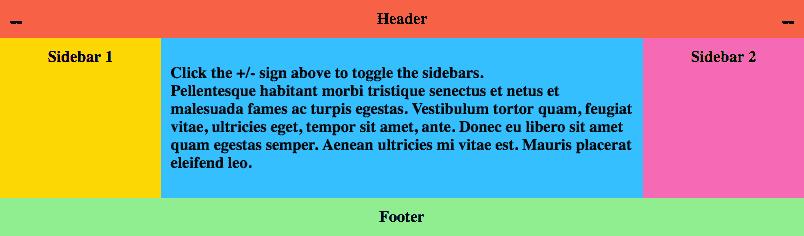

# 带有侧栏开关的 CSS Flexbox

> 原文:[https://dev . to/jimfrenette/CSS-flexbox-with-sidebars-toggle-1h1e](https://dev.to/jimfrenette/css-flexbox-with-sidebars-toggle-1h1e)

这篇文章记录了如何创建一个完全响应的 flexbox 内容布局，它包含一个用于左右侧栏的纯 CSS 打开/关闭开关。CSS 是使用带有 Autoprefixer 的 Webpack 从 Sass 构建的。对于开发，包括一个 Webpack 开发服务器。

特征

*   纯 CSS 侧边栏切换
*   Sass CSS 预处理程序
*   PostCSS Autoprefixer
*   CSSnano
*   网络包 4
*   Webpack 开发服务器

[](https://res.cloudinary.com/practicaldev/image/fetch/s--EXnIev1k--/c_limit%2Cf_auto%2Cfl_progressive%2Cq_auto%2Cw_880/https://thepracticaldev.s3.amazonaws.com/i/7h38esdhvondyhut6kho.png) 
[在我们的在线沙盒中演示和编辑这段代码](https://jimfrenette.com/code-editors/sandbox/responsive-sidebars)

### [](#getting-started)入门

用下面的 HTML 在项目的根目录下创建一个`index.html`文件。该标记创建了一个包含页眉、内容和页脚容器的布局。内容容器包括侧边栏的侧边容器和切换侧边栏打开或关闭的复选框输入。

##### index.html

```
<!DOCTYPE html>
<html lang="en">
<head>
    <meta charset="UTF-8">
    <meta name="viewport" content="width=device-width, initial-scale=1.0">
    <meta http-equiv="X-UA-Compatible" content="ie=edge">
    <title>Document</title>
    <link rel="stylesheet" media="all" href="/dist/app.css">
</head>
<body>
    <div class="site">
        <header class="header">Header</header>
        <div class="content">
            <article class="main">
                <p>Pellentesque habitant morbi tristique senectus et netus et malesuada fames ac turpis egestas. Vestibulum tortor quam, feugiat vitae, ultricies eget, tempor sit amet, ante. Donec eu libero sit amet quam egestas semper. Aenean ultricies mi vitae est. Mauris placerat eleifend leo.</p>
            </article>
            <input type="checkbox" id="sidebar-1-toggle">
            <label for="sidebar-1-toggle"></label>
            <aside class="sidebar sidebar-1">
                <div>Sidebar 1</div>
            </aside>
            <input type="checkbox" id="sidebar-2-toggle">
            <label for="sidebar-2-toggle"></label>
            <aside class="sidebar sidebar-2">
                <div>Sidebar 2</div>
            </aside>
        </div>
        <footer class="footer">Footer</footer>
    </div>
</body>
</html> 
```

> 使用 VS 代码中内置的[的](https://code.visualstudio.com/docs/editor/emmet) [Emmet](https://emmet.io/) ，您可以通过在第一行输入感叹号然后选择 tab 键来创建 index.html 内容。

在项目中创建一个`src/sass`文件夹。并在 sass 文件夹中用下面的 css 创建一个`style.scss`文件。

##### [](#stylescss)style.scss

```
body {
  min-width: 400px;
}

.site {
  max-width: 1440px;
  margin: 0 auto;
  position: relative;
  font-weight: bold;
  text-align: center;
}

.content {
  display: flex;
}

.header {
  background: tomato;
  padding: 10px;
}

.footer {
  background: lightgreen;
  padding: 10px;
}

.main {
  flex: 1;
  min-width: 0;
  text-align: left;
  background: deepskyblue;
  padding: 10px;
}

.sidebar > div {
  padding: 10px;
}

.sidebar-1 {
  background: gold;
}

.sidebar-2 {
  background: hotpink;
}

@media all and (max-width: 800px) {
  .content {
    flex-wrap: wrap;
  }
  .main {
    flex: 1 1 100%;
  }
}

@media all and (min-width: 801px) {
  .sidebar-1 { order: 1; }
  .main    { order: 2; }
  .sidebar-2 { order: 3; }
} 
```

### [](#webpack)Webpack

[Webpack](https://webpack.js.org/) 将用于处理保存到 CSS 中的 [Sass](https://sass-lang.com/) ，并在本地提供 HTML。

*   先决条件–这里的 Webpack 模块捆绑器示例需要 [Node.js](https://nodejs.org) 。

使用您喜欢的 Node.js bash 命令行来设置项目。导航到项目根目录并输入`npm init`。接受默认值是好的。

```
npm init 
```

现在我们准备将 Webpack 和其他 [devDependencies](https://docs.npmjs.com/files/package.json#devdependencies) 安装到我们的项目中。如果您想知道，项目`node_modules`文件夹是安装所有这些包的地方。欲了解更多信息，请访问[npmjs.com](https://www.npmjs.com/)和/或观看此[NPM 介绍视频](https://youtu.be/x03fjb2VlGY)。

安装 Webpack 及其命令行界面。

```
npm install -D webpack webpack-cli 
```

为 webpack 配置文件创建一个`config`文件夹。

在这个 config 文件夹中，会有三个 webpack 配置文件，`base.config.js`、`dev.config.js`和`prod.config.js`。

首先，创建`config/base.config.js`,它包含开发和生产通用的配置。

##### [](#baseconfigjs)base.config.js

```
const path = require('path');
const MiniCssExtractPlugin = require("mini-css-extract-plugin");

module.exports = {
  context: path.resolve(__dirname, '../src'),
  entry: {
    app: './js/index.js'
  },
  plugins: [
    new MiniCssExtractPlugin
  ],
  module: {
    rules: [
      {
        test: /\.(css|scss)$/,
        use: [
          MiniCssExtractPlugin.loader,
          'css-loader',
          {
            loader: 'postcss-loader' },
          {
            loader: 'sass-loader' }
        ]
      },
      {
        test: /\.js$/,
        exclude: /node_modules/,
        use: 'babel-loader'
      }
    ]
  }
} 
```

[mini-css-extract-plugin](https://github.com/webpack-contrib/mini-css-extract-plugin) 从包中提取 css，并在加载程序处理 sass 后输出 css 文件。

为基本配置安装插件和[加载器](https://webpack.js.org/loaders/)。

```
npm install -D mini-css-extract-plugin

npm install -D babel-loader @babel/core @babel/preset-env

npm install -D autoprefixer style-loader css-loader postcss-loader

npm install -D node-sass sass-loader 
```

接下来，创建`config/dev.config.js`。

##### [T1】dev . config . js](#devconfigjs)

```
const baseConfig = require('./base.config.js');
const merge = require('webpack-merge');
const writeFilePlugin = require('write-file-webpack-plugin');

module.exports = merge(baseConfig, {
  devtool: 'eval-source-map',
  plugins: [
    new writeFilePlugin()
  ]
}); 
```

安装 [webpack-dev-server](https://github.com/webpack/webpack-dev-server) ，write-file-webpack-plugin 和 webpack-merge。

```
npm install -D webpack-dev-server write-file-webpack-plugin

npm install -D webpack-merge 
```

与 mini-css-extract-plugin 一样，[write-file-webpack-plugin](https://github.com/gajus/write-file-webpack-plugin)为内存中的 web pack 开发服务器输出 css 文件。然而，这个插件不做任何事情，除非它与 webpack-dev-server 一起使用。

我们使用 [webpack-merge](https://github.com/survivejs/webpack-merge) 来组合我们单独的 webpack 配置模块。

我们需要一个用于 postcss 的小配置文件。在项目根目录下，创建一个名为`postcss.config.js`的文件。

##### [](#postcssconfigjs)postcss.config.js

```
module.exports = {
  plugins: [
    require('autoprefixer')
  ]
} 
```

创建`config/prod.config.js`。

##### [](#prodconfigjs)产品配置. js

```
const baseConfig = require('./base.config.js');
const merge = require('webpack-merge');
const OptimizeCSSAssetsPlugin = require("optimize-css-assets-webpack-plugin");
const UglifyJsPlugin = require("uglifyjs-webpack-plugin");

module.exports = merge(baseConfig, {
  optimization: {
      minimizer: [
        new OptimizeCSSAssetsPlugin({})
      ]
  },
  plugins: [
    new UglifyJsPlugin({
      uglifyOptions: { output: { comments: false } }
    })
  ]
}); 
```

安装[optimize-CSS-assets-web pack-plugin](https://github.com/NMFR/optimize-css-assets-webpack-plugin)和 [uglifyjs-webpack-plugin](https://github.com/webpack-contrib/uglifyjs-webpack-plugin) 让我们的客户端资产尽可能的小用于生产。

```
npm install -D optimize-css-assets-webpack-plugin

npm install -D uglifyjs-webpack-plugin 
```

#### [](#supported-browsers)支持的浏览器

向`package.json`文件添加一个`browserslist`属性，以定义生成的 CSS 以哪个供应商为前缀。在本例中，根据全球使用统计，我们的目标浏览器超过 2 %, Internet Explorer 版本超过 9。[ [更多信息](https://www.npmjs.com/package/autoprefixer)

##### [](#packagejson)package.json

```
{
  "name": "blank",
  "version": "1.0.0",
  "description": "",
  "main": "index.js",
  "browserslist": [
    "> 2%",
    "ie > 9"
  ],

  ...
} 
```

#### [NPM-运行-脚本](https://docs.npmjs.com/cli/run-script)

将这些`webpack`命令添加到`scripts`属性中。我们将运行这些 npm 脚本命令来启动 webpack 开发服务器并观察或生产 webpack 构建。

##### [](#packagejson)package.json

```
 ...

  "browserslist": [
    "> 2%",
    "ie > 9"
  ],
  "scripts": {
    "dev": "webpack-dev-server --mode=development --watch --progress --colors --config config/dev.config.js --open",
    "build": "webpack --mode=production --progress --hide-modules --config config/prod.config.js",
    "test": "echo \"Error: no test specified\" && exit 1"
  },

  ...
} 
```

#### 输入类型 JavaScript

创建一个`src/js/index.js` javascript 入口点文件来导入 webpack 包的样式 Sass。

##### [](#indexjs)index.js

```
import '../sass/style.scss' 
```

### [](#sidebar-toggle-sass)侧栏切换 Sass

为侧边栏开关创建三个 Sass partials，`src/sass/_toggle.scss`，`src/sass/_default-open.scss`和`src/sass/_default-closed.scss`。

这是由`style.scss`文件导入的`_toggle.scss`部分。

##### [T1】_ toggle . scss](#togglescss)

```
/**
  * Sidebar toggle
  */

// uncomment for default closed sidebars
// @import "default-closed";
// uncomment for default open sidebars
@import "default-open";

/**
  * checkboxes open/close the sidebars
  * #sidebar-1-toggle and #sidebar-2-toggle
  */
  #sidebar-1-toggle, #sidebar-2-toggle {
  display: none;
}

label[for=sidebar-1-toggle],
label[for=sidebar-2-toggle] {
  position: absolute;
  top: 0;
  display: block;
  padding: .25em 10px;
  font-size: 1.5em;
  cursor: pointer;
}

label[for=sidebar-1-toggle] {
  left: 0;
}

label[for=sidebar-2-toggle] {
  right: 0;
}

@media all and (max-width: 800px) {
  label[for=sidebar-1-toggle],
  label[for=sidebar-2-toggle] {
    display: none;
  }
  .sidebar-1,
  .sidebar-2 {
    display: block;
    width: 50%;
  }
} 
```

这是由`_toggle.scss`导入的`_default-open.scss`部分。

##### _ 默认-打开. scss

```
/**
  * Sidebars open by default
  */

.sidebar {
  width: 20%;
}

label[for=sidebar-1-toggle],
label[for=sidebar-2-toggle] {
  &:after {
    content: '\2013';
  }
}

#sidebar-1-toggle:checked ~ label[for=sidebar-1-toggle],
#sidebar-2-toggle:checked ~ label[for=sidebar-2-toggle] {
  &:after {
    content: '+';
  }
}

#sidebar-1-toggle:checked ~ .sidebar-1,
#sidebar-2-toggle:checked ~ .sidebar-2 {
  display: none;
  width: 0;
} 
```

这是取消注释时由`_toggle.scss`文件导入的`_default-closed.scss`部分。

##### _ 默认-关闭. scss

```
/**
  * Sidebars closed by default
  */

.sidebar {
  display: none;
}

label[for=sidebar-1-toggle],
label[for=sidebar-2-toggle] {
  &:after {
    content: '+';
  }
}

#sidebar-1-toggle:checked ~ label[for=sidebar-1-toggle],
#sidebar-2-toggle:checked ~ label[for=sidebar-2-toggle] {
  &:after {
    content: '\2013';
  }
}

#sidebar-1-toggle:checked ~ .sidebar-1,
#sidebar-2-toggle:checked ~ .sidebar-2 {
  display: block;
  width: 20%;
} 
```

### [](#webpack-dev-server)Webpack 开发服务器

对于开发，使用`npm run dev`启动开发服务器，打开浏览器，观察变更，并在保存变更时进行增量构建。

```
npm run dev 
```

现在测试开发服务器和文件监视构建。编辑`_toggle.scss`文件和注释`@import "default-open";`，取消注释`@import "default-closed";`。保存文件，检查终端输出并刷新浏览器。

对于生产，取消开发任务 Ctrl + C 并运行构建。

```
npm run build 
```

##### *[源代码](https://github.com/jimfrenette/uiCookbook/tree/2018-09-sidebars/sidebars)*

 *最初发表于[jimfrenette.com/2018/09/css-flexbox-with-sidebars-toggle](https://jimfrenette.com/2018/09/css-flexbox-with-sidebars-toggle/)*