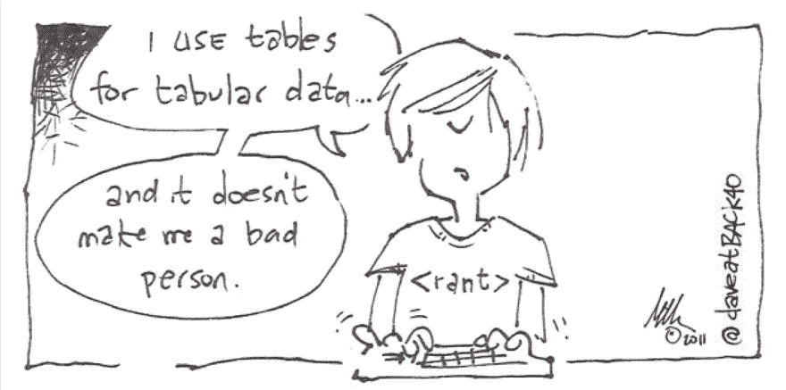

# 迪维蒂斯和其他-蒂斯

> 原文：<https://dev.to/alvaromontoro/divitis-and-other-itis-3k9l>

> 结尾-itis 是一个希腊和拉丁后缀，在医学术语中用来表示器官的炎症(字面或比喻)。它有时被用作一个专有词(It is，复数 itis)来定义一种以炎症为特征的疾病，或者以更广泛的方式来定义一种异常状态、过度或对某事物的痴迷。

Divitis，或者说过度使用`<div>`标签，是一种众所周知且极其常见的 web 开发疾病。这个名字在网上流传很久了。

这是一种以页面的结构和布局为中心的设计疾病，在本文中，我们将试图展示它是如何由其他因素演变而来的，如何修复它们，以及这种疾病演变的下一步可能是什么。

## 网络发展的趋势

虽然结尾-itis 在这种情况下似乎是合适的，并且 Divitis 这个术语广为人知，但在写这篇文章时，我们认真考虑过将其从 Divitis 重命名为 Flu。

这是因为流感病毒不断进化。类似地，Divitis 是另一种设计疾病(Tablitis)的进化，而 tabli tis 本身又是另一种设计疾病(Framitis)的进化...这可能只是这些设计/布局问题发展过程中的又一步。

虽然 Divitis 将是本文的主要部分，但我们将按时间顺序来看它的其他疾病。这将引导我们到目前的状况，并让我们为接下来的事情做好准备。

## Frame-itis

在 web 的开始，有 frame-itis(或简称 Framitis)。框架和框架标签的滥用。下面是一个使用框架的页面示例:

```
<frameset rows="100,*">
   <frame src="header.html" />
   <frameset cols="150,*">
      <frame src="menu.html" />
      <frame src="body.html" name="main"/>
   </frameset>
   <noframe>
      Your page doesn’t support frames
   </noframe>
</frameset> 
```

<svg width="20px" height="20px" viewBox="0 0 24 24" class="highlight-action crayons-icon highlight-action--fullscreen-on"><title>Enter fullscreen mode</title></svg> <svg width="20px" height="20px" viewBox="0 0 24 24" class="highlight-action crayons-icon highlight-action--fullscreen-off"><title>Exit fullscreen mode</title></svg>

像这样的代码在 90 年代和 21 世纪初非常流行。它生成一个框架布局，顶部是标题/横幅部分，左侧是菜单，右侧是主要内容。

框架在当时看起来是个好主意。它们服务于一个目的:每个框架包含一个静态页面，只有“变化的”框架需要更新，在刺耳的调制解调器时代节省了宝贵的加载时间。

但是缺点多于优点，特别是由于框架糟糕的用户体验:后退、前进和刷新导航按钮不会像你期望的那样工作，并且以你在屏幕上看到的方式标记或打印页面几乎是不可能的。

随着 web 技术的发展，出现了其他更合适的替代技术，如`iframes`或 AJAX...这导致框架标签在 HTML5 中被弃用。

在 Framitis 之后，设计者和开发者开始使用(和滥用)表格...开始一段新的旅程。

## 表型炎

在 2000 年，我们有 Table-itis(或简称 Tablitis):过多(不必要的)表格被错误地用于布局。

这是一个使用表格进行设计的例子。它看起来比使用框架的设计更好，因为它将页面分成了一个网格，允许比框架更灵活的设计

```
<table>
   <tr>
      <td>
         ...
      </td>
      <td>
         <table>
            <tr>
               <td>
                  ...
               </td>
               <td>
                  ...
               </td>
            </tr>
         </table>
      </td>
      <td>
         ...
      </td>
   </tr>
</table> 
```

<svg width="20px" height="20px" viewBox="0 0 24 24" class="highlight-action crayons-icon highlight-action--fullscreen-on"><title>Enter fullscreen mode</title></svg> <svg width="20px" height="20px" viewBox="0 0 24 24" class="highlight-action crayons-icon highlight-action--fullscreen-off"><title>Exit fullscreen mode</title></svg>

但是它仍然有许多局限性。设计过于“封闭”,代码中充斥着不必要的标签。(每个单元格至少需要一个表格和一行。)此外，如果你想重新设计你的网站，你基本上必须重写整个东西，这是痛苦和漫长的。

这个问题部分是由于当时的限制。CSS 的改进使得跳出框框(或单元格)变得更加容易，并且创建更加灵活的布局。(想象一下，只改变 CSS 就能得到一个全新的网站。)

不幸的是，并不是所有的系统都像网络浏览器一样跟上时代的步伐。许多电子邮件应用程序只允许使用有限的 HTML 和 CSS，即使我们接近 21 世纪 20 年代，表格仍然是电子邮件活动(相对)常见的布局选择。

但是除此之外，开发人员过渡到了一个新时代...

## 除数

Div-itis:标签太多。这就是我们现在的处境。这一演变的当前步骤是。

下面的代码是 Divitis 的一个极端例子。你可以看到代码是单色的，很难理解，而且很无聊。除非你看内容，否则你无法分辨什么是什么。而一台机器可能毫无头绪:

```
<div>
   <div>
      <div>
         <div>Title</div>
      </div>
      <div>
         <div>Section A Title</div>
         <div>Section A Content</div>
      </div>
      <div>
         <div>Section B Title</div>
         <div>Section B Content</div>
      </div>
      <div>
         Related Content
      </div>
      <div>
         Copyright Information
      </div>
   </div>
</div> 
```

<svg width="20px" height="20px" viewBox="0 0 24 24" class="highlight-action crayons-icon highlight-action--fullscreen-on"><title>Enter fullscreen mode</title></svg> <svg width="20px" height="20px" viewBox="0 0 24 24" class="highlight-action crayons-icon highlight-action--fullscreen-off"><title>Exit fullscreen mode</title></svg>

但是有好消息:有一种 Divitis 疫苗。的确如此...[鼓声]... **HTML5** ！

```
<main>
   <article>
      <header>
         <h1>Title</h1>
      </header>
      <section>
         <h2>Section A Title</h2>
         <div>Section A Content</div>
      </section>
      <section>
         <h2>Section B Title</h2>
         <p>Section B Content</p>
      </section>
      <aside>
         Related Content
      </aside>
      <footer>
         Copyright Information
      </footer>
   </article>
</main> 
```

<svg width="20px" height="20px" viewBox="0 0 24 24" class="highlight-action crayons-icon highlight-action--fullscreen-on"><title>Enter fullscreen mode</title></svg> <svg width="20px" height="20px" viewBox="0 0 24 24" class="highlight-action crayons-icon highlight-action--fullscreen-off"><title>Exit fullscreen mode</title></svg>

现在你可以看到代码变得更加丰富多彩，由于有了更多的语义标签，你不用看上下文就可以知道每件事是什么。人类更容易阅读和理解。你可以看到上面的代码是一篇文章，有一个标题，两个部分，一些相关的旁注信息和一个页脚。

代码也更容易维护，因为忘记结尾`</div>`的风险更低。对于屏幕阅读器和残疾用户来说也很好，页面内容的流动更加自然。

要看一个网站是否患有 Divitis，只需要查看源代码即可。如果您几乎看不到任何语义标签，并且代码大多是`<div>`和更多的`<div>`，那么您就发现了 Divitis 的情况。

这是一种常见的网络疾病。像 CNN、ESPN、雅虎这样的热门网站，或者 Reddit，深受其害。如果你检查你的网站，它可能也有轻微的问题！

以下是可以用来代替`<div>`的常用标签列表:

*   `<main>`:文档或应用的`<body>`的主要内容。它应该包括文档特有的内容，不包括导航或页脚等常见元素。
*   `<header>`:表示网页或部分的介绍性内容。作为它的一部分，有一些导航设备是很常见的。
*   `<footer>`:表示其最近的切片祖先或`<main>`的页脚。它通常包含关于作者、版权信息和类似内容的信息。
*   一篇完整/独立的文章，如博客文章、新闻文章或短文。它应该包含一个识别它的标题。
*   `<section>`:文档或应用程序中的通用部分。它根据主题或话题对内容进行分组，并且应该用标题来标识。
*   `<nav>`:导航辅助设备。也就是说，页面的一个部分具有指向页面内不同内容或其他页面的链接。
*   `<aside>`:与容器的内容无关，但可以被认为是独立的和分开的内容。
*   `<figure>` / `<figcaption>`:表示插图、图表、照片、代码片段等。它是独立的，并从页面的主要内容中引用。
*   `<ul>` / `<ol>` / `<li>`:列表。这些标签长期以来一直是 HTML 标准的一部分，但是很多时候它们被误用了。

标准中还有许多更有用的标签:`<blockquote>`、`<cite>`、`<details>`...[访问该页面，获取 HTML5 标签的更完整列表](https://developer.mozilla.org/en-US/docs/Web/HTML/Element)。

### div 还不错！

在我们继续之前，有一个重要的澄清: **`<div>`标签或者表格都不错**。他们有自己的目的，如果你正确使用，他们没有任何问题。

下面这幅漫画更好地解释了这个概念:

[](https://res.cloudinary.com/practicaldev/image/fetch/s--Ag6FChdg--/c_limit%2Cf_auto%2Cfl_progressive%2Cq_auto%2Cw_880/https://thepracticaldev.s3.amazonaws.com/i/y3rhc5k9q7mff2ofxjva.png)

如果你想在表格中显示数据，使用`<table>`标签。这就是它的设计目的！如果你发现自己在使用`<div>`，停下来想一想是否可以用一个更有语义的标签来代替它...如果没有，使用`<div>`也没什么不好。

## 未来

我们已经看到 Framitis，Tablitis 和 Divitis，以及它们是如何相互演变的。认为分裂是进化之路的终点是天真的。

现实是 HTML5 是当前的设计解决方案。但是一旦新版本的 HTML(比如 HTML6)有了更具体的语义标签，我们可能会谈论 HTML5-itis。

事实上，有迹象表明一种新的布局——it 可能会与 divi 并存。回顾不同的项目，我发现开发人员正在大量使用(和滥用)FlexBox。即使在不必要的情况下，或者网格是更好的选择的情况下。

因此，如果将来我们最终谈论 Flex-itis 或 Flexbox-itis，也不会太令人惊讶...有待时间去证明...